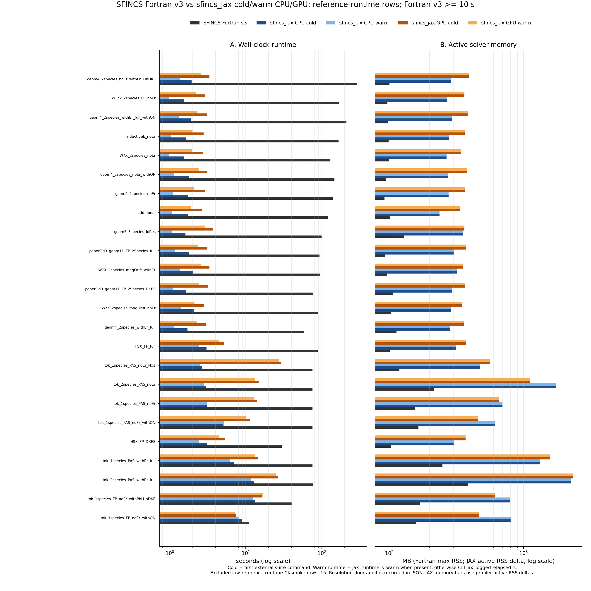
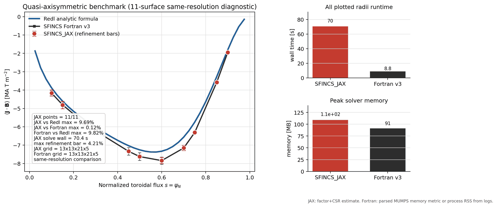
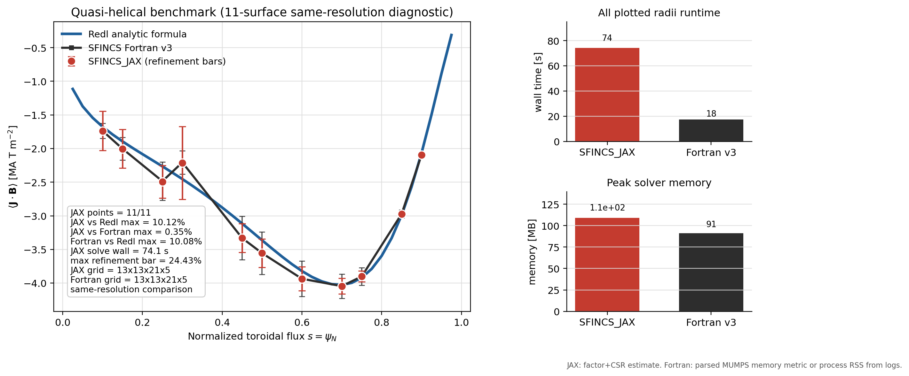
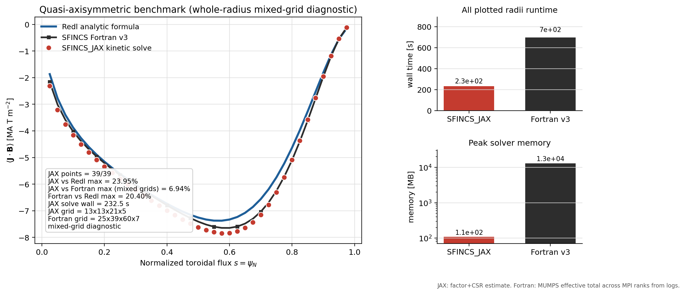
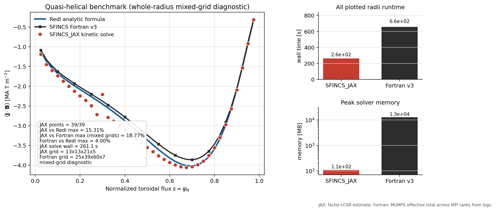
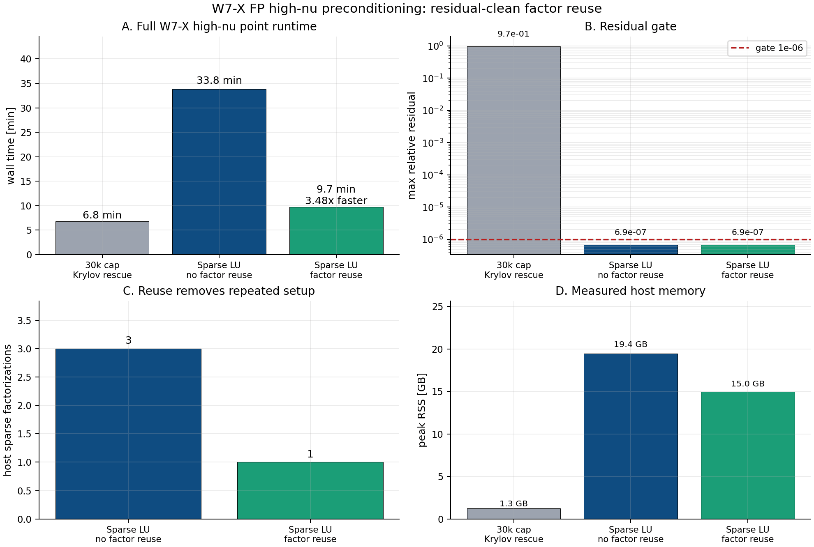
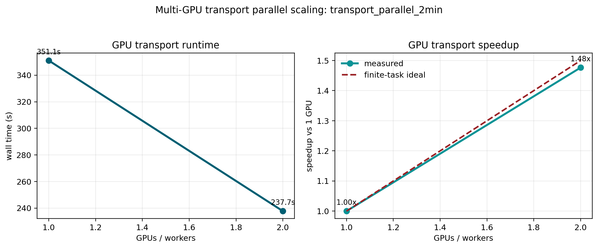

# sfincs_jax

[](https://github.com/uwplasma/sfincs_jax/actions/workflows/ci.yml)
[](https://github.com/uwplasma/sfincs_jax/actions/workflows/docs.yml)
[](https://pypi.org/project/sfincs_jax/)
[](https://codecov.io/gh/uwplasma/sfincs_jax)
[](https://www.python.org/downloads/)
[](LICENSE)

`sfincs_jax` is a standalone neoclassical transport code for radially local
drift-kinetic calculations in stellarator and tokamak geometry. It combines
high-fidelity kinetic models, CPU/GPU execution, modern matrix-free numerics,
parallel workflows, and optional differentiable solve paths in one codebase.

The default CLI path is tuned for robust residual-clean solves and practical
throughput. The Python API exposes differentiable residuals, fluxes,
ambipolar-root workflows, and optimization-oriented sensitivity checks when
gradients matter. Runtime and memory plots in this README use benchmark rows
with matching SFINCS Fortran v3 references and clearly stated grid sizes; larger
research campaigns and opt-in experimental solvers are documented in the
performance and validation pages.

It is designed for:

- high-performance runs on CPU/GPU,
- research and production transport workflows,
- memory-efficient large solves,
- end-to-end differentiable workflows.

## Installation

Install from PyPI:

```bash
pip install sfincs_jax
```

Install from source:

```bash
git clone https://github.com/uwplasma/sfincs_jax.git
cd sfincs_jax
pip install .
```

Large public equilibrium fixtures are not stored in the git clone or wheel. They
are fetched from the `sfincs-jax-data-v1` GitHub release on first use and cached
under `~/.cache/sfincs_jax/data/2026-05-26-v1` by default. To prefetch them for
CI, offline work, or reproducible examples, run:

```bash
python scripts/fetch_equilibria.py
```

Set `SFINCS_JAX_DATA_DIR=/path/to/cache` to choose a different cache root, or set
`SFINCS_JAX_OFFLINE=1` to require that the release data is already cached.

After installing, run the CLI on an input file. For most users this is the
entire workflow: provide `input.namelist`, optionally override the geometry file
with `--wout-path`, and let the default `auto` policy choose the fastest
validated solve path for the problem.

```bash
cd sfincs_jax
sfincs_jax examples/sfincs_examples/quick_2species_FPCollisions_noEr/input.namelist --out sfincsOutput.h5
sfincs_jax --plot sfincsOutput.h5
```

This writes `sfincsOutput.h5` and then creates a multi-page PDF diagnostics panel
next to it as `sfincsOutput_summary.pdf`. The same command works for NetCDF and
NPZ by changing the output suffix:

```bash
sfincs_jax examples/sfincs_examples/quick_2species_FPCollisions_noEr/input.namelist --out sfincsOutput.nc
sfincs_jax examples/sfincs_examples/quick_2species_FPCollisions_noEr/input.namelist --out sfincsOutput.npz
sfincs_jax --plot sfincsOutput.nc
```

For VMEC geometry, either put the VMEC `wout` path in the namelist or pass it at
runtime:

```bash
sfincs_jax /path/to/input.namelist --wout-path /path/to/wout.nc --out sfincsOutput.h5
```

Advanced users can still force solver methods and write solver traces for
profiling or reproducibility, but these are not required for normal production
runs:

```bash
sfincs_jax /path/to/input.namelist \
  --out sfincsOutput.h5 \
  --solver-trace solver_trace.json \
  --solve-method xblock_sparse_pc_gmres
```

RHSMode=1 outputs include `linearSolverMethod`, `linearSolverResidualNorm`,
`linearSolverResidualTarget`, `linearSolverResidualTargetRatio`,
`linearSolverConverged`, `linearSolverAccepted`, and
`linearSolverAcceptanceCriterion` in the output file so automatic choices remain
auditable after the run.
For large non-autodiff RHSMode=1 full-Fokker-Planck solves without `Phi1`, the
default `auto` policy can select the Fortran-reduced sparse-PC GMRES route. This
uses a simplified global preconditioner matrix, keeps the true residual gate on
the full operator, and avoids the slower structured-CSR research path unless the
user explicitly asks for it.

Production benchmark inputs use research-scale grids and are separate from
quick-start examples. The public runtime figure below includes rows with
matching SFINCS Fortran v3 references and a measured Fortran runtime of at least
`10 s`, so startup overhead does not dominate the comparison.

## Runtime and Memory Summary



The comparison covers SFINCS Fortran v3, `sfincs_jax` CPU cold, `sfincs_jax`
CPU warm, `sfincs_jax` GPU cold, and `sfincs_jax` GPU warm. The left panel shows
wall-clock runtime and the right panel shows active solver memory, both on log
axes. Fortran memory is process maximum RSS; JAX memory uses profiler RSS
deltas over the fixed Python/JAX/XLA runtime baseline, with full process peaks
stored in the JSON reports. Cold means the first external suite command; warm
means a repeated run after JIT compilation. Cases are ordered by best warm
`sfincs_jax` speedup over the Fortran v3 runtime.

Benchmark grids are selected to represent research use rather than tutorial
smoke tests: RHSMode=1 PAS/no-`E_r` tokamak rows use `89 x 1 x 24 x 300`,
standard tokamak rows use `33 x 1 x 12 x 140`, and 3D rows use
`25 x 51 x 4 x 100`. Detailed parity tables, benchmark provenance, regeneration
commands, and lower-resolution CI evidence live in the documentation pages for
performance, parity, and Fortran examples.

## Optimization Lane

`sfincs_jax` also provides optimization-oriented helpers for adding
neoclassical objectives to stellarator design loops. The recommended workflow is
two-tiered: use fast JAX-native proxy objectives inside the optimizer, then
promote accepted designs to full `sfincs_jax` electric-field scans and kinetic
validation gates before making physics claims.

```bash
python examples/optimization/qa_nfp2_sfincs_jax_objectives.py --objective balanced --steps 120
```


The QA example supports `bootstrap`, `electron-root`, `flux-selective`, and
`balanced` presets. If the QA proxy does not provide a strong electron-root
candidate, use the QI/QA NFP screen to pick the next kinetic promotion target:

For a VMEC-backed optimization diagnostic, use the checked
`vmec_jax/examples/optimization/QA_optimization.py` result and inspect the
finite-iota QA equilibrium before promoting it to kinetic `sfincs_jax` scans:

```bash
python examples/optimization/qa_nfp2_bootstrap_current_comparison.py --vmec-jax-root /path/to/vmec_jax
```


The checked artifact is generated from the real `vmec_jax` QA optimization
output, with target aspect ratio 5 and target mean iota 0.41. It plots the VMEC
LCFS, `|B|`, iota profile, and VMEC `J.B/sqrt(B.B)` current diagnostic. Pass
`--comparison-result-dir` to overlay a second `vmec_jax` result, for example a
QA run with a `JDotB` or `RedlBootstrapMismatch` objective. The plotted current
is an equilibrium diagnostic, not a kinetic bootstrap-current claim; accepted
equilibria still need completed `sfincs_jax scan-er` outputs before using
`FSABjHatOverRootFSAB2` in a paper or design decision.

```bash
python examples/optimization/screen_qi_electron_root_nfp.py --steps 70
```


The checked screen recommends QI `nfp=2` as the first fallback target, because
QA positive-root evidence is limited to low/mid-resolution scans while QI
electron-root promotion includes a bounded kinetic artifact. Both scripts write JSON
provenance plus PNG/PDF plots. The proxy layer is differentiable and
finite-difference checked; this does not make the promoted kinetic scan
differentiable. Accepted designs still need completed `sfincs_jax scan-er`
outputs before high-fidelity SFINCS kinetic gates can be used for bootstrap
current, ambipolar roots, particle/heat/impurity fluxes, residual convergence,
CPU/GPU agreement, and Fortran v3 comparison when applicable. See
`docs/optimization.rst`.

Concise real-promotion sequence:

```bash
python examples/optimization/qa_nfp2_sfincs_jax_objectives.py --objective balanced --steps 120 --out-dir runs/qa_candidate01/proxy --stem candidate01_proxy
python examples/optimization/launch_sfincs_jax_candidate_scan.py --proxy-summary runs/qa_candidate01/proxy/candidate01_proxy.json --input runs/qa_candidate01/input_r0p50.namelist --out-dir runs/qa_candidate01/scan_cpu/r0p50 --er-min -3 --er-max 3 --n-er 7 --jobs 4
python examples/optimization/run_promotion_evidence_campaign.py --input runs/qa_candidate01/input_r0p50.namelist --out-dir runs/qa_candidate01/evidence_r0p50 --values -3 -2 -1 0 1 2 3 --run-cpu --run-gpu --gpu-device 0 --run-fortran --fortran-exe /path/to/sfincs --jobs 4 --impurity-species-index 2 --target-impurity-flux 0.01
```

The campaign command writes a JSON plan, launches matching CPU/GPU/Fortran scan
lanes, audits each completed scan, and compares the resulting promotion JSON
files. To inspect commands without launching solves, add `--dry-run`. Fortran
v3 outputs often do not contain JAX linear-residual datasets, so the campaign
allows missing residuals only for the Fortran lane by default; CPU/GPU JAX lanes
still require residual diagnostics.

Equivalent manual commands are:

```bash
JAX_PLATFORM_NAME=cpu sfincs_jax scan-er --input runs/qa_candidate01/input_r0p50.namelist --out-dir runs/qa_candidate01/scan_cpu/r0p50 --values -3 -2 -1 0 1 2 3 --compute-solution --skip-existing --jobs 4
python examples/optimization/evaluate_sfincs_jax_promotion_scan.py --scan-dir runs/qa_candidate01/scan_cpu/r0p50 --out-dir runs/qa_candidate01/audit --stem candidate01_r0p50_cpu --require-electron-root
CUDA_VISIBLE_DEVICES=0 JAX_PLATFORM_NAME=gpu sfincs_jax scan-er --input runs/qa_candidate01/input_r0p50.namelist --out-dir runs/qa_candidate01/scan_gpu/r0p50 --values -3 -2 -1 0 1 2 3 --compute-solution --skip-existing --jobs 1
python examples/optimization/evaluate_sfincs_jax_promotion_scan.py --scan-dir runs/qa_candidate01/scan_gpu/r0p50 --out-dir runs/qa_candidate01/audit --stem candidate01_r0p50_gpu --require-electron-root
python examples/optimization/compare_sfincs_jax_promotion_runs.py --cpu runs/qa_candidate01/audit/candidate01_r0p50_cpu.json --gpu runs/qa_candidate01/audit/candidate01_r0p50_gpu.json --out-dir runs/qa_candidate01/audit --stem candidate01_r0p50_comparison
```

After running a real `sfincs_jax scan-er` for an accepted candidate, audit the
high-fidelity promotion gate with:

```bash
python examples/optimization/evaluate_sfincs_jax_promotion_scan.py --scan-dir /path/to/scan-er-directory
```

Pass `--impurity-species-index` only when the scan includes a real impurity
species and the flux-selectivity objective is part of the claim. For two-species
ion/electron electron-root scans, omit it; the backend comparison still checks
the selected root, bootstrap objective, residuals, and CPU/GPU agreement.

To go from a proxy optimization JSON to a reproducible scan command without
starting a long solve immediately:

```bash
python examples/optimization/launch_sfincs_jax_candidate_scan.py --proxy-summary qa_nfp2_sfincs_jax_optimization_lane.json --input input.namelist --out-dir candidate_scan
```

CPU/GPU and optional Fortran-v3 promotion summaries can be compared with:

```bash
python examples/optimization/compare_sfincs_jax_promotion_runs.py --cpu cpu_promotion.json --gpu gpu_promotion.json --fortran fortran_promotion.json
```

The checked documentation includes two real promotion artifacts generated from
separate CPU, GPU, and SFINCS Fortran v3 JSON files: a reduced-W7-X PAS/DKES
two-species comparison for shared-model backend/reference agreement, and a
low-resolution finite-beta QA positive-electron-root comparison. The finite-beta
artifact demonstrates the full promotion workflow on a VMEC finite-beta QA
geometry; production-resolution radial/profile convergence remains a separate
claim-specific validation step.
It also includes a bounded QI `nfp=2` kinetic electron-root promotion
artifact from a two-species VMEC scan at `7 x 7 x 7 x 4`. CPU and GPU pass
strict agreement for the positive ambipolar root at `E_r = 2.4386009865`; the
SFINCS Fortran v3 reference agrees within the documented low-resolution
reference tolerances. This closes the first QI kinetic artifact, not the
production-resolution QI ladder.


The first refined QI `nfp=2` rung at `9 x 9 x 11 x 4` also passes
fixed-resolution CPU/GPU/Fortran gates: CPU selected `E_r = 2.2834299271`, GPU
selected the same root within `4.3e-14`, and the Fortran-v3 reference selected
`E_r = 2.2834273232` within the documented refined-grid tolerance. The root
drift from the `7 x 7 x 7 x 4` artifact is about `0.155`, so this is
persistence evidence, not a convergence claim.


A second bounded rung at `11 x 11 x 13 x 4` checks the same CPU/GPU/Fortran
contract after fixing a mid-size RHSMode=1 solver-policy cliff. The default
dense full-FP lane covers active sizes up to `8000`; this reduced the checked
`11 x 11 x 13 x 4` CPU scan from about `326 s` to about `23 s`, and the office
GPU0 scan also completes in about `23 s`. CPU and GPU selected
`E_r = 2.2224054815` within `2.5e-13`; Fortran-v3 selected
`E_r = 2.2224043880`, within the documented `2e-6` reference tolerance. The
root drift from the `9 x 9 x 11 x 4` rung is reported in the JSON artifact so
publication claims can require the higher-resolution gates documented in the
validation pages.


The QI ladder also has a `13 x 13 x 15 x 4` fixed-resolution CPU/GPU/Fortran
artifact and a `15 x 15 x 17 x 4` CPU/Fortran rung. The `15x` rung selects
`E_r = 2.2132389239` on CPU and agrees with SFINCS Fortran v3 to `9.2e-7`
relative on the selected root, with all residual gates passing. GPU promotion at
this resolution is intentionally not claimed: the candidate route is the
matrix-free QI-device operator-reuse path, available behind explicit
advanced controls. A bounded one-GPU rerun verifies route activation and local
x-block factor skipping, but it remains fail-closed because the residual misses
the requested target; it is infrastructure evidence, not a public performance
claim.

A checked no-solve rollup records the QI `nfp=2` electron-root ladder from
`7x` through `15x`, with a recorded root drift of `0.00210`. Treat this as a
bounded validation example; use the documented full-resolution gates before
making production-resolution QI claims.

The separate finite-beta QA convergence ladder extends the finite-beta QA
artifact to `9 x 9 x 7 x 4` at the central surface and is presented as a bounded
workflow example rather than a production-floor claim.
A follow-up medium-resolution solver-policy probe at `17 x 21 x 12 x 4`
validated the non-dense `xblock_sparse_pc_gmres` fallback route for the
same two-species finite-beta QA deck: the automatic CPU path converged in about
7 s wall time, matched the written Fortran-v3 output to better than `1.6e-6`
relative on the reported current/flux observables, and avoids dense matrix
materialization. The next `21 x 25 x 14 x 4` rung also converged on CPU and GPU
and matched the written Fortran-v3 output to better than `2.7e-6` relative on
the same observables. A no-probe structured full-CSR RHSMode=1 route can
also solve the active projected transport system directly on the host, avoiding
the matrix-free pattern probe that made some finite-beta QA/QH runs stall. In
the QS-paper comparison script, the bounded runtime/non-autodiff lane uses
the `fortran_reduced_pc_gmres` host route with a guarded native-stack attempt
and robust active-LU fallback. On a QH `13 x 13 x 21 x 5` diagnostic grid this
route completes
three selected surfaces in about `21.9 s` total and is within `9.8%` of Redl
and `9.7%` of archived Fortran v3 on the checked surfaces. That closes the
low-resolution residual-clean diagnostic path, but not the production-resolution
physics parity claim. Default differentiable `auto` and GPU-native
preconditioning are tracked separately. The full `25 x 51 x 100 x 4`
production floor is still documented as a larger algorithmic validation step
rather than a closed convergence claim.

### SFINCS_JAX / SFINCS Fortran v3 / Redl Bootstrap-Current Check

The paper-backed bootstrap-current check uses the QA and QH benchmark
configurations from the Zenodo artifact for arXiv:2205.02914. It evaluates the
same Redl analytic formula used in that paper and overlays `sfincs_jax`
RHSMode=1 kinetic solves on the same VMEC `wout` and profile contract. The
included cases use `wout_new_QA_aScaling.nc` and `wout_new_QH_aScaling.nc`. If the
archived SFINCS Fortran v3 `sfincsOutput.h5` files are present in the Zenodo
tree, the script overlays them too; no local Fortran executable is required.

```bash
JAX_ENABLE_X64=1 \
python examples/vmec_jax_finite_beta/compare_qs_paper_sfincs_jax_redl.py \
  --ntheta 13 --nzeta 13 --nxi 21 --nx 5 \
  --solver-tolerance 1e-6 \
  --solve-method auto
```

For a pure `sfincs_jax` versus Redl plot without the archived Fortran overlay,
add `--hide-fortran`. The default uses `--s-values all`, so it evaluates the
same 39 archived radial surfaces as the SFINCS Fortran v3 benchmark. Add
`--quick` for a three-surface smoke plot, or increase the grid beyond
`--ntheta 13 --nzeta 13 --nxi 21 --nx 5` for convergence studies.

For the fast 11-surface educational bootstrap-current profile used in the
figures below, run:

```bash
JAX_ENABLE_X64=1 \
python examples/vmec_jax_finite_beta/compare_qs_paper_sfincs_jax_redl.py \
  --case QA \
  --stem qs_paper_qa_same_resolution_11surface \
  --s-values 0.1,0.15,0.25,0.3,0.45,0.5,0.6,0.7,0.75,0.85,0.9 \
  --ntheta 13 --nzeta 13 --nxi 21 --nx 5 \
  --with-errorbars \
  --real-ntheta 15 --real-nzeta 15 \
  --velocity-nxi 25 --velocity-nx 6 \
  --fortran-case-root outputs/qs_paper_fortran_reduced_resolution/QA_Ntheta13_Nzeta13_Nxi21_Nx5 \
  --fortran-errorbar-json docs/_static/figures/vmec_jax_finite_beta/qs_paper_qa_same_resolution_11surface_fortran_errorbars.json \
  --require-same-resolution \
  --solver-tolerance 1e-6 \
  --solve-method auto
```

Use `--case QH --stem qs_paper_qh_same_resolution_11surface`,
`--fortran-case-root outputs/qs_paper_fortran_reduced_resolution/QH_Ntheta13_Nzeta13_Nxi21_Nx5`,
and the QH Fortran-errorbar sidecar for the quasi-helical benchmark. If the
local reduced-resolution Fortran sidecar is absent, add `--hide-fortran` to
generate the same `sfincs_jax`/Redl educational plot without the Fortran
overlay.

For an apples-to-apples SFINCS_JAX/SFINCS Fortran v3 comparison, use the
same-resolution gate:

```bash
JAX_ENABLE_X64=1 \
python examples/vmec_jax_finite_beta/compare_qs_paper_sfincs_jax_redl.py \
  --case QA --s-values 0.5 \
  --match-fortran-resolution \
  --require-same-resolution \
  --verbose-sfincs \
  --solver-tolerance 1e-6 \
  --solve-method auto
```

The gate reads the archived Fortran grid and sets the JAX grid to the matching
`Ntheta,Nzeta,Nxi,Nx` values before running. If the plotted JAX and Fortran
surfaces do not have the same grid, the script fails before writing a public
figure. JAX error bars come from `--with-errorbars` refinement probes. Fortran
error bars are plotted only from an explicit `--fortran-errorbar-json` sidecar,
because the archived Zenodo outputs provide one Fortran solve per surface and
therefore do not by themselves define a convergence uncertainty.
Use `--verbose-sfincs` or set `SFINCS_JAX_EXAMPLE_VERBOSE=1` for production-grid
runs; the script then forwards SFINCS_JAX phase, preconditioner, and Krylov
progress messages instead of appearing silent during long setup phases.

The apples-to-apples QA/QH check reruns SFINCS Fortran v3 at the same
`13 x 13 x 21 x 5` grid used by the fast JAX documentation solve on 11
surfaces, `s = 0.10, 0.15, 0.25, 0.30, 0.45, 0.50, 0.60, 0.70, 0.75, 0.85,
0.90`. JAX refinement bars come from independent `15 x 15 x 21 x 5`
real-space and `13 x 13 x 25 x 6` velocity-space probes. Fortran bars are
one-sided refinement deltas against the archived `25 x 39 x 60 x 7` Fortran v3
outputs. On this same-resolution 11-surface gate, the maximum JAX-vs-Fortran
difference is `1.21e-3` for QA and `3.54e-3` for QH. The largest JAX refinement
bar is `4.21%` for QA and `24.43%` for QH, so QH remains a visible reduced-grid
convergence stress test rather than a production-resolution claim.





For larger RHSMode=1 reruns, keep `--solve-method auto` first. Eligible
non-autodiff finite-beta/full-FP cases select the residual-clean
`fortran_reduced_pc_gmres` host route automatically. Structured-CSR and
preconditioner research paths remain forceable for debugging, but they are not
the recommended user-facing path unless the JSON/HDF5 diagnostics show that
their true-residual and convergence gates pass for the case being run.
The combined `active_multiline_field_split_sparse_coarse` residual preconditioner
is implemented and test-covered as an opt-in research path, but real QA/QH
surface probes did not pass the strict true-residual gate, so it is not the
default for these public figures. The direct-tail active-auto ladder tries
the lower-memory `active_fortran_v3_reduced_native_stack` candidate first, then
falls back to the robust `active_fortran_v3_reduced_lu` reference route when the
native stack fails its true-residual preflight. On the full archived
`25 x 39 x 60 x 7` QA surface, the native stack built in `9.17 s` with a
`5.09 GB` bounded factor estimate but worsened the one-apply residual, so
`auto` accepted active LU without trying experimental native/coarse rescue by
default. The guarded audit converged the true residual to `7.27e-16`
in `354.6 s` wall at `tol=1e-10` without requiring any solver environment
variables.

The plotted quantity is the flux-surface-averaged bootstrap current projected
along the magnetic field,

```math
\langle J\cdot B\rangle .
```

`sfincs_jax` reports the dimensionless current

```math
\widehat{J}
= \mathrm{FSABjHat}
= \sum_s Z_s\,\mathrm{FSABFlow}_s,
```

which is converted to the paper's SI units with the archived SFINCS factor
`437695 * 1e20 * e`. The archived Fortran v3 outputs use the same `FSABjHat`
normalization and conversion factor. The Redl side uses
`n_e = 4.13e20 (1-s^5) m^-3`, `T_e = T_i = 12 keV (1-s)`, and `Z_eff = 1`.
For QA the Redl geometry uses `helicity_n = 0` and
`wout_new_QA_aScaling.nc`; for QH it uses `helicity_n = -1` and
`wout_new_QH_aScaling.nc`.

The checked whole-radius QA documentation run below is a reduced-grid diagnostic,
`13 x 13 x 21 x 5`, on the same 39 radial surfaces as the archived Fortran v3
benchmark. The script sets the runtime/non-autodiff solver lane for this
benchmark, so all solves selected `fortran_reduced_pc_gmres` under `auto` and
reached the true-residual target. The JAX run completed those 39 surfaces in
`232.5 s` total versus `696.1 s` from the archived Fortran v3 logs. Peak solver
memory in the plot is `109 MB` for the JAX factor/CSR estimate versus
`12.96 GB` of effective total MUMPS factor memory across MPI ranks for the
Fortran v3 run.
The figure remains a mixed-grid diagnostic, not a production same-resolution
parity claim: max QA differences are `23.95%` versus Redl and `6.94%` versus
SFINCS Fortran v3 on this reduced JAX grid. Same-resolution
claims require the gated command above and refinement/error-bar metadata for
both codes.



The same bounded QH diagnostic is also generated on all 39 archived surfaces.
It is residual-clean and much improved after the VMEC radial-cache fix, but it
is more sensitive to the reduced JAX grid: max QH differences are `15.31%`
versus Redl and `18.77%` versus SFINCS Fortran v3. The JAX whole-radius scan
completed in `261.1 s` versus `655.5 s` from the archived Fortran v3 logs, with
the same `109 MB` JAX solver-memory estimate versus `12.80 GB` Fortran MUMPS
effective total factor memory. This keeps the QH finite-beta
production-resolution convergence lane open; term-level audits point
away from a simple stale-radius geometry, radial-gradient conversion, or
current-assembly normalization bug, but the production-resolution convergence
gate remains the acceptance criterion.



## Physics in One Page

`sfincs_jax` solves the radially local, steady, linearized drift-kinetic
equation for the non-adiabatic distribution-function perturbation
`f_s1` on a flux surface. In normalized form the solved kinetic balance is

```text
(parallel streaming + mirror force + E x B drift + magnetic drift
 + energy/pitch-angle drifts - linearized collisions) f_s1 = thermodynamic drives.
```

The unknown distribution can be coupled to the flux-surface electrostatic
potential variation `Phi1(theta,zeta)` through quasineutrality when requested.
The output fluxes, flows, transport matrices, and diagnostics are moments of
this solved `f_s1`. The full equations, normalizations, switches, and source-code
mapping are documented in `docs/system_equations.rst`, `docs/physics_models.rst`,
and `docs/method.rst`.

## Quick Start (CLI)

You can run `sfincs_jax` from anywhere in your terminal. You do not need to be
inside the repository folder.

Run an input file:

```bash
sfincs_jax /path/to/input.namelist
```

Write output explicitly:

```bash
sfincs_jax write-output --input /path/to/input.namelist --out /path/to/sfincsOutput.h5
```

Plot an existing output file:

```bash
sfincs_jax --plot /path/to/sfincsOutput.h5
```

By default this writes `/path/to/sfincsOutput_summary.pdf`, a multi-page panel
with geometry, radial profiles, particle/heat/momentum fluxes, NTV, moments, and
transport-matrix diagnostics when those datasets are present. Use
`sfincs_jax plot-output --input-h5 ... --out custom.pdf` to choose a filename.

Override the equilibrium file at the CLI without changing `input.namelist`:

```bash
sfincs_jax write-output \
  --input /path/to/input.namelist \
  --out /path/to/sfincsOutput.h5 \
  --wout-path /path/to/wout.nc
```

The bare `sfincs_jax /path/to/input.namelist` form accepts the same
`--equilibrium-file` and `--wout-path` overrides.

## Quick Start (Python)

Read a namelist, run `sfincs_jax`, write an output file, and inspect results directly in memory:

```python
from pathlib import Path

from sfincs_jax.io import write_sfincs_jax_output_h5

input_namelist = Path("input.namelist")
out_path, results = write_sfincs_jax_output_h5(
    input_namelist=input_namelist,
    output_path=Path("sfincsOutput.h5"),
    return_results=True,
)

print("Wrote:", out_path)
print("Available datasets:", len(results))
print("Example key:", "particleFlux_vm_psiHat" in results)
```

Set `output_path=Path("sfincsOutput.nc")` for NetCDF4 or
`output_path=Path("sfincsOutput.npz")` for a fast NumPy archive. The calculation
is identical; only the writer changes.

If you need to override the equilibrium file without editing the namelist, pass
``equilibrium_file=...`` or the VMEC-friendly alias ``wout_path=...``:

```python
write_sfincs_jax_output_h5(
    input_namelist=input_namelist,
    output_path=Path("sfincsOutput.h5"),
    wout_path=Path("/path/to/wout.nc"),
)
```

`sfincs_jax write-output` and the scan utilities use `solve_method="auto"` and
`differentiable=False` by default. When calling
`write_sfincs_jax_output_h5(...)` directly, keep those defaults for production
runs or request the implicit/differentiable linear-solve path only when you need
gradients:

```python
write_sfincs_jax_output_h5(
    input_namelist=input_namelist,
    output_path=Path("sfincsOutput.h5"),
    differentiable=False,
)

write_sfincs_jax_output_h5(
    input_namelist=input_namelist,
    output_path=Path("sfincsOutput.h5"),
    solve_method="sparse_host",
    differentiable=False,
)

write_sfincs_jax_output_h5(
    input_namelist=input_namelist,
    output_path=Path("sfincsOutput.h5"),
    differentiable=True,
)
```

Most users should leave `--solve-method auto`; it selects only promoted
guarded policies. For reproducibility, solver debugging, or structured-CSR
research benchmarks,
`solve_method="structured_csr"` or `solve_method="host_structured_csr"` forces
the same analytic full CSR operator on the host without column probing. The
longer aliases `structured_full_csr`, `host_full_csr`, and
`structured_full_csr_host_gmres` refer to the same no-probe host-CSR lane.
For large RHSMode=1 full-FP host production solves, `auto` may instead choose
`fortran_reduced_pc_gmres`, which mirrors the simplified global preconditioner
strategy used by SFINCS Fortran v3 while preserving SFINCS-JAX's true-residual
acceptance check.
For full-grid finite-beta QA/QH bootstrap-current diagnostics at
`25 x 39 x 60 x 7`, `auto` reaches the Fortran-reduced direct-tail path
without user environment variables. It tests the lower-memory
`active_fortran_v3_reduced_native_stack` candidate under the same true-residual
gate and falls back to the high-memory active LU reference route when that gate
fails. The checked QA auto audit converged to `9.00e-13` residual in `343.5 s`
wall after rejecting the native stack; checked QA/QH active-LU reference
audits converge to `9.95e-13` and `8.71e-14` residual with a `13.3 GB` active LU
factor. A stricter guarded rerun with `tol=1e-10` converged to `7.27e-16` in
`354.6 s`. Native true-coupled, BLR/HSS, and nested-dissection rescue paths
are opt-in advanced routes: the default path uses them only when they satisfy
the same true-residual gate, otherwise it falls back to the residual-clean
active-LU reference route. Detailed lower-memory optimization evidence lives in
the performance documentation.

```bash
SFINCS_JAX_RHS1_FULL_CSR_KRYLOV=direct \
SFINCS_JAX_RHS1_FULL_CSR_ACTIVE_DOF=1 \
SFINCS_JAX_RHS1_FULL_CSR_MAX_MB=1024 \
sfincs_jax write-output \
  --input /path/to/input.namelist \
  --out /path/to/sfincsOutput.h5 \
  --solve-method host_structured_csr
```

`SFINCS_JAX_RHS1_FULL_CSR_MAX_MB` caps the assembled CSR matrix. If the matrix
would exceed that cap, the structured solve fails closed before the solve.
`SFINCS_JAX_RHS1_FULL_CSR_ACTIVE_DOF=1` projects away inactive truncated
pitch-angle rows before the host solve and expands the result back to the full
output vector. For Krylov experiments, `SFINCS_JAX_RHS1_FULL_CSR_PRECONDITIONER`,
`SFINCS_JAX_RHS1_FULL_CSR_PRECONDITIONER_MAX_MB`, and
`SFINCS_JAX_RHS1_FULL_CSR_XBLOCK_LMAX` still control the x-block/coarse residual
preconditioner candidates, but the residual-clean finite-beta QA/QH diagnostic
path is the active projected direct solve above. Physical RHSMode=1
`host_structured_csr` output defaults to this route; shifted operator benchmarks
default to Krylov unless `SFINCS_JAX_RHS1_FULL_CSR_KRYLOV=direct` is set.
To evaluate a lower-memory iterative alternative, set
`SFINCS_JAX_RHS1_FULL_CSR_KRYLOV=gmres` or `lgmres` and
`SFINCS_JAX_RHS1_FULL_CSR_PRECONDITIONER=active_low_l_schur`. This projected
field-split candidate uses a sparse exact Schur residual equation over the
full-angle low-pitch active variables and the global tail; the low-pitch
cutoff is controlled by
`SFINCS_JAX_RHS1_FULL_CSR_ACTIVE_LOW_L_SCHUR_LMAX`, and the sparse factor is
bounded by `SFINCS_JAX_RHS1_FULL_CSR_PRECONDITIONER_MAX_MB`. The alternate
`active_coarse` candidate remains available; it uses low-`l`/angular/tail modal
coarse residual modes. Its default coarse equation is Galerkin;
`SFINCS_JAX_RHS1_FULL_CSR_ACTIVE_COARSE_SOLVER=least_squares` or
`active_coarse_ls` enables the residual-minimizing comparison. Explicit
`active_overlap_schwarz` builds a restricted additive-Schwarz residual
correction over overlapping speed-space patches; control its pitch cutoff and
overlap with `SFINCS_JAX_RHS1_FULL_CSR_ACTIVE_SCHWARZ_LMAX` and
`SFINCS_JAX_RHS1_FULL_CSR_ACTIVE_SCHWARZ_RADIUS`. The combined
`active_schwarz_low_l_schur` path uses that Schwarz correction as the base for
the low-pitch Schur residual equation. Explicit `active_xblock` and
`active_xblock_low_l_schur` probes factor active sparse blocks at fixed species
and speed index; control their cutoff with
`SFINCS_JAX_RHS1_FULL_CSR_ACTIVE_XBLOCK_LMAX`. These are retained as
benchmark/debug routes after the first QA gate showed they are not yet a
promotion path. Generic
`SFINCS_JAX_RHS1_FULL_CSR_PRECONDITIONER=active_ilu` is also available and tuned with
`SFINCS_JAX_RHS1_FULL_CSR_ACTIVE_ILU_DROP_TOL` and
`SFINCS_JAX_RHS1_FULL_CSR_ACTIVE_ILU_FILL_FACTOR`. Treat this as a benchmark
candidate: physical finite-beta bootstrap-current outputs should stay on the
active direct route unless the iterative active low-L/Schwarz/xblock/coarse/ILU
residual gate passes for the case being run.

Repository examples that map directly onto common first tasks:

- run the bundled solved CLI example: `sfincs_jax examples/sfincs_examples/quick_2species_FPCollisions_noEr/input.namelist`
- write a tiny tokamak output: `python examples/getting_started/write_sfincs_output_tokamak.py`
- write a tiny VMEC output with `wout_path`: `python examples/getting_started/write_sfincs_output_vmec.py`
- run a finite-beta `vmec_jax` equilibrium into convergence-gated `sfincs_jax` radial profiles of ambipolar `E_r` and bootstrap current: `python examples/vmec_jax_finite_beta/finite_beta_vmec_to_sfincs.py`
- plot the finite-beta kinetic/angular/root-bracket convergence scan from cached outputs: `python examples/vmec_jax_finite_beta/plot_convergence_scan.py`
- plot an output file: `python examples/getting_started/plot_sfincs_output.py`
- write HDF5/NetCDF/NPZ and plot a PDF panel: `python examples/getting_started/write_and_plot_multiple_formats.py`
- run autodiff examples: `python examples/autodiff/autodiff_gradient_nu_n_residual.py`
- run the optional VMEC/Boozer differentiable geometry workflow: `python examples/autodiff/vmec_jax_to_boozer_sfincs_pipeline.py --wout /path/to/wout.nc`
- benchmark CPU/GPU parallel solves: `python examples/performance/benchmark_sharded_solve_scaling.py --backend cpu --devices 1 2 --inner-warmup-solves 1 --sample-timeout-s 300 ...`

Parallel CLI controls are first-class:

```bash
# Multi-core CPU host sharding on one node
sfincs_jax --cores 8 --shard-axis auto /path/to/input.namelist

# Parallel transport-matrix RHS solves
sfincs_jax transport-matrix-v3 \
  --input /path/to/input.namelist \
  --transport-workers 4

# High-nu LHD/W7-X campaign pilot on a dual-GPU node
CUDA_VISIBLE_DEVICES=0,1 \
python examples/publication_figures/generate_sfincs_paper_figs.py \
  --case lhd \
  --collision-operators 0 \
  --nuprime-min 17.78279101649707 \
  --nuprime-max 17.78279101649707 \
  --n-points 1 \
  --transport-workers 2 \
  --transport-parallel-backend gpu \
  --transport-sparse-direct-max 30000 \
  --require-residuals \
  --max-transport-residual 1e-6 \
  --max-transport-relative-residual 1e-6 \
  --scan-only

# The office dual-GPU LHD pilot for that point is residual-clean in
# ~262 s, compared with ~345 s on one GPU and ~569 s on the implicit baseline path.
# For the first W7-X FP high-nu point, use the bounded one-worker sparse-LU lane
# below: it closes all three RHS residual gates in ~9.7 min on one office GPU
# with sparse-helper factor reuse, compared with ~33.8 min before reuse.

# W7-X FP high-nu residual-clean pilot, intentionally one worker to limit sparse
# LU memory pressure:
CUDA_VISIBLE_DEVICES=0 \
SFINCS_JAX_TRANSPORT_SPARSE_FACTOR_DTYPE=float32 \
python examples/publication_figures/generate_sfincs_paper_figs.py \
  --case w7x \
  --collision-operators 0 \
  --nuprime-min 17.78332923601508 \
  --nuprime-max 17.78332923601508 \
  --n-points 1 \
  --transport-workers 1 \
  --transport-parallel-backend gpu \
  --transport-sparse-direct-max 40000 \
  --transport-maxiter 800 \
  --require-residuals \
  --max-transport-residual 1e-6 \
  --max-transport-relative-residual 1e-6 \
  --scan-only

# To compare candidate preconditioners before widening W7-X high-nu scans,
# isolate single-RHS behavior:
CUDA_VISIBLE_DEVICES=0 \
python examples/performance/benchmark_w7x_high_nu_preconditioners.py \
  --preconditioners auto,fp_tzfft,fp_tzfft_line,fp_tzfft_line_schur,fp_xblock_tz_lu,fp_xblock_tz_lu_schur,xmg \
  --which-rhs 2 \
  --sparse-direct-max 40000 \
  --sparse-factor-dtype float32 \
  --maxiter 800 \
  --timeout-s 900
```



The W7-X high-nu figure is generated by
`python examples/publication_figures/generate_w7x_high_nu_performance.py`.
The checked run preserves the residual-clean transport matrix, reduces the full
one-point wall time from about `2028 s` to `582 s`, and lowers measured peak RSS
from about `19.9 GB` to `15.3 GB`.

```bash
# One-node multi-GPU sharded solve (experimental for very large single-RHS cases)
CUDA_VISIBLE_DEVICES=0,1 \
sfincs_jax write-output \
  --input /path/to/input.namelist \
  --shard-axis theta \
  --distributed-gmres auto

# Multi-host JAX distributed bootstrap
sfincs_jax write-output \
  --input /path/to/input.namelist \
  --distributed \
  --process-count 8 \
  --process-id ${RANK} \
  --coordinator-address node0 \
  --coordinator-port 1234
```

Use `-v` to have the executable print the active parallel runtime summary
(cores, shard axis, transport workers, distributed Krylov mode, and multi-host
bootstrap fields) before the solve starts.

Recommended parallel usage:

- CPU host sharding is supported and deterministic, but the measured speedup is
  still case-dependent.
- The sharded RHSMode=1 CPU path uses a wider Schwarz patch rule plus a bounded
  multilevel residual correction to avoid the worst 4/8-device
  fragmentation failures.
- Use one GPU per case or scan point for production throughput.
- Multi-GPU single-case sharding is available for benchmarking and very large
  runs, but it remains experimental and is not yet the default recommendation.
- The sharded-solve benchmark helper supports both `--backend cpu` and
  `--backend gpu`; the GPU path uses `CUDA_VISIBLE_DEVICES` and disables JAX
  preallocation in the subprocess, with `cuda_malloc_async` enabled for the
  benchmark subprocess allocator, so one-node GPU scaling experiments are more
  reproducible.
- For practical multi-GPU usage, the strongest measured path is
  transport-worker parallelism with one worker per GPU on RHSMode=2/3 runs.
  On the fresh office 2-GPU rerun of
  `examples/performance/transport_parallel_2min.input.namelist`, this path
  measured `351.1s -> 237.7s` from `1 -> 2` GPU workers, i.e. `1.48x` speedup
  on a 3-RHS case, essentially at the finite-task ideal of `1.5x`.
- Multi-GPU single-case sharding remains experimental. Use it for research and
  benchmarking, not as the default production scaling path.

You can reproduce the recommended multi-GPU transport-worker benchmark with:

```bash
python examples/performance/benchmark_transport_parallel_scaling.py \
  --input examples/performance/transport_parallel_2min.input.namelist \
  --backend gpu \
  --workers 1 2
```

To regenerate only the checked-in figure from the saved JSON payload without
rerunning the multi-minute GPU benchmark:

```bash
python examples/performance/benchmark_transport_parallel_scaling.py \
  --from-json examples/performance/output/transport_parallel_scaling_gpu.json \
  --out-dir docs/_static/figures/parallel \
  --figure-name transport_parallel_scaling_gpu.png
```



Compare two outputs:

```bash
sfincs_jax compare-h5 --a sfincsOutput_jax.h5 --b sfincsOutput_fortran.h5
```

Advanced CLI, plotting, and solver options are documented in `docs/usage.rst`,
`docs/outputs.rst`, and `docs/performance_techniques.rst`.

## Models, Numerics, and Validation

`sfincs_jax` solves the same class of neoclassical drift-kinetic problems as mature
SFINCS workflows, but it is documented and maintained as its own code. In particular:

- the public executable favors bounded, performance-oriented solve strategies,
- the Python API can switch to differentiable solve paths when end-to-end sensitivities are needed,
- CPU runs lean on JIT-cached kernels and selected host sparse factorizations for hard linear branches,
- repeated RHSMode=1 output-writing runs reuse prebuilt grids, geometry, and operator state to cut setup cost on large HSX/geometry11 cases,
- GPU runs keep operator applications on device, then fall back to accelerator-safe or host rescue paths only when conditioning or memory demands it,
- and the documentation maps the governing equations directly onto the source tree.

The main documentation entry points are:

- physics and equations: `docs/physics_models.rst`, `docs/system_equations.rst`, `docs/physics_reference.rst`
- geometry and numerics: `docs/geometry.rst`, `docs/method.rst`, `docs/numerics.rst`
- inputs and outputs: `docs/inputs.rst`, `docs/outputs.rst`
- parallel and performance workflows: `docs/parallelism.rst`, `docs/performance.rst`
- examples, applications, and testing: `docs/examples.rst`, `docs/applications.rst`, `docs/testing.rst`
- external trust-building comparisons: `docs/fortran_comparison.rst`

## Example-Suite Audit

Regenerate the README audit block from the tracked CPU/GPU suite reports:

```bash
python scripts/generate_readme_fast_branch_audit.py \
  --out-root tests/scaled_example_suite_release_cpu_2026-05-08_production_tokamak \
  --gpu-out-root tests/scaled_example_suite_gpu_bounded_default_2026-05-08_lu3000_pas \
  --min-fortran-runtime-s 10
```

To replace those tracked reports, run a fresh suite with either
`--fortran-exe /path/to/sfincs` or a locally restored
`--reference-results-root`. The benchmark policy is:

- start from the original Fortran v3 example resolution,
- only downscale when a case is too expensive for a practical suite run,
- benchmark JAX CPU and GPU against a frozen CPU-generated Fortran reference root,
- and never intentionally push a reduced case below about `1s` of Fortran wall time unless
  the original example is already that small.

That avoids the misleading sub-second Fortran rows that came from blind global downscaling,
keeps the GPU lane tied to a deterministic reference, and makes the additional example part
of the same artifact set as the standard suite.

Production-resolution inputs are generated separately with
`scripts/create_production_benchmark_inputs.py`. When
`scripts/run_scaled_example_suite.py` is pointed at one of those generated
`inputs/` trees, it detects the sibling `manifest.json` and launches only
`bounded_local_ok` rows by default. Use `--max-run-recommendation bounded_remote`,
`--max-run-recommendation remote_or_cluster_only`, or
`--max-run-recommendation all` only on explicitly budgeted remote or cluster
lanes. The Fortran wrapper used for reference generation defaults to one MPI
rank so local parity runs avoid concurrent HDF5 output writes; set
`SFINCS_FORTRAN_MPI_NP` explicitly only for a Fortran scaling study.
If `scripts/run_reduced_upstream_suite.py` is used against a generated
production input tree, pass `--production-inputs` so the runner uses the
manifest decks exactly and does not substitute or promote reduced CI fixtures.

<!-- BEGIN EXAMPLE_SUITE_AUDIT -->
CPU audit source: `tests/scaled_example_suite_release_cpu_2026-05-08_production_tokamak`.
GPU audit source: `tests/scaled_example_suite_gpu_bounded_default_2026-05-08_lu3000_pas`.

- Recorded cases: `39/39`
- Practical status counts: `parity_ok=39`
- Strict status counts: `parity_ok=39`
- GPU practical status counts: `parity_ok=39`
- GPU strict status counts: `parity_ok=39`
- CPU output-key coverage: `missing_total=0, extra_total=-, audited_cases=39, skipped_cases=0`
- GPU output-key coverage: `missing_total=0, extra_total=-, audited_cases=39, skipped_cases=0`
- CPU runtime drift gate: not applicable: suite rows are not same-resolution with the optional runtime baseline
- GPU runtime drift gate: not applicable: suite rows are not same-resolution with the optional runtime baseline
- Remaining cases: none
- Additional example: `parity_ok` on CPU and `parity_ok` on GPU

Mismatches:
- CPU practical mismatches: none
- CPU strict mismatches: none
- GPU practical/strict mismatches: none

Runtime columns match the summary plot: cold is `jax_runtime_s`; warm/logged is `jax_runtime_s_warm` when available, otherwise `jax_logged_elapsed_s`. The JAX memory columns match the plot and use profiler active RSS deltas (`jax_incremental_max_rss_mb`) when present; full process peak RSS remains available as `jax_max_rss_mb` in the merged JSON reports.
The benchmark summary JSON records production-resolution floor violations for frozen reference rows, so the table is a reference-runtime-window comparison unless a row is also marked as satisfying the production-resolution floor.
The public runtime/memory table is restricted to cases where the SFINCS Fortran v3 reference runtime is at least `10 s`. Excluded lower-resolution CI parity/smoke rows: `HSX_PASCollisions_DKESTrajectories` (0.994s), `HSX_PASCollisions_fullTrajectories` (2.510s), `geometryScheme4_1species_PAS_withEr_DKESTrajectories` (1.365s), `geometryScheme4_2species_PAS_noEr` (0.953s), `monoenergetic_geometryScheme1` (0.795s), `monoenergetic_geometryScheme11` (0.861s), `monoenergetic_geometryScheme5_ASCII` (1.052s), `monoenergetic_geometryScheme5_netCDF` (1.029s), `sfincsPaperFigure3_geometryScheme11_PASCollisions_2Species_DKESTrajectories` (1.104s), `sfincsPaperFigure3_geometryScheme11_PASCollisions_2Species_fullTrajectories` (1.706s), `tokamak_1species_FPCollisions_noEr` (7.897s), `tokamak_1species_FPCollisions_withEr_DKESTrajectories` (6.958s), `tokamak_1species_FPCollisions_withEr_fullTrajectories` (6.736s), `transportMatrix_geometryScheme11` (0.025s), `transportMatrix_geometryScheme2` (0.031s).

Full per-case runtime / memory table:
| Case | Fortran CPU(s) | JAX CPU cold(s) | CPU cold x | JAX CPU warm/logged(s) | CPU warm/logged x | JAX GPU cold(s) | GPU cold x | JAX GPU warm/logged(s) | GPU warm/logged x | Fortran MB | JAX CPU active MB | CPU MB x | JAX GPU active MB | GPU MB x | CPU mismatch | GPU mismatch | CPU print | GPU print | CPU status | GPU status |
| --- | ---: | ---: | ---: | ---: | ---: | ---: | ---: | ---: | ---: | ---: | ---: | ---: | ---: | ---: | --- | --- | --- | --- | --- | --- |
| `HSX_FPCollisions_DKESTrajectories` | 29.664 | 3.060 | 0.10x | 2.438 | 0.08x | 5.298 | 0.18x | 4.514 | 0.15x | 103.0 | 303.6 | 2.95x | 370.1 | 3.59x | 0/193 (strict 0/193) | 0/193 (strict 0/193) | 9/9 | 9/9 | parity_ok | parity_ok |
| `HSX_FPCollisions_fullTrajectories` | 88.504 | 3.054 | 0.03x | 2.414 | 0.03x | 5.247 | 0.06x | 4.493 | 0.05x | 100.8 | 314.1 | 3.12x | 374.9 | 3.72x | 0/193 (strict 0/193) | 0/193 (strict 0/193) | 9/9 | 9/9 | parity_ok | parity_ok |
| `additional_examples` | 120.074 | 1.733 | 0.01x | 1.063 | 0.01x | 2.633 | 0.02x | 1.898 | 0.02x | 102.1 | 237.2 | 2.32x | 336.1 | 3.29x | 0/193 (strict 0/193) | 0/193 (strict 0/193) | 9/9 | 9/9 | parity_ok | parity_ok |
| `filteredW7XNetCDF_2species_magneticDrifts_noEr` | 89.052 | 2.069 | 0.02x | 1.417 | 0.02x | 2.834 | 0.03x | 2.115 | 0.02x | 103.2 | 288.3 | 2.79x | 349.3 | 3.38x | 0/193 (strict 0/193) | 0/193 (strict 0/193) | 9/9 | 9/9 | parity_ok | parity_ok |
| `filteredW7XNetCDF_2species_magneticDrifts_withEr` | 95.440 | 2.011 | 0.02x | 1.372 | 0.01x | 3.339 | 0.03x | 2.590 | 0.03x | 96.2 | 318.7 | 3.31x | 355.4 | 3.69x | 0/193 (strict 0/193) | 0/193 (strict 0/193) | 9/9 | 9/9 | parity_ok | parity_ok |
| `filteredW7XNetCDF_2species_noEr` | 128.508 | 1.550 | 0.01x | 0.978 | 0.01x | 2.734 | 0.02x | 1.964 | 0.02x | 100.3 | 266.9 | 2.66x | 343.8 | 3.43x | 0/193 (strict 0/193) | 0/193 (strict 0/193) | 9/9 | 9/9 | parity_ok | parity_ok |
| `geometryScheme4_2species_noEr` | 139.240 | 1.733 | 0.01x | 1.112 | 0.01x | 2.888 | 0.02x | 2.105 | 0.02x | 92.2 | 276.8 | 3.00x | 364.2 | 3.95x | 0/207 (strict 0/207) | 0/207 (strict 0/207) | 9/9 | 9/9 | parity_ok | parity_ok |
| `geometryScheme4_2species_noEr_withPhi1InDKE` | 293.275 | 1.936 | 0.01x | 1.353 | 0.00x | 3.340 | 0.01x | 2.596 | 0.01x | 100.6 | 288.6 | 2.87x | 394.0 | 3.91x | 0/265 (strict 0/265) | 0/265 (strict 0/265) | 9/9 | 9/9 | parity_ok | parity_ok |
| `geometryScheme4_2species_noEr_withQN` | 146.734 | 1.769 | 0.01x | 1.140 | 0.01x | 3.132 | 0.02x | 2.402 | 0.02x | 95.1 | 276.2 | 2.91x | 381.2 | 4.01x | 0/265 (strict 0/265) | 0/265 (strict 0/265) | 9/9 | 9/9 | parity_ok | parity_ok |
| `geometryScheme4_2species_withEr_fullTrajectories` | 58.053 | 1.710 | 0.03x | 1.144 | 0.02x | 3.032 | 0.05x | 2.258 | 0.04x | 113.4 | 284.6 | 2.51x | 359.1 | 3.17x | 0/193 (strict 0/193) | 0/193 (strict 0/193) | 9/9 | 9/9 | parity_ok | parity_ok |
| `geometryScheme4_2species_withEr_fullTrajectories_withQN` | 211.358 | 1.889 | 0.01x | 1.310 | 0.01x | 3.087 | 0.01x | 2.314 | 0.01x | 98.8 | 295.1 | 2.99x | 384.2 | 3.89x | 0/251 (strict 0/251) | 0/251 (strict 0/251) | 9/9 | 9/9 | parity_ok | parity_ok |
| `geometryScheme5_3species_loRes` | 98.976 | 1.615 | 0.02x | 1.074 | 0.01x | 3.691 | 0.04x | 2.908 | 0.03x | 129.6 | 352.8 | 2.72x | 363.3 | 2.80x | 0/193 (strict 0/193) | 0/193 (strict 0/193) | 9/9 | 9/9 | parity_ok | parity_ok |
| `inductiveE_noEr` | 166.614 | 1.644 | 0.01x | 1.039 | 0.01x | 2.785 | 0.02x | 1.992 | 0.01x | 99.2 | 279.7 | 2.82x | 364.8 | 3.68x | 0/207 (strict 0/207) | 0/207 (strict 0/207) | 9/9 | 9/9 | parity_ok | parity_ok |
| `quick_2species_FPCollisions_noEr` | 166.945 | 1.531 | 0.01x | 0.983 | 0.01x | 2.938 | 0.02x | 2.200 | 0.01x | 97.1 | 269.0 | 2.77x | 363.7 | 3.74x | 0/207 (strict 0/207) | 0/207 (strict 0/207) | 9/9 | 9/9 | parity_ok | parity_ok |
| `sfincsPaperFigure3_geometryScheme11_FPCollisions_2Species_DKESTrajectories` | 76.666 | 1.653 | 0.02x | 1.110 | 0.01x | 3.188 | 0.04x | 2.391 | 0.03x | 106.7 | 294.2 | 2.76x | 367.6 | 3.44x | 0/207 (strict 0/207) | 0/207 (strict 0/207) | 9/9 | 9/9 | parity_ok | parity_ok |
| `sfincsPaperFigure3_geometryScheme11_FPCollisions_2Species_fullTrajectories` | 93.439 | 1.767 | 0.02x | 1.177 | 0.01x | 3.138 | 0.03x | 2.363 | 0.03x | 94.0 | 303.6 | 3.23x | 372.2 | 3.96x | 0/207 (strict 0/207) | 0/207 (strict 0/207) | 9/9 | 9/9 | parity_ok | parity_ok |
| `tokamak_1species_FPCollisions_noEr_withPhi1InDKE` | 41.132 | 13.276 | 0.32x | 12.527 | 0.30x | 16.744 | 0.41x | 16.744 | 0.41x | 169.1 | 796.8 | 4.71x | 613.9 | 3.63x | 0/274 (strict 0/274) | 0/274 (strict 0/274) | 9/9 | 9/9 | parity_ok | parity_ok |
| `tokamak_1species_FPCollisions_noEr_withQN` | 10.952 | 9.019 | 0.82x | 8.255 | 0.75x | 7.175 | 0.66x | 7.175 | 0.66x | 159.4 | 800.0 | 5.02x | 469.1 | 2.94x | 0/274 (strict 0/274) | 0/274 (strict 0/274) | 9/9 | 9/9 | parity_ok | parity_ok |
| `tokamak_1species_PASCollisions_noEr` | 75.566 | 2.297 | 0.03x | 2.281 | 0.03x | 3.629 | 0.05x | 3.591 | 0.05x | 155.3 | 336.5 | 2.17x | 1094.1 | 7.05x | 0/212 (strict 0/212) | 0/212 (strict 0/212) | 9/9 | 9/9 | parity_ok | parity_ok |
| `tokamak_1species_PASCollisions_noEr_Nx1` | 75.533 | 1.339 | 0.02x | 1.330 | 0.02x | 2.728 | 0.04x | 2.718 | 0.04x | 119.2 | 278.2 | 2.33x | 1076.7 | 9.03x | 0/212 (strict 0/212) | 0/212 (strict 0/212) | 9/9 | 9/9 | parity_ok | parity_ok |
| `tokamak_1species_PASCollisions_noEr_withQN` | 75.242 | 5.147 | 0.07x | 5.147 | 0.07x | 11.444 | 0.15x | 10.019 | 0.13x | 165.0 | 612.3 | 3.71x | 459.5 | 2.78x | 0/274 (strict 0/274) | 0/274 (strict 0/274) | 9/9 | 9/9 | parity_ok | parity_ok |
| `tokamak_1species_PASCollisions_withEr_fullTrajectories` | 75.698 | 7.049 | 0.09x | 6.231 | 0.08x | 14.423 | 0.19x | 13.193 | 0.17x | 248.9 | 1319.5 | 5.30x | 1572.1 | 6.32x | 0/212 (strict 0/212) | 0/212 (strict 0/212) | 8/9 | 8/9 | parity_ok | parity_ok |
| `tokamak_2species_PASCollisions_noEr` | 75.362 | 2.033 | 0.03x | 2.023 | 0.03x | 5.243 | 0.07x | 5.207 | 0.07x | 215.3 | 393.5 | 1.83x | 1168.7 | 5.43x | 0/212 (strict 0/212) | 0/212 (strict 0/212) | 9/9 | 9/9 | parity_ok | parity_ok |
| `tokamak_2species_PASCollisions_withEr_fullTrajectories` | 76.530 | 9.435 | 0.12x | 8.669 | 0.11x | 23.369 | 0.31x | 22.264 | 0.29x | 386.6 | 1389.9 | 3.60x | 2007.0 | 5.19x | 0/212 (strict 0/212) | 0/212 (strict 0/212) | 8/9 | 8/9 | parity_ok | parity_ok |
<!-- END EXAMPLE_SUITE_AUDIT -->

## Documentation

Build docs locally:

```bash
sphinx-build -b html -W docs docs/_build/html
```

Entry points:

- `docs/index.rst`
- `docs/system_equations.rst`
- `docs/method.rst`
- `docs/normalizations.rst`
- `docs/performance.rst`
- `docs/parallelism.rst`

## Testing

```bash
pytest -q
```

## License

See `LICENSE`.
