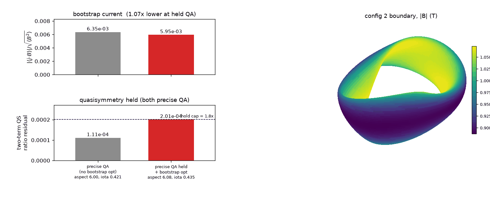
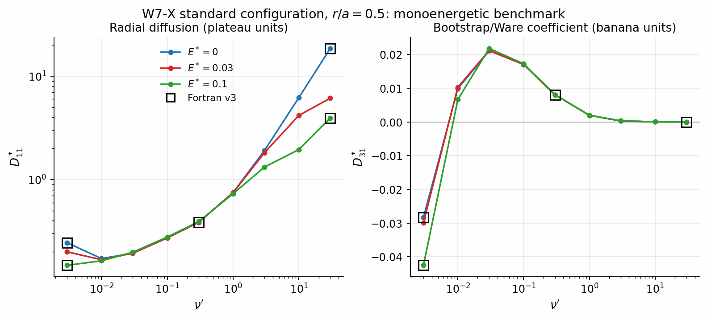
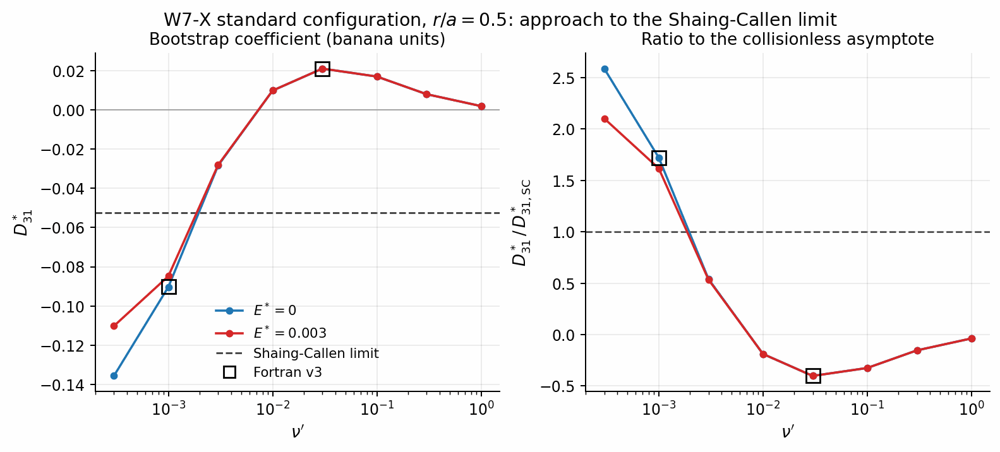
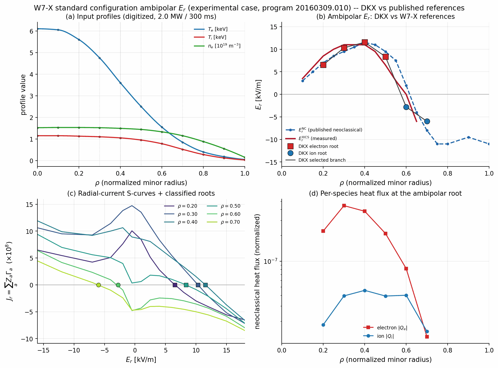
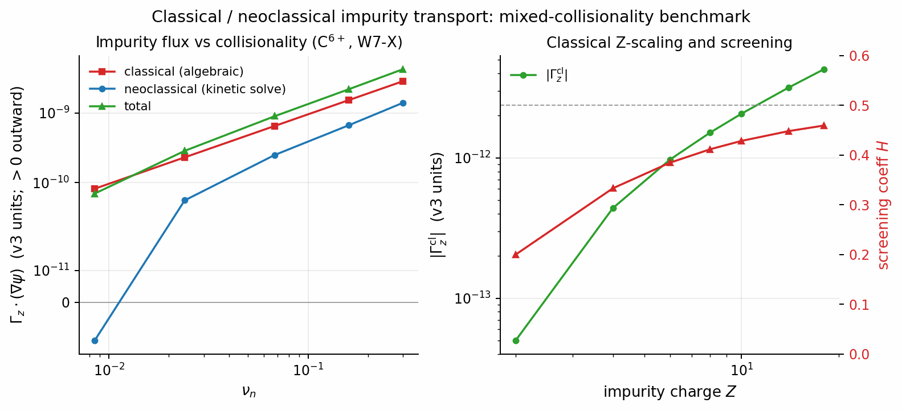
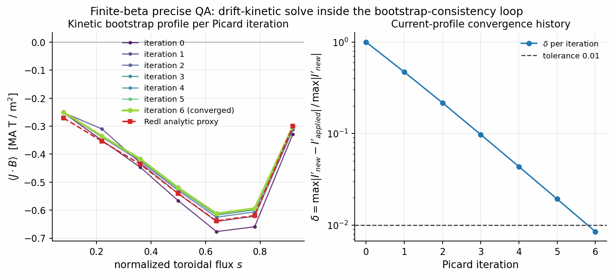

# DKX

[](https://pypi.org/project/dkx/)
[](https://github.com/uwplasma/DKX/actions/workflows/ci.yml)
[](https://sfincs-jax.readthedocs.io/en/latest/)
[](LICENSE)
[](https://www.python.org/downloads/)

**DKX** solves the radially local, linearized drift-kinetic equation on a flux
surface — the same physics as [SFINCS Fortran v3](https://github.com/landreman/sfincs) —
in pure JAX. One `input.namelist` plus one geometry file gives neoclassical
particle/heat fluxes, parallel flows, bootstrap current, and transport matrices
for stellarators and tokamaks, on CPU or GPU. Every output is pinned
field-by-field against SFINCS Fortran v3, and the whole solve is differentiable:
`jax.grad` of any output with respect to any input, by implicit differentiation.


*Every canonical module admitted against the reference implementation at pinned
tolerances that run in CI: fluxes, flows, bootstrap current, transport matrices,
collisions, geometry, and console prints all match SFINCS Fortran v3 to the
envelopes shown.*

## Install

```bash
pip install dkx
```

The solver tiers (block-tridiagonal Legendre elimination, recycled GCROT,
implicit differentiation) live in the external
[`solvax`](https://pypi.org/project/solvax/) library, which installs
automatically as a core dependency. For GPU, add the matching CUDA build of JAX,
e.g. `pip install -U "jax[cuda12]"`. Large public equilibria (W7-X, HSX) are
fetched from a GitHub release on first use and cached under `~/.cache/dkx/data`
(prefetch with `python -m dkx.validation.data_fetch`; see the
[installation docs](docs/installation.rst) for offline options).

## Quickstart

```bash
dkx input.namelist --out sfincsOutput.h5    # solve, write SFINCS-keyed HDF5/NetCDF
dkx --plot sfincsOutput.h5                  # PDF diagnostics panel
```

The same solve from Python (mirrors
[`examples/getting_started/run_tokamak.py`](examples/getting_started/run_tokamak.py),
which also builds the namelist from dicts and plots the result):

```python
from pathlib import Path
from dkx.run import run_profile

deck = Path("input.namelist")
deck.write_text("""\
&geometryParameters
  geometryScheme = 1  ! circular tokamak: BHat = 1 + 0.1 cos(theta)
  inputRadialCoordinate = 3
  rN_wish = 0.3
  B0OverBBar = 1.0  GHat = 1.0  IHat = 0.0  iota = 1.31
  epsilon_t = 0.1  epsilon_h = 0.0  psiAHat = 0.045  aHat = 0.1
/
&speciesParameters
  Zs = 1  mHats = 1.0  nHats = 1.0  THats = 0.5
  dNHatdrHats = -6.0  dTHatdrHats = -3.0
/
&physicsParameters
  Delta = 4.5694d-3  alpha = 1.0  nu_n = 8.4774d-3
  Er = 0.0  collisionOperator = 1  ! pitch-angle scattering
/
&resolutionParameters
  Ntheta = 15  Nzeta = 1  Nxi = 8  NL = 4  Nx = 6
  solverTolerance = 1d-10
/
""")

run = run_profile(deck, solve_method="auto", out_path=Path("sfincsOutput.h5"))
print("particle flux:", float(run.moments["particleFlux_vm_psiHat"][0]))
print("bootstrap current <j.B>:", float(run.moments["FSABjHat"]))
```

`run_profile` prints the Fortran-parity console flow, writes `sfincsOutput.h5`/`.nc`
keyed by the SFINCS output names, and returns the state, solver statistics, and
all moments in memory.

## Parity with SFINCS Fortran v3

Every canonical module is admitted against the reference implementation —
Fortran golden outputs, tiny-grid PETSc matrix dumps, or the retained legacy
path — at pinned tolerances that run in CI (the envelope figure at the top of
this page). Outputs, per-species result tables, and console prints match SFINCS
Fortran v3 field-by-field. The scheme-1 monoenergetic `transportMatrix[0,1]`
element is pinned to upstream's expected value because that element is
tolerance-unstable in the Fortran build itself; the DKX direct solve reproduces
the expected value to 4.2e-6 by construction.

| Capability | dkx | SFINCS Fortran v3 |
| --- | :---: | :---: |
| RHSMode 1/2/3 (fluxes, flows, bootstrap current, transport matrices) | ✅ | ✅ |
| Pitch-angle + full Fokker-Planck (Rosenbluth) collisions | ✅ | ✅ |
| Geometry: analytic 1-4, VMEC 5, Boozer `.bc` 11/12, namelist spectrum 13; non-symmetric (`lasym`) | ✅ | ✅ |
| `Phi1`/quasineutrality; Tangential magnetic drifts; `export_f` output | ✅ | ✅ |
| Ambipolar radial-electric-field root solve | ✅ | ✅ |
| Exact gradients of any output w.r.t. any input (`jax.grad`, implicit differentiation) | ✅ | ❌ |
| GPU execution; warm starts + Krylov recycling across scans | ✅ | ❌ |
| Variational upper/lower transport bounds (convergence certificates) | ✅ | ❌ |
| MPI multi-node execution | ❌ (single-node multicore + GPU) | ✅ |

The full matrix — including the JAX-only research capabilities (momentum-conserving
flow corrections, an extended-collisionality Sugama operator, monoenergetic
database mode, batched GPU scans, a bounce-averaged 1/ν surrogate) — lives in
[docs/feature_matrix.rst](docs/feature_matrix.rst).

*Reproduce with the drivers in [`examples/parity/`](examples/parity/).*

## Fast on CPU and GPU


Measured head-to-head on the same machine (MacBook, Apple M4, 24 GB) and the
same deck: `HSX_PASCollisions_DKESTrajectories`, RHSMode=1, at
`Ntheta=25, Nzeta=51, Nxi=100, Nx=5` — **744,610 unknowns**. The Fortran
reference is the conda PETSc 3.23 + MUMPS 5.8.2 build of SFINCS v3.

- With the matched `Nxi`-for-`x` ramp discretization, DKX solves in
  **27.2 s at 0.93 GB** — 17x faster than 1-rank Fortran (463.6 s, 3.98 GB) and
  8.4x faster than Fortran's best measured parallel floor (229.5 s / 2.86 GB at
  2 ranks), at roughly 30% of the memory. With uniform `Nxi` it takes 44.3 s at
  1.16 GB; an RTX A4000 GPU takes 45.0 s (the Legendre scan is serial and A4000
  FP64 is 1/32 rate).
- A cross-machine sweep on the two-species production variant (1,275,010
  unknowns) repeats the shape: one DKX process beats every measured MPI
  configuration — 3.1x the laptop's best on CPU, 13.6x the workstation's best on
  its GPU. At the full production resolution (2.5 M unknowns) neither code fits a
  global sparse factorization in 24 GB, and the truncated Legendre elimination is
  the locally viable direct path (~0.3 GB vs ~91 GB for the full-band factor).
- The direct solve is more converged than the Fortran reference: Fortran's own
  electron `FSABFlow` scatters 51% across its 1/2/4/8-rank runs (Krylov solver
  noise), while DKX matches the closest Fortran run to 2e-10.

Scope: this is **one measured 744k-unknown HSX PAS case**; further cases are
promoted here as each vertical slice lands with its own evidence. Full tables,
provenance, and known issues: [docs/performance.rst](docs/performance.rst);
regenerate with `python tools/benchmarks/tier1_hsx_head_to_head.py` and
`python tools/benchmarks/readme_figures.py`.

## Differentiable optimization



One `jax.value_and_grad` differentiates the whole physics chain — boundary
Fourier modes through the fixed-boundary MHD equilibrium (implicit adjoint), the
differentiable Boozer transform, and the drift-kinetic solve — to the bootstrap
current, with no finite differences. The flagship run shapes a genuine
quasi-axisymmetric stellarator and then lowers its bootstrap current at held
quasisymmetry, warm-starting the kinetic Krylov solve across optimizer
iterations so each evaluation is a few seconds.

*Reproduce with `python examples/optimization/optimize_QA_bootstrap.py` (needs
the optional `vmex` + `booz_xform_jax` companions).*

## Monoenergetic (ICNTS) benchmarks



ICNTS-style monoenergetic coefficients (`D11*`, `D31*` versus collisionality at
several `EStar`) on the W7-X, TJ-II, and HSX standard configurations, each with
matched-deck SFINCS Fortran v3 cross-check points at solver precision. The
quasi-helically symmetric HSX case shows the suppressed 1/ν branch that W7-X and
TJ-II retain.

*Reproduce with `python examples/paper_benchmarks/monoenergetic_icnts_w7x.py`
(and the `_tjii` / `_hsx` companions).*

## Low-collisionality bootstrap convergence



The hard low-collisionality test: the bootstrap coefficient `D31*` on the W7-X
standard configuration scanned to `nuPrime = 3e-4`, approaching the collisionless
Shaing-Callen asymptote. At `EStar = 0` the coefficient keeps deepening past the
asymptote — the 1/ν-regime offset does not decay without orbit precession — while
a small finite `EStar` detaches below `nuPrime ~ 1e-3` and flattens back toward
the asymptote, the E×B-precession dip.

*Reproduce with `python examples/paper_benchmarks/shaing_callen_convergence.py`.*

## Ambipolar Er and electron roots



Validated against a real published W7-X core-electron-root-confinement discharge
[Pablant et al., *Phys. Plasmas* 25, 022508 (2018)]: DKX resolves every ambipolar
root of `J_r(E_r)`, classifies each as ion / unstable / electron by the `dJr/dEr`
sign, and follows the physical branch by radial continuity to reproduce the
electron-root → ion-root crossover near `ρ ~ 0.6`, matching the reference `E_r`
within the digitization uncertainty (~1.5 kV/m mean difference).

*Reproduce with `python examples/paper_benchmarks/w7x_ambipolar_er.py` and
`python examples/paper_benchmarks/electron_root_optimization.py`.*

## Impurity transport



Classical and neoclassical transport of a high-Z trace impurity in a hydrogenic
bulk, anchored by a Fortran-parity check on the committed carbon two-species deck
(neoclassical impurity flux to 1.5e-6 relative). The temperature-screening
diagnostic recovers the exact `-Z` density-peaking coefficient and the classical
1/2 collisional screening coefficient, with an autodiff ion-temperature-gradient
derivative verified against finite differences.

*Reproduce with `python examples/paper_benchmarks/impurity_transport.py`.*

## Kinetic-in-the-loop bootstrap



A self-consistent finite-β precise-QA equilibrium with the full drift-kinetic
solve inside the Picard loop, in place of the Redl analytic proxy, converging in
7 damped iterations. At the converged state the analytic proxy over-predicts the
kinetic bootstrap current by a few percent across the interior profile — the
error the kinetic-in-the-loop iteration removes by construction — and one
`jax.value_and_grad` differentiates the total bootstrap current through the
equilibrium → Boozer → kinetic chain.

*Reproduce with `python examples/paper_benchmarks/bootstrap_consistency_kinetic_loop.py`
(needs the optional `vmex` + `booz_xform_jax` companions).*

## Examples

Six pedagogic scripts on the canonical API sit at the top of
[`examples/`](examples/) — parameters at the top, printed progress, a plot, and
output files written and read back. The wider tree (tutorial notebooks,
parity/benchmark drivers, upstream SFINCS decks) is mapped in the navigable
[`examples/README.md`](examples/README.md).

## Documentation

Full documentation — installation, quickstart, the equations solved, namelist
and output references, API, and measured performance/validation notes — at
[sfincs-jax.readthedocs.io](https://sfincs-jax.readthedocs.io/).

## Known issues

- `Nxi_for_x` ramps embed the truncated degrees of freedom as identity-pinned
  rows in the matrix-free operator (the Fortran code packs them out of its
  matrix). The direct tier solves each `(species, x)` subsystem with its own
  packed Legendre count — the exact Fortran discretization — and gradients
  through the ramped route match finite differences to 1e-6 relative in the
  regression tests; every solve raises at execution time if a forward or adjoint
  solve fails to converge.
- The scheme-1 monoenergetic `transportMatrix[0,1]` element is ill-conditioned
  in the upstream configuration itself, so parity for it is pinned to upstream's
  expected value. Near-singular structured eliminations (for example a
  collisionless `nu_n = 0` deck) fall back automatically from the direct tier to
  the preconditioned Krylov tier.

## License

MIT. See [LICENSE](LICENSE). If you use DKX in published work, please cite this
repository and the SFINCS drift-kinetic formulation
[Landreman et al., *Phys. Plasmas* 21, 042503 (2014)].
