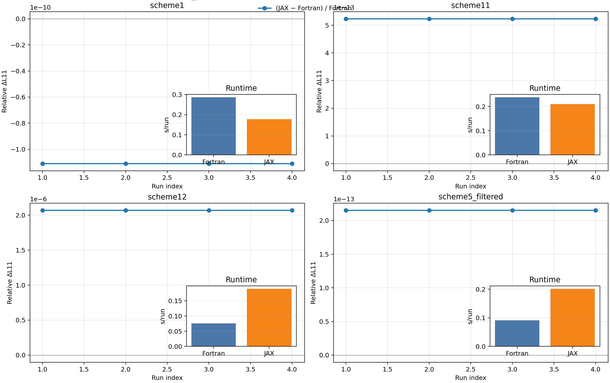

# sfincs_jax

`sfincs_jax` is a JAX implementation of SFINCS v3 that solves the same neoclassical drift-kinetic problem with matching normalizations, geometry conventions, and output format (`sfincsOutput.h5`).

On the current `main` branch, the full vendored example suite runs cleanly on CPU and GPU with dataset-level parity against SFINCS Fortran v3. The default CLI path is tuned for robust explicit solves and practical throughput, while the Python API can opt into differentiable solve paths when gradients matter.

It is designed for:

- high-performance runs on CPU/GPU,
- memory-efficient large solves,
- end-to-end differentiable workflows.



The figure above shows a representative transport benchmark. In the full 39-case example-suite audit below, all cases complete on CPU and GPU with no `jax_error`, no `max_attempts`, no practical mismatches, and no strict mismatches.

## Installation

Install from PyPI:

```bash
pip install sfincs_jax
```

Install from source:

```bash
git clone https://github.com/uwplasma/sfincs_jax.git
cd sfincs_jax
pip install .
```

Development install:

```bash
git clone https://github.com/uwplasma/sfincs_jax.git
cd sfincs_jax
pip install -e ".[dev]"
```

## Quick Start (Python)

Read a namelist, run `sfincs_jax`, write `sfincsOutput.h5`, and inspect results directly in memory:

```python
from pathlib import Path

from sfincs_jax.io import write_sfincs_jax_output_h5

input_namelist = Path("input.namelist")
out_path, results = write_sfincs_jax_output_h5(
    input_namelist=input_namelist,
    output_path=Path("sfincsOutput.h5"),
    return_results=True,
)

print("Wrote:", out_path)
print("Available datasets:", len(results))
print("Example key:", "particleFlux_vm_psiHat" in results)
```

`sfincs_jax write-output` and `write_sfincs_jax_output_h5(...)` use the explicit
performance-oriented solve path by default. Request the implicit/differentiable linear-solve path only when
you need it:

```python
write_sfincs_jax_output_h5(
    input_namelist=input_namelist,
    output_path=Path("sfincsOutput.h5"),
    differentiable=True,
)
```

## Executable (CLI)

You can run `sfincs_jax` from anywhere in your terminal. You do not need to be inside the repository folder.

Run an input file (default behavior, same invocation style as Fortran SFINCS):

```bash
sfincs_jax /path/to/input.namelist
```

Write output explicitly:

```bash
sfincs_jax write-output --input /path/to/input.namelist --out /path/to/sfincsOutput.h5
```

Compare two outputs:

```bash
sfincs_jax compare-h5 --a sfincsOutput_jax.h5 --b sfincsOutput_fortran.h5
```

Advanced CLI/solver options are documented in `docs/usage.rst` and `docs/performance_techniques.rst`.

## What Differs From Fortran v3

`sfincs_jax` reproduces the SFINCS v3 equations, normalizations, geometry conventions, and output datasets for the supported examples, but the implementation strategy differs in a few important ways:

- the default CLI path uses an explicit performance-oriented solve strategy instead of trying to mirror every PETSc iteration path exactly,
- the Python API can switch to differentiable solve paths when end-to-end sensitivities are needed,
- CPU runs lean on JIT-cached kernels and selected host sparse factorizations for hard linear branches,
- GPU runs keep operator applications on device, then fall back to accelerator-safe or host rescue paths only when conditioning or memory demands it,
- and terminal output is intentionally a superset of Fortran SFINCS output so debugging information is available without losing Fortran-visible signals.

The detailed equations and normalization conventions are documented in `docs/system_equations.rst`, `docs/normalizations.rst`, and `docs/method.rst`. CPU/GPU-specific implementation notes are documented in `docs/performance.rst` and `docs/performance_techniques.rst`.

## Current Example-Suite Audit

Regenerate this block from the current `main` working tree with:

```bash
python scripts/run_scaled_example_suite.py \
  --examples-root examples/sfincs_examples \
  --resolution-reference-root /Users/rogeriojorge/local/tests/sfincs_original/fortran/version3/examples \
  --fortran-exe /Users/rogeriojorge/local/tests/sfincs/fortran/version3/sfincs \
  --out-root tests/scaled_example_suite_fast_cpu_rtwindow_v1 \
  --scale-factor 1.0 \
  --runtime-target-basis fortran \
  --fortran-min-runtime-s 1.0 \
  --fortran-max-runtime-s 20.0 \
  --runtime-adjustment-iters 3
python scripts/generate_readme_fast_branch_audit.py \
  --out-root tests/scaled_example_suite_fast_cpu_rtwindow_v1
```

The benchmark policy on `main` is:

- start from the original Fortran v3 example resolution,
- only downscale when a case is too expensive for a practical suite run,
- benchmark JAX CPU and GPU against a frozen CPU-generated Fortran reference root,
- and never intentionally push a reduced case below about `1s` of Fortran wall time unless
  the original example is already that small.

That avoids the misleading sub-second Fortran rows that came from blind global downscaling,
keeps the GPU lane tied to a deterministic reference, and makes the additional example part
of the same artifact set as the standard suite.

<!-- BEGIN FAST_BRANCH_AUDIT -->
Current `main` CPU audit comes from `tests/scaled_example_suite_fast_cpu_full_v6_merged`.
Matching frozen-reference GPU audit comes from `tests/scaled_example_suite_fast_gpu_full_v8`.

- Recorded cases: `39/39`
- Practical status counts: `parity_ok=39`
- Strict status counts: `parity_ok=39`
- GPU practical status counts: `parity_ok=39`
- GPU strict status counts: `parity_ok=39`
- Remaining cases: none
- Additional example: `parity_ok` on CPU and `parity_ok` on GPU

Current mismatches:
- CPU practical mismatches: none
- CPU strict mismatches: none
- GPU practical/strict mismatches: none

Full per-case runtime / memory table:
| Case | Fortran CPU(s) | JAX CPU(s) | CPU x | JAX GPU(s) | GPU x | Fortran MB | JAX CPU MB | CPU MB x | JAX GPU MB | GPU MB x | CPU mismatch | GPU mismatch | CPU print | GPU print | CPU status | GPU status |
| --- | ---: | ---: | ---: | ---: | ---: | ---: | ---: | ---: | ---: | ---: | --- | --- | --- | --- | --- | --- |
| `HSX_FPCollisions_DKESTrajectories` | 29.664 | 2.907 | 0.10x | 5.956 | 0.20x | 103.0 | 474.8 | 4.61x | 967.2 | 9.39x | 0/193 (strict 0/193) | 0/193 (strict 0/193) | 9/9 | 9/9 | parity_ok | parity_ok |
| `HSX_FPCollisions_fullTrajectories` | 88.504 | 2.882 | 0.03x | 6.609 | 0.07x | 100.8 | 496.3 | 4.92x | 972.7 | 9.65x | 0/193 (strict 0/193) | 0/193 (strict 0/193) | 9/9 | 9/9 | parity_ok | parity_ok |
| `HSX_PASCollisions_DKESTrajectories` | 0.994 | 4.900 | 4.93x | 11.242 | 11.31x | 112.0 | 2128.6 | 19.00x | 1488.3 | 13.28x | 0/123 (strict 0/123) | 0/123 (strict 0/123) | 7/7 | 7/7 | parity_ok | parity_ok |
| `HSX_PASCollisions_fullTrajectories` | 2.510 | 4.563 | 1.82x | 11.600 | 4.62x | 179.2 | 1662.3 | 9.28x | 2105.3 | 11.75x | 0/193 (strict 0/193) | 0/193 (strict 0/193) | 9/9 | 9/9 | parity_ok | parity_ok |
| `additional_examples` | 120.074 | 1.596 | 0.01x | 3.487 | 0.03x | 102.1 | 407.4 | 3.99x | 930.1 | 9.11x | 0/193 (strict 0/193) | 0/193 (strict 0/193) | 9/9 | 9/9 | parity_ok | parity_ok |
| `filteredW7XNetCDF_2species_magneticDrifts_noEr` | 89.052 | 1.816 | 0.02x | 4.045 | 0.05x | 103.2 | 475.3 | 4.60x | 949.3 | 9.19x | 0/193 (strict 0/193) | 0/193 (strict 0/193) | 9/9 | 9/9 | parity_ok | parity_ok |
| `filteredW7XNetCDF_2species_magneticDrifts_withEr` | 95.440 | 1.910 | 0.02x | 4.246 | 0.04x | 96.2 | 516.7 | 5.37x | 958.8 | 9.97x | 0/193 (strict 0/193) | 0/193 (strict 0/193) | 9/9 | 9/9 | parity_ok | parity_ok |
| `filteredW7XNetCDF_2species_noEr` | 128.508 | 1.653 | 0.01x | 3.538 | 0.03x | 100.3 | 460.2 | 4.59x | 940.1 | 9.37x | 0/193 (strict 0/193) | 0/193 (strict 0/193) | 9/9 | 9/9 | parity_ok | parity_ok |
| `geometryScheme4_1species_PAS_withEr_DKESTrajectories` | 1.365 | 3.588 | 2.63x | 5.506 | 4.03x | 127.3 | 969.8 | 7.62x | 1307.5 | 10.27x | 0/207 (strict 0/207) | 0/207 (strict 0/207) | 9/9 | 9/9 | parity_ok | parity_ok |
| `geometryScheme4_2species_PAS_noEr` | 0.953 | 3.685 | 3.87x | 9.286 | 9.74x | 162.7 | 2623.4 | 16.12x | 2552.1 | 15.69x | 0/207 (strict 0/207) | 0/207 (strict 0/207) | 9/9 | 9/9 | parity_ok | parity_ok |
| `geometryScheme4_2species_noEr` | 139.240 | 1.699 | 0.01x | 3.594 | 0.03x | 92.2 | 444.1 | 4.81x | 960.2 | 10.41x | 0/207 (strict 0/207) | 0/207 (strict 0/207) | 9/9 | 9/9 | parity_ok | parity_ok |
| `geometryScheme4_2species_noEr_withPhi1InDKE` | 293.275 | 1.973 | 0.01x | 4.647 | 0.02x | 100.6 | 468.6 | 4.66x | 990.8 | 9.84x | 0/264 (strict 0/264) | 0/264 (strict 0/264) | 9/9 | 9/9 | parity_ok | parity_ok |
| `geometryScheme4_2species_noEr_withQN` | 146.734 | 1.661 | 0.01x | 3.944 | 0.03x | 95.1 | 452.5 | 4.76x | 975.3 | 10.26x | 0/264 (strict 0/264) | 0/264 (strict 0/264) | 9/9 | 9/9 | parity_ok | parity_ok |
| `geometryScheme4_2species_withEr_fullTrajectories` | 58.053 | 1.749 | 0.03x | 4.146 | 0.07x | 113.4 | 463.4 | 4.09x | 958.1 | 8.45x | 0/193 (strict 0/193) | 0/193 (strict 0/193) | 9/9 | 9/9 | parity_ok | parity_ok |
| `geometryScheme4_2species_withEr_fullTrajectories_withQN` | 211.358 | 1.806 | 0.01x | 4.348 | 0.02x | 98.8 | 479.5 | 4.85x | 980.3 | 9.92x | 0/250 (strict 0/250) | 0/250 (strict 0/250) | 9/9 | 9/9 | parity_ok | parity_ok |
| `geometryScheme5_3species_loRes` | 98.976 | 1.750 | 0.02x | 144.597 | 1.46x | 129.6 | 540.1 | 4.17x | 1043.0 | 8.05x | 0/193 (strict 0/193) | 0/193 (strict 0/193) | 9/9 | 9/9 | parity_ok | parity_ok |
| `inductiveE_noEr` | 166.614 | 1.597 | 0.01x | 4.341 | 0.03x | 99.2 | 449.8 | 4.53x | 959.8 | 9.68x | 0/207 (strict 0/207) | 0/207 (strict 0/207) | 9/9 | 9/9 | parity_ok | parity_ok |
| `monoenergetic_geometryScheme1` | 0.795 | 1.707 | 2.15x | 4.091 | 5.15x | 110.2 | 664.0 | 6.02x | 967.7 | 8.78x | 0/203 (strict 0/203) | 0/203 (strict 0/203) | 9/9 | 9/9 | parity_ok | parity_ok |
| `monoenergetic_geometryScheme11` | 0.861 | 2.728 | 3.17x | 16.535 | 19.20x | 118.7 | 1164.6 | 9.81x | 1091.1 | 9.19x | 0/208 (strict 0/208) | 0/208 (strict 0/208) | 9/9 | 9/9 | parity_ok | parity_ok |
| `monoenergetic_geometryScheme5_ASCII` | 1.052 | 2.653 | 2.52x | 17.433 | 16.57x | 142.1 | 2773.9 | 19.52x | 1296.0 | 9.12x | 0/205 (strict 0/205) | 0/205 (strict 0/205) | 9/9 | 9/9 | parity_ok | parity_ok |
| `monoenergetic_geometryScheme5_netCDF` | 1.029 | 2.133 | 2.07x | 14.875 | 14.46x | 131.4 | 1148.6 | 8.74x | 1073.7 | 8.17x | 0/205 (strict 0/205) | 0/205 (strict 0/205) | 9/9 | 9/9 | parity_ok | parity_ok |
| `quick_2species_FPCollisions_noEr` | 166.945 | 1.553 | 0.01x | 4.445 | 0.03x | 97.1 | 440.7 | 4.54x | 959.0 | 9.87x | 0/207 (strict 0/207) | 0/207 (strict 0/207) | 9/9 | 9/9 | parity_ok | parity_ok |
| `sfincsPaperFigure3_geometryScheme11_FPCollisions_2Species_DKESTrajectories` | 76.666 | 1.754 | 0.02x | 3.998 | 0.05x | 106.7 | 464.1 | 4.35x | 964.2 | 9.03x | 0/207 (strict 0/207) | 0/207 (strict 0/207) | 9/9 | 9/9 | parity_ok | parity_ok |
| `sfincsPaperFigure3_geometryScheme11_FPCollisions_2Species_fullTrajectories` | 93.439 | 1.921 | 0.02x | 4.508 | 0.05x | 94.0 | 476.6 | 5.07x | 970.3 | 10.33x | 0/207 (strict 0/207) | 0/207 (strict 0/207) | 9/9 | 9/9 | parity_ok | parity_ok |
| `sfincsPaperFigure3_geometryScheme11_PASCollisions_2Species_DKESTrajectories` | 1.104 | 4.550 | 4.12x | 25.291 | 22.91x | 130.7 | 874.1 | 6.69x | 1671.2 | 12.79x | 0/207 (strict 0/207) | 0/207 (strict 0/207) | 9/9 | 9/9 | parity_ok | parity_ok |
| `sfincsPaperFigure3_geometryScheme11_PASCollisions_2Species_fullTrajectories` | 1.706 | 3.440 | 2.02x | 58.198 | 34.11x | 144.6 | 2075.7 | 14.36x | 2354.4 | 16.28x | 0/207 (strict 0/207) | 0/207 (strict 0/207) | 9/9 | 9/9 | parity_ok | parity_ok |
| `tokamak_1species_FPCollisions_noEr` | 160.856 | 1.329 | 0.01x | 4.039 | 0.03x | 93.2 | 352.1 | 3.78x | 904.8 | 9.71x | 0/188 (strict 0/188) | 0/188 (strict 0/188) | 9/9 | 9/9 | parity_ok | parity_ok |
| `tokamak_1species_FPCollisions_noEr_withPhi1InDKE` | 259.575 | 1.930 | 0.01x | 5.406 | 0.02x | 89.6 | 441.9 | 4.93x | 980.8 | 10.95x | 0/274 (strict 0/274) | 0/274 (strict 0/274) | 9/9 | 9/9 | parity_ok | parity_ok |
| `tokamak_1species_FPCollisions_noEr_withQN` | 237.879 | 1.546 | 0.01x | 4.244 | 0.02x | 102.6 | 406.7 | 3.96x | 963.2 | 9.39x | 0/274 (strict 0/274) | 0/274 (strict 0/274) | 9/9 | 9/9 | parity_ok | parity_ok |
| `tokamak_1species_FPCollisions_withEr_DKESTrajectories` | 155.955 | 1.548 | 0.01x | 3.693 | 0.02x | 103.1 | 410.2 | 3.98x | 953.7 | 9.25x | 0/214 (strict 0/214) | 0/214 (strict 0/214) | 9/9 | 9/9 | parity_ok | parity_ok |
| `tokamak_1species_FPCollisions_withEr_fullTrajectories` | 154.953 | 1.878 | 0.01x | 3.741 | 0.02x | 101.1 | 421.0 | 4.16x | 960.9 | 9.51x | 0/214 (strict 0/214) | 0/214 (strict 0/214) | 9/9 | 9/9 | parity_ok | parity_ok |
| `tokamak_1species_PASCollisions_noEr` | 0.309 | 2.345 | 7.59x | 5.855 | 18.95x | 114.2 | 575.2 | 5.03x | 1028.2 | 9.00x | 0/212 (strict 0/212) | 0/212 (strict 0/212) | 9/9 | 9/9 | parity_ok | parity_ok |
| `tokamak_1species_PASCollisions_noEr_Nx1` | 0.017 | 1.753 | 103.14x | 5.610 | 330.01x | 100.9 | 481.9 | 4.77x | 971.1 | 9.62x | 0/212 (strict 0/212) | 0/212 (strict 0/212) | 9/9 | 9/9 | parity_ok | parity_ok |
| `tokamak_1species_PASCollisions_noEr_withQN` | 0.888 | 1.986 | 2.24x | 4.347 | 4.90x | 120.9 | 496.9 | 4.11x | 1031.6 | 8.53x | 0/274 (strict 0/274) | 0/274 (strict 0/274) | 9/9 | 9/9 | parity_ok | parity_ok |
| `tokamak_1species_PASCollisions_withEr_fullTrajectories` | 0.017 | 37.747 | 2220.43x | 87.134 | 5125.56x | 102.0 | 549.3 | 5.38x | 1076.8 | 10.55x | 0/212 (strict 0/212) | 0/212 (strict 0/212) | 9/9 | 9/9 | parity_ok | parity_ok |
| `tokamak_2species_PASCollisions_noEr` | 0.331 | 3.555 | 10.74x | 12.356 | 37.33x | 123.6 | 1940.7 | 15.70x | 1702.6 | 13.78x | 0/212 (strict 0/212) | 0/212 (strict 0/212) | 9/9 | 9/9 | parity_ok | parity_ok |
| `tokamak_2species_PASCollisions_withEr_fullTrajectories` | 1.330 | 3.331 | 2.50x | 8.927 | 6.71x | 121.8 | 1586.3 | 13.02x | 1292.6 | 10.61x | 0/212 (strict 0/212) | 0/212 (strict 0/212) | 9/9 | 9/9 | parity_ok | parity_ok |
| `transportMatrix_geometryScheme11` | 0.025 | 1.605 | 64.20x | 3.795 | 151.82x | 102.6 | 405.2 | 3.95x | 968.7 | 9.44x | 0/194 (strict 0/194) | 0/194 (strict 0/194) | 9/9 | 9/9 | parity_ok | parity_ok |
| `transportMatrix_geometryScheme2` | 0.031 | 1.479 | 47.72x | 3.543 | 114.28x | 100.5 | 405.7 | 4.04x | 965.9 | 9.61x | 0/194 (strict 0/194) | 0/194 (strict 0/194) | 9/9 | 9/9 | parity_ok | parity_ok |
<!-- END FAST_BRANCH_AUDIT -->

## Documentation

Build docs locally:

```bash
sphinx-build -b html -W docs docs/_build/html
```

Entry points:

- `docs/index.rst`
- `docs/system_equations.rst`
- `docs/method.rst`
- `docs/normalizations.rst`
- `docs/performance.rst`
- `docs/parallelism.rst`

## Testing

```bash
pytest -q
```

## License

See `LICENSE`.
