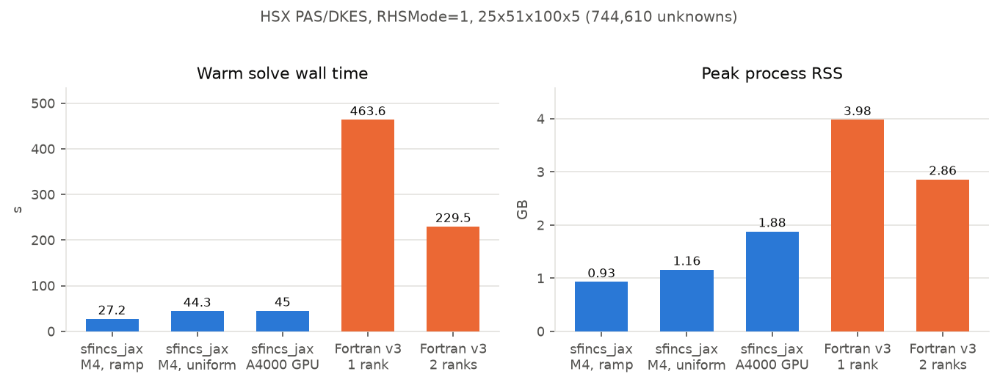
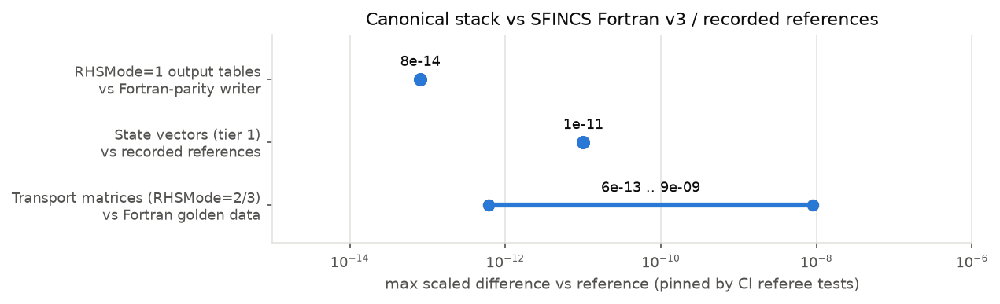

# sfincs_jax

[](https://github.com/uwplasma/sfincs_jax/actions/workflows/ci.yml)
[](https://github.com/uwplasma/sfincs_jax/actions/workflows/docs.yml)
[](https://pypi.org/project/sfincs_jax/)
[](https://codecov.io/gh/uwplasma/sfincs_jax)
[](https://www.python.org/downloads/)
[](LICENSE)

`sfincs_jax` solves the radially local, linearized drift-kinetic equation on a
flux surface — the same physics as [SFINCS Fortran v3](https://github.com/landreman/sfincs)
— in pure JAX. One `input.namelist` plus one geometry file gives neoclassical
particle/heat fluxes, parallel flows, bootstrap current, and transport matrices
for stellarators and tokamaks, on CPU or GPU, with end-to-end automatic
differentiation for sensitivities and optimization. Outputs, per-species result
tables, and console prints are pinned field-by-field against SFINCS Fortran v3.

## Installation

```bash
pip install sfincs_jax
```

The solver tiers (block-tridiagonal Legendre elimination, recycled GCROT,
implicit differentiation) live in the external [`solvax`](https://pypi.org/project/solvax/)
library, which installs automatically as a core dependency.

Optional extras:

- **GPU**: install the matching CUDA build of JAX, e.g.
  `pip install -U "jax[cuda12]"`.

Large public equilibrium files (W7-X, HSX) are not shipped in the wheel; they
are fetched from a GitHub release on first use and cached under
`~/.cache/sfincs_jax/data`. Prefetch with
`python -m sfincs_jax.validation.data_fetch`; see the
[installation docs](docs/installation.rst) for offline/cache options and for
building the SFINCS Fortran v3 reference executable with conda-provided
PETSc/MUMPS.

## Quickstart

Run a small circular-tokamak deck through the canonical driver (this mirrors
[`examples/run_tokamak.py`](examples/run_tokamak.py), which also builds the
namelist from Python dicts and plots the results):

```python
from pathlib import Path
from sfincs_jax.run import run_profile

deck = Path("input.namelist")
deck.write_text("""\
&geometryParameters
  geometryScheme = 1  ! circular tokamak: BHat = 1 + 0.1 cos(theta)
  inputRadialCoordinate = 3
  rN_wish = 0.3
  B0OverBBar = 1.0  GHat = 1.0  IHat = 0.0  iota = 1.31
  epsilon_t = 0.1  epsilon_h = 0.0  psiAHat = 0.045  aHat = 0.1
/
&speciesParameters
  Zs = 1  mHats = 1.0  nHats = 1.0  THats = 0.5
  dNHatdrHats = -6.0  dTHatdrHats = -3.0
/
&physicsParameters
  Delta = 4.5694d-3  alpha = 1.0  nu_n = 8.4774d-3
  Er = 0.0  collisionOperator = 1  ! pitch-angle scattering
/
&resolutionParameters
  Ntheta = 15  Nzeta = 1  Nxi = 8  NL = 4  Nx = 6
  solverTolerance = 1d-10
/
""")

run = run_profile(deck, solve_method="auto", out_path=Path("sfincsOutput.h5"))
print("particle flux:", float(run.moments["particleFlux_vm_psiHat"][0]))
print("bootstrap current <j.B>:", float(run.moments["FSABjHat"]))
```

`run_profile` prints the Fortran-parity console flow (banner, grids, solve
progress, per-species results table), writes `sfincsOutput.h5`/`.nc` keyed by
the SFINCS output names, and returns the state vector, solver statistics, and
all moments in memory. The CLI equivalent is
`sfincs_jax input.namelist --out sfincsOutput.h5`, and
`sfincs_jax --plot sfincsOutput.h5` builds a PDF diagnostics panel.

## Performance vs SFINCS Fortran v3

Measured head-to-head on the same machine (MacBook, Apple M4, 24 GB) and the
same deck: `HSX_PASCollisions_DKESTrajectories`, RHSMode=1, at
`Ntheta=25, Nzeta=51, Nxi=100, Nx=5` — 744,610 unknowns. The Fortran reference
is the conda PETSc 3.23 + MUMPS 5.8.2 build of SFINCS v3; `sfincs_jax` uses
the tier-1 truncated Legendre block elimination from `solvax`.



- With the matched `Nxi`-for-`x` ramp discretization, `sfincs_jax` solves in
  **27.2 s at 0.93 GB** — 17x faster than 1-rank Fortran (463.6 s, 3.98 GB) and
  8.4x faster than Fortran's best measured parallel floor (229.5 s / 2.86 GB
  at 2 ranks; 4 and 8 ranks are slower on this machine), at roughly 30% of the
  memory. With uniform `Nxi` it takes 44.3 s at 1.16 GB; an RTX A4000 GPU
  takes 45.0 s (the Legendre scan is serial and A4000 FP64 is 1/32 rate).
- The Fortran strong-scaling baseline on the same case: 463.6 s (1 rank),
  229.5 s (2 ranks, 101% efficiency), 240.9 s (4 ranks), 270.5 s (8 ranks).
- A cross-machine end-to-end sweep on the two-species production variant of
  this deck (1,275,010 unknowns; 10-core laptop + 36-core workstation,
  freshly compiled Fortran MPI) repeats the shape: Fortran/MUMPS bottoms out
  near 8 ranks and degrades beyond (slower at 32 ranks than at 1), while one
  `sfincs_jax` process beats every measured MPI configuration — 3.1x the
  laptop's best on CPU, 13.6x the workstation's best on its GPU
  ([table](docs/performance.rst)).
- At the full production resolution of this case (2.5 M unknowns), **neither**
  code fits a global sparse factorization in 24 GB; the truncated Legendre
  elimination needs only O(K m^2) memory (~0.3 GB here, vs ~91 GB for the
  full-band factor) and is the locally viable direct path.
- The direct solve is more converged than the Fortran reference: Fortran's own
  electron `FSABFlow` scatters 51% across its 1/2/4/8-rank runs (KSP
  rtol=1e-6 solver noise), while `sfincs_jax` matches the closest Fortran run
  to 2e-10 and sits inside Fortran's spread on every quantity.

Scope: this is one measured 744k-unknown HSX PAS case; further cases are
promoted here as each vertical slice lands with its own evidence. Regenerate
the figure from the recorded values with
`python tools/benchmarks/readme_figures.py`; rerun the measurement with
`python tools/benchmarks/tier1_hsx_head_to_head.py`. Full tables, provenance,
and known issues: [docs/performance.rst](docs/performance.rst).

## Parity with SFINCS Fortran v3

Every canonical module was admitted against the reference implementation
(Fortran golden outputs, tiny-grid PETSc matrix dumps, or the retained legacy
implementation) at pinned tolerances that run in CI:



The scheme-1 monoenergetic `transportMatrix[0,1]` element is pinned to
upstream's expected value because that element is tolerance-unstable in the
Fortran build itself; the `sfincs_jax` direct solve reproduces the expected
value to 4.2e-6 by construction.

## Functionality: sfincs_jax vs SFINCS Fortran v3

Every SFINCS Fortran v3 physics family is supported, each admitted with
Fortran-parity evidence (golden outputs, tiny-grid PETSc matrix dumps) pinned
in CI:

| Capability | sfincs_jax | SFINCS Fortran v3 |
| --- | :---: | :---: |
| RHSMode 1 (fluxes, flows, bootstrap current) | ✅ | ✅ |
| RHSMode 2 / 3 (thermal and monoenergetic transport matrices) | ✅ | ✅ |
| Pitch-angle scattering + full Fokker-Planck (Rosenbluth) collisions | ✅ | ✅ |
| Full and DKES trajectory models; radial electric field | ✅ | ✅ |
| Constraint schemes −1…4 | ✅ | ✅ |
| Geometry: analytic 1–4, VMEC 5, Boozer `.bc` 11/12, namelist spectrum 13 | ✅ | ✅ |
| Non-stellarator-symmetric VMEC (`lasym`) | ✅ | ✅ |
| `Phi1`/quasineutrality (kinetic + collision coupling, `readExternalPhi1`) | ✅ | ✅ |
| Tangential magnetic drifts (`magneticDriftScheme` 0–9) | ✅ | ✅ |
| Speed grids `xGridScheme` 1–8; `xDotDerivativeScheme` −2…11 | ✅ | ✅ |
| `export_f`, HDF5/NetCDF output, Fortran-format stdout | ✅ | ✅ |
| Ambipolar radial-electric-field root solve | ✅ | ✅ |
| Exact gradients of any output w.r.t. any input (`jax.grad`, implicit differentiation) | ✅ | ❌ (fixed adjoint pairs via RHSMode 4/5) |
| Differentiable ambipolar root and `Phi1` state (implicit function theorem) | ✅ | ❌ |
| GPU execution | ✅ | ❌ |
| Variational upper/lower bounds on transport coefficients (convergence certificates) | ✅ | ❌ |
| `.npz` output, versioned solver traces, geometry-only output | ✅ | ❌ |
| Warm starts + Krylov recycling across scans and optimizer iterations | ✅ | ❌ |
| Automatic memory-based solver-tier selection | ✅ | ❌ |
| MPI multi-node execution | ❌ (single-node multicore + GPU) | ✅ |

Beyond the Fortran-v3 feature set, several JAX-only research capabilities have
landed: momentum-conserving flow corrections (`sfincs_jax.momentum_correction`),
an extended-collisionality improved Sugama collision operator
(`collisionOperator=3`, momentum- and energy-conserving into the
Pfirsch-Schlüter regime), a monoenergetic (collisionality, electric field)
database mode with energy convolution (`sfincs_jax.monoenergetic`), batched
multi-`Er`/multi-surface GPU scans (`sfincs_jax.batch`), a differentiable
bounce-averaged 1/ν effective-ripple surrogate (`sfincs_jax.bounce_averaged`),
and the variational transport-coefficient bounds above. See
[docs/feature_matrix.rst](docs/feature_matrix.rst) for the matrix.

## Examples

Six pedagogic scripts on the canonical API live at the top of
[`examples/`](examples/) — no `main()`, parameters at the top, printed
progress, a plot, and output files written and read back:

- [`run_tokamak.py`](examples/run_tokamak.py) — build a namelist in Python, solve, read HDF5/NetCDF back.
- [`run_w7x.py`](examples/run_w7x.py) — W7-X Boozer geometry with full Fokker-Planck collisions (tier-2 Krylov).
- [`transport_coefficients.py`](examples/transport_coefficients.py) — monoenergetic transport matrices and a collisionality scan.
- [`ambipolar_er_scan.py`](examples/ambipolar_er_scan.py) — scan `Er`, bracket and solve the ambipolar root.
- [`gradients_tour.py`](examples/gradients_tour.py) — `jax.grad` through the solve, verified against finite differences.
- [`optimize_QA_bootstrap.py`](examples/optimize_QA_bootstrap.py) — differentiable two-stage QA shaping and bootstrap-current reduction through the `vmec_jax` → `sfincs_jax` chain (needs the optional companions).

The wider `examples/` tree (tutorial notebooks, parity/benchmark drivers,
upstream SFINCS decks) is mapped in [`examples/README.md`](examples/README.md).

## Documentation

```bash
pip install -e ".[docs]"
sphinx-build -b html -W docs docs/_build/html
```

Entry points: [docs/index.rst](docs/index.rst) (landing + quickstart),
[docs/examples.rst](docs/examples.rst),
[docs/performance.rst](docs/performance.rst) (measured evidence and known
issues), [docs/inputs.rst](docs/inputs.rst) / [docs/outputs.rst](docs/outputs.rst)
(namelist and output references), and
[docs/system_equations.rst](docs/system_equations.rst) (the equations solved).

## Known issues

- `Nxi_for_x` ramps embed the truncated degrees of freedom as identity-pinned
  rows in the matrix-free operator (the Fortran code packs them out of its
  matrix). The direct tier solves each (species, x) subsystem with its own
  packed Legendre count — the exact Fortran discretization — and the
  differentiable path pins the truncated rows; gradients through the ramped
  route match finite differences to 1e-6 relative in the regression tests,
  and every solve raises at execution time if a forward or adjoint solve
  fails to converge.
- The scheme-1 monoenergetic `transportMatrix[0,1]` element is ill-conditioned
  in the upstream configuration itself (tolerance-unstable in the Fortran
  build); parity for it is pinned to upstream's expected value. Near-singular
  structured eliminations (for example a collisionless `nu_n = 0` deck) fall
  back automatically from the direct tier to the preconditioned Krylov tier.

## Testing

```bash
pytest -q
```

## License

See [LICENSE](LICENSE).
