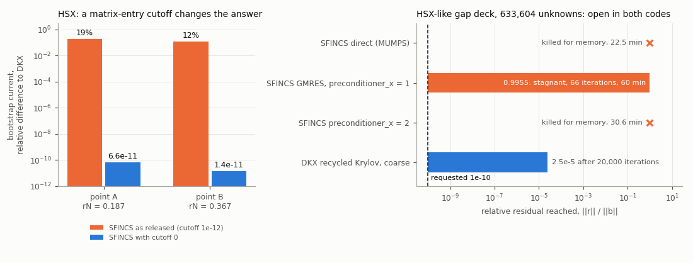
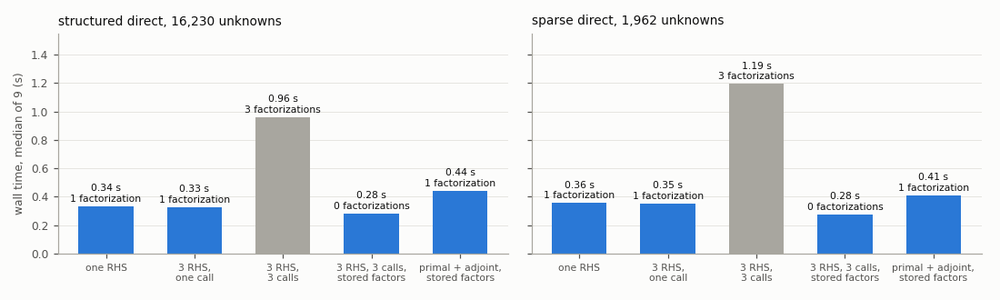
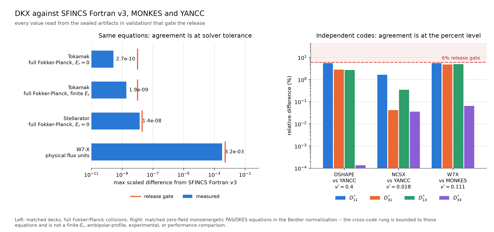

# DKX

[](https://pypi.org/project/dkx/)
[](https://github.com/uwplasma/DKX/actions/workflows/ci.yml)
[](https://sfincs-jax.readthedocs.io/en/latest/)
[](LICENSE)

**Differentiable neoclassical transport for stellarators and tokamaks, in JAX.**

DKX solves the SFINCS v3 drift-kinetic equation on a flux surface for fluxes, flows, bootstrap
current, transport matrices and ambipolar `E_r`, on CPU or GPU, differentiably.


## Install and run

```bash
pip install dkx                    # CPU
pip install -U "jax[cuda12]"       # add for NVIDIA GPUs
```

```python
import dkx

case = dkx.Case.from_mapping({           # analytic tokamak, teaching grid: seconds, not converged
    "schema": 1, "name": "tokamak", "run": {"workflow": "profile", "progress": False},
    "geometry": {"format": "analytic", "file": "tokamak", "surfaces": [0.16, 0.25, 0.36]},
    "species": [{"name": "deuterium", "charge": 1, "mass_amu": 2.014,
                 "density_m3": [8.0e19, 7.0e19, 6.0e19], "temperature_keV": [1.0, 0.8, 0.6]}],
    "physics": {"model": "full_local", "collisions": "pitch_angle_scattering", "magnetic_drifts": "dkes", "phi1": "off"},
    "electric_field": {"mode": "prescribed", "value_kV_m": 0.0},
    "resolution": {"theta": 9, "zeta": 1, "pitch": 8, "speed": 4}, "solver": {"method": "auto", "relative_tolerance": 1e-8},
})
result = dkx.run(case)
print("solver route:", result.metadata["solver_route"])
print("particle flux:", float(result.arrays["particle_flux_m2_s"][1, 0]))
```

Shell: `dkx run case.toml`, `dkx converge case.toml`, `dkx wout_w7x.nc`, `dkx input.namelist`.
[Examples](examples/) `01_tokamak_profile` to `09_phi1_and_impurities` are the learning path.

## Gradients

```python
import jax, jax.numpy as jnp, dkx

case = dkx.Case.from_file("examples/05_ambipolar_profile/case.toml")
problem = dkx.prepare_er_scan(case, surface_index=1)          # geometry, grids, collisions once

def bootstrap_current(er_kv_m):
    scan = dkx.batched_er_scan(problem, er_kv_m, differentiable=True, retain_full_state=True)
    return jnp.sum(scan.moments["FSABjHat"])

j, dj_der = jax.jit(jax.value_and_grad(bootstrap_current))(jnp.array([-0.2, 0.0, 0.2]))
```

Implicit differentiation through the solve; compiled, a gradient costs 1.00–1.11× its primal on a
16,230-unknown deck ([#279](https://github.com/uwplasma/DKX/pull/279), [more](docs/differentiability.rst)).

## Capabilities

| Capability | Status | Scope |
| --- | --- | --- |
| RHSMode 1 profiles; RHSMode 2/3 transport matrices | ✅ | SFINCS deck, HDF5 and `export_f` I/O |
| Pitch-angle scattering; full linearized Fokker–Planck, multispecies | ✅ | FP decks agree with SFINCS v3 to 1e-8 |
| Analytic, VMEC, Boozer and `lasym` geometry | ✅ | Tangential magnetic drifts, DKES and full trajectories |
| Ambipolar `E_r` root with branch evidence | ✅ | Seeded-interval search; 9.7× a solve on W7-X |
| Phi1 quasineutrality, impurities | ✅ | Expert path, `09_phi1_and_impurities` |
| Direct routes: structured, assembled sparse (Ruiz-scaled), MUMPS | ✅ | Sparse direct to a few 1e5 unknowns; MUMPS needs SOLVAX ≥ 0.25 + PyMUMPS |
| Recycled Krylov route, CPU and GPU | ✅ | Stalls at high `Nx` on the HSX-like gap deck (below) |
| Gradients of any output | ✅ | Finite-difference checked on every derivative example |

## Where the reference falls short



On an HSX deck, released SFINCS v3 and DKX differ by **12–19 %** in bootstrap current.
SFINCS drops matrix entries below `1e-12`, which removes the ion–electron collision coupling of a
cold-ion, hot-electron plasma. With that cutoff set to zero, the two codes agree to **7e-11**
([record](docs/experiments/2026-09-13-sfincs-sparsify-threshold.md), fix proposed as
[landreman/sfincs#27](https://github.com/landreman/sfincs/pull/27)).

The HSX-like gap deck (633,604 unknowns, `Nx = 16`) is **open in both codes** on a 36 GiB host:
two SFINCS routes run out of memory, its GMRES stagnates at 0.9955, and DKX's Krylov route
reaches 2.5e-5. DKX assembles its operator exactly from 4,800 products and solves the
66,004-unknown reduction to 1.3e-14
([record](docs/experiments/2026-09-19-sfincs-on-the-gap-deck.md)).

## One factorization, many solves



`solve` returns `SolveResult.factors`; pass them back with `factors=`, and `transpose=True`
solves the adjoint. Three right-hand sides in three calls drop from three
factorizations to none, 0.96 s to 0.28 s; the sparse adjoint costs 0.15 of a primal
([record](docs/experiments/2026-09-20-one-factorization-many-solves.md)).

## Proved against analytic limits

| Limit | Reference | Measured |
| --- | --- | --- |
| Spitzer–Härm conductivity, full FP, `Z` = 1, 2, 4, 16 | Spitzer & Härm 1953 | within 0.36 % |
| Lorentz conductivity, thermal factor `8/√π` | Braginskii 1965 | 1.7e-13 |
| Pfirsch–Schlüter approach, `O(ε²/ν²)` | Helander & Sigmar 2002 | order 1.99 |
| Shaing–Callen / Boozer–Gardner collisionless bootstrap | Shaing & Callen 1983 | `√ν` approach, 4 % at `ν′ = 1e-4` |
| Onsager `L_ij = L_ji`, thermal matrix under refinement | Onsager 1931 | ≥ 3× per rung, to 7e-5 |
| FP conserves density, momentum, energy | Rosenbluth et al. 1957 | 1e-15 |
| Monoenergetic-to-thermal convolution, manufactured `D*` | Beidler et al. 2011 | 1.5e-15 |

Tests: [`test_physics_limits.py`](tests/test_physics_limits.py), [`test_transport_limits.py`](tests/test_transport_limits.py),
[`test_shaing_callen.py`](tests/test_shaing_callen.py), [`test_collision_physics_gates.py`](tests/test_collision_physics_gates.py).

## Verified against other codes



38 upstream decks agree with SFINCS v3 to solver tolerance (median 4e-6); monoenergetic
coefficients agree with MONKES and YANCC within 6 %, `D33` within 0.1 % ([scope](docs/validation_matrix.rst)).


## Fast


`HSX_PASCollisions_DKESTrajectories`, **744,610 unknowns**, against PETSc 3.23 / MUMPS 5.8.2 SFINCS v3.

| Configuration | Warm solve | Peak RSS |
| --- | ---: | ---: |
| DKX, `Nxi`-for-`x` ramp | **27.2 s** | **0.93 GB** |
| DKX, uniform `Nxi` | 44.3 s | 1.16 GB |
| DKX, RTX A4000 GPU | 45.0 s | — |
| SFINCS v3, 1 rank / 2 ranks | 463.6 s / 229.5 s | 3.98 / 2.86 GB |

Cold and warm, M3 Max: 1.72 s and 0.12 s at 40,584 unknowns; 23.6 s and 20.0 s at 744,610.
That is **one measured 744k-unknown HSX PAS case**; every deck and method: [performance](docs/performance.rst).

## Documentation and citation

[Tutorial](docs/usage.rst) · [How-to](docs/case_files.rst) · [Reference](docs/api.rst) ·
[Physics and limitations](docs/physics_models.rst) · [Solver routes](docs/numerics.rst)

```bibtex
@software{dkx,
  author = {Jorge, Rogerio and contributors},
  title  = {DKX: differentiable drift-kinetic neoclassical transport in JAX},
  url    = {https://github.com/uwplasma/DKX},
  year   = {2026}
}
```

Please also cite SFINCS (Landreman, Smith, Mollén & Helander, Phys. Plasmas 21, 042503, 2014).
Metadata: [CITATION.cff](CITATION.cff). [Research plan](plan.md) · [Contributing](docs/contributing.rst) ·
[SOLVAX](https://github.com/uwplasma/SOLVAX) · [LICENSE](LICENSE)
