# DKX

[](https://pypi.org/project/dkx/)
[](https://github.com/uwplasma/DKX/actions/workflows/ci.yml)
[](https://sfincs-jax.readthedocs.io/en/latest/)
[](LICENSE)
[](https://www.python.org/downloads/)

**DKX** solves the radially local, linearized drift-kinetic equation on a flux
surface — the same physics as [SFINCS Fortran v3](https://github.com/landreman/sfincs) —
in pure JAX. One `input.namelist` plus one geometry file gives neoclassical
particle/heat fluxes, parallel flows, bootstrap current, and transport matrices
for stellarators and tokamaks, on CPU or GPU. Every output is pinned
field-by-field against SFINCS Fortran v3, and the whole solve is differentiable:
`jax.grad` of any output with respect to any input, by implicit differentiation.

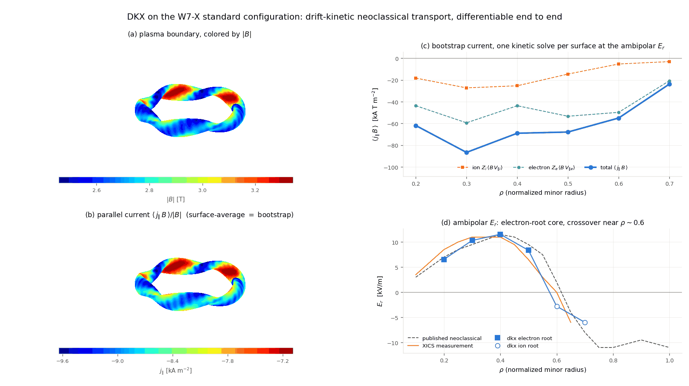

*The W7-X standard configuration, solved by DKX. The plasma boundary is drawn
twice — colored by `|B|` and by the local parallel current density
`j‖(θ, ζ)`, the genuine θ,ζ-resolved current from a drift-kinetic solve that
carries the Pfirsch-Schlüter and bootstrap structure and whose flux-surface
average `<j‖ B>` is the bootstrap current — beside the bootstrap-current
profile, one two-species kinetic solve per flux surface at its ambipolar
electric field, and the ambipolar `E_r`, an electron-root core crossing to the
ion root near mid-radius, against published references [Pablant et al.,
*Phys. Plasmas* 25, 022508 (2018)]. Every field is a `dkx` kinetic-solve output,
differentiable end to end (`python tools/benchmarks/readme_showcase_w7x.py`).*

## Install

```bash
pip install dkx
```

The solver tiers (block-tridiagonal Legendre elimination, recycled GCROT,
implicit differentiation) live in the external
[`solvax`](https://pypi.org/project/solvax/) library, which installs
automatically as a core dependency. For GPU, add the matching CUDA build of JAX,
e.g. `pip install -U "jax[cuda12]"`. Large public equilibria (W7-X, HSX) are
fetched from a GitHub release on first use and cached under `~/.cache/dkx/data`
(prefetch with `python -m dkx.validation.data_fetch`; see the
[installation docs](docs/installation.rst) for offline options).

## Quickstart

```bash
dkx wout_XXX.nc                          # equilibrium in, publication panels out (~45 s)
dkx --plot sfincsOutput.h5               # panels from an existing DKX or Fortran run
dkx input.namelist --out sfincsOutput.h5 # solve one deck, write SFINCS-keyed HDF5/NetCDF
```

`dkx wout_XXX.nc` writes `<name>.panels.png` and `<name>.panels.h5`:
monoenergetic `D11/D31/D33` vs `nuPrime` across the 1/ν, plateau and
Pfirsch–Schlüter regimes (a curve per `EStar`), `|B|` on the surface, and — at
the ambipolar root, against radius — the bootstrap current in kA/m² beside the
VMEC equilibrium's own, and species fluxes in SI units. DKX reads evaluated
`presf` for `sum_atan`, series, spline, and other inputs, retaining `pmass_type` as provenance. A standard `wout` lacks separate density/temperature profiles,
so the explicit n/T pressure split is labeled. Output and panels distinguish
unavailable physics, parser or solve failure, and a completed scan with no bracket.
`--full` widens the grid and `--quick` cuts it to about a
quarter of the wall time for a smoke check — the panels still fill, but nothing
`--quick` prints is a reportable number; `--plot` reads DKX and Fortran
SFINCS output alike. Measured on a 10-core M4 with the Fokker–Planck operator
throughout: 37.3 s on W7-X and 45.8 s on a finite-β precise-QA equilibrium, the
latter split 16.4 s for the 21-point scan, 6.0 s for the `|B|` solve, and 22.5 s
for the radial scan's 50 drift-kinetic solves.

The same solve from Python. No input file, no argument parsing — the
parameters are the ones a deck carries, passed as keywords
([`examples/1_basics/run_tokamak.py`](examples/1_basics/run_tokamak.py)):

```python
import dkx

run = dkx.run(
    geometryScheme=1,          # circular tokamak: BHat = 1 + 0.1 cos(theta)
    inputRadialCoordinate=3, rN_wish=0.3,
    B0OverBBar=1.0, GHat=1.0, IHat=0.0, iota=1.31,
    epsilon_t=0.1, epsilon_h=0.0, psiAHat=0.045, aHat=0.1,
    Zs=[1.0], mHats=[1.0], nHats=[1.0], THats=[0.5],
    dNHatdrHats=[-6.0], dTHatdrHats=[-3.0],
    Ntheta=15, Nzeta=1, Nxi=8, NL=4, Nx=6,
    Delta=4.5694e-3, alpha=1.0, nu_n=8.4774e-3,
    Er=0.0, collisionOperator=1,   # 1 = pitch-angle scattering, 0 = Fokker-Planck
)
print("particle flux:", float(run.moments["particleFlux_vm_psiHat"][0]))
print("bootstrap current <j.B>:", float(run.moments["FSABjHat"]))
```

`dkx.run` reads `RHSMode` from the case and dispatches, so the same call covers
a profile-gradient run and a transport matrix. It also takes an
`input.namelist` path — `dkx.run("input.namelist")` — and overrides on top of
one, which is what a convergence scan is:

```python
dkx.run("input.namelist", Ntheta=25)     # same deck, finer grid
dkx.run(..., out="sfincsOutput.h5")      # write a file; the suffix picks the format
```

Results come back in memory: `run.moments` is keyed by the SFINCS output names,
and `run.solve_result` carries the residual, the iteration count, and whether it
converged.

## Parity with SFINCS Fortran v3

Every canonical module is admitted against the reference implementation —
Fortran golden outputs, tiny-grid PETSc matrix dumps, or the retained legacy
path — at pinned tolerances that run in CI (the envelope figure below).
Outputs, per-species result tables, and console prints match SFINCS
Fortran v3 field-by-field. The scheme-1 monoenergetic `transportMatrix[0,1]`
element is pinned to upstream's expected value because that element is
tolerance-unstable in the Fortran build itself; the DKX direct solve reproduces
the expected value to 4.2e-6 by construction.

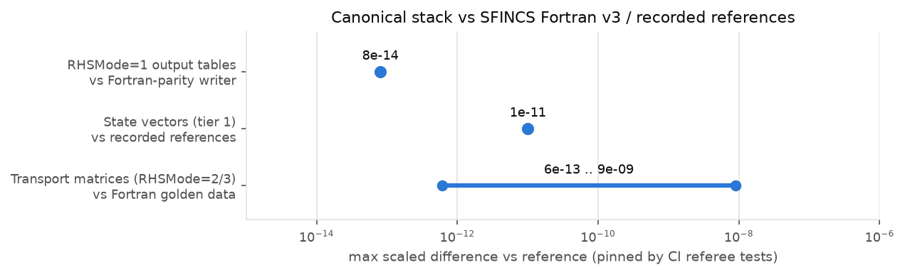

*Measured parity envelopes: fluxes, flows, bootstrap current, transport
matrices, collisions, geometry, and console prints all match SFINCS Fortran v3
to the tolerances shown, in CI.*

| Capability | dkx | SFINCS Fortran v3 |
| --- | :---: | :---: |
| RHSMode 1/2/3 (fluxes, flows, bootstrap current, transport matrices) | ✅ | ✅ |
| Pitch-angle + full Fokker-Planck (Rosenbluth) collisions | ✅ | ✅ |
| Geometry: analytic 1-4, VMEC 5, Boozer `.bc` 11/12, namelist spectrum 13; non-symmetric (`lasym`) | ✅ | ✅ |
| `Phi1`/quasineutrality; Tangential magnetic drifts; `export_f` output | ✅ | ✅ |
| Ambipolar radial-electric-field root solve | ✅ | ✅ |
| Exact gradients of any output w.r.t. any input (`jax.grad`, implicit differentiation) | ✅ | ❌ |
| GPU execution; warm starts + Krylov recycling across scans | ✅ | ❌ |
| Variational upper/lower transport bounds (convergence certificates) | ✅ | ❌ |
| MPI multi-node execution | ❌ (single-node multicore + GPU) | ✅ |

The full matrix — including the JAX-only research capabilities (momentum-conserving
flow corrections, an extended-collisionality Sugama operator, monoenergetic
database mode, batched GPU scans, a bounce-averaged 1/ν surrogate) — lives in
[docs/feature_matrix.rst](docs/feature_matrix.rst).

*Reproduce with the drivers in [`tools/parity/`](tools/parity/).*

### Interpreting a difference

Two codes agree only to the accuracy each one reaches. For left-preconditioned
Krylov methods PETSc's default convergence test measures the *preconditioned*
residual rather than the true one (`KSPSetNormType`), so a run can report
success at its requested `solverTolerance` while leaving a large true residual.

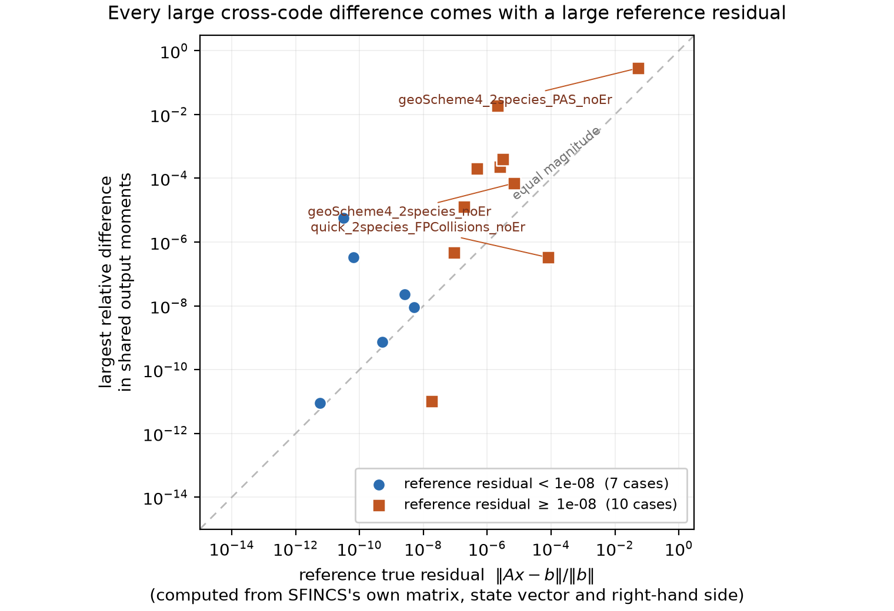

Measured from SFINCS's own matrix, right-hand side and state vector, with no
DKX quantity involved. Across 17 linear decks from upstream's example suite,
every large cross-code difference comes with a large reference residual. On
`geometryScheme4_2species_PAS_noEr` the reference's own true residual is
`5.4e-2` where DKX solves the same system — matrix agreeing to `8.5e-15`, RHS
to `5.0e-15` — to `3.1e-13`.

This is not specific to SFINCS; a preconditioned-norm test is standard and
usually adequate. The practical point is that a reference's own residual is
worth checking before a disagreement is attributed to the code under test.
Reproduce with `parity_performance_matrix.py --fortran-residual` then
`reference_convergence.py`; details in
[docs/performance.rst](docs/performance.rst).

## Fast on CPU and GPU

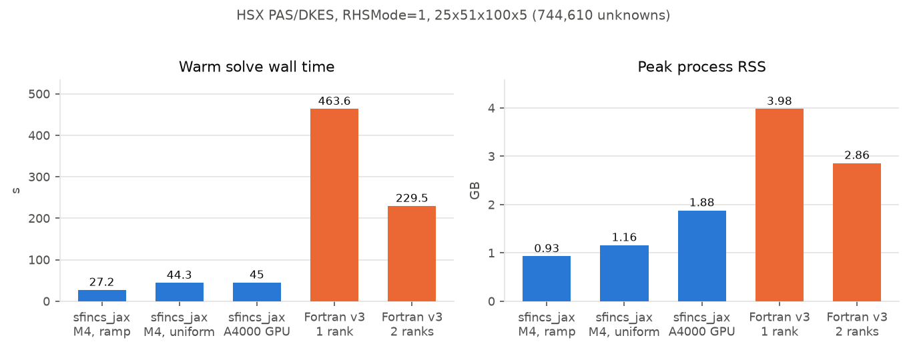

Measured head-to-head on the same machine (MacBook, Apple M4, 24 GB) and the
same deck: `HSX_PASCollisions_DKESTrajectories`, RHSMode=1, at
`Ntheta=25, Nzeta=51, Nxi=100, Nx=5` — **744,610 unknowns**. The Fortran
reference is the conda PETSc 3.23 + MUMPS 5.8.2 build of SFINCS v3.

- With the matched `Nxi`-for-`x` ramp discretization, DKX solves in
  **27.2 s at 0.93 GB** — 17x faster than 1-rank Fortran (463.6 s, 3.98 GB) and
  8.4x faster than Fortran's best measured parallel floor (229.5 s / 2.86 GB at
  2 ranks), at roughly 30% of the memory. With uniform `Nxi` it takes 44.3 s at
  1.16 GB; an RTX A4000 GPU takes 45.0 s (the Legendre scan is serial and A4000
  FP64 is 1/32 rate).
- A cross-machine sweep on the two-species production variant (1,275,010
  unknowns) repeats the shape: one DKX process beats every measured MPI
  configuration — 3.1x the laptop's best on CPU, 13.6x the workstation's best on
  its GPU. At the full production resolution (2.5 M unknowns) neither code fits a
  global sparse factorization in 24 GB, and the truncated Legendre elimination is
  the locally viable direct path (~0.3 GB vs ~91 GB for the full-band factor).
- The direct solve is more converged than the Fortran reference: Fortran's own
  electron `FSABFlow` scatters 51% across its 1/2/4/8-rank runs (Krylov solver
  noise), while DKX matches the closest Fortran run to 2e-10.

The above is **one measured 744k-unknown HSX PAS case** — a pitch-angle DKES deck,
i.e. one where DKX has a structured direct solver. Across **all 38 upstream
decks**, that distinction, not problem size, decides the outcome:

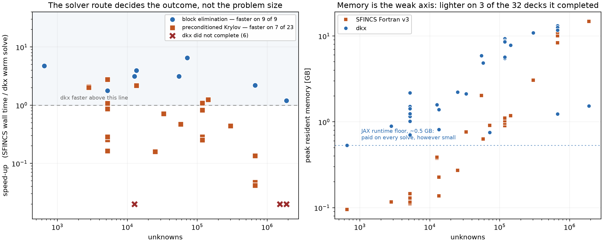

Block elimination (tier 1) is faster on **9 of 9**; preconditioned Krylov
(tier 2) on 7 of 23. The losses sit exactly where the block-tridiagonal-in-`L`
structure breaks — Fokker-Planck collisions, magnetic drifts, the `Er`
`xDot`/`xiDot` terms, the `Phi1` Newton iteration. Two facts run the other way,
stated because the sweep settles them: DKX is **lighter on only 3 of 32** decks (a
~0.5 GB JAX runtime floor sinks the small end), and **6 did not complete at all**
against 38 of 38 for the reference. Median agreement `4.1e-06`. Full tables and
provenance: [docs/performance.rst](docs/performance.rst).

## Differentiable optimization

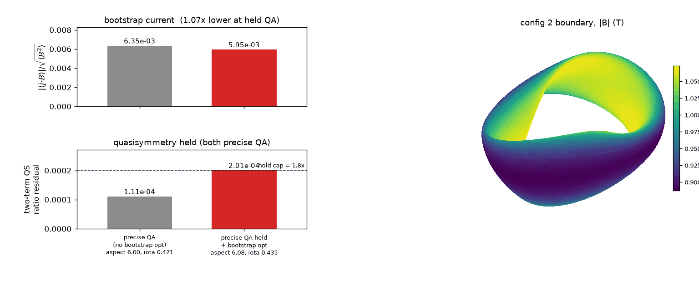

One `jax.value_and_grad` differentiates the whole physics chain — boundary
Fourier modes through the fixed-boundary MHD equilibrium (implicit adjoint), the
differentiable Boozer transform, and the drift-kinetic solve — to the bootstrap
current, with no finite differences. The flagship run shapes a genuine
quasi-axisymmetric stellarator and then lowers its bootstrap current at held
quasisymmetry, warm-starting the kinetic Krylov solve across optimizer
iterations so each evaluation is a few seconds.

*Reproduce with `python examples/optimization/optimize_QA_bootstrap.py` (needs
the optional `vmex` + `booz_xform_jax` companions).*

### What the gradient costs

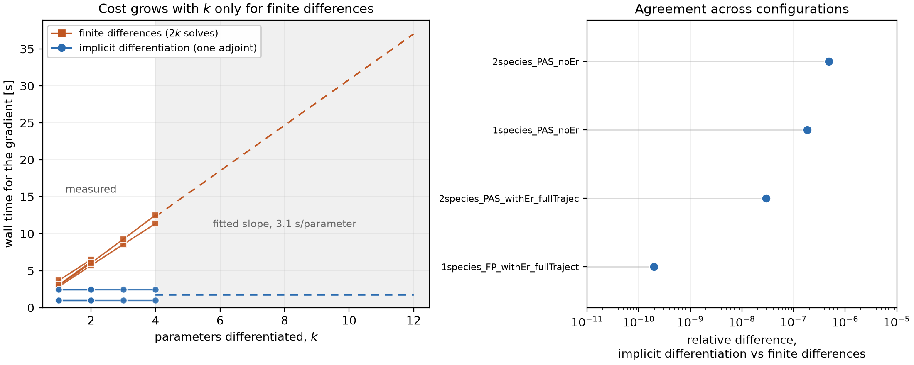

A central finite difference of `k` parameters costs `2k` converged solves;
implicit differentiation costs one transposed solve whatever `k` is. Measured
against SFINCS finite differences on four upstream decks (one and two species,
pitch-angle and Fokker-Planck collisions, zero and finite `Er`), the gradients
agree to **4.7e-10 … 4.8e-07**, and the finite-difference cost is linear in `k`
(`2.86, 5.71, 8.56, 11.37` s) against a flat one-adjoint cost. At these small
`k` the wall-time ratio is only 1.4×–7.1× — the claim is the slope, not the
intercept. See [docs/differentiability.rst](docs/differentiability.rst).

## Monoenergetic (ICNTS) benchmarks

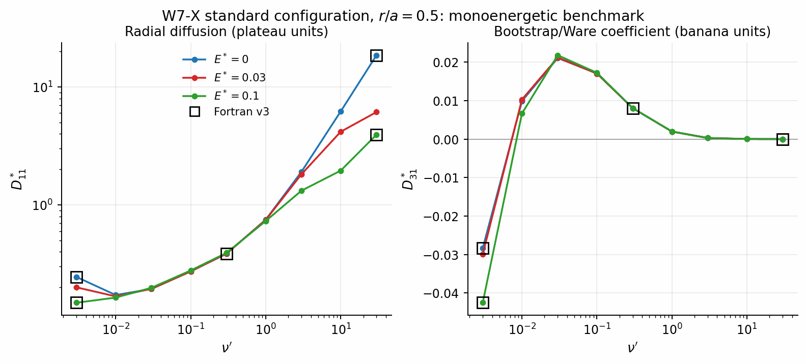

ICNTS-style monoenergetic coefficients (`D11*`, `D31*` versus collisionality at
several `EStar`) on the W7-X, TJ-II, and HSX standard configurations, each with
matched-deck SFINCS Fortran v3 cross-check points at solver precision. The
quasi-helically symmetric HSX case shows the suppressed 1/ν branch that W7-X and
TJ-II retain.

*Reproduce with `python tools/paper_benchmarks/monoenergetic_icnts_w7x.py`
(and the `_tjii` / `_hsx` companions).*

## Low-collisionality bootstrap convergence

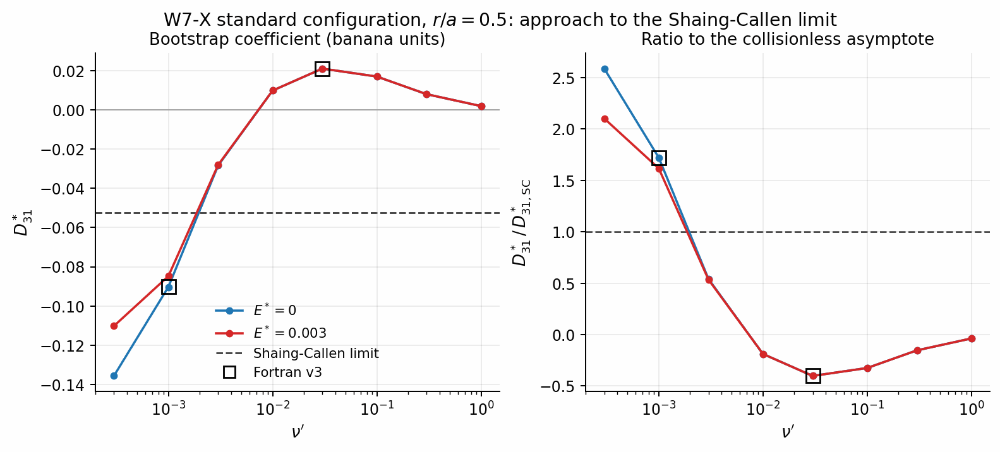

The hard low-collisionality test: the bootstrap coefficient `D31*` on the W7-X
standard configuration scanned to `nuPrime = 3e-4`, approaching the collisionless
Shaing-Callen asymptote. At `EStar = 0` the coefficient keeps deepening past the
asymptote — the 1/ν-regime offset does not decay without orbit precession — while
a small finite `EStar` detaches below `nuPrime ~ 1e-3` and flattens back toward
the asymptote, the E×B-precession dip.

*Reproduce with `python tools/paper_benchmarks/shaing_callen_convergence.py`.*

## Ambipolar Er and electron roots

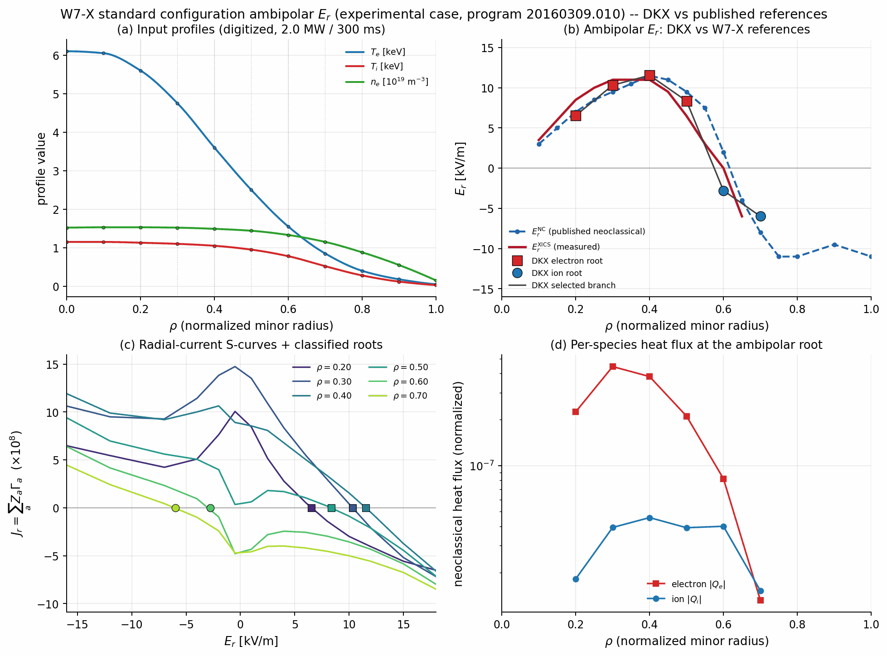

Validated against a real published W7-X core-electron-root-confinement discharge
[Pablant et al., *Phys. Plasmas* 25, 022508 (2018)]: DKX resolves every ambipolar
root of `J_r(E_r)`, classifies each as ion / unstable / electron by the `dJr/dEr`
sign, and follows the physical branch by radial continuity to reproduce the
electron-root → ion-root crossover near `ρ ~ 0.6`, matching the reference `E_r`
within the digitization uncertainty (~1.5 kV/m mean difference).

*Reproduce with `python tools/paper_benchmarks/w7x_ambipolar_er.py` and
`python tools/paper_benchmarks/electron_root_optimization.py`.*

## Impurity transport

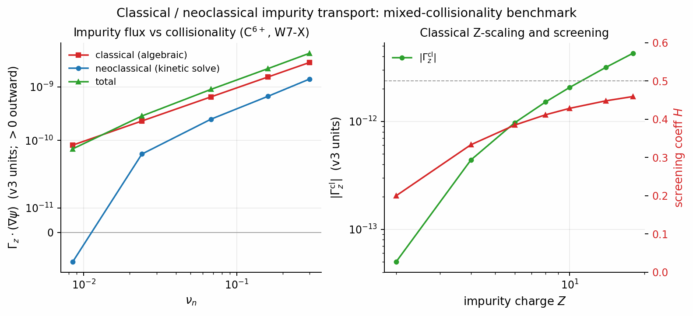

Classical and neoclassical transport of a high-Z trace impurity in a hydrogenic
bulk, anchored by a Fortran-parity check on the committed carbon two-species deck
(neoclassical impurity flux to 1.5e-6 relative). The temperature-screening
diagnostic recovers the exact `-Z` density-peaking coefficient and the classical
1/2 collisional screening coefficient, with an autodiff ion-temperature-gradient
derivative verified against finite differences.

*Reproduce with `python tools/paper_benchmarks/impurity_transport.py`.*

## Kinetic-in-the-loop bootstrap

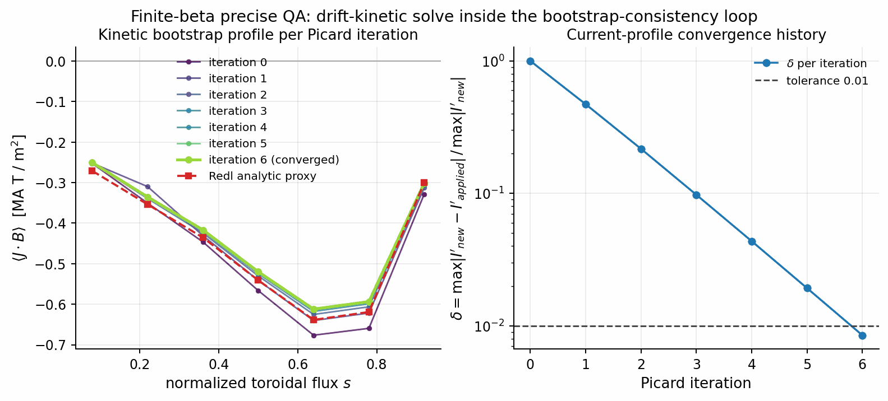

A self-consistent finite-β precise-QA equilibrium with the full drift-kinetic
solve inside the Picard loop, in place of the Redl analytic proxy, converging in
7 damped iterations. At the converged state the analytic proxy over-predicts the
kinetic bootstrap current by a few percent across the interior profile — the
error the kinetic-in-the-loop iteration removes by construction — and one
`jax.value_and_grad` differentiates the total bootstrap current through the
equilibrium → Boozer → kinetic chain.

*Reproduce with `python tools/paper_benchmarks/bootstrap_consistency_kinetic_loop.py`
(needs the optional `vmex` + `booz_xform_jax` companions).*

To put that inside an optimizer instead of after it, `dkx.bootstrap.KineticBootstrapCurrent`
is an objective term with the interface `vmex.optimize` expects, so a `vmex`
optimization becomes drift-kinetic in one import and one tuple:

```python
from dkx.bootstrap import KineticBootstrapCurrent
kinetic = KineticBootstrapCurrent(profiles, surfaces=[0.25, 0.5, 0.75])
objective_function_terms.append((kinetic, 0.0, 1.0))   # target 0: minimize <j.B>
```

`profiles` is the same `vmex` `KineticProfiles` the Redl term takes.
`examples/optimization/{QA,QH,QI}_optimization_bootstrap_dkx.py` are the three
`vmex` bootstrap scripts with exactly that substitution.

## Examples

Six pedagogic scripts on the canonical API sit at the top of
[`examples/`](examples/) — parameters at the top, printed progress, a plot, and
output files written and read back. The wider tree (tutorial notebooks,
parity/benchmark drivers, upstream SFINCS decks) is mapped in the navigable
[`examples/README.md`](examples/README.md).

## Documentation

Full documentation — installation, quickstart, the equations solved, namelist
and output references, API, and measured performance/validation notes — at
[sfincs-jax.readthedocs.io](https://sfincs-jax.readthedocs.io/).

## Implementation notes

- `Nxi_for_x` ramps embed the truncated degrees of freedom as identity-pinned
  rows in the matrix-free operator (the Fortran code packs them out of its
  matrix). The direct tier solves each `(species, x)` subsystem with its own
  packed Legendre count — the exact Fortran discretization — and gradients
  through the ramped route match finite differences to 1e-6 relative in the
  regression tests; every solve raises at execution time if a forward or adjoint
  solve fails to converge.
- The scheme-1 monoenergetic `transportMatrix[0,1]` element is ill-conditioned
  in the upstream configuration itself, so parity for it is pinned to upstream's
  expected value. Near-singular structured eliminations (for example a
  collisionless `nu_n = 0` deck) fall back automatically from the direct tier to
  the preconditioned Krylov tier.

## License

MIT. See [LICENSE](LICENSE). If you use DKX in published work, please cite this
repository and the SFINCS drift-kinetic formulation
[Landreman et al., *Phys. Plasmas* 21, 042503 (2014)].
