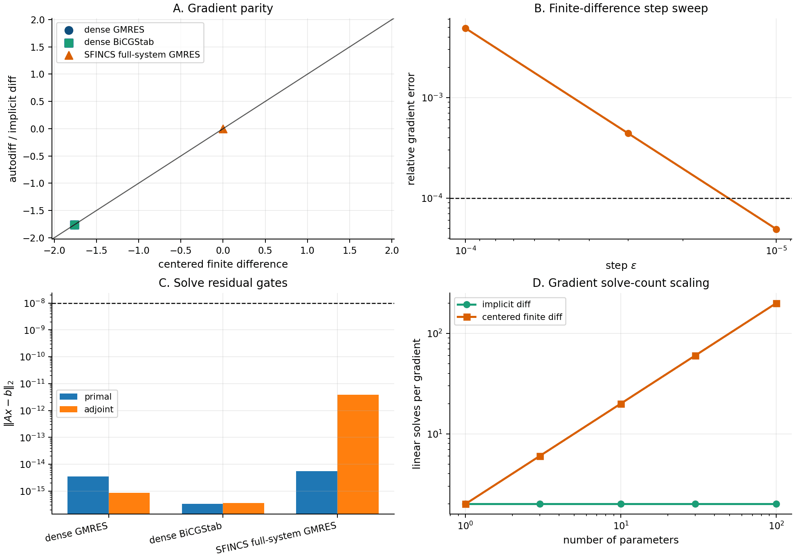
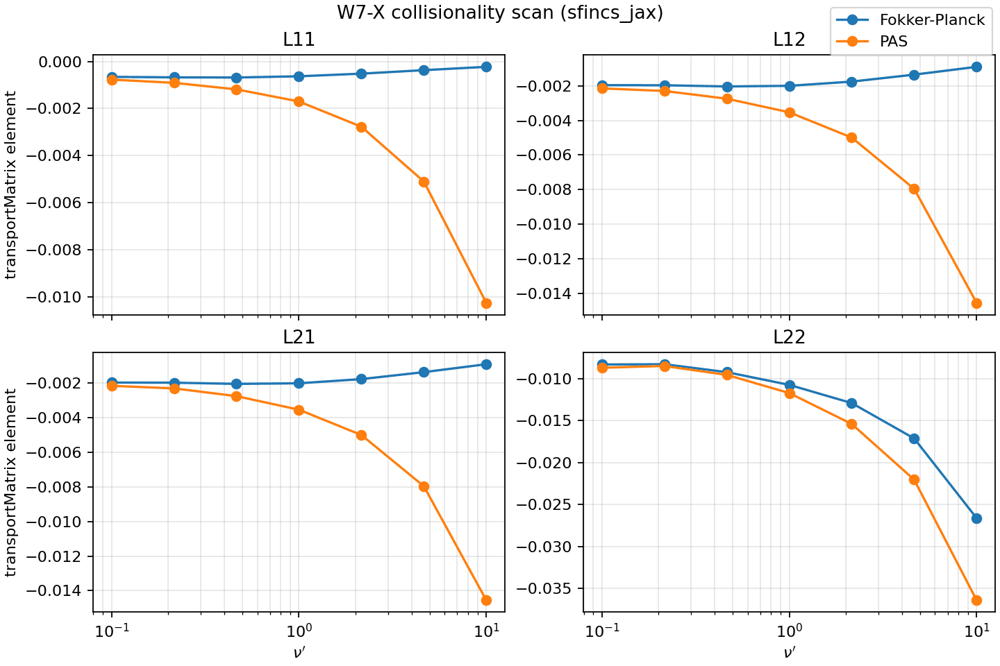
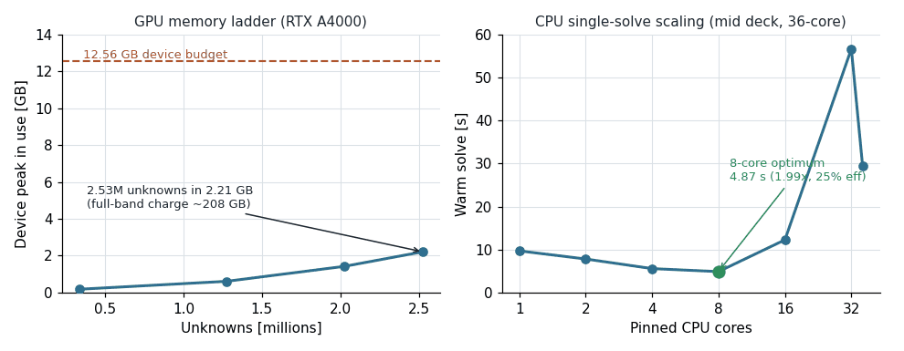

# DKX

[](https://pypi.org/project/dkx/)
[](https://github.com/uwplasma/DKX/actions/workflows/ci.yml)
[](https://sfincs-jax.readthedocs.io/en/latest/)
[](LICENSE)

**Differentiable neoclassical transport for stellarators and tokamaks, in JAX.**

DKX solves the linearized drift-kinetic equation of SFINCS v3 on a flux surface for fluxes, flows,
bootstrap current, transport matrices and the ambipolar `E_r`, on CPU or GPU. Every output is
differentiable, and SFINCS decks run unchanged.


W7-X from its VMEC equilibrium; `E_r` beside Pablant et al. (2018)
(`tools/benchmarks/readme_showcase_w7x.py`).

## At a glance

| Capability | Scope |
| --- | --- |
| RHSMode 1 profiles; RHSMode 2/3 transport matrices | SFINCS deck, HDF5 and `export_f` I/O |
| Pitch-angle scattering; full linearized Fokker–Planck, multispecies | FP decks agree with SFINCS v3 to 1e-8 |
| Analytic, VMEC, Boozer and `lasym` geometry | Tangential magnetic drifts, DKES and full trajectories |
| Ambipolar `E_r` roots with branch evidence | Seeded-interval search; 9.7× a solve on W7-X |
| Phi1 quasineutrality, impurities | Expert path, rung `09_phi1_and_impurities` |
| Direct routes: structured, assembled sparse (Ruiz-scaled), MUMPS | Sparse direct to a few 1e5 unknowns; MUMPS needs SOLVAX ≥ 0.25 + PyMUMPS |
| Recycled Krylov route, CPU and GPU | Stalls at high `Nx` on the HSX-like gap deck (below) |
| Gradients of any output | Finite-difference checked on every derivative example |

## Install

```bash
pip install dkx                    # CPU
pip install -U "jax[cuda12]"       # add for NVIDIA GPUs
dkx doctor                         # checks the environment
```

Python ≥ 3.11. From source: `pip install -e .` in a clone.

## Quickstart

```python
import dkx

case = dkx.Case.from_mapping({           # analytic tokamak, teaching grid: seconds, not converged
    "schema": 1, "name": "tokamak", "run": {"workflow": "profile", "progress": False},
    "geometry": {"format": "analytic", "file": "tokamak", "surfaces": [0.16, 0.25, 0.36]},
    "species": [{"name": "deuterium", "charge": 1, "mass_amu": 2.014,
                 "density_m3": [8.0e19, 7.0e19, 6.0e19], "temperature_keV": [1.0, 0.8, 0.6]}],
    "physics": {"model": "full_local", "collisions": "pitch_angle_scattering", "magnetic_drifts": "dkes", "phi1": "off"},
    "electric_field": {"mode": "prescribed", "value_kV_m": 0.0},
    "resolution": {"theta": 9, "zeta": 1, "pitch": 8, "speed": 4}, "solver": {"method": "auto", "relative_tolerance": 1e-8},
})
result = dkx.run(case)
print("solver route:", result.metadata["solver_route"])
print("particle flux:", float(result.arrays["particle_flux_m2_s"][1, 0]))
```

The same case from a file, and the checks to run before quoting a number:

```console
dkx run examples/01_tokamak_profile/case.toml --out result.nc
dkx plot result.nc                      # profile panel; E_r roots when the run was ambipolar
dkx converge examples/01_tokamak_profile/case.toml
dkx input.namelist                      # a SFINCS v3 deck, unchanged
```

`dkx converge` refines every phase-space axis and exits zero only when the observables stopped
moving and every returned state satisfies the kinetic equation.

## Differentiate

```python
import jax, jax.numpy as jnp, dkx

case = dkx.Case.from_file("examples/05_ambipolar_profile/case.toml")
problem = dkx.prepare_er_scan(case, surface_index=1)          # geometry, grids, collisions once

def bootstrap_current(er_kv_m):
    scan = dkx.batched_er_scan(problem, er_kv_m, differentiable=True, retain_full_state=True)
    return jnp.sum(scan.moments["FSABjHat"])

j, dj_der = jax.jit(jax.value_and_grad(bootstrap_current))(jnp.array([-0.2, 0.0, 0.2]))
```

Implicit differentiation through the solve: one transposed solve on the primal's factors. Compiled, a gradient costs
1.00–1.11× its primal on a 16,230-unknown deck
([record](docs/experiments/2026-09-20-one-factorization-many-solves.md), [#279](https://github.com/uwplasma/DKX/pull/279)).


Finite differences cost two solves per parameter; the adjoint costs one.



Every derivative example is checked against central differences ([differentiability](docs/differentiability.rst)).

## What you can compute

### Monoenergetic coefficients and transport matrices


`RHSMode = 3` gives `D11*`, `D31*`, `D33*` normalized as in Beidler et al. (2011); `RHSMode = 2`
the thermal transport matrix. Boxes: SFINCS v3. Rung `04_monoenergetic_scan`.

### Collision operators



Pitch-angle scattering is fast; full linearized Fokker–Planck conserves momentum, which
particle-flux coefficients need at high collisionality.

### Ambipolar `E_r`


W7-X program 20160309.010: electron roots in the core, ion roots at the edge. Every root is
classified as ion, electron or unstable and kept with its bracketing evaluations; `dkx roots`
prints them. Rung `05_ambipolar_profile`.

### Phi1 and impurities


Multispecies runs carry impurities; Phi1 adds the in-surface potential and its quasineutrality
equation. Rung `09_phi1_and_impurities`.

<!-- FLAGSHIP-OPTIMIZATION: replace the figure path, caption and numbers below with the output of
examples/optimization/QA_optimization_bootstrap_dkx.py once its before/after figure is committed. -->
## Stellarator optimization with a kinetic bootstrap current


The gradient runs VMEX → `booz_xform_jax` → DKX → `⟨j·B⟩`, so a DKX bootstrap-current objective
sits beside quasisymmetry, aspect ratio and rotational transform in one differentiable
least-squares problem. The figure lowers the bootstrap current of a precise QA while holding its
quasisymmetry residual below a cap
([`optimize_QA_bootstrap.py`](examples/optimization/optimize_QA_bootstrap.py)). Rung
`08_vmex_optimization` takes the same shape derivative on an analytic `|B|` spectrum in seconds
([optimization](docs/optimization.rst)).
<!-- /FLAGSHIP-OPTIMIZATION -->

## Proved against analytic limits

| Limit | Reference | Measured |
| --- | --- | --- |
| Spitzer–Härm conductivity, full FP, `Z` = 1, 2, 4, 16 | Spitzer & Härm 1953 | within 0.36 % |
| Lorentz conductivity, thermal factor `8/√π` | Braginskii 1965 | 1.7e-13 |
| Pfirsch–Schlüter approach, `O(ε²/ν²)` | Helander & Sigmar 2002 | order 1.99 |
| Shaing–Callen / Boozer–Gardner collisionless bootstrap | Shaing & Callen 1983 | `√ν` approach, 4 % at `ν′ = 1e-4` |
| Onsager `L_ij = L_ji`, thermal matrix under refinement | Onsager 1931 | ≥ 3× per rung, to 7e-5 |
| Zero tokamak particle flux, like-particle FP collisions | Helander & Sigmar 2002 | 1.6e-8 of `L_22` |
| FP conserves density, momentum, energy | Rosenbluth et al. 1957 | 1e-15 |
| Monoenergetic-to-thermal convolution, manufactured `D*` | Beidler et al. 2011 | 1.5e-15 |


Tests: [`test_physics_limits.py`](tests/test_physics_limits.py), [`test_transport_limits.py`](tests/test_transport_limits.py),
[`test_shaing_callen.py`](tests/test_shaing_callen.py), [`test_collision_physics_gates.py`](tests/test_collision_physics_gates.py).

## Verified against SFINCS, MONKES and YANCC


On 38 upstream decks with the same discretization DKX agrees with SFINCS v3 to solver tolerance:
median 4e-6, full Fokker–Planck decks to 1e-8. The monoenergetic coefficients agree with MONKES
and YANCC within 6 %, `D33` within 0.1 %, on three configurations
([validation matrix](docs/validation_matrix.rst)).


## Where the reference falls short


On an HSX deck, released SFINCS v3 and DKX differ by **12–19 %** in bootstrap current. SFINCS
drops matrix entries below `1e-12`, which removes the ion–electron collision coupling of a
cold-ion, hot-electron plasma. With that cutoff set to zero, the two codes agree to **7e-11**
([record](docs/experiments/2026-09-13-sfincs-sparsify-threshold.md); fix proposed as
[landreman/sfincs#27](https://github.com/landreman/sfincs/pull/27)).

The HSX-like gap deck (633,604 unknowns, `Nx = 16`) is **open in both codes** on a 36 GiB host:
two SFINCS routes run out of memory, its GMRES stagnates at 0.9955, and DKX's Krylov route
reaches 2.5e-5. DKX assembles its operator exactly from 4,800 products and solves the
66,004-unknown reduction to 1.3e-14 ([record](docs/experiments/2026-09-19-sfincs-on-the-gap-deck.md)).
A deck where SFINCS fails and DKX converges is the open target of the solver program.

## Where DKX converges, and why

DKX picks its route from the operator's structure ([solver routes](docs/numerics.rst)):

| Route | When it applies | How it solves |
| --- | --- | --- |
| Structured direct | block-tridiagonal in the Legendre index: PAS, DKES drifts | exact block elimination; nothing to stall |
| Assembled sparse direct | any operator, to a few 1e5 unknowns | exact assembly, Ruiz equilibration, LU or MUMPS |
| Recycled Krylov (GCROT) | full FP, tangential drifts, `E_r` terms, Phi1 | coarse-operator preconditioner, subspace recycled across solves |

Direct routes converge because they are exact; the Krylov route stalls at high `Nx` on the gap
deck. Every route reports the original-equation residual of what it returns.

## One factorization, many solves


Pass `SolveResult.factors` back with `factors=`; `transpose=True` solves the adjoint. Three
right-hand sides drop from three factorizations to none, 0.96 s to 0.28 s; the sparse adjoint costs 0.15 of a primal
([record](docs/experiments/2026-09-20-one-factorization-many-solves.md)).

## Performance and memory


`HSX_PASCollisions_DKESTrajectories`, **744,610 unknowns**, against PETSc 3.23 / MUMPS 5.8.2 SFINCS v3.

| Configuration | Warm solve | Peak RSS |
| --- | ---: | ---: |
| DKX, `Nxi`-for-`x` ramp | **27.2 s** | **0.93 GB** |
| DKX, uniform `Nxi` | 44.3 s | 1.16 GB |
| DKX, RTX A4000 GPU | 45.0 s | — |
| SFINCS v3, 1 rank / 2 ranks | 463.6 s / 229.5 s | 3.98 / 2.86 GB |

Cold and warm, M3 Max: 1.72 s and 0.12 s at 40,584 unknowns; 23.6 s and 20.0 s at 744,610.
That is **one measured 744k-unknown HSX PAS case**, chosen because the structured route applies.


Across the upstream suite the route decides the outcome: structured direct is faster on 9 of 9
decks, recycled Krylov on 7 of 23, and six decks did not complete. Memory is the weak axis: the
JAX runtime floor is about 0.5 GB, and DKX is lighter on 3 of the 32 decks it completed
([performance](docs/performance.rst)).



Keeping only the Legendre blocks the moments need, a 2.53M-unknown solve peaks at 2.21 GB on one
RTX A4000. On CPU the warm solve is fastest at eight pinned cores.

## Examples

| Rung | What it shows | Runs in |
| --- | --- | --- |
| [`01_tokamak_profile`](examples/01_tokamak_profile) | build, run, read, save, plot | ~4 s |
| [`02_vmec_stellarator`](examples/02_vmec_stellarator) | the same solve on a VMEC `wout` | ~3 s |
| [`03_boozer_stellarator`](examples/03_boozer_stellarator) | Boozer geometry and the route the operator picks | ~4 s |
| [`04_monoenergetic_scan`](examples/04_monoenergetic_scan) | `D11*`, `D31*`, `D33*` against collisionality | ~5 s |
| [`05_ambipolar_profile`](examples/05_ambipolar_profile) | every `E_r` root, classified | ~8 s |
| [`06_convergence_certificate`](examples/06_convergence_certificate) | refine every axis before trusting a number | ~12 s |
| [`07_gradients`](examples/07_gradients) | `jax.grad` through the solve against central differences | ~17 s |
| [`08_vmex_optimization`](examples/08_vmex_optimization) | a shape derivative on an analytic `\|B\|` spectrum | ~12 s |
| [`09_phi1_and_impurities`](examples/09_phi1_and_impurities) | impurity transport with and without Phi1 | ~12 s |

Rung 06 shows how far these fast grids are from converged. More: [examples/README.md](examples/README.md),
[`examples/optimization`](examples/optimization).

## Documentation, development and citation

[Tutorial](docs/usage.rst) · [How-to: case files](docs/case_files.rst) · [CLI](docs/cli.rst) ·
[API](docs/api.rst) · [Physics and limitations](docs/physics_models.rst) ·
[Solver routes](docs/numerics.rst) · [Validation](docs/validation_matrix.rst) ·
[Testing](docs/testing.rst) · [Contributing](docs/contributing.rst) · [Research plan](plan.md)

Reusable solver algorithms live in [SOLVAX](https://github.com/uwplasma/SOLVAX).

```bibtex
@software{dkx,
  author = {Jorge, Rogerio and contributors},
  title  = {DKX: differentiable drift-kinetic neoclassical transport in JAX},
  url    = {https://github.com/uwplasma/DKX},
  year   = {2026}
}
```

Please also cite SFINCS (Landreman, Smith, Mollén & Helander, Phys. Plasmas 21, 042503, 2014)
when you use its decks or model. Metadata: [CITATION.cff](CITATION.cff). [LICENSE](LICENSE)
