# DKX

[](https://pypi.org/project/dkx/)
[](https://github.com/uwplasma/DKX/actions/workflows/ci.yml)
[](https://sfincs-jax.readthedocs.io/en/latest/)
[](LICENSE)

**Differentiable neoclassical transport for stellarators and tokamaks, in JAX.**

DKX solves SFINCS v3's linearized drift-kinetic equation on a flux surface for fluxes, flows,
bootstrap current, transport matrices and the ambipolar `E_r`, on CPU or GPU. Every output is
differentiable; SFINCS decks run unchanged.

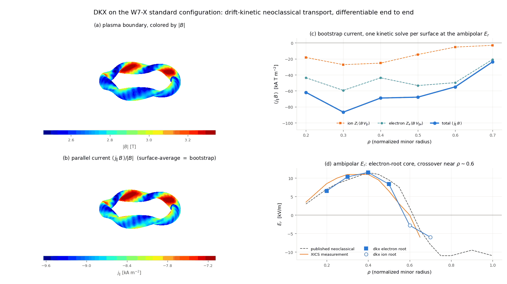

W7-X from its VMEC equilibrium; `E_r` beside Pablant et al. (2018)
(`tools/benchmarks/readme_showcase_w7x.py`).

## Inputs and outputs

A DKX calculation is one **case**: a document in TOML, JSON or a Python
dict. `dkx.Case` validates it and hashes it to a `case_id`. Profiles hold one value per surface.

| Section | Sets |
| --- | --- |
| `name`, `[run]` | `workflow`: `profile` (prescribed `E_r`) or `ambipolar_profile` |
| `[geometry]` | `format` (`analytic`, `vmec`, `boozer`), `file`, `surfaces` (normalized toroidal flux) |
| `[[species]]` | `name`, `charge` (e), `mass_amu`, `density_m3`, `temperature_keV` |
| `[physics]` | `collisions`: `pitch_angle_scattering` or `linearized_fokker_planck`; `coulomb_logarithm` |
| `[electric_field]` | `value_kV_m` when prescribed; `search_kV_m` bracket when ambipolar |
| `[resolution]` | grid sizes `theta`, `zeta`, `pitch` (Legendre modes), `speed` (speed nodes) |
| `[solver]` | `method` (`auto` picks the route), `relative_tolerance`, `memory_fraction` |
| optional | `[parallel]`, `[convergence]`, `[output]`, `[scan]` |

`dkx template` prints every field with its default; `dkx validate case.toml` checks a file. A run
returns a `Result`, saved as NetCDF, whose arrays carry units in their names:
`particle_flux_m2_s` and `heat_flux_W_m2` (surface × species), `parallel_current_A_T_m2`
(`⟨j·B⟩`), `electric_field_kV_m`, the equation residual per surface and, for ambipolar runs,
every root (`ambipolar_root_kV_m`). SFINCS v3 `input.namelist` decks are the second route, for
tangential drifts, Phi1 and transport matrices: `dkx input.namelist` writes SFINCS's
`sfincsOutput.h5`. [Inputs](docs/user_guide/inputs.md) · [outputs](docs/user_guide/outputs.md).

## At a glance

| Capability | Scope |
| --- | --- |
| RHSMode 1 profiles; RHSMode 2/3 transport matrices | SFINCS deck, HDF5 and `export_f` I/O |
| Pitch-angle scattering; linearized Fokker–Planck, multispecies | FP decks match SFINCS v3 to 1e-8 |
| Analytic, VMEC, Boozer and `lasym` geometry | Tangential magnetic drifts, DKES and full trajectories |
| Ambipolar `E_r` roots with branch evidence | Seeded search: 9.7× a solve on W7-X |
| Phi1 quasineutrality, impurities | Native `phi1 = "kinetic"`; matches SFINCS v3 to 2e-6 |
| Direct routes: structured (PAS and Fokker–Planck), sparse, MUMPS | Sparse to a few 1e5 unknowns |
| Recycled Krylov route, CPU and GPU | Coupled preconditioner, memory-aware restart |
| Gradients of any output | Checked against finite differences |

## Install

```bash
pip install dkx                    # CPU
pip install -U "jax[cuda12]"       # add for NVIDIA GPUs
dkx doctor                         # checks the environment
```

Python ≥ 3.11. From source: `pip install -e .` in a clone.
Optional Boozer transforms: `pip install -e ".[booz]"`.

## Quickstart

```python
import dkx

case = dkx.Case.from_mapping({           # analytic tokamak, teaching grid: seconds, not converged
    "name": "tokamak", "run": {"workflow": "profile", "progress": False},
    "geometry": {"format": "analytic", "file": "tokamak", "surfaces": [0.16, 0.25, 0.36]},
    "species": [{"name": "deuterium", "charge": 1, "mass_amu": 2.014,
                 "density_m3": [8.0e19, 7.0e19, 6.0e19], "temperature_keV": [1.0, 0.8, 0.6]}],
    "physics": {"model": "full_local", "collisions": "pitch_angle_scattering", "magnetic_drifts": "dkes", "phi1": "off"},
    "electric_field": {"mode": "prescribed", "value_kV_m": 0.0},
    "resolution": {"theta": 9, "zeta": 1, "pitch": 8, "speed": 4}, "solver": {"method": "auto", "relative_tolerance": 1e-8},
})
result = dkx.run(case)
print("solver route:", result.metadata["solver_route"])
print("particle flux:", float(result.arrays["particle_flux_m2_s"][1, 0]))
```

From a file, then the check to run before quoting a number:

```console
dkx run examples/tutorials/02_cli_case.toml --out result.nc
dkx plot result.nc                      # profile panel; E_r roots when the run was ambipolar
dkx converge examples/tutorials/02_cli_case.toml
dkx examples/tutorials/03_sfincs_namelist.namelist   # a SFINCS v3 deck, unchanged
```

`dkx converge` exits zero only when refining every axis leaves the observables unchanged.

## Differentiate

```python
import jax, jax.numpy as jnp, dkx

case = dkx.Case.from_file("examples/tutorials/08_ambipolar_er.toml")
problem = dkx.prepare_er_scan(case, surface_index=1)          # geometry, grids, collisions once

def bootstrap_current(er_kv_m):
    scan = dkx.batched_er_scan(problem, er_kv_m, differentiable=True, retain_full_state=True)
    return jnp.sum(scan.moments["FSABjHat"])

j, dj_der = jax.jit(jax.value_and_grad(bootstrap_current))(jnp.array([-0.2, 0.0, 0.2]))
```

Implicit differentiation: one transposed solve on the primal's factors. Compiled, a gradient costs
1.00–1.11× its primal on a 16,230-unknown deck ([differentiation](docs/numerics/differentiation.md)).

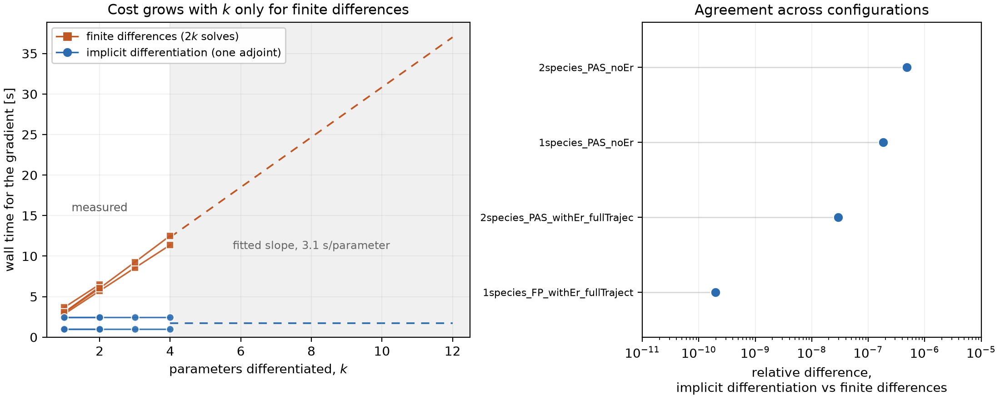

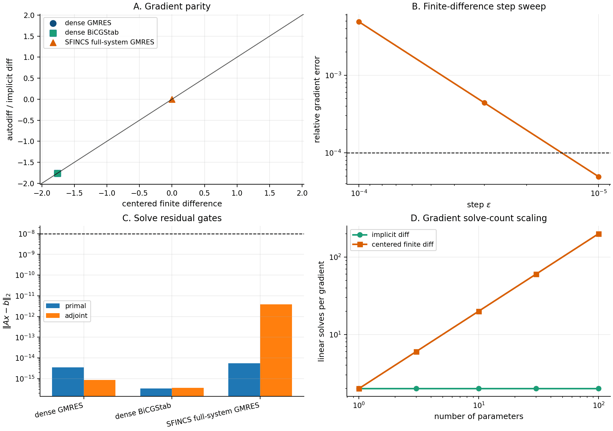

Every derivative example is checked against central differences.

## What you can compute

### Monoenergetic coefficients and transport matrices

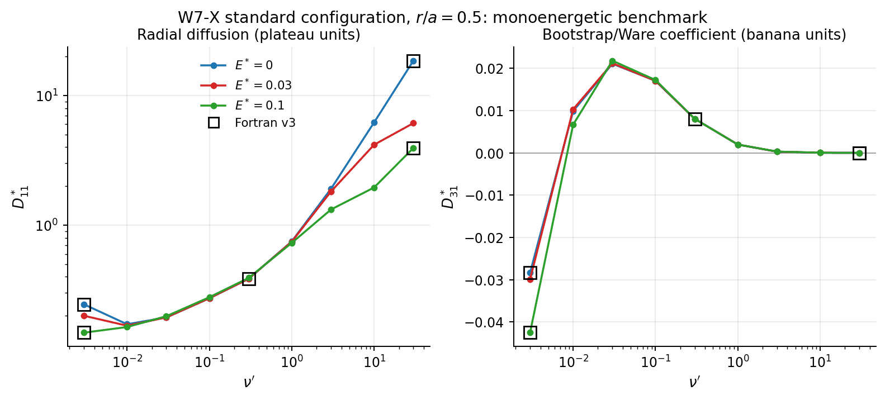

`RHSMode = 3` gives `D11*`, `D31*`, `D33*` (Beidler et al. 2011); `RHSMode = 2` the thermal
matrix. Boxes: SFINCS v3. Spectral angles, as in MONKES.

### Collision operators

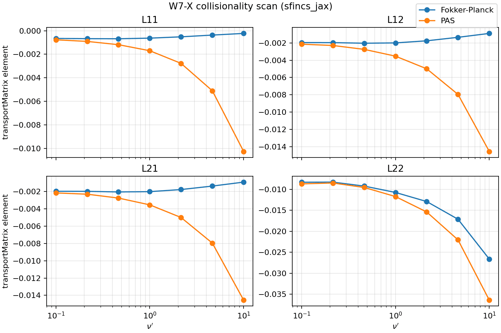

Full linearized Fokker–Planck conserves momentum; pitch-angle scattering is faster.

### Ambipolar `E_r`

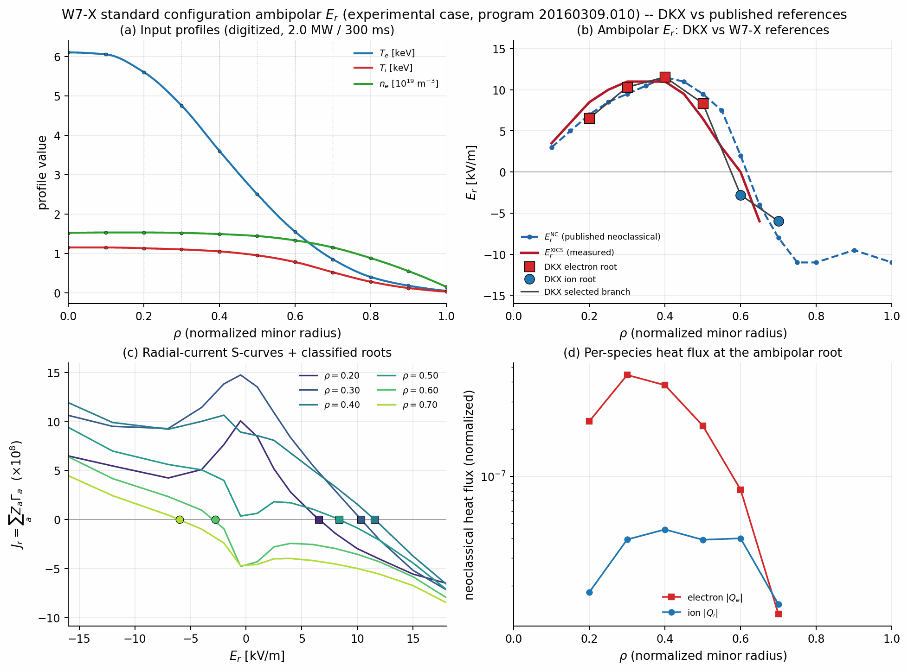

W7-X program 20160309.010: electron roots in the core, ion roots at the edge; `dkx roots` prints
every classified root.

### Phi1 and impurities

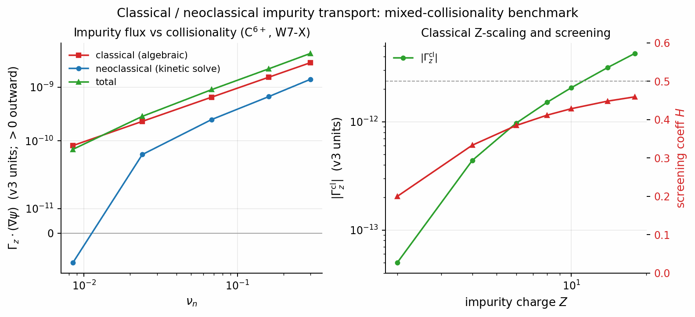

Phi1 adds the in-surface potential and its quasineutrality equation, with an adjoint.

<!-- FLAGSHIP-OPTIMIZATION -->
## Stellarator optimization with a kinetic bootstrap current

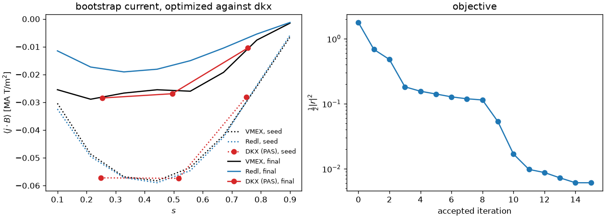

VMEX's QA bootstrap example plus `dkx.bootstrap.KineticBootstrapMismatch` (equilibrium `⟨j·B⟩`
against DKX's), traced VMEX → `booz_xform_jax` → DKX (finite differences
agree to 5.7e-5–1.8e-3). On a laptop CPU (30 min, 4.6 GB) the objective falls
from 1.78 to 0.0061 and the DKX mismatch from 1.2e-3 to 1.2e-4
([`QA_optimization_bootstrap_dkx.py`](examples/advanced/QA_optimization_bootstrap_dkx.py)).
Pitch-angle scattering does not conserve momentum: its current is 1.5–1.6× Redl's.
<!-- /FLAGSHIP-OPTIMIZATION -->

## Proved against analytic limits

| Limit | Reference | Measured |
| --- | --- | --- |
| Spitzer–Härm conductivity, full FP, `Z` = 1, 2, 4, 16 | Spitzer & Härm 1953 | within 0.36 % |
| Lorentz conductivity, thermal factor `8/√π` | Braginskii 1965 | 1.7e-13 |
| Pfirsch–Schlüter approach, `O(ε²/ν²)` | Helander & Sigmar 2002 | order 1.99 |
| Shaing–Callen / Boozer–Gardner collisionless bootstrap | Shaing & Callen 1983 | `√ν` approach, 4 % at `ν′ = 1e-4` |
| Onsager `L_ij = L_ji`, thermal matrix under refinement | Onsager 1931 | ≥ 3× per rung, to 7e-5 |
| Zero tokamak particle flux, like-particle FP collisions | Helander & Sigmar 2002 | 1.6e-8 of `L_22` |
| FP conserves density, momentum, energy | Rosenbluth et al. 1957 | 1e-15 |
| Monoenergetic-to-thermal convolution, manufactured `D*` | Beidler et al. 2011 | 1.5e-15 |

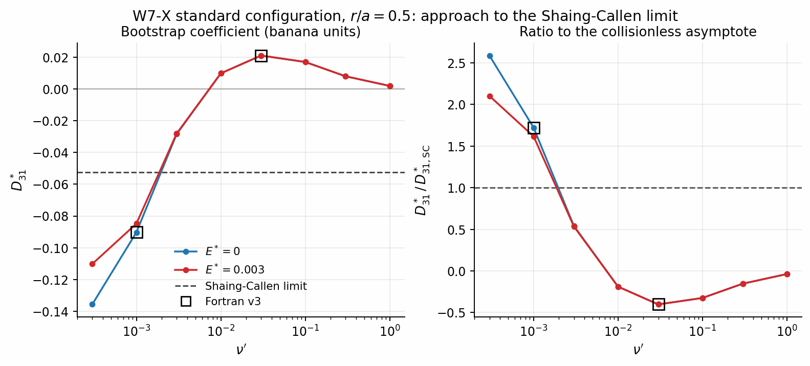

Tests: [`test_physics_limits.py`](tests/test_physics_limits.py), [`test_transport_limits.py`](tests/test_transport_limits.py),
[`test_shaing_callen.py`](tests/test_shaing_callen.py), [`test_collision_physics_gates.py`](tests/test_collision_physics_gates.py).

## Verified against SFINCS, MONKES and YANCC

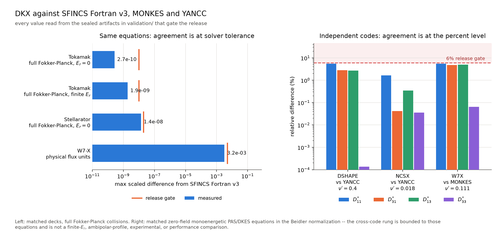

On 38 upstream decks at equal discretization DKX matches SFINCS v3 to solver tolerance:
median 4e-6, full Fokker–Planck decks 1e-8. The monoenergetic coefficients agree with MONKES
and YANCC within 6 %, `D33` within 0.1 %, on three configurations
([cross-code benchmarks](docs/benchmarks/cross_code.md)).

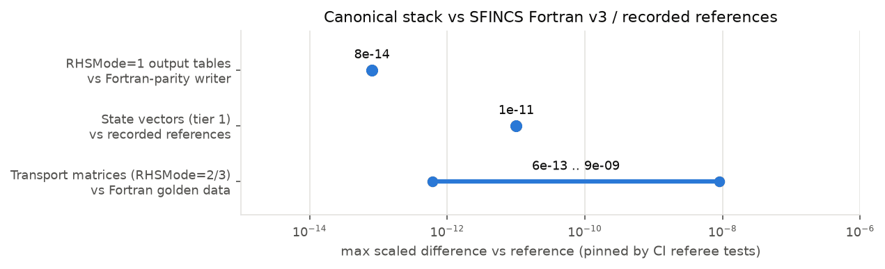

## Where the reference falls short

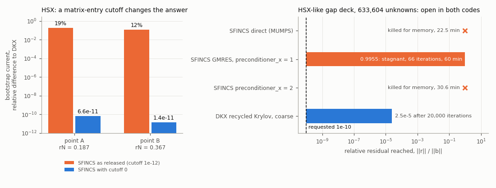

On an HSX deck, released SFINCS v3 and DKX differ by **12–19 %** in bootstrap current. SFINCS
drops matrix entries below `1e-12`, which removes the ion–electron collision coupling of a
cold-ion, hot-electron plasma. With that cutoff set to zero, the two codes agree to **7e-11**
([SFINCS benchmarks](docs/benchmarks/sfincs.md); fix proposed as
[landreman/sfincs#27](https://github.com/landreman/sfincs/pull/27)).

The HSX-like gap deck (633,604 unknowns, `Nx = 16`) is **open in both codes** on a 36 GiB host:
two SFINCS routes run out of memory, its GMRES stagnates at 0.9955, and DKX's Krylov route
reaches 2.5e-5. DKX assembles its operator exactly from 4,800 products and solves the
66,004-unknown reduction to 1.3e-14.

## Where DKX converges, and why

DKX picks its route from the operator's structure ([solver routes](docs/numerics/solver_routes.md)):

| Route | When it applies | How it solves |
| --- | --- | --- |
| Structured direct | block-tridiagonal in the Legendre index: PAS or Fokker–Planck, DKES drifts | exact block elimination; nothing to stall |
| Assembled sparse direct | any operator, to a few 1e5 unknowns | exact assembly, Ruiz equilibration, LU or MUMPS |
| Recycled Krylov (GCROT) | larger FP, tangential drifts, `E_r` terms, Phi1 | coupled or coarse preconditioner, recycled subspace |

Direct routes are exact. The Krylov restart grows to 1,000 within a memory budget (`Nx = 16`:
357 iterations against 2,788 at restart 200). Every route reports its true residual.

## One factorization, many solves

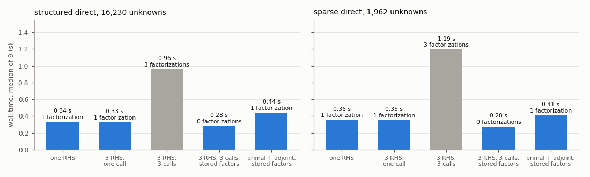

Pass `SolveResult.factors` back with `factors=`; `transpose=True` solves the adjoint. Three
right-hand sides drop from three factorizations to none, 0.96 s to 0.28 s; the sparse adjoint costs 0.15 of a primal
([factor reuse](docs/numerics/factor_reuse.md)).

## Performance and memory

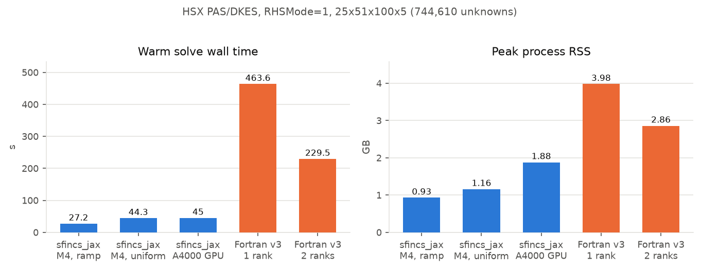

`HSX_PASCollisions_DKESTrajectories`, **744,610 unknowns**, against PETSc 3.23 / MUMPS 5.8.2 SFINCS v3.

| Configuration | Warm solve | Peak RSS |
| --- | ---: | ---: |
| DKX, `Nxi`-for-`x` ramp | **27.2 s** | **0.93 GB** |
| DKX, uniform `Nxi` | 44.3 s | 1.16 GB |
| DKX, RTX A4000 GPU | 45.0 s | — |
| SFINCS v3, 1 rank / 2 ranks | 463.6 s / 229.5 s | 3.98 / 2.86 GB |

Cold and warm, M3 Max: 1.72 s and 0.12 s at 40,584 unknowns; 23.6 s and 20.0 s at 744,610.
This is **one measured 744k-unknown HSX PAS case**, where the structured route applies.

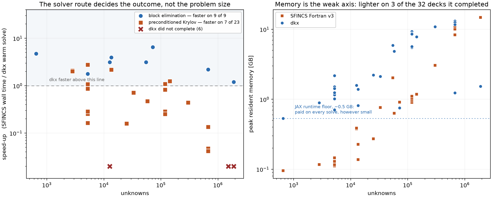

Across the upstream suite structured direct is faster on 9 of 9 decks, recycled Krylov on 7 of 23;
six decks did not complete. Memory is the weak axis: the JAX floor is about 0.5 GB, and DKX is
lighter on 3 of the 32 decks it completed ([performance](docs/benchmarks/performance.md)).

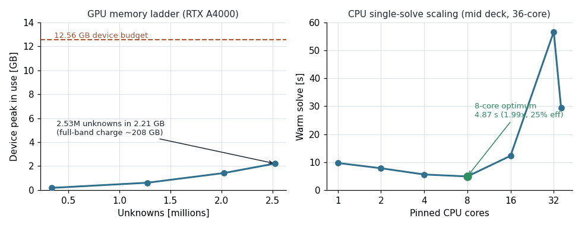

Keeping only the Legendre blocks the moments need, 2.53M unknowns fit in 2.21 GB on one RTX A4000.

## Learn DKX

The [tutorial track](docs/tutorials/index.md) runs from a first case to ambipolar `E_r`,
transport coefficients, Phi1, bootstrap current against Redl, gradients and optimization,
with the equations and the output of every step. Its scripts are
[`examples/tutorials/01_first_run.py`](examples/tutorials) to `15_optimization.py`;
`13_convergence.py` shows how far their fast grids are from converged.

## Documentation, development and citation

[Install](docs/getting_started/installation.md) · [User guide](docs/user_guide/index.md) ·
[Tutorials](docs/tutorials/index.md) · [Physics](docs/physics/index.md) · [Numerics](docs/numerics/index.md) ·
[Benchmarks](docs/benchmarks/index.md) · [Design decisions](docs/design_decisions.md) ·
[API](docs/api.md) · [Contributing](docs/contributing.md)

Reusable solver algorithms live in [SOLVAX](https://github.com/uwplasma/SOLVAX).

```bibtex
@software{dkx,
  author = {Jorge, Rogerio and contributors},
  title  = {DKX: differentiable drift-kinetic neoclassical transport in JAX},
  url    = {https://github.com/uwplasma/DKX},
  year   = {2026}
}
```

Please also cite SFINCS (Landreman, Smith, Mollén & Helander, Phys. Plasmas 21, 042503, 2014)
when you use its decks or model. Metadata: [CITATION.cff](CITATION.cff). [LICENSE](LICENSE)
