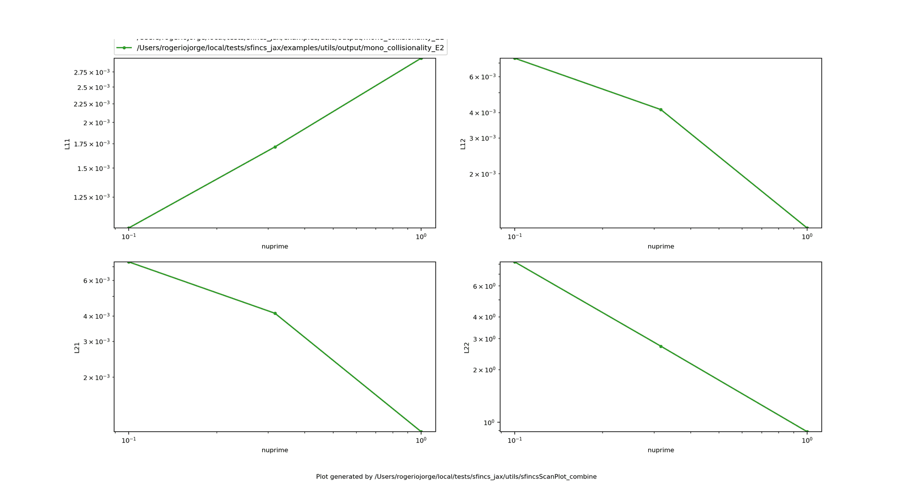

Reduced-model capabilities
==========================

Beyond the full drift-kinetic solve, `sfincs_jax` ships three reduced-model tools
that make the monoenergetic layer of the theory directly usable: a
**monoenergetic-database mode** for the community-standard
:math:`(\nu'/v,\ E_r/v)` scan and energy convolution, **variational bounds** that
bracket the monoenergetic :math:`D_{11}` and act as a convergence certificate, and
a **Shaing-Callen collisionless-limit** evaluator for the bootstrap coefficient
with an analytic axisymmetric cross-check. All three build on the same
:class:`~sfincs_jax.drift_kinetic.KineticOperator` and normalizations as the full
solve, so their results compose with everything else in the package.

Monoenergetic database mode
---------------------------

:mod:`sfincs_jax.monoenergetic` turns the RHSMode=3 monoenergetic transport-matrix
solve into the standard stellarator database workflow: scan the normalized
collisionality ``nuPrime`` and radial-electric-field ``EStar`` plane, store the
four monoenergetic coefficients :math:`D_{11}^\*, D_{13}^\*, D_{31}^\*, D_{33}^\*`
in the benchmark normalization of `Beidler et al., Nucl. Fusion 51, 076001 (2011)
<https://doi.org/10.1088/0029-5515/51/7/076001>`_, and reconstruct the thermal
(energy-integrated) transport matrix per species by convolving with a local
Maxwellian. The monoenergetic formulation is that of `Hirshman, Shaing, van Rij,
Beasley & Crume, Phys. Fluids 29, 2951 (1986) <https://doi.org/10.1063/1.865495>`_.

   Monoenergetic transport coefficients versus collisionality — the raw content
   of a database scan.

From Python:

.. code-block:: python

   from sfincs_jax.monoenergetic import (
       monoenergetic_database, energy_convolution, save_database,
   )

   db = monoenergetic_database(
       "input.namelist",
       nu_prime_grid=[3e-3, 1e-2, 3e-2, 1e-1, 3e-1, 1.0],
       e_star_grid=[0.0, 1e-4, 3e-4],
   )
   save_database("monoenergeticDatabase.npz", db)  # portable .npz

   # Energy-convolve the database into thermal L_ij per species:
   thermal = energy_convolution(
       db, z_s=z_s, m_hats=m_hats, t_hats=t_hats, n_hats=n_hats, nu_n=nu_n,
   )
   print(thermal.l11)  # shape (n_species,)

The equivalent one-liner from the CLI writes the same ``.npz`` and prints a
``nuPrime EStar nu_star D11* D31* D13* D33*`` table:

.. code-block:: bash

   sfincs_jax monoenergetic-database --input input.namelist \
     --nu-prime 3e-3 1e-2 3e-2 1e-1 3e-1 1.0 \
     --e-star 0.0 1e-4 3e-4 \
     --out monoenergeticDatabase.npz

The database is normalized exactly as in the benchmark literature: ``D11* =
D11/D11^p`` against the equivalent-tokamak plateau value, ``D31*``/``D13*``
against the banana-regime bootstrap value, and ``D33* -> 1`` in the collisional
limit. For a pitch-angle-scattering database with DKES trajectories, the energy
convolution reproduces a full RHSMode=2 kinetic solve to ``5.8e-14``, and the
convolved :math:`L_{11}` differentiates cleanly with respect to geometry
(:doc:`differentiability`). The ``.npz`` carries a schema tag so
:func:`~sfincs_jax.monoenergetic.load_database` round-trips it safely.

Variational transport-coefficient bounds
-----------------------------------------

The monoenergetic drift-kinetic operator with pitch-angle scattering has the
classic variational structure :math:`M = V + P`, with :math:`P` (collisions)
symmetric positive semidefinite and :math:`V` (streaming + mirror + :math:`E\times
B`) antisymmetric under the entropy inner product. Two quadratic functionals then
bound the diffusion coefficient :math:`D_{11}` from below and above for any trial
field, and both are tight at the exact solution. Evaluated at the even and odd
Legendre-parity parts of the *discrete* solution, they sit symmetrically around
the computed :math:`D_{11}`, and their relative gap measures how well the
discretization preserves the continuum entropy-production structure — it shrinks
under :math:`\theta`/:math:`\zeta`/:math:`\xi` refinement and at high
collisionality.

:func:`sfincs_jax.variational.monoenergetic_d11_bounds` returns this bracket from a
converged monoenergetic state:

.. code-block:: python

   from sfincs_jax.variational import monoenergetic_d11_bounds, d11_bounds_supported

   assert d11_bounds_supported(op)  # RHSMode=3, PAS, monoenergetic trajectories
   bounds = monoenergetic_d11_bounds(
       op, state_vector, g_hat=g_hat, i_hat=i_hat, iota=iota,
       b0_over_bbar=b0_over_bbar,
   )
   print(bounds.lower, bounds.d11, bounds.upper)
   print("convergence certificate:", bounds.gap)  # |upper - lower| / |d11|

The returned :class:`~sfincs_jax.variational.MonoenergeticD11Bounds` guarantees
``lower <= transportMatrix[0][0] <= upper`` to solver-residual precision, so
``gap`` is an a-posteriori certificate that requires no reference solution: a
small gap certifies a converged discretization, a large gap flags an
under-resolved one. The functionals are the upper/lower estimates of `van Rij &
Hirshman, Phys. Fluids B 1, 563 (1989) <https://doi.org/10.1063/1.859116>`_,
built on the variational principle of Hirshman et al. (1986). The strict-bound
property holds for purely parity-flipping trajectories (:math:`E_\* = 0`); with a
finite radial electric field the gap remains a consistency diagnostic.

Shaing-Callen collisionless limit
---------------------------------

At asymptotically low collisionality the monoenergetic bootstrap coefficient (the
RHSMode=3 ``transportMatrix[1][0]`` entry) approaches a collisionality-independent
value fixed purely by the flux-surface geometry. :mod:`sfincs_jax.shaing_callen`
evaluates this limit directly from the geometry — the analytic result of `Shaing &
Callen, Phys. Fluids 26, 3315 (1983) <https://doi.org/10.1063/1.864108>`_, in the
closed form of Albert, Beidler, Kapper, Kasilov & Kernbichler, arXiv:2407.21599
(2024) — by solving the geodesic-curvature magnetic differential equations
spectrally on a Fourier-upsampled ``(theta, zeta)`` grid:

.. code-block:: python

   from sfincs_jax.shaing_callen import shaing_callen_d31_limit, trapped_fraction

   limit = shaing_callen_d31_limit(
       b_hat, g_hat=g_hat, i_hat=i_hat, iota=iota, n_periods=nfp,
       x=x_nodes, x_weights=x_weights,   # the monoenergetic Nx=1 speed grid
   )
   print(limit.d31, limit.lambda_bb)

For an axisymmetric field the geometric factor collapses analytically to
:math:`\lambda_{bB} = (G/\iota)\,f_t` with :math:`f_t` the trapped-particle
fraction — the tokamak banana-regime value of `Boozer & Gardner, Phys. Fluids B
2, 2408 (1990) <https://doi.org/10.1063/1.859506>`_. That closed form is an
independent cross-check on the spectral evaluator and is exposed as
:func:`~sfincs_jax.shaing_callen.trapped_fraction`. The module underpins the
package's collisionless-limit physics tests, which confirm that a
:math:`\nu'`-scan of the full monoenergetic solve envelopes the analytic value as
collisionality drops.

See :doc:`numerics` for the solver, :doc:`differentiability` for gradients through
these tools, and :doc:`references` for the full literature.
