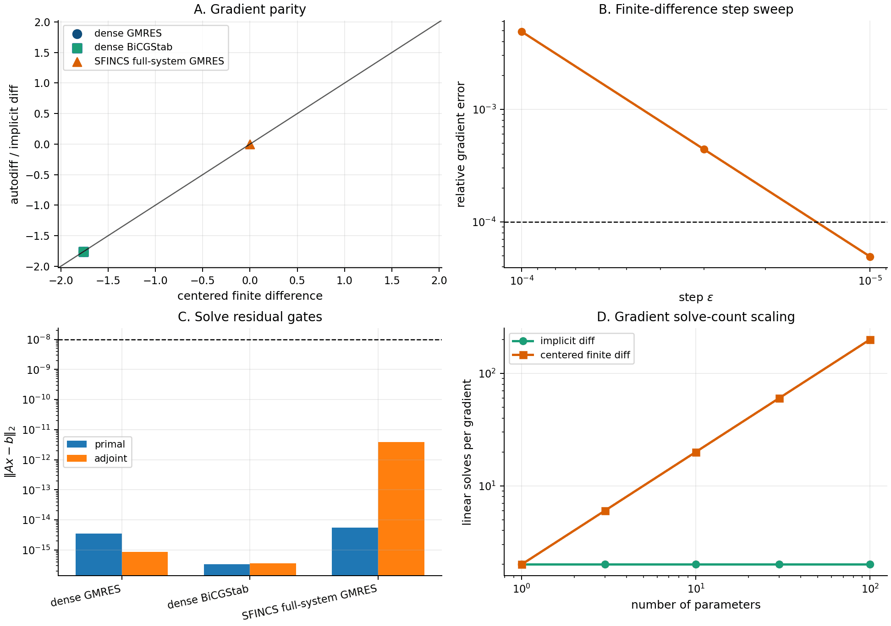

Differentiability
=================

`dkx` is differentiable end to end. Because the drift-kinetic operator,
its right-hand side, and the moment diagnostics are all pure JAX functions, a
scalar built from a solved distribution — a flux, a bootstrap current, an
ambipolar :math:`E_r`, a transport coefficient — can be handed straight to
``jax.grad`` and returns an exact derivative with respect to geometry harmonics,
plasma profiles, or the collisionality. There is no divided-difference
stencil in the loop and no differentiation through solver iterations.

This page explains how the gradient is taken through the linear solve, catalogues
what is differentiable, reports the measured gradient-vs-finite-difference
agreement, and shows the differentiable geometry chain
``vmex -> booz_xform_jax -> dkx`` used for stellarator optimization.

   Reverse-mode ``jax.grad`` derivatives of kinetic observables (points) plotted
   against centered finite differences (line). Reproduce with
   ``examples/gradients_tour.py``.

Implicit differentiation through the solve
------------------------------------------

Every tier of the solver returns the solution of a linear system
:math:`A(p)\,u = b(p)`, where :math:`p` collects the differentiable parameters
(geometry, profiles, drives). For a scalar objective :math:`J = g(u, p)` the
chain rule needs :math:`\mathrm{d}u/\mathrm{d}p`, which satisfies the *tangent*
system

.. math::

   A\,\frac{\mathrm{d}u}{\mathrm{d}p}
   = \frac{\partial b}{\partial p} - \frac{\partial A}{\partial p}\,u .

Differentiating through the Krylov or block-elimination iterations to get this
would be expensive and numerically noisy. Instead the solve is wrapped with the
**implicit function theorem**: the reverse-mode adjoint of :math:`A u = b` is the
single *transposed* solve

.. math::

   A^{\mathsf T}\,\lambda = \left(\frac{\partial g}{\partial u}\right)^{\!\mathsf T},
   \qquad
   \frac{\mathrm{d}J}{\mathrm{d}p}
   = \frac{\partial g}{\partial p}
   + \lambda^{\mathsf T}\!\left(\frac{\partial b}{\partial p}
   - \frac{\partial A}{\partial p}\,u\right).

The decisive point is that :math:`A^{\mathsf T}\lambda = \cdot` **reuses the
forward factorization**. In tier 1 the adjoint is the same block-Thomas sweep run
with ``transpose=True`` on the factors already computed for the forward solve; in
tier 2 it is the transposed-preconditioner recycled-Krylov solve seeded from the
same coarse operator. A gradient therefore costs *one extra solve*, independent
of how many iterations the forward solve took.

The wrappers come from the standalone ``solvax`` package: linear solves route
through ``solvax.implicit.linear_solve`` (``jax.lax.custom_linear_solve``), and
the outer root problems — the ambipolar :math:`E_r` and the nonlinear
:math:`\Phi_1` Newton solve — route through ``solvax.implicit.root_solve``
(``jax.lax.custom_root``), so their derivatives also fall out of the implicit
function theorem rather than unrolled iterations.

.. admonition:: Where in the code

   ``solve(op, rhs, differentiable=True)`` (:func:`dkx.solve.solve`) wraps
   tiers 1 and 2 with the implicit adjoint. The scalar
   ``ambipolar_er`` (:func:`dkx.er.ambipolar_er`) and the
   ``phi1_state`` (:func:`dkx.phi1.phi1_state`) helpers return
   differentiable JAX arrays directly. The tier-3 host direct solve is *not*
   differentiable and raises if ``differentiable=True`` is requested.

What is differentiable
----------------------

.. list-table::
   :header-rows: 1
   :widths: 26 40 34

   * - Target
     - What flows
     - Entry point
   * - **Geometry**
     - Boozer harmonics :math:`\hat B_{mn}` and derived metric coefficients, for
       analytic schemes and for JAX-native geometry producers
     - :meth:`dkx.drift_kinetic.KineticOperator.apply` /
       ``booz_xform_jax``
   * - **Profiles**
     - densities, temperatures, their radial gradients, ``nu_n``, and the
       :math:`E_r`/potential-gradient drive
     - ``KineticOperator.rhs`` and the operator coefficients
   * - **Ambipolar** :math:`E_r`
     - the scalar root of :math:`J_r(E_r)=0` and any downstream function of it
     - :func:`dkx.er.ambipolar_er`
   * - :math:`\Phi_1` **state**
     - the solved flux-surface potential :math:`\Phi_1(\theta,\zeta)` from the
       nonlinear quasineutrality Newton solve
     - :func:`dkx.phi1.phi1_state`
   * - **Monoenergetic transport matrix**
     - the RHSMode=3 coefficients and the energy-convolved thermal
       :math:`L_{ij}`, differentiated w.r.t. geometry
     - :func:`dkx.monoenergetic.monoenergetic_database_from_operator`
       (``differentiable=True``)

The file-based readers (``input.namelist``, ``.bc`` Boozer files, ``wout_*.nc``)
are provenance and parity tools and are **not** differentiable. Geometry
sensitivities flow through JAX-native producers instead — the analytic geometry
schemes, or the ``vmex -> booz_xform_jax`` transform below.

.. note::

   The differentiable ambipolar :math:`E_r` and :math:`\Phi_1` helpers require the
   untruncated pitch embedding (``Nxi_for_x_option = 0``); with an active
   :math:`N_\xi`-for-:math:`x` ramp they raise ``NotImplementedError`` rather than
   return an approximate gradient. RHSMode=1 outputs remain differentiable through
   the ramped tier-1 route.

Measured gradient accuracy
--------------------------

Every differentiable path is gated against centered finite differences. The
recorded agreements are:

.. list-table::
   :header-rows: 1
   :widths: 40 34 26

   * - Differentiable target
     - Adjoint route
     - ``grad`` vs finite difference
   * - PAS + :math:`E_r` kinetic outputs
     - tier-2 recycled-Krylov transposed solve
     - ``2.9e-6``
   * - Ramped-PAS RHSMode=1 output
     - tier-1 truncated block-Thomas, transposed
     - agree at rtol ``1e-6``
   * - Monoenergetic :math:`L_{11}` w.r.t. :math:`\hat B_{mn}`
     - tier-1 differentiable + energy convolution
     - ``5.5e-10``
   * - Monoenergetic energy convolution to thermal :math:`L_{ij}`
     - closed-form convolution vs a full RHSMode=2 kinetic solve
     - ``5.8e-14``

As a throughput reference, a ``value_and_grad`` of a 39,318-unknown PAS
scheme-1 objective through the tier-1 differentiable route costs about
``5.3 s`` cold and ``2.1 s`` warm on the development MacBook — the adjoint adds
roughly one forward solve, as predicted.

.. warning::

   **Do not trust a tier-2 gradient on a numerically singular Fokker-Planck
   system.** Full Fokker-Planck with ``constraintScheme=1`` on the flagship
   optimization deck produces a near-singular operator (about 5 zero singular
   values, condition number :math:`\sim 2\times10^{36}`). The recycled-Krylov
   adjoint stagnates and the vector-Jacobian product returns a wrong gradient
   with no error raised (``-1.7e-3`` from autodiff versus ``+2.8e-5`` from finite
   differences on the affected degree of freedom). The PAS + :math:`E_r` gradient
   on the same optimization chain is exact. Until the adjoint residual is
   surfaced in ``SolveResult`` and flagged when it misses tolerance, validate
   gradients on singular-FP decks against a finite difference before using them.

The differentiable optimization chain
-------------------------------------

Stellarator optimization with a *kinetic* objective closes the loop from the
plasma boundary to a neoclassical figure of merit and back, entirely under
automatic differentiation:

.. math::

   \text{boundary } \partial\Omega
   \;\xrightarrow[\text{equilibrium}]{\texttt{vmec\_jax}}\;
   \{ \hat B_{mn} \}
   \;\xrightarrow[\text{Boozer transform}]{\texttt{booz\_xform\_jax}}\;
   \text{geometry}
   \;\xrightarrow[\text{kinetic solve}]{\texttt{sfincs\_jax}}\;
   \langle \mathbf{j}\cdot\mathbf{B}\rangle,\ D_{ij},\ \Gamma_s .

Each arrow is a JAX transformation, so ``jax.grad`` of the bootstrap current
:math:`\langle \mathbf{j}\cdot\mathbf{B}\rangle` (or a transport coefficient)
with respect to the boundary Fourier modes propagates through the equilibrium
solve, the Boozer transform, and the drift-kinetic solve without any finite
differences. The flagship script ``examples/optimize_QA_bootstrap.py`` drives a
quasi-axisymmetric, low-bootstrap optimization on exactly this chain with warm
starts and finite-difference-verified gradients; the geometry link on its own is
demonstrated in ``examples/autodiff/vmex_to_boozer_sfincs_pipeline.py``. See
:doc:`optimization` and :doc:`vmex_workflow` for the full workflow.

Worked examples
---------------

- ``examples/gradients_tour.py`` — ``jax.grad`` of kinetic outputs through the
  implicit solve, checked against finite differences (the figure above).
- ``examples/autodiff/matrix_free_residual_and_jvp.py`` — matrix-free residual
  and Jacobian-vector products for the F-block.
- ``examples/autodiff/implicit_diff_through_gmres_solve_scheme5.py`` — implicit
  differentiation through a full-system Krylov solve on a VMEC geometry.
- ``examples/autodiff/differentiable_geometry_gradients.py`` — a geometry scalar
  differentiated with respect to harmonic amplitudes.
- ``examples/optimize_QA_bootstrap.py`` — the flagship gradient-based
  optimization with kinetic :math:`\langle \mathbf{j}\cdot\mathbf{B}\rangle` in
  the objective.

See :doc:`numerics` for the solver tiers behind the adjoint and :doc:`performance`
for runtime and memory of the differentiable paths.
