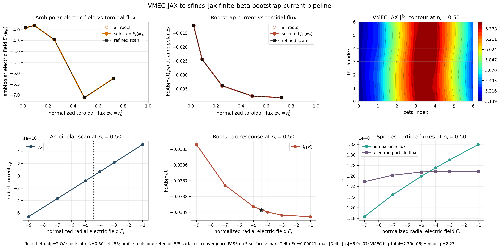
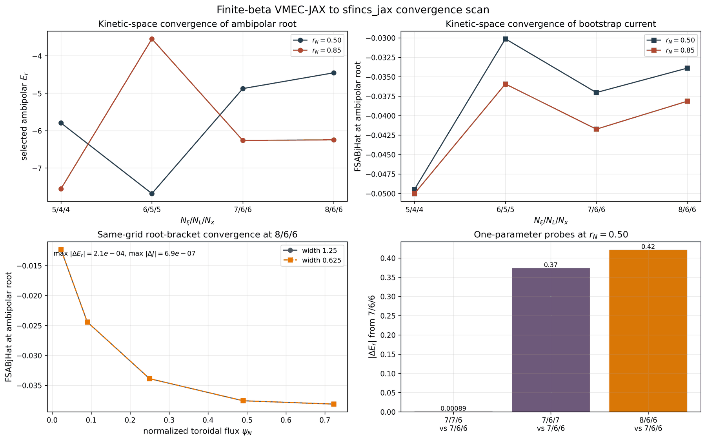

Examples
========

Canonical examples
------------------

Six pedagogic scripts on the canonical API sit at the top of ``examples/``.
Each follows the same style contract: no ``main()``, all parameters at the top
of the file, printed setup/progress/final results, at least one plot, and
output files written and read back. All run on a laptop CPU; CI runs each one
at shrunken resolution (``SFINCS_JAX_CI=1``) in
``tests/test_examples_pedagogic.py``.

``examples/run_tokamak.py`` — first solve, from Python
   Builds a circular-tokamak ``input.namelist`` from Python dicts
   (``geometryScheme=1``, one ion species, pitch-angle-scattering collisions),
   runs the canonical driver, and reads the HDF5 output back. The key lines:

   .. code-block:: python

      from sfincs_jax.run import run_profile

      run = run_profile(deck_path, solve_method="auto", out_path=h5_path)
      gamma = float(run.moments["particleFlux_vm_psiHat"][0])

   It teaches the per-species results table, the four radial-coordinate flux
   conventions, and HDF5/NetCDF output selection by file suffix.

``examples/run_w7x.py`` — stellarator geometry and full Fokker-Planck
   Loads a W7-X Boozer equilibrium and solves with the linearized
   Fokker-Planck operator, which routes ``auto`` to the tier-2 recycled-Krylov
   (GCROT) solver instead of the tier-1 structured direct path. It teaches
   geometry files, collision-operator selection, and how to inspect which
   solver tier ran (``run.solve_result.method``).

``examples/transport_coefficients.py`` — RHSMode=3 transport matrices
   Computes monoenergetic transport matrices over a collisionality scan,
   checks Onsager symmetry, and plots ``L11`` versus ``nuPrime``.

``examples/ambipolar_er_scan.py`` — ambipolar radial electric field
   Scans ``Er``, brackets the sign change of the radial current, solves for
   the ambipolar root, and writes/reads the output at the root.

``examples/gradients_tour.py`` — differentiating the solve
   Takes ``jax.grad`` of fluxes and bootstrap current with respect to
   temperature and ``Er`` drives through the implicit-differentiation solve
   path, and verifies every gradient against central finite differences.

``examples/optimize_QA_bootstrap.py`` — flagship optimization
   Gradient-based optimization of a quasi-axisymmetric stellarator boundary
   for low bootstrap current: boundary Fourier coefficients ->
   ``vmec_jax`` fixed-boundary equilibrium (implicit-adjoint VJP) ->
   differentiable Boozer transform (``booz_xform_jax``) ->
   ``FluxSurfaceGeometry.from_fourier`` (geometryScheme-13 pure-JAX path) ->
   canonical kinetic solve (tier-2 GCROT, warm-started and recycled across
   optimizer iterations) -> ``FSABjHat``. One ``jax.value_and_grad`` call
   differentiates the whole chain; the example verifies the end-to-end
   gradient against central finite differences and holds aspect ratio, mean
   iota, and quasisymmetry with penalty terms. Alternative objective lines
   (e.g. ``D11``-style targets) ship commented and CI-tested. Requires
   ``vmec_jax`` and ``booz_xform_jax``.

   .. figure:: _static/figures/readme/optimize_QA_bootstrap.png
      :alt: QA low-bootstrap optimization dashboard: objective history, boundary cross-sections, |B| spectrum, and <j.B> profile.
      :align: center
      :width: 90%

      Output figure of ``examples/optimize_QA_bootstrap.py``.

Example tree
------------

The repository includes a structured `examples/` tree:

- `examples/tutorials/`: notebook-led learning path and a fast output/plot script
- `examples/getting_started/`: basic API usage (no external reference code required)
- `examples/parity/`: focused validation scripts against frozen reference fixtures
- `examples/transport/`: `RHSMode=2/3` transport-matrix workflows + upstream scanplot scripts
- `examples/autodiff/`: autodiff + implicit-diff demonstrations
- `examples/optimization/`: optimization patterns (may require extras)
- `examples/performance/`: JIT/performance microbenchmarks
- `examples/publication_figures/`: publication-style figure generation
- `examples/vmec_jax_finite_beta/`: finite-beta ``vmec_jax`` to ``sfincs_jax`` radial bootstrap-current and ambipolar-``E_r`` workflow

Run from the repo root:

.. code-block:: bash

   cd sfincs_jax
   python examples/tutorials/run_quick_output_and_plot.py --out-dir tutorial_output
   python examples/getting_started/build_grids_and_geometry.py

For a guided classroom-style path, open the notebooks in
``examples/tutorials`` in order — a getting-started -> transport -> ambipolar
-> optimization arc:

- ``00_start_here.ipynb``: pick a learning path, verify first-run assets, and map
  physics goals to example folders.
- ``01_cli_outputs_and_plots.ipynb``: CLI, output formats, and diagnostics panels.
- ``02_transport_and_autodiff.ipynb``: RHSMode=2/3 transport matrices and JAX
  differentiation (deeper: :doc:`differentiability`).
- ``03_bootstrap_redl_and_optimization.ipynb``: bootstrap-current/Redl comparisons
  and optimization objectives (deeper: :doc:`optimization`).
- ``04_geometry_validation_and_performance.ipynb``: analytic/Boozer/VMEC geometry,
  validation and parity, and CPU/GPU performance pointers (deeper:
  :doc:`performance`).

For the reduced-model tools that build on these workflows — the
monoenergetic-database mode, the variational :math:`D_{11}` bounds, and the
Shaing-Callen collisionless limit — see :doc:`capabilities`.

The checked catalog ``examples/workflow_catalog.json`` mirrors the tables on
this page. It records the supported topic folders, first-pass entry points,
typical commands, runtime budgets, and whether a workflow requires a local
SFINCS Fortran v3 executable.

For a terminal browser over the same catalog:

.. code-block:: bash

   python examples/list_workflows.py --list-topics
   python examples/list_workflows.py --topic bootstrap --long
   python examples/list_workflows.py --search "VMEC geometry"

One-command start points
------------------------

These entries are the shortest useful commands for common workflows. They avoid
a local SFINCS Fortran v3 executable unless the command explicitly says it is a
frozen-reference or benchmark workflow.

.. list-table::
   :header-rows: 1
   :widths: 28 36 36

   * - Goal
     - Entry script
     - Typical command
   * - Write output files and a diagnostics panel
     - ``examples/tutorials/run_quick_output_and_plot.py``
     - ``python examples/tutorials/run_quick_output_and_plot.py --out-dir tutorial_output``
   * - Inspect HDF5, NetCDF, NPZ, and plotting
     - ``examples/getting_started/write_and_plot_multiple_formats.py``
     - ``python examples/getting_started/write_and_plot_multiple_formats.py``
   * - Load VMEC geometry through ``wout_path``
     - ``examples/getting_started/write_sfincs_output_vmec.py``
     - ``python examples/getting_started/write_sfincs_output_vmec.py``
   * - Compute a RHSMode=2/3 transport matrix
     - ``examples/transport/transport_matrix_rhsmode2_and_rhsmode3.py``
     - ``python examples/transport/transport_matrix_rhsmode2_and_rhsmode3.py``
   * - Differentiate a residual with JAX
     - ``examples/autodiff/autodiff_gradient_nu_n_residual.py``
     - ``python examples/autodiff/autodiff_gradient_nu_n_residual.py``
   * - Compare kinetic bootstrap current with Redl
     - ``examples/vmec_jax_finite_beta/compare_qs_paper_sfincs_jax_redl.py``
     - ``python examples/vmec_jax_finite_beta/compare_qs_paper_sfincs_jax_redl.py --case QA --quick --jax-vs-redl --solve-method auto``
   * - Time output formats and memory behavior
     - ``examples/performance/benchmark_output_formats.py``
     - ``python examples/performance/benchmark_output_formats.py --repeats 2``
   * - Check a frozen Fortran-v3 output fixture
     - ``examples/parity/output_parity_vs_fortran_fixture.py``
     - ``python examples/parity/output_parity_vs_fortran_fixture.py``

Fast tutorial, getting-started, and frozen-fixture parity entries are designed
for seconds-scale laptop CPU runs. VMEC, Redl, optimization, and performance
entries may take longer; use ``--quick`` where available and inspect generated
solver metadata before treating a result as quantitative evidence.

Decision map
------------

Use this map when you know the kind of task you need, but not the example
folder name.

.. list-table::
   :header-rows: 1
   :widths: 28 32 40

   * - Starting question
     - Go here
     - Why
   * - I want to run one case and plot the output.
     - ``examples/tutorials/run_quick_output_and_plot.py``
     - Writes HDF5, NetCDF, NPZ, and a PDF panel in one bounded command.
   * - I want to learn the file formats and CLI/API basics.
     - ``examples/getting_started/``
     - Isolates input parsing, output writing, VMEC paths, and plotting.
   * - I need transport coefficients.
     - ``examples/transport/``
     - Covers RHSMode=2/3 transport matrices and scan postprocessing.
   * - I need gradients or optimization hooks.
     - ``examples/autodiff/`` and ``examples/optimization/``
     - Starts with residual/JVP examples, then moves to QA/QI objectives and promotion gates.
   * - I need bootstrap current or Redl comparisons.
     - ``examples/vmec_jax_finite_beta/``
     - Owns the VMEC, Redl, ambipolar-root, and bootstrap-current profile scripts.
   * - I need to validate against SFINCS Fortran v3 behavior.
     - ``examples/parity/`` and ``examples/publication_figures/``
     - Provides frozen fixtures and release-facing comparison plot generators.
   * - I need CPU/GPU runtime or memory evidence.
     - ``examples/performance/``
     - Benchmarks output formats, JIT, sharding, transport workers, and optional backends.
   * - I recognize an upstream SFINCS input name.
     - ``examples/sfincs_examples/``
     - Preserves upstream-style decks for parity and benchmark audits, not first-pass learning.

Application recipe map
----------------------

Use this table when you know the physics or software task, but not the folder
name. The first entry point is the smallest useful run; the research workflow
points to the script or notebook that adds production-style validation,
convergence, or profiling detail.

.. list-table::
   :header-rows: 1
   :widths: 28 36 36

   * - Application
     - Smallest useful entry point
     - Research workflow
   * - CLI output and diagnostics panel
     - ``examples/tutorials/run_quick_output_and_plot.py``
     - ``examples/getting_started/write_and_plot_multiple_formats.py``
   * - Analytic tokamak input
     - ``examples/getting_started/write_sfincs_output_tokamak.py``
     - ``examples/sfincs_examples/tokamak_1species_FPCollisions_noEr/input.namelist``
   * - VMEC ``wout_path`` input
     - ``examples/getting_started/write_sfincs_output_vmec.py``
     - ``examples/vmec_jax_finite_beta/finite_beta_vmec_to_sfincs.py``
   * - RHSMode=2/3 transport matrix
     - ``examples/transport/transport_matrix_rhsmode2_and_rhsmode3.py``
     - ``examples/transport/transport_matrix_rhsmode2_scheme11_and_scheme5.py``
   * - Bootstrap current vs Redl
     - ``examples/vmec_jax_finite_beta/compare_qs_paper_sfincs_jax_redl.py``
     - ``examples/tutorials/03_bootstrap_redl_and_optimization.ipynb``
   * - Ambipolar electric-field scan
     - ``examples/vmec_jax_finite_beta/finite_beta_vmec_to_sfincs.py``
     - ``examples/optimization/evaluate_sfincs_jax_promotion_scan.py``
   * - Differentiable residual or flux
     - ``examples/autodiff/autodiff_gradient_nu_n_residual.py``
     - ``examples/autodiff/implicit_diff_through_gmres_solve_scheme5.py``
   * - VMEC/Boozer/JAX workflow
     - ``examples/autodiff/vmec_jax_to_boozer_sfincs_pipeline.py``
     - ``examples/tutorials/04_geometry_validation_and_performance.ipynb``
   * - QA/QI optimization objective
     - ``examples/optimization/qa_nfp2_sfincs_jax_objectives.py``
     - ``examples/optimization/QA_optimization_bootstrap_current.py``
   * - CPU/GPU timing and output I/O
     - ``examples/performance/benchmark_output_formats.py``
     - ``examples/performance/benchmark_transport_l11_vs_fortran.py``
   * - Frozen Fortran-v3 parity check
     - ``examples/parity/output_parity_vs_fortran_fixture.py``
     - ``examples/sfincs_examples/`` for retained upstream-style decks

Top-level folder categories
---------------------------

The top-level folders are grouped by user intent. Start with the ``learning``
folders when exploring the code, use ``capability`` folders for physics or
differentiability workflows, and use ``validation`` folders when producing
parity, performance, or publication evidence. The ``reference`` folders are not
the recommended first stop for new workflows.

.. list-table::
   :header-rows: 1
   :widths: 18 32 50

   * - Category
     - Folders
     - Use when
   * - ``learning``
     - ``examples/tutorials/``, ``examples/getting_started/``
     - You want to learn the CLI, Python API, plots, output formats, and first operator or geometry concepts.
   * - ``capability``
     - ``examples/transport/``, ``examples/autodiff/``, ``examples/optimization/``, ``examples/vmec_jax_finite_beta/``
     - You need a specific physics, optimization, VMEC, Redl, bootstrap-current, or differentiability workflow.
   * - ``validation``
     - ``examples/parity/``, ``examples/performance/``, ``examples/publication_figures/``
     - You need parity checks, runtime/memory evidence, CPU/GPU benchmark drivers, or regenerated documentation figures.
   * - ``reference``
     - ``examples/data/``, ``examples/sfincs_examples/``
     - You need small shared inputs or recognizable SFINCS Fortran v3 decks for audits and compatibility checks.

Some geometry examples reference public W7-X/HSX/QI equilibrium fixtures by
basename. Those multi-megabyte files are fetched from the
``sfincs-jax-data-v1`` release into the local `sfincs_jax` data cache on first
use. To prefetch them before running examples, use:

.. code-block:: bash

   python -m sfincs_jax.validation.data_fetch

Writing `sfincsOutput.h5` (Python + CLI):

.. code-block:: bash

   python examples/getting_started/write_sfincs_output_python.py
   python examples/getting_started/write_sfincs_output_cli.py

Geometry-specific write-output examples:

.. code-block:: bash

   python examples/getting_started/write_sfincs_output_tokamak.py
   python examples/getting_started/write_sfincs_output_vmec.py

Finite-beta VMEC-JAX to kinetic transport
-----------------------------------------

The finite-beta example is a single Python script that reads the bundled
``input.nfp2_QA_finite_beta`` VMEC input, runs ``vmec_jax`` for a bounded number
of fixed-boundary iterations, writes a VMEC-style ``wout`` file, and uses that
file directly in ``sfincs_jax`` with ``geometryScheme=5``.  It then scans the
normalized radial electric field on several flux surfaces, computes ambipolar
radial-current roots when each scan brackets them, selects a continuous root
branch, and writes a polished PNG/PDF panel with the radial electric-field
profile, bootstrap-current radial profile, representative ambipolarity and flux
scans in ``Er``, and a VMEC magnetic-field contour plot using a ``jet`` colormap.
The radial-profile x-axis is normalized toroidal flux,
:math:`\psi_N = r_N^2`, not the square-root radial label used in the input file.

.. code-block:: bash

   export SFINCS_JAX_VMEC_JAX_ROOT=/path/to/vmec_jax  # optional for source checkouts
   python examples/vmec_jax_finite_beta/finite_beta_vmec_to_sfincs.py

   Finite-beta VMEC-JAX to ``sfincs_jax`` example panel.  The top row shows the
   ambipolar radial-electric-field profile versus normalized toroidal flux, the
   bootstrap-current profile versus normalized toroidal flux, and the sampled
   VMEC magnetic-field-strength contour.  The bottom row shows the representative
   ambipolarity scan, bootstrap response, and ion/electron particle fluxes versus
   normalized ``Er`` at the selected surface.  Open markers show all bracketed
   roots; filled markers show the selected continuous branch; dashed black markers
   show the tighter root-bracket convergence scan at the same kinetic grid.

The direct VMEC path does not require a Boozer transform: ``sfincs_jax`` consumes
the generated ``wout`` through the same scheme-5 geometry implementation used by
file-based VMEC runs.  ``booz_xform_jax`` remains useful for the separate
differentiable Boozer-spectrum workflow described below.  This finite-beta script
is a primal transport example: it does not differentiate through the VMEC-JAX
fixed-boundary run, the ``wout`` file boundary, scheme-5 geometry evaluation, the
SFINCS kinetic solve, or radial postprocessing.  Its summary JSON records that
boundary in a workflow-contract block, plus radial-profile provenance for the
``r_N`` surfaces, plotted :math:`\psi_N = r_N^2` values, selected ambipolar branch,
all bracketed roots, and convergence-overlay status.

By default the radial profile uses ``r_N = 0.15, 0.30, 0.50, 0.70, 0.85`` and
root-neighborhood ``Er = -9, -7, -5, -3, -1``.  This spans core-to-edge behavior
while avoiding the exact magnetic axis and VMEC boundary, and it spends the
expensive solves near the ambipolar branch instead of at far-off electric fields.
The checked documentation figure is run at ``Ntheta=7``, ``Nzeta=7``,
``Nxi=8``, ``NL=6``, and ``Nx=6`` with adaptive midpoint refinement of bracketed
ambipolar roots until the local ``Er`` bracket is no wider than ``1.25``.  The
dashed overlay in the top panels uses the same kinetic-space grid on every
plotted surface, but refines each bracketed ambipolar root to a local ``Er``
bracket width of ``0.625``.  The checked documentation figure passes the default
gate, ``max |Delta Er| <= 0.1`` and ``max |Delta Jbs| <= 5e-4``; the measured
values are ``max |Delta Er| = 2.1e-4`` and ``max |Delta Jbs| = 6.9e-7`` in the
cached documentation run.  Use ``--quick`` for the smoke-test resolution, and
increase ``--r-n-values``, ``--er-values``, and the resolution flags for denser
production-quality scans.

The convergence-scan helper reads the cached ``sfincsOutput.h5`` files from the
finite-beta example and summarizes which numerical knobs move the ambipolar root
and bootstrap current:

.. code-block:: bash

   python examples/vmec_jax_finite_beta/plot_convergence_scan.py

   Convergence scan for the finite-beta example.  The top panels show that the
   cached documentation campaign is still sensitive to kinetic-space resolution:
   moving from ``7/6/6`` to ``8/6/6`` changes the selected ambipolar root and
   bootstrap current, especially at the representative surfaces.  The bottom-left
   panel shows that, once the practical ``8/6/6`` kinetic grid is fixed,
   tightening the local ambipolar-root bracket from ``1.25`` to ``0.625`` changes
   the full radial profile by only ``max |Delta Er| = 2.1e-4`` and
   ``max |Delta Jbs| = 6.9e-7``.  The bottom-right panel records one-parameter
   probes at ``r_N=0.50``: ``NL=7`` is stable, while ``Nxi=8`` and ``Nx=7`` both
   move the root.  Combined ``Nxi=8,Nx=7`` and ``Nxi=9`` probes were too expensive
   on a single RTX A4000 for this bounded documentation campaign, so this figure
   is an explicit resolution audit rather than a claim of asymptotic
   kinetic-space convergence.

SFINCS_JAX / Redl bootstrap-current comparison
~~~~~~~~~~~~~~~~~~~~~~~~~~~~~~~~~~~~~~~~~~~~~~

The finite-beta directory includes a standalone diagnostic script for the QA and
QH SFINCS/Redl benchmarks used in the Zenodo artifact associated with
arXiv:2205.02914.  The script evaluates the Redl analytic formula on the
archived VMEC ``wout_new_QA_aScaling.nc`` and ``wout_new_QH_aScaling.nc`` files
and overlays ``sfincs_jax`` RHSMode=1 kinetic solves.  Use ``--jax-vs-redl`` for
the first-run path: it
plots only ``sfincs_jax`` and Redl, and does not load or require a SFINCS
Fortran v3 executable or archived ``psiN_*/sfincsOutput.h5`` files.  If those
archived SFINCS Fortran v3 outputs are present in the Zenodo tree, the script
can also overlay them as a reference curve without installing or running the
Fortran executable.  It intentionally makes one plot only: ``sfincs_jax``, Redl,
and optionally SFINCS Fortran v3, with no NTX or NEOPAX data.

Run a quick QA ``sfincs_jax``-versus-Redl diagnostic with no Fortran v3
dependency:

.. code-block:: bash

   JAX_ENABLE_X64=1 \
   python examples/vmec_jax_finite_beta/compare_qs_paper_sfincs_jax_redl.py \
     --case QA \
     --quick \
     --jax-vs-redl \
     --solve-method auto \
     --stem qs_paper_qa_jax_redl_quick

For the quasi-helical benchmark, switch the case and stem:

.. code-block:: bash

   JAX_ENABLE_X64=1 \
   python examples/vmec_jax_finite_beta/compare_qs_paper_sfincs_jax_redl.py \
     --case QH \
     --quick \
     --jax-vs-redl \
     --solve-method auto \
     --stem qs_paper_qh_jax_redl_quick

This no-Fortran mode still uses the Zenodo input decks and VMEC ``wout`` file,
and still requires ``vmec_jax`` for the Redl algebra; it simply skips every
SFINCS Fortran v3 output overlay and metric.

Run the checked 11-surface educational diagnostic used for the same-resolution
QA figure:

.. code-block:: bash

   JAX_ENABLE_X64=1 \
   python examples/vmec_jax_finite_beta/compare_qs_paper_sfincs_jax_redl.py \
     --case QA \
     --stem qs_paper_qa_same_resolution_11surface \
     --s-values 0.1,0.15,0.25,0.3,0.45,0.5,0.6,0.7,0.75,0.85,0.9 \
     --ntheta 13 --nzeta 13 --nxi 21 --nx 5 \
     --with-errorbars \
     --real-ntheta 15 --real-nzeta 15 \
     --velocity-nxi 25 --velocity-nx 6 \
     --fortran-case-root outputs/qs_paper_fortran_reduced_resolution/QA_Ntheta13_Nzeta13_Nxi21_Nx5 \
     --fortran-errorbar-json docs/_static/figures/vmec_jax_finite_beta/qs_paper_qa_same_resolution_11surface_fortran_errorbars.json \
     --require-same-resolution \
     --solver-tolerance 1e-6 \
     --solve-method auto

Use ``--case QH --stem qs_paper_qh_same_resolution_11surface``,
``--fortran-case-root outputs/qs_paper_fortran_reduced_resolution/QH_Ntheta13_Nzeta13_Nxi21_Nx5``,
and the QH Fortran-errorbar JSON sidecar for the quasi-helical configuration.
If those local reduced-resolution Fortran sidecars are not present, add
``--hide-fortran`` to generate a pure ``sfincs_jax``/Redl educational plot.
Add ``--quick`` for a three-surface smoke plot, or increase the surface list to
rerun a denser radial diagnostic.

To re-render a checked figure bundle from its summary JSON without rerunning
kinetic solves or requiring local HDF5 sidecars:

.. code-block:: bash

   python examples/vmec_jax_finite_beta/compare_qs_paper_sfincs_jax_redl.py \
     --from-summary-json docs/_static/figures/vmec_jax_finite_beta/qs_paper_qa_same_resolution_11surface.json \
     --stem qs_paper_qa_same_resolution_11surface

Add ``--jax-vs-redl`` (alias ``--hide-fortran``) for a pure ``sfincs_jax``
versus Redl plot. The default ``--s-values all`` evaluates all 39 archived
surfaces; increase the grid beyond ``13 x 13 x 21 x 5`` for production accuracy
studies.

For an apples-to-apples SFINCS_JAX/SFINCS Fortran v3 figure, use the
same-resolution gate:

.. code-block:: bash

   JAX_ENABLE_X64=1 \
   python examples/vmec_jax_finite_beta/compare_qs_paper_sfincs_jax_redl.py \
     --case QA --s-values 0.5 \
     --match-fortran-resolution \
     --require-same-resolution \
     --verbose-sfincs \
     --solver-tolerance 1e-6 \
     --solve-method auto

The gate reads the archived Fortran grid and sets the JAX grid to matching
``Ntheta,Nzeta,Nxi,Nx`` values before running. If the plotted JAX and Fortran
surfaces do not have the same grid, the script fails before writing a public
figure. JAX error bars come from ``--with-errorbars`` refinement probes. Fortran
error bars are plotted only from an explicit ``--fortran-errorbar-json`` sidecar;
the archived Zenodo outputs contain one Fortran solve per surface, so they do
not by themselves define a convergence uncertainty.
Use ``--verbose-sfincs`` or set ``SFINCS_JAX_EXAMPLE_VERBOSE=1`` for
production-grid reruns so the script forwards phase, preconditioner, and Krylov
progress messages while setup is running.

The apples-to-apples QA/QH documentation check reruns SFINCS Fortran v3
at the same ``13 x 13 x 21 x 5`` grid used by the fast JAX documentation solve
on 11 surfaces, ``s = 0.10, 0.15, 0.25, 0.30, 0.45, 0.50, 0.60, 0.70, 0.75,
0.85, 0.90``. JAX
refinement bars come from independent ``15 x 15 x 21 x 5`` real-space and
``13 x 13 x 25 x 6`` velocity-space probes. Fortran bars are one-sided
refinement deltas against the archived ``25 x 39 x 60 x 7`` Fortran v3 outputs.
On this same-resolution 11-surface gate, the maximum JAX-vs-Fortran
difference is ``1.21e-3`` for QA and ``3.54e-3`` for QH. The largest JAX
refinement bar is ``4.21%`` for QA and ``24.43%`` for QH, so QH is still a
reduced-grid convergence stress test rather than a production-resolution claim.

For this benchmark script, ``--solve-method auto`` runs in the
runtime/non-autodiff lane (the script sets ``SFINCS_JAX_IMPLICIT_SOLVE=0``).
The recorded finite-beta QA/QH figures below remain valid measured evidence,
and reruns use the matrix-free ``auto`` policy. The script refuses to write
nonconverged production-sized diagnostics.

.. figure:: _static/figures/vmec_jax_finite_beta/qs_paper_qa_same_resolution_11surface.png
   :alt: Same-resolution SFINCS_JAX and SFINCS Fortran v3 QA bootstrap-current comparison against the Redl analytic formula.
   :width: 100%

   Same-resolution 11-surface QA bootstrap-current gate.  The black curve is
   a local SFINCS Fortran v3 rerun at ``13 x 13 x 21 x 5``.  The red markers are
   SFINCS_JAX at the same grid, with refinement bars from independent
   real-space and velocity-space probes.  Fortran bars are refinement deltas
   from the archived ``25 x 39 x 60 x 7`` Fortran outputs.  The maximum
   JAX-vs-Fortran difference on the 11 surfaces is ``1.21e-3``.

.. figure:: _static/figures/vmec_jax_finite_beta/qs_paper_qh_same_resolution_11surface.png
   :alt: Same-resolution SFINCS_JAX and SFINCS Fortran v3 QH bootstrap-current comparison against the Redl analytic formula.
   :width: 100%

   Same-resolution 11-surface QH bootstrap-current gate.  The maximum
   JAX-vs-Fortran difference is ``3.54e-3``; the larger visible red bars at low
   radius are JAX velocity-space refinement deltas, not a Fortran/JAX
   normalization mismatch.

.. figure:: _static/figures/vmec_jax_finite_beta/qs_paper_sfincs_jax_redl_comparison.png
   :alt: SFINCS_JAX and SFINCS Fortran v3 bootstrap-current comparison against the Redl analytic formula.
   :width: 100%

   Paper-backed QA bootstrap-current mixed-grid diagnostic.  The Redl curve uses the
   archived VMEC equilibrium and the same polynomial profile contract used in
   the original SFINCS/Redl comparison.  The black curve is the archived
   SFINCS Fortran v3 output at the paper resolution ``25 x 39 x 60 x 7``.
   The red markers are the ``sfincs_jax`` benchmark ``auto`` policy at
   ``13 x 13 x 21 x 5`` on the same 39 archived radial surfaces.  All solves
   selected ``fortran_reduced_pc_gmres`` and reached the true-residual target.
   The right panels compare the total solve wall time over all plotted radii and
   the peak solver-memory metric over those radii.  QA completed in ``232.5 s``
   with ``109 MB`` JAX solver-memory estimate, versus ``696.1 s`` and
   ``12.96 GB`` effective total MUMPS factor memory for the archived Fortran v3
   run.  Max differences are ``23.95%`` versus Redl and ``6.94%`` versus
   Fortran, so this is a useful reduced-grid diagnostic while the full
   same-resolution production parity claim remains a separate gate.

.. figure:: _static/figures/vmec_jax_finite_beta/qs_paper_qh_sfincs_jax_redl_comparison.png
   :alt: SFINCS_JAX and SFINCS Fortran v3 QH bootstrap-current comparison against the Redl analytic formula.
   :width: 100%

   Paper-backed QH bootstrap-current diagnostic with the same whole-radius
   plotting contract.  The QH run is also residual-clean under ``auto`` /
   ``fortran_reduced_pc_gmres``.  The JAX scan completed in ``261.1 s`` with
   ``109 MB`` JAX solver-memory estimate, versus ``655.5 s`` and ``12.80 GB``
   effective total MUMPS factor memory for the archived Fortran v3 run.  Max
   differences are ``15.31%`` versus Redl and ``18.77%`` versus Fortran on the
   reduced JAX grid.  This keeps the QH production-resolution convergence lane
   open; term-level audits point away from a simple stale-radius
   geometry, radial-gradient conversion, or current-assembly normalization bug,
   but the production-resolution convergence gate remains the acceptance
   criterion.

The plotted quantity is the flux-surface-averaged bootstrap current projected
along the magnetic field,

.. math::

   \langle J\cdot B\rangle .

``sfincs_jax`` reports the dimensionless diagnostic

.. math::

   \widehat{J}
   = \mathrm{FSABjHat}
   = \sum_s Z_s\,\mathrm{FSABFlow}_s .

For this archived benchmark the SI conversion used by the original SFINCS
post-processing script is

.. math::

   \langle J\cdot B\rangle_{\rm SFINCS}
   =
   \widehat{J}\,
   \left(437695\right)\left(10^{20}\right)e .

The archived SFINCS Fortran v3 and generated ``sfincs_jax`` outputs both use
``FSABjHat`` and the same conversion factor.  This makes the plotted Fortran and
JAX points a direct output-normalization check, not an extra model fit.

The Redl side follows the Sauter-like analytic bootstrap-current structure of
Redl et al. (``Phys. Plasmas 28, 022502 (2021)``,
`doi:10.1063/5.0012664 <https://doi.org/10.1063/5.0012664>`_), using the
trapped-particle fraction, local collisionalities, and :math:`Z_{\rm eff}` as
fit variables.  The profile contract is exactly the one in the paper benchmark:

.. math::

   n_e(s)=4.13\times 10^{20}(1-s^5)\ {\rm m}^{-3},
   \qquad
   T_e(s)=T_i(s)=12\,{\rm keV}\,(1-s),
   \qquad
   Z_{\rm eff}=1 .

The effective trapped fraction is

.. math::

   f_t
   =
   1-\frac{3}{4}\langle B^2\rangle
   \int_0^{1/B_{\max}}
   \frac{\lambda\,d\lambda}
        {\left\langle \sqrt{1-\lambda B}\right\rangle},

and the Redl current is assembled as

.. math::

   \langle J\cdot B\rangle_{\rm Redl}
   =
   -\frac{G e}{\psi_{\rm edge}(\iota-N)}
   \left[
   (n_eT_e+n_iT_i)L_{31}\frac{d\ln n_e}{ds}
   +p_e(L_{31}+L_{32})\frac{d\ln T_e}{ds}
   +p_i(L_{31}+\alpha L_{34})\frac{d\ln T_i}{ds}
   \right],

where :math:`s=\psi_N` and
:math:`N=N_{\rm fp}\,\mathrm{helicity\_n}`. The QA benchmark uses
``helicity_n = 0`` with ``wout_new_QA_aScaling.nc``; the QH benchmark uses
``helicity_n = -1`` with ``wout_new_QH_aScaling.nc``. The fitted functions
:math:`L_{31}`,
:math:`L_{32}`, :math:`L_{34}`, and :math:`\alpha` are the Redl/Sauter
bootstrap coefficients implemented in
``vmec_jax.redl_bootstrap.redl_bootstrap_jdotb`` and used here only for the
analytic Redl curve.

This check also exercises SFINCS v3 radial-coordinate compatibility:
the archived inputs specify ``inputRadialCoordinate = 1`` and ``psiN_wish``,
so ``sfincs_jax`` must select the VMEC surface from :math:`s=\psi_N` rather
than assuming an ``rN_wish`` input.  The associated unit tests cover this
``psiN_wish`` path and the ``Er`` to ``dPhiHat/dpsiHat`` conversion.

Main references for this diagnostic are Redl et al. 2021 for the analytic
bootstrap fit, Sauter et al. 1999/2002 for the original tokamak fit structure,
Landreman et al. 2014 for the SFINCS kinetic model, and the arXiv:2205.02914
Zenodo benchmark artifact for the QA/QH comparison data.  See
:doc:`references` for the full citation list and links.

Plotting a generated or frozen output file:

.. code-block:: bash

   sfincs_jax --plot sfincsOutput.h5
   python examples/getting_started/plot_sfincs_output.py

Matrix-free linear solve demo (using frozen PETSc binaries):

.. code-block:: bash

   python examples/parity/solve_fortran_matrix_with_gmres.py
   python examples/autodiff/autodiff_gradient_nu_n_residual.py

Transport matrices (RHSMode=2/3)
--------------------------------

Upstream v3 uses ``RHSMode=2`` and ``RHSMode=3`` to compute transport matrices by looping over multiple
right-hand sides (``whichRHS``) and assembling a matrix from diagnostic moments of the solved distribution.

`sfincs_jax` provides both a Python driver and a CLI:

.. code-block:: bash

   python examples/transport/transport_matrix_rhsmode2_and_rhsmode3.py
   sfincs_jax transport-matrix-v3 --input input.namelist --out-matrix transportMatrix.npy

Upstream postprocessing (utils/)
--------------------------------

The mature SFINCS ecosystem includes a set of plotting scripts under `utils/`. `sfincs_jax` vendors these scripts
in `examples/sfincs_examples/utils/` and can run them non-interactively:

.. code-block:: bash

   sfincs_jax postprocess-upstream --case-dir /path/to/case --util sfincsScanPlot_1 -- pdf

For a small end-to-end transport-matrix postprocessing workflow, generate a
matrix and then call the supported upstream utility wrapper:

.. code-block:: bash

   sfincs_jax transport-matrix-v3 --input input.namelist --out-matrix transportMatrix.npy
   sfincs_jax postprocess-upstream --case-dir . --util sfincsScanPlot_1 -- --pdf

Some advanced examples require optional dependencies:

.. code-block:: bash

   pip install optax

Optimization + figures
----------------------

The retained optimization examples focus on a QA nfp=2 workflow: a fast
differentiable proxy objective, an editable VMEC-JAX-style QA script with an
optional bootstrap-current term, and promotion audits from completed
``sfincs_jax scan-er`` outputs.

.. code-block:: bash

   python examples/optimization/qa_nfp2_sfincs_jax_objectives.py --objective balanced --steps 20
   python examples/optimization/QA_optimization_bootstrap_current.py

Optional ecosystem solver-library comparisons are research-lane material rather
than stable user examples. The retained examples use the in-tree JAX
differentiable geometry and optimization helpers.

Implicit differentiation through solves
---------------------------------------

An important differentiability capability is **implicit differentiation** through a linear solve
(``A x = b``) without backpropagating through Krylov iterations. `sfincs_jax` provides a small helper
based on `jax.lax.custom_linear_solve` and demonstrates it here:

.. code-block:: bash

   python examples/autodiff/implicit_diff_through_gmres_solve_scheme5.py --solver gmres
   python examples/autodiff/implicit_diff_through_gmres_solve_scheme5.py --solver bicgstab

VMEC-to-Boozer Differentiable Geometry Workflow
-----------------------------------------------

For optional ``vmec_jax`` and ``booz_xform_jax`` installations, this example
checks a public differentiable geometry workflow into ``sfincs_jax``:

.. code-block:: bash

   python examples/autodiff/vmec_jax_to_boozer_sfincs_pipeline.py \
     --wout /path/to/wout_circular_tokamak.nc \
     --mboz 3 \
     --nboz 3 \
     --surface 0.5

The script reports a Boozer-spectrum geometry proxy, its JAX gradient, a centered
finite-difference gradient, and a few scalar optimization steps.  It is a fast
research workflow gate for JAX-native geometry coupling; it is not a full kinetic
transport optimization solve.

The backend-status path is safe in default CI and normal installations:

.. code-block:: bash

   python examples/autodiff/vmec_jax_to_boozer_sfincs_pipeline.py --check-backends --json

That command does not import ``vmec_jax`` or ``booz_xform_jax``.  The JSON output
contains a ``workflow_contract`` with shallow backend availability, differentiability
labels, the exact geometry-proxy gradient claim, deferred kinetic-gradient work,
and a no-overclaim gate that forbids presenting this lane as full
VMEC-boundary-to-SFINCS transport differentiation.

Parallel and scaling examples
-----------------------------

The legacy transport-worker scaling benchmark was deleted with the legacy
pipeline. Host-device parallelism for canonical runs is configured through
the ``SFINCS_JAX_CORES``/``SFINCS_JAX_CPU_DEVICES`` environment knobs
(:doc:`parallelism`); single-case sharded RHSMode=1 scaling remains a research
lane rather than a stable example.

.. note::

   ``geometryScheme=5`` (VMEC) and analytic tokamak ``geometryScheme=1`` are
   supported public examples. `sfincs_jax` does not expose a
   separate Miller-parameter geometry mode in the public CLI/API, so tokamak
   examples use the supported analytic Boozer tokamak path instead.

The autodiff examples build cached operators, treat scalar inputs such as
:math:`\\nu_n` as differentiable parameters, and use `custom_linear_solve` where
implicit gradients are the memory-efficient path. This is the recommended
pattern for gradients without backpropagating through every Krylov iteration.

Upstream SFINCS example inputs
--------------------------------

For convenience, `sfincs_jax` vendors the upstream-style SFINCS-v3 example suite
in `examples/sfincs_examples/`. These files are recognizable reference points
for SFINCS users and support compatibility audits. A best-effort runner is
provided:

.. code-block:: bash

   python examples/sfincs_examples/run_sfincs_jax.py --write-output
