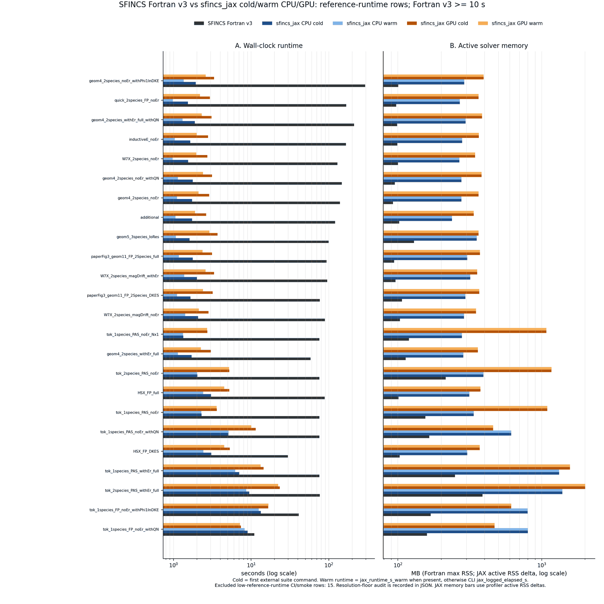

:orphan:

Validation against reference implementations
============================================

`dkx` validates outputs and solver behavior against a mature Fortran SFINCS
implementation.

.. note::

   The suite figures below are historical reports, not certification under
   the current :doc:`development_roadmap`. Their ``parity_ok`` labels do not
   establish independently checked residuals for every RHS, phase-space
   convergence, or uncontended timings. Re-admit individual cases through
   the current benchmark gates before using these ratios in a publication.
   Additional historical runtime/memory evidence lives in :doc:`performance`.

The historical vendored example-suite audit merged production-floor tokamak
reruns into these frozen reference suites:

- CPU: ``tests/scaled_example_suite_release_cpu_2026-05-08_production_tokamak``
- GPU: ``tests/scaled_example_suite_gpu_bounded_default_2026-05-08_lu3000_pas``

Those artifacts report:

- ``39/39 parity_ok`` on CPU,
- ``39/39 parity_ok`` on GPU,
- no strict mismatches,
- no ``jax_error``,
- no ``max_attempts``.

The merged reports also generate a historical runtime and memory
comparison. The plotted rows are restricted to cases whose SFINCS Fortran v3
reference runtime is at least ``10 s``; shorter rows remain CI parity/smoke
checks unless they are rerun at production-comparison resolution.

.. code-block:: bash

   python tools/publication_figures/generate_fortran_suite_benchmark_summary.py

   Historical benchmark generated from the profiled CPU/GPU suite reports. Panel A
   compares wall-clock runtime and Panel B compares active solver memory for the
   reference-runtime-window subset, with separate ``dkx`` cold and warm bars for
   CPU and GPU. Cases are ordered by best warm ``dkx`` speedup over the
   Fortran v3 runtime.
   The benchmark artifacts have median cold JAX/Fortran wall-clock ratios of about
   ``0.021x`` on CPU and ``0.037x`` on GPU for the plotted reference-runtime
   subset. Median process maximum-RSS ratios remain available in the JSON audit
   fields. The public memory bars use profiler active RSS deltas over the
   fixed Python/JAX/XLA baseline, and the median active-memory ratios are about
   ``2.89x`` on CPU and ``3.71x`` on GPU. The top runtime and memory cases are recorded in
   ``tools/publication_figures/artifacts/dkx_fortran_suite_benchmark_summary.json``.

Use :doc:`parity` for the scope map and comparison policy, :doc:`performance` for CPU/GPU
runtime and memory context, and :doc:`fortran_examples` for the exact-input frozen-fixture audit.

Building an auditable SFINCS reference
--------------------------------------

Use an isolated build of a pinned SFINCS commit. Preserve local build edits
separately: a Git commit alone does not identify an executable compiled from
a dirty checkout. Keep the environment lock, compiler output, build flags,
source patches and binary checksum with the external benchmark evidence,
not as large repository artifacts.

The office review uses SFINCS ``8df5453472e982df0f6ae005243ce38d57a83711``
and an isolated conda-forge environment with PETSc ``3.23.6``, MPICH,
``gfortran_linux-64``, Make, HDF5, NetCDF and NetCDF Fortran. Export the
resolved package URLs with ``micromamba list --explicit``; package names
and the PETSc version alone are not a reproducible toolchain lock.
The environment's ``include/petscconf.h`` reports
``PETSC_USE_REAL_DOUBLE``, ``PETSC_HAVE_MUMPS`` and
``PETSC_HAVE_SUPERLU_DIST``. These macros establish build availability;
successful runtime use must be checked independently.

The initial PAS smoke on this build passed with MUMPS at one and two MPI
ranks (original relative residuals ``2.64e-14`` and ``3.92e-14`` against
``1e-10``). SuperLU_DIST failed at both rank counts with segmentation
violations and residuals of approximately ``0.068`` and ``0.053`` despite
a reported linear convergence reason. This environment is therefore not
a qualified SuperLU_DIST reference under its default settings. Neither this
tiny smoke nor compilation establishes production accuracy or scaling.

The checked ``-O0 -g -fcheck=all -fbacktrace`` SFINCS build reproduced the
crash. Source inspection found an unconditional ``MatMumpsGetInfog`` call in
``solver.F90`` after ``SNESSolve``, using a factor handle initialized only for
MUMPS. An isolated reference patch replaces that call with:

.. code-block:: fortran

   factor_err = 0
   if (actualSolverType == MATSOLVERMUMPS) then
      call MatMumpsGetInfog(factorMat, 1, factor_err, ierr)
   end if

This patch eliminates the crash at both rank counts and preserves the MUMPS
result, but leaves the SuperLU_DIST residual failure unchanged. Label the
patched source and executable separately from upstream; this is a reference
build correction, not a DKX physics change.

A separate C/PETSc replay loads the same dumped matrix and manufactures
``b = A * ones``. At one/two ranks, MUMPS obtains relative residuals below
``8e-16``; default SuperLU_DIST returns approximately ``0.041`` and maximum
state error ``3.32`` despite a positive solve reason. This reproduces an
accuracy problem without SFINCS orchestration, but does not identify a
specific library defect. In this replay, disabling equilibration, selecting
natural column ordering, or enabling iterative refinement each restores a
small residual. Removing row permutation instead produces a failed solve.

For the patched SFINCS PAS case, the explicitly selected variants
``-mat_superlu_dist_colperm NATURAL`` and
``-mat_superlu_dist_equil false`` pass execution and original-residual checks
at both rank counts (approximately ``1.3e-14`` and ``9.6e-15`` respectively).
These are smoke-qualified configurations only. Natural ordering may increase
fill on larger matrices; retain ordering, scaling and refinement settings
with every measurement and recheck each original residual. A favorable
setting for this case is not grounds for a global default change.

With that environment activated, the review's SFINCS makefile configuration is:

.. code-block:: make

   include ${PETSC_DIR}/lib/petsc/conf/variables
   FC = ${CONDA_PREFIX}/bin/mpifort
   FLINKER = ${CONDA_PREFIX}/bin/mpifort
   LIBSTELL_DIR = mini_libstell
   LIBSTELL_FOR_SFINCS = mini_libstell/mini_libstell.a
   EXTRA_COMPILE_FLAGS = -I${CONDA_PREFIX}/include -O3 -ffree-line-length-none -fallow-argument-mismatch
   EXTRA_LINK_FLAGS = -L${CONDA_PREFIX}/lib -Wl,-rpath,${CONDA_PREFIX}/lib -lnetcdff -lnetcdf -lhdf5_fortran -lhdf5 -lhdf5_hl -lhdf5hl_fortran
   SFINCS_IS_A_BATCH_SYSTEM_USED = no

Save this as ``fortran/version3/makefiles/makefile.dkx_review`` in the
isolated source tree, set ``PETSC_DIR`` to the environment prefix and
``SFINCS_SYSTEM=dkx_review``, then run ``make -C fortran/version3 -j4``.
Retain compiler warnings, including legacy argument-mismatch diagnostics;
successful compilation does not establish bounds safety or physical accuracy.

Before profiling, run bounded one- and two-rank smoke cases for each backend.
Record the selected factor backend and PETSc convergence reasons, then
independently check every RHS against the original operator and deck tolerance.
Compare direct factorization of the same matrix separately from a complete
preconditioned solve: factoring the preconditioner and factoring the kinetic
Jacobian are different workloads. Separate assembly, ordering/symbolic analysis,
numeric factorization, triangular application and Krylov costs. Preserve failed
attempts and never use their short runtimes as successful reference timings.

The campaign runner accepts repeatable PETSc argument tokens, for example:

.. code-block:: bash

   python tools/benchmarks/parity_performance_matrix.py \
     --examples /path/to/cases --out /path/to/campaign.jsonl \
     --fortran-binary /path/to/qualified/sfincs \
     --fortran-petsc-opt=-mat_superlu_dist_colperm \
     --fortran-petsc-opt=NATURAL --petsc-profile

Each record retains ``fortran_petsc_opts`` and each reference run reports
``observed_factor_backends`` from ``-ksp_view``. An empty observed list means
no factor-package name was captured; requested options alone do not prove
which implementation ran. SFINCS or PETSc can override an option. The example
assumes a separately qualified SuperLU_DIST configuration and does not itself
select that backend.

Changed option tokens or recorded ``PETSC_`` environment settings invalidate
resume. This is not a complete toolchain lock: archive external option-file
contents and implicit PETSc configuration separately, and start a new campaign
if they change. Every configuration still requires the original-residual and
observable gates; a backend change can change accuracy as well as runtime.

Output comparison and transport reference limits
------------------------------------------------

The comparator requires matching explicit ``RHSMode`` values. Mode 2 compares
all entries of a 3-by-3 transport matrix; mode 3 requires a 2-by-2 matrix.
Profile mode compares final species columns and final current, allowing
different Newton-history lengths. Missing required outputs, incompatible
shapes and non-finite data are errors. Absolute and unrounded relative
differences are retained; irrelevant profile/transport datasets are excluded.
These schema checks do not replace original-residual or grid convergence gates.

A bounded office pilot of the analytic monoenergetic PAS fixture at
``Ntheta=Nzeta=9`` and ``Nxi=6,12`` rejects both MUMPS and naturally ordered
SuperLU_DIST at one/two MPI ranks: original relative residuals range from
``5.61e-8`` to ``1.59e-6`` against ``1e-12``. DKX passes the algebraic gate on
both inputs, but no pair is admitted for parity or performance claims.
The CPU allocations differ, so these runs also lack a matched timing budget.

A retained one-rank MUMPS repeat with ``-ksp_pc_side right``,
``-ksp_norm_type unpreconditioned`` and ``-ksp_atol 1e-30`` still fails.
For its second RHS, PETSc's estimated norm reaches ``1.54e-16`` while its
explicit true residual is ``7.70e-8`` (relative ``1.28e-7``), agreeing with
the independent dumped-matrix check. Changing norm semantics alone is
insufficient. The source of this finite-precision residual gap remains under
investigation; do not attribute it solely to a factorization package.
PETSc's `true-residual monitor
<https://petsc.org/release/manualpages/KSP/KSPMonitorTrueResidual/>`_
distinguishes the explicitly evaluated norm from an estimated norm.

Inputs, commands, pilot JSON/logs and the two retained diagnostic runs,
including matrices and states, are archived with SHA-256 checksums outside
Git in ``dkx-review-evidence-20260905/transport-reference-pilot``.
The campaign runner deletes its temporary raw solve files; only the separate
retained diagnostic runs preserve those files. R0 must add deliberate raw
failure retention and a complete environment lock before production sweeps.
