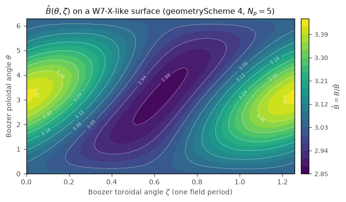

Geometry models and loading
===========================

`sfincs_jax` solves a radially local neoclassical kinetic problem on a single
flux surface, so geometry is not an incidental input: the magnetic field
strength :math:`\hat B(\theta,\zeta)`, its derivatives, the Jacobian factor
:math:`\hat D`, and the covariant/contravariant field components set the
coefficients of the streaming, mirror, :math:`E\times B`, and magnetic-drift
terms (:doc:`physics_reference`), as well as the flux-surface averages used in
every diagnostic.

All geometry is consolidated in the single canonical module
:mod:`sfincs_jax.magnetic_geometry`, which mirrors the Fortran v3 ``geometry.F90``
(``initializeGeometry`` / ``computeBHat_*`` / ``setBoozerCoordinates`` /
``computeBIntegrals``). Every geometry source produces the same normalized
container, :class:`sfincs_jax.magnetic_geometry.FluxSurfaceGeometry`, on a
``(Ntheta, Nzeta)`` grid.

Supported geometry schemes
--------------------------

.. list-table::
   :header-rows: 1
   :widths: 12 34 24 30

   * - ``geometryScheme``
     - Model
     - Coordinates
     - Constructor
   * - 1
     - Analytic three-helicity straight-field-line model
     - Boozer
     - ``FluxSurfaceGeometry.from_scheme(1, ...)``
   * - 2
     - LHD standard reduced model (Beidler 2011 table)
     - Boozer
     - ``from_scheme(2, ...)``
   * - 3
     - LHD inward-shifted reduced model
     - Boozer
     - ``from_scheme(3, ...)``
   * - 4
     - W7-X standard reduced model
     - Boozer
     - ``from_scheme(4, ...)``
   * - 5
     - VMEC ``wout`` equilibrium (ASCII or netCDF)
     - VMEC
     - ``from_vmec(...)`` via ``read_vmec_wout``
   * - 11
     - Boozer ``.bc`` file, stellarator-symmetric
     - Boozer
     - ``from_boozer(...)`` via ``read_boozer_bc``
   * - 12
     - Boozer ``.bc`` file, non-stellarator-symmetric
     - Boozer
     - ``from_boozer(...)`` via ``read_boozer_bc``
   * - 13
     - Namelist-supplied Boozer :math:`|B|` spectrum (optimization path)
     - Boozer
     - ``from_fourier(...)`` (differentiable)

The namelist entry point
:meth:`sfincs_jax.drift_kinetic.KineticOperator.from_namelist` builds geometry
schemes ``{1, 2, 3, 4, 5, 11, 12}`` directly from an ``input.namelist``. Scheme
13 is reachable through the differentiable ``from_fourier`` constructor in
Python; parsing ``bmnc``/``bmns`` amplitudes from a namelist is deferred (see
*Deferrals* below).

The analytic reduced models (schemes 2/3/4) use the harmonic tables from
`Beidler et al., Nucl. Fusion 51, 076001 (2011)
<https://doi.org/10.1088/0029-5515/51/7/076001>`_. For example, the W7-X
standard model (scheme 4) has five field periods and the field strength shown
below.

   :math:`\hat B(\theta,\zeta) = B/\bar B` on one field period of a W7-X-like
   flux surface, evaluated analytically from
   ``FluxSurfaceGeometry.from_scheme(4, ...)`` (``geometryScheme = 4``). The
   low-field "bean" region and the high-field lobes set the trapped-passing
   boundary that dominates low-collisionality transport. Reproduce with
   ``python docs/figures/generate_docs_figures.py``.

Boozer vs VMEC coordinates and the :math:`|B|` Fourier representation
---------------------------------------------------------------------

The analytic and ``.bc`` schemes work in **Boozer coordinates**, where the
field strength is a Fourier series in the Boozer angles

.. math::

   \hat B(\theta,\zeta)
   = \sum_{m,n} \hat B_{mn}\,\cos\!\bigl(m\theta - N_p\,n\,\zeta\bigr)
     \;\;[+\ \text{sine terms for non-symmetric fields}],

with :math:`N_p` the number of field periods (the ``n`` index does not carry the
period factor, matching the Fortran ``boozer_bmnc(m,n)`` convention). The
covariant components reduce to the flux functions
:math:`\hat B_\theta = \hat I`, :math:`\hat B_\zeta = \hat G` plus the field-
period structure, which is why Boozer geometry is the natural setting for the
drift coefficients and for monoenergetic (``RHSMode>3``) runs.

The retained harmonics follow the **representable-mode policy** imposed by the
discrete :math:`(\theta,\zeta)` grid, matching the v3 Jacobian assembly at a
given resolution:

.. math::

   0 \le m \le \left\lfloor \frac{N_\theta}{2}\right\rfloor,
   \qquad
   |n| \le \left\lfloor \frac{N_\zeta}{2}\right\rfloor,

with the expected Nyquist exclusions for sine/cosine pairs. This truncation
matters numerically: the resolved harmonic content changes both the geometric
coefficients and the trapped-passing boundary structure.

For ``geometryScheme = 5`` the equilibrium is a **VMEC** ``wout`` file. VMEC
stores the field in its own flux coordinates and on a radial mesh, so the loader
interpolates the requested surface (half/full-mesh with the v3 finite-difference
conventions) and reconstructs :math:`\hat B`, its derivatives, and the
:math:`|\nabla\hat\psi|^2` metric used by the classical fluxes and the
Sugama-form magnetic drifts.

The differentiable geometry path
--------------------------------

Two constructors are pure JAX and safe to ``jit`` / ``grad``:
``FluxSurfaceGeometry.from_scheme`` (analytic schemes 1--4) and
``FluxSurfaceGeometry.from_fourier`` (a Boozer :math:`|B|` spectrum). The latter
is the geometry entry point for optimization loops: gradients with respect to
the spectral amplitudes ``bmnc``/``bmns`` flow through :math:`\hat B`,
:math:`\hat D`, and the flux-surface averages.

.. code-block:: python

   import jax
   import jax.numpy as jnp
   from sfincs_jax.magnetic_geometry import FluxSurfaceGeometry

   theta = jnp.linspace(0.0, 2.0 * jnp.pi, 24, endpoint=False)
   zeta = jnp.linspace(0.0, 2.0 * jnp.pi / 5.0, 20, endpoint=False)

   # A tiny W7-X-like |B| spectrum: (m, n) modes and cosine amplitudes in Bbar units.
   m = jnp.asarray([0, 0, 1, 1])
   n = jnp.asarray([0, 1, 0, 1])
   bmnc = jnp.asarray([3.0, 0.05, -0.02, -0.04])

   def objective(amps):
       geom = FluxSurfaceGeometry.from_fourier(
           theta=theta, zeta=zeta, bmnc=amps, m=m, n=n,
           n_periods=5, iota=0.87, g_hat=-17.885, i_hat=0.0,
       )
       # e.g. minimize mirror-ripple-like content in |B|
       return jnp.mean((geom.b_hat - jnp.mean(geom.b_hat)) ** 2)

   value, grad = jax.value_and_grad(objective)(bmnc)

Grid truncation of unrepresentable modes is applied by zeroing amplitudes, which
keeps array shapes static under ``jit``. A worked differentiable-geometry
gradient check is in ``examples/autodiff/differentiable_geometry_gradients.py``.

The ``FluxSurfaceGeometry`` container
-------------------------------------

The operator does not carry an opaque geometry object; the solve path works with
explicitly normalized arrays collected in the frozen dataclass
:class:`sfincs_jax.magnetic_geometry.FluxSurfaceGeometry`. Its fields follow the
SFINCS v3 ``sfincsOutput.h5`` names (``BHat`` :math:`\to` ``b_hat``, ``DHat``
:math:`\to` ``d_hat``, ...):

- scalars: ``n_periods``, ``b0_over_bbar``, ``iota``, ``g_hat`` (``GHat``),
  ``i_hat`` (``IHat``);
- ``(Ntheta, Nzeta)`` arrays: ``b_hat`` and its :math:`\theta`/:math:`\zeta`
  derivatives, ``d_hat``, and the co/contravariant components
  ``b_hat_sub_theta/zeta``, ``b_hat_sup_theta/zeta`` with their derivatives;
- radial/drift arrays (populated from neighbouring surfaces for ``.bc``/VMEC
  input) and the optional ``gpsipsi`` :math:`=|\nabla\hat\psi|^2` metric.

Two flux-surface averages are methods on the container:
``vprime_hat`` (:math:`\hat V' = \sum_{ij} w^\theta_i w^\zeta_j/\hat D_{ij}`) and
``fsab_hat2`` (:math:`\langle\hat B^2\rangle`).

.. admonition:: Where in the code

   :mod:`sfincs_jax.magnetic_geometry`. Constructors:
   ``FluxSurfaceGeometry.from_scheme`` (analytic 1--4, magnetic_geometry.py),
   ``from_fourier`` (differentiable Boozer spectrum, magnetic_geometry.py),
   ``from_boozer`` (``.bc`` schemes 11/12), ``from_vmec`` (VMEC scheme 5).
   Readers: :func:`sfincs_jax.magnetic_geometry.read_boozer_bc` and
   :func:`sfincs_jax.magnetic_geometry.read_vmec_wout` are plain-NumPy pure
   functions kept separate from geometry construction. The namelist dispatch is
   ``_geometry_and_radial``.

VMEC workflow
-------------

For ``geometryScheme = 5`` the workflow is: pick a target radius, load the
``wout`` file, interpolate the flux-surface quantities onto the requested
:math:`(\theta,\zeta)` grid, and convert to the normalized SFINCS arrays. The
radial coordinate can be requested in any supported form (:math:`\psi`,
:math:`\psi_N`, :math:`\hat r`, :math:`r_N`) through ``VMECRadialOption``, but
the solve is always local to one surface.

VMEC-centered runs use either the namelist ``equilibriumFile`` entry or the
explicit ``wout_path=...`` / ``--wout-path`` override (:doc:`inputs`). Large
public VMEC fixtures such as ``wout_w7x_standardConfig.nc`` are release-hosted
rather than tracked in the repository; a namelist that references one by
basename resolves it through the path search in :doc:`inputs` and downloads the
checked release asset into the user cache when needed.

A JAX-native equilibrium producer (for example ``vmec_jax``) can be coupled
through the same scheme-5 formulas. A primal finite-beta end-to-end example is
``examples/vmec_jax_finite_beta/finite_beta_vmec_to_sfincs.py``, which builds a
``wout`` with ``vmec_jax``, evaluates scheme-5 geometry, scans ``Er`` on several
surfaces, and plots core-to-edge ambipolar ``Er`` and bootstrap current versus
:math:`\psi_N = r_N^2`.

Boozer ``.bc`` workflow
-----------------------

For ``geometryScheme = 11`` (stellarator-symmetric) and ``12``
(non-stellarator-symmetric) the loader reads the Boozer-coordinate Fourier
tables and evaluates the fields on the requested angular grid, applying the
representable-mode truncation above. Packaged examples can refer to
release-hosted ``.bc`` fixtures by basename (for example ``hsx3free.bc`` or
``w7x_standardConfig.bc``); the resolver verifies the release archive checksum
and each extracted-file checksum before use.

Radial coordinates and geometry-derived scales
----------------------------------------------

The geometry layer defines the conversion between the radial labels used
throughout `sfincs_jax`:

.. math::

   \psi, \qquad \psi_N = \psi/\psi_a, \qquad \hat r = r/\bar R, \qquad r_N = r/a,

selected by ``inputRadialCoordinate`` (surface) and
``inputRadialCoordinateForGradients`` (profile gradients). It also computes the
surface scalars that enter normalization and diagnostics:

.. math::

   \hat V' = \frac{dV}{d\hat\psi}, \qquad
   \langle \hat B^2 \rangle, \qquad \langle 1/\hat B^2 \rangle,

and the metric contractions used by the classical transport and NTV diagnostics.

Deferrals and non-modes
-----------------------

Stated plainly:

- **Scheme 13 via namelist**: the differentiable ``from_fourier`` spectrum path
  exists in Python, but parsing ``bmnc``/``bmns`` from an ``input.namelist`` is
  deferred; use the Python constructor for optimization loops.
- **Non-stellarator-symmetric VMEC**: ``geometryScheme = 12`` Boozer ``.bc``
  files are supported; a non-stellarator-symmetric VMEC equilibrium is routed to
  the legacy owner rather than the canonical stack.
- **Miller geometry**: there is no separate Miller-parameter public geometry
  mode. For tokamak studies the supported path is the analytic straight-field-
  line family (primarily ``geometryScheme = 1``).

Worked examples
---------------

- analytic tokamak (scheme 1): ``examples/getting_started/write_sfincs_output_tokamak.py``
- VMEC (scheme 5) with explicit ``wout_path``:
  ``examples/getting_started/write_sfincs_output_vmec.py``
- mixed Boozer + VMEC transport (schemes 11 and 5):
  ``examples/transport/transport_matrix_rhsmode2_scheme11_and_scheme5.py``
- differentiable geometry gradient check:
  ``examples/autodiff/differentiable_geometry_gradients.py``

For the input knobs see :doc:`inputs`; for the way geometry enters the DKE see
:doc:`physics_reference`, :doc:`system_equations`, and :doc:`numerics`.
