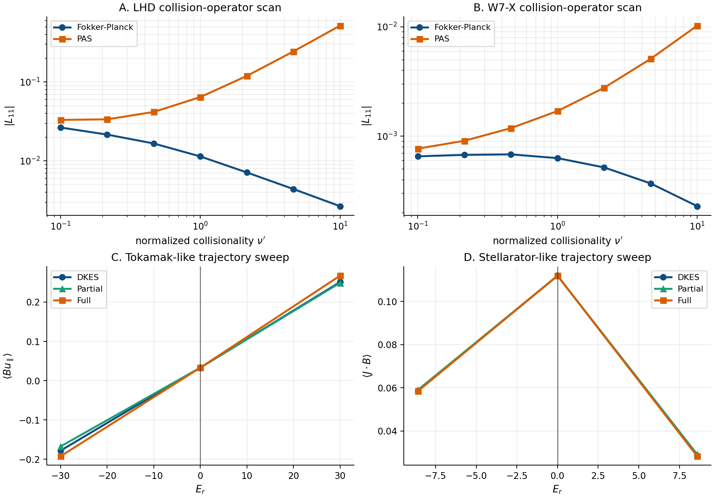

sfincs_jax
==========

`sfincs_jax` is a production neoclassical transport code for radially local
drift-kinetic calculations in stellarator and tokamak geometry. It combines
high-fidelity kinetic models, CPU/GPU execution, matrix-free numerics, and optional
differentiable solve paths in one codebase.

Current release snapshot
------------------------

On the current ``main`` branch:

- the full audited 39-case example suite runs cleanly on CPU and GPU,
- the default CLI and ``write-output`` path are validated across the release-facing scope with no practical or strict mismatches,
- the Python API can switch to differentiable solve paths when end-to-end sensitivities are needed,
- and the remaining open work is performance and memory tuning on the heaviest cases, not correctness of the documented workflows.

The active integration branch also contains opt-in mapped speed-grid evidence,
a QI seed-robustness runner, and a solver-path policy extraction. Those lanes are
documented as bounded integration work: mapped-grid artifacts currently cover PAS
RHSMode=2 smoke/reduced comparisons, the checked QI execute smoke now passes one
low-resolution seed on the default CLI path, and the solver-path refactor is a
policy reproducibility improvement rather than a new physics or performance
claim.

What this documentation covers
------------------------------

This manual is organized around the actual user and developer workflows:

- :doc:`installation`, :doc:`usage`, :doc:`examples`
- :doc:`physics_models`, :doc:`system_equations`, :doc:`geometry`
- :doc:`method`, :doc:`numerics`, :doc:`source_map`
- :doc:`inputs`, :doc:`outputs`, :doc:`applications`
- :doc:`parallelism`, :doc:`performance`, :doc:`testing`
- :doc:`fortran_comparison` and :doc:`references`

.. figure:: _static/figures/paper/sfincs_jax_fortran_suite_benchmark_summary.png
   :alt: Runtime and active-memory comparison for SFINCS Fortran v3 and sfincs_jax cold/warm CPU/GPU.
   :align: center
   :width: 90%

   Release benchmark for reference-runtime-window rows whose SFINCS Fortran v3
   reference runtime is at least ``10 s``. Panel A compares wall-clock runtime and Panel B
   compares active solver memory for SFINCS Fortran v3, ``sfincs_jax`` CPU
   cold/warm, and ``sfincs_jax`` GPU cold/warm. Fortran memory is process
   maximum RSS; JAX memory uses profiler RSS deltas over the fixed runtime
   baseline, with full process RSS retained in the JSON reports. Cases are
   ordered by best warm
   ``sfincs_jax`` speedup over the Fortran v3 runtime. Reproduce with
   ``examples/publication_figures/generate_fortran_suite_benchmark_summary.py``.

   Publication-facing validation dashboard from checked-in collisionality and
   electric-field sweep artifacts. Reproduce with
   ``examples/publication_figures/generate_validation_dashboard.py``.

.. figure:: _static/figures/transport_compile_runtime_cache_2x2.png
   :alt: Compile/runtime split with the persistent JAX cache across four reference cases.
   :align: center
   :width: 90%

   Compile-time versus warm steady-state runtime for representative transport cases.
   Reproduce with ``examples/performance/profile_transport_compile_runtime_cache.py``.

.. toctree::
   :maxdepth: 2
   :caption: Contents

   installation
   applications
   examples
   usage
   inputs
   outputs
   normalizations
   geometry
   method
   numerics
   source_map
   theory_from_upstream
   physics_models
   physics_reference
   system_equations
   parallelism
   performance
   performance_techniques
   adaptive_speed_grid
   testing
   validation_matrix
   paper_figures
   upstream_docs
   fortran_examples
   utils
   api
   fortran_comparison
   references
   contributing
   release_notes
   release_checklist
