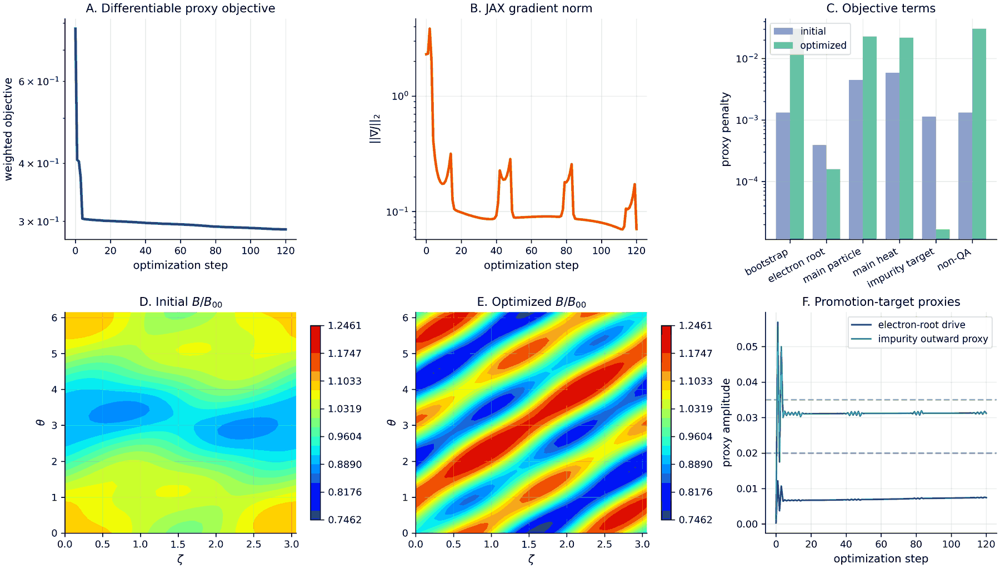
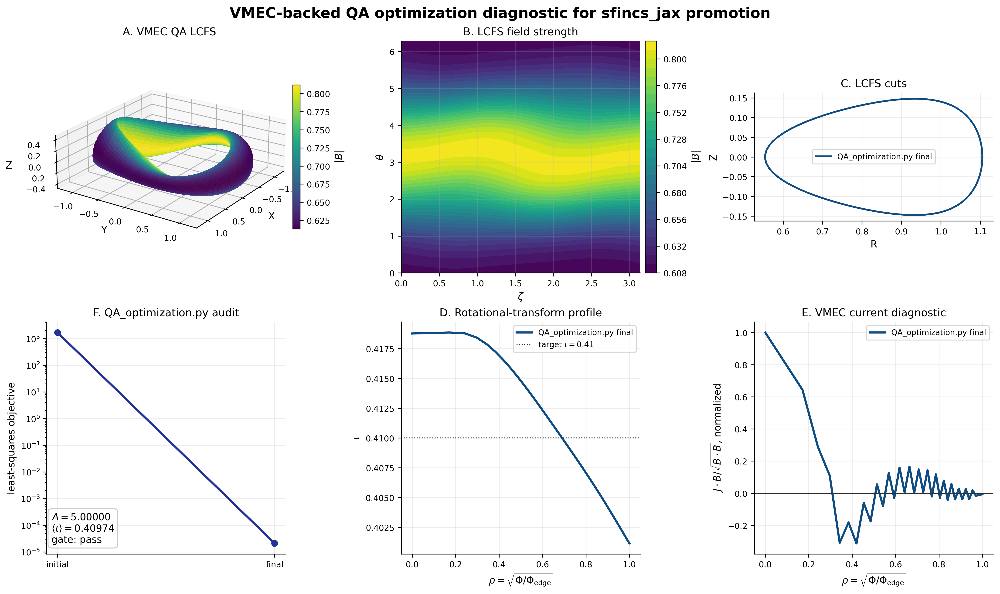
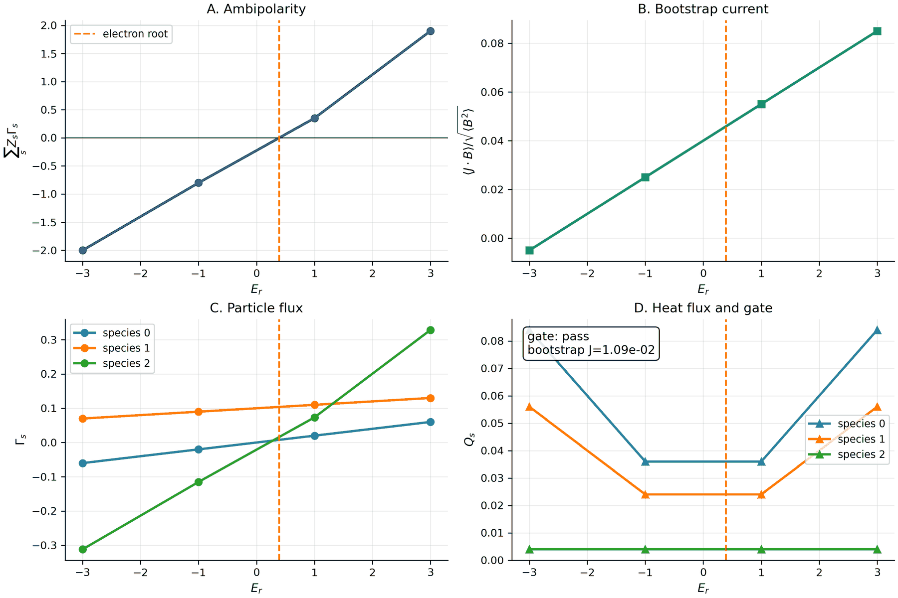
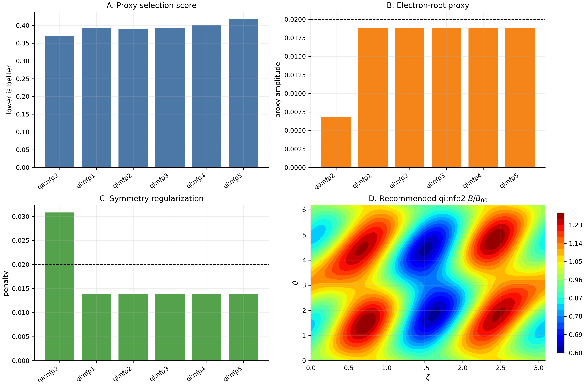
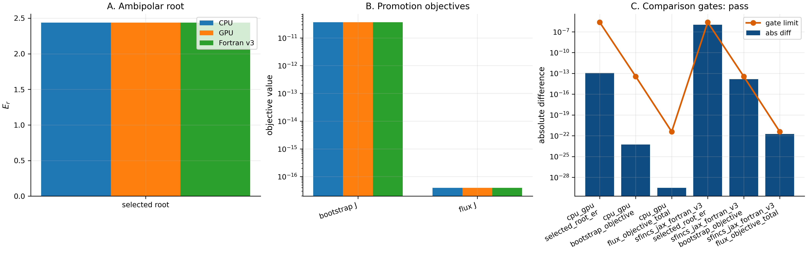
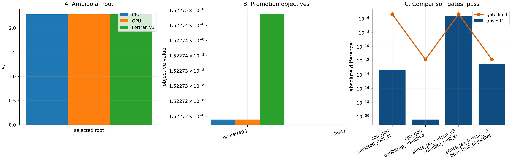
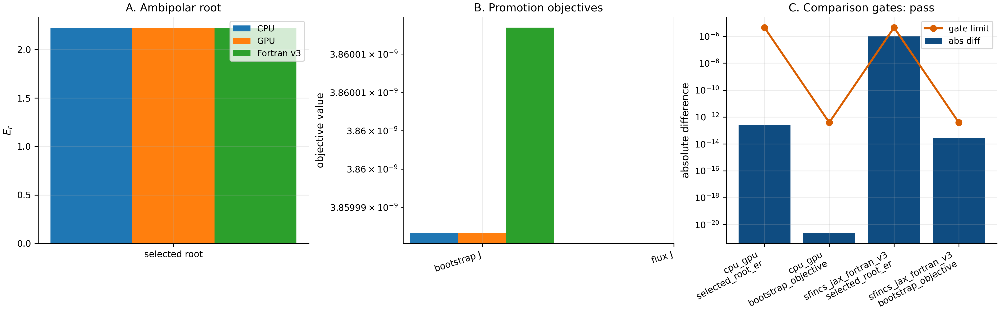
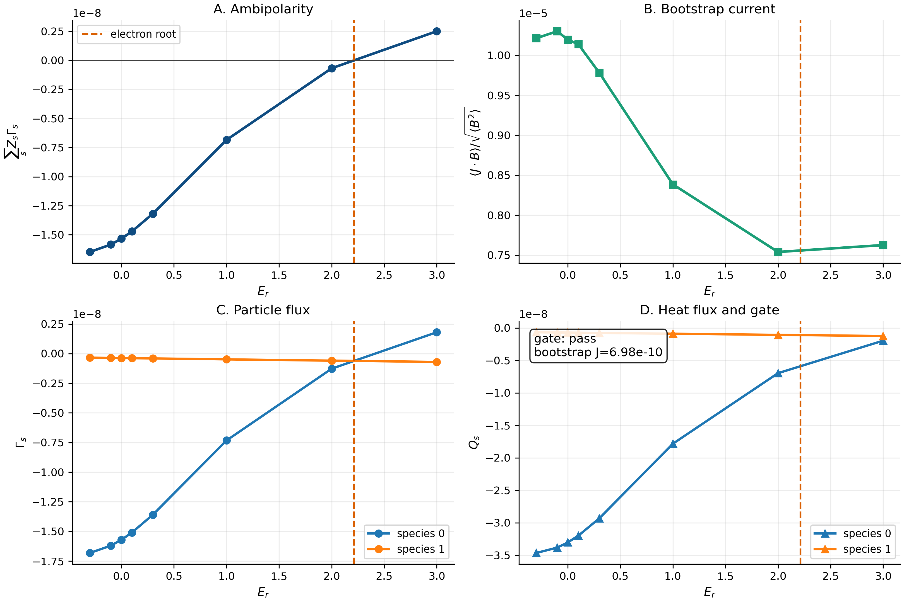

Optimization Workflows
======================

``sfincs_jax`` supports optimization workflows in two layers:

1. **Fast differentiable proxies** used inside a stellarator optimizer.
2. **High-fidelity kinetic gates** run on accepted designs before making a
   physics or publication claim.

This split is deliberate.  A full neoclassical solve at every VMEC objective
evaluation is usually too expensive, and it can make optimizer behavior depend
on solver tolerances, branch choices, and one-off failed scans.  The recommended
workflow is therefore to optimize with cheap JAX-native terms and promote only
selected candidates to full ``sfincs_jax`` scans.

The implementation lives in
``sfincs_jax.optimization_objectives`` and the public example is
``examples/optimization/qa_nfp2_sfincs_jax_objectives.py``.

QA nfp=2 Example
----------------

Run the fast QA optimization lane from the repository root:

.. code-block:: bash

   python examples/optimization/qa_nfp2_sfincs_jax_objectives.py \
     --objective balanced \
     --steps 120 \
     --out-dir docs/_static/figures/optimization \
     --stem qa_nfp2_sfincs_jax_optimization_lane

This produces a JSON provenance file plus PNG/PDF figures:

   Fast QA nfp=2 neoclassical optimization proxy.  Panels A-B show the
   differentiable JAX objective and gradient norm.  Panel C shows the proxy
   terms before and after optimization.  Panels D-E show the initial and
   optimized normalized Boozer field strength.  Panel F shows the proxy
   electron-root and impurity-flux target amplitudes.  This figure is an
   optimizer-design diagnostic, not a replacement for high-fidelity SFINCS
   kinetic validation.

Available objective presets are:

``bootstrap``
   Prioritize small bootstrap-current and QA-like geometry penalties.

``electron-root``
   Prioritize a proxy for a resolved positive ambipolar root.

``flux-selective``
   Penalize main-species heat and particle flux while encouraging outward
   impurity flux.

``balanced``
   Combine all terms in one tradeoff objective for demonstrations and optimizer
   smoke tests.

Bootstrap-Current Comparison Example
------------------------------------

The most direct way to teach the geometry-to-transport handoff is to start from
the real ``vmec_jax`` QA optimization output, verify that the VMEC equilibrium
has the intended finite rotational transform, and then use that equilibrium as
the input to kinetic ``sfincs_jax`` promotion scans.  The checked figure below
uses ``vmec_jax/examples/optimization/QA_optimization.py``, whose public target
is aspect ratio 5 and mean iota 0.41.

.. code-block:: bash

   python examples/optimization/qa_nfp2_bootstrap_current_comparison.py \
     --vmec-jax-root /path/to/vmec_jax \
     --out-dir docs/_static/figures/optimization \
     --stem qa_nfp2_bootstrap_current_comparison

   VMEC-backed QA nfp=2 optimization diagnostic.  Panels A-B show the real
   VMEC last-closed-flux-surface and LCFS field strength.  Panel C shows LCFS
   cuts.  Panel D shows the finite rotational-transform profile from the final
   VMEC ``wout``.  Panel E shows the VMEC equilibrium current diagnostic
   :math:`J\cdot B/\sqrt{B\cdot B}` versus normalized toroidal-flux radius.
   Panel F audits the ``QA_optimization.py`` objective and the final aspect/iota
   gate.  The checked artifact has aspect ratio 4.999999 and mean iota 0.4097.

Pass ``--comparison-result-dir`` to overlay a second ``vmec_jax`` result, for
example a QA run in which ``QA_optimization.py`` has been edited to add
``JDotB`` or ``RedlBootstrapMismatch`` to ``objective_tuples``.  That overlay is
accepted only if it reduces the VMEC current diagnostic while preserving the
finite-iota/aspect gate.  The plotted current profile is still not a completed
kinetic SFINCS current.  A candidate selected from this step should be promoted
with completed ``sfincs_jax scan-er`` outputs.  The corresponding kinetic
observable is ``FSABjHatOverRootFSAB2``, i.e.

For a directly editable script, use
``examples/optimization/QA_optimization_bootstrap_current.py``.  It follows the
same workflow as ``vmec_jax/examples/optimization/QA_optimization.py`` but sets
``MAX_MODE = 3`` for faster iteration and exposes
``INCLUDE_BOOTSTRAP_CURRENT_OBJECTIVE`` at the top of the file.  Run once with
the flag disabled, once with it enabled, then compare the two result
directories:

.. code-block:: bash

   SFINCS_JAX_VMEC_JAX_ROOT=/path/to/vmec_jax \
     python examples/optimization/QA_optimization_bootstrap_current.py

   python examples/optimization/qa_nfp2_bootstrap_current_comparison.py \
     --vmec-jax-root /path/to/vmec_jax \
     --qa-result-dir results/qa_opt_bootstrap_current_maxmode3/qa_only \
     --comparison-result-dir results/qa_opt_bootstrap_current_maxmode3/with_jdotb_current_objective

.. math::

   \frac{\langle\mathbf{J}\cdot\mathbf{B}\rangle}
        {\sqrt{\langle B^2\rangle}},

which should be checked together with residual convergence, CPU/GPU agreement,
radial and velocity-space convergence, and SFINCS Fortran v3 comparison when
the input lies in shared model scope.

Objective Terms
---------------

Bootstrap current
~~~~~~~~~~~~~~~~~

For a set of radial surfaces :math:`\rho_i`, the high-fidelity bootstrap-current
objective is

.. math::

   J_\mathrm{boot}
   =
   \sum_i w_i
   \left(
   \frac{\langle \mathbf{J}\cdot\mathbf{B}\rangle_i}
        {J_0 \sqrt{\langle B^2\rangle_i}}
   \right)^2 .

In ``sfincs_jax`` output this uses ``FSABjHatOverRootFSAB2``.  The helper
``bootstrap_current_objective`` evaluates the normalized least-squares penalty
from completed kinetic outputs or cached radial profiles.

Ambipolar electron root
~~~~~~~~~~~~~~~~~~~~~~~

The radial current used for ambipolarity is

.. math::

   j_r(E_r) = \sum_s Z_s \Gamma_s(E_r),

where :math:`\Gamma_s` is the radial particle flux for species :math:`s`.  An
electron-root objective requires a resolved positive root

.. math::

   j_r(E_r^\star)=0,\qquad E_r^\star > 0 .

The helper ``find_ambipolar_roots`` sorts the scan, finds bracketed roots, and
classifies each root as ion, near-zero, or electron.  The helper
``electron_root_penalty`` returns zero only when a positive root exists with a
finite local slope.  This avoids promoting flat or unbracketed ambipolar curves
as meaningful electron-root evidence.

Flux selectivity
~~~~~~~~~~~~~~~~

For main species :math:`m` and an impurity species :math:`Z`, the selected flux
objective is

.. math::

   J_\mathrm{flux}
   =
   w_\Gamma \left\langle \Gamma_m^2 \right\rangle
   +
   w_Q \left\langle Q_m^2 \right\rangle
   +
   w_Z
   \left[
   \max\left(0,\Gamma_Z^\mathrm{target}-\Gamma_Z^\mathrm{out}\right)
   \right]^2 .

The last term is written as a shortfall penalty rather than an unbounded
``maximize impurity flux`` objective.  This keeps the optimizer well-scaled and
prevents it from increasing impurity transport at any cost.

Differentiable Proxy
--------------------

The public proxy path uses a Boozer spectrum

.. math::

   B(\theta,\zeta) =
   \sum_k B_k \cos(m_k\theta - n_k\zeta)

with the :math:`B_{00}` component fixed.  For QA optimization, terms with
:math:`n_k \ne 0` are treated as non-QA content.  The differentiable proxy
combines field-strength variance, angular roughness, non-QA spectral energy,
and smooth hinge penalties for electron-root and impurity-flux targets.

The proxy layer is evaluated with JAX and checked by finite differences through
``qa_proxy_gradient_gate``.  It is appropriate for optimizer steering, unit
tests, and rapid design iteration.  It is not a high-fidelity kinetic transport
claim, and it does not make the later promoted kinetic ``scan-er`` outputs
differentiable.

High-Fidelity Promotion Gates
-----------------------------

Accepted designs should be promoted to actual ``sfincs_jax`` solves before
publication or engineering decisions.  Real promotion starts only after the
candidate has completed ``sfincs_jax scan-er`` outputs containing
``sfincsOutput.h5`` files for the requested electric-field grid.  The minimum
promotion evidence is:

- Same-profile ``sfincs_jax`` electric-field scans over each selected radius.
- Ambipolar root bracketing with a positive electron root when requested.
- Bootstrap-current normalization audit using ``FSABjHatOverRootFSAB2``.
- Particle, heat, and impurity flux sign-convention audit.
- Linear residual convergence and solver-path provenance.
- CPU/GPU agreement for selected final designs.
- SFINCS Fortran v3 comparison when the case lies in the shared model scope.

The helper ``kinetic_validation_gate`` records residual and CPU/GPU agreement
checks for promoted designs.  For production optimization campaigns, store the
JSON summary generated by each proxy run together with the completed SFINCS
scan outputs and solver traces.  The synthetic scan generated when
``evaluate_sfincs_jax_promotion_scan.py`` is run without ``--scan-dir`` is only
a plotting/API demonstration and must not be treated as promotion evidence.

Real Promotion Checklist
~~~~~~~~~~~~~~~~~~~~~~~~

Replace the paths and electric-field grid with the accepted candidate's actual
VMEC geometry, profiles, species, radial surface, and campaign tolerances.  The
promotion boundary is the first command that evaluates a completed ``scan-er``
directory; anything before that is proxy provenance or scan planning.

.. code-block:: bash

   mkdir -p runs/qa_candidate01/proxy runs/qa_candidate01/audit
   python examples/optimization/qa_nfp2_sfincs_jax_objectives.py \
     --objective balanced \
     --steps 120 \
     --out-dir runs/qa_candidate01/proxy \
     --stem candidate01_proxy
   python examples/optimization/launch_sfincs_jax_candidate_scan.py \
     --proxy-summary runs/qa_candidate01/proxy/candidate01_proxy.json \
     --input runs/qa_candidate01/input_r0p50.namelist \
     --out-dir runs/qa_candidate01/scan_cpu/r0p50 \
     --er-min -3 \
     --er-max 3 \
     --n-er 7 \
     --jobs 4 \
     --impurity-species-index 2 \
     --target-impurity-flux 0.01

For production evidence, the one-command campaign wrapper is preferred because
it records the CPU, GPU, optional Fortran, audit, and comparison commands in one
JSON plan before launching any expensive solves:

.. code-block:: bash

   python examples/optimization/run_promotion_evidence_campaign.py \
     --input runs/qa_candidate01/input_r0p50.namelist \
     --out-dir runs/qa_candidate01/evidence_r0p50 \
     --values -3 -2 -1 0 1 2 3 \
     --run-cpu \
     --run-gpu \
     --gpu-device 0 \
     --run-fortran \
     --fortran-exe /path/to/sfincs \
     --jobs 4 \
     --impurity-species-index 2 \
     --target-impurity-flux 0.01

Add ``--dry-run`` to write ``promotion_evidence_plan.json`` without executing
the scans.  The manual commands below are equivalent and are useful when a
cluster scheduler should own each lane separately.  Fortran-v3 HDF5 files often
do not contain the JAX linear-residual datasets, so the campaign wrapper allows
missing residuals only for the Fortran lane by default; JAX CPU/GPU promotion
still requires residual diagnostics unless the user explicitly relaxes the
standalone evaluator with ``--allow-missing-residuals``.

.. code-block:: bash

   JAX_PLATFORM_NAME=cpu sfincs_jax scan-er \
     --input runs/qa_candidate01/input_r0p50.namelist \
     --out-dir runs/qa_candidate01/scan_cpu/r0p50 \
     --values -3 -2 -1 0 1 2 3 \
     --compute-solution \
     --skip-existing \
     --jobs 4
   python examples/optimization/evaluate_sfincs_jax_promotion_scan.py \
     --scan-dir runs/qa_candidate01/scan_cpu/r0p50 \
     --out-dir runs/qa_candidate01/audit \
     --stem candidate01_r0p50_cpu \
     --require-electron-root \
     --impurity-species-index 2 \
     --target-impurity-flux 0.01
   CUDA_VISIBLE_DEVICES=0 JAX_PLATFORM_NAME=gpu sfincs_jax scan-er \
     --input runs/qa_candidate01/input_r0p50.namelist \
     --out-dir runs/qa_candidate01/scan_gpu/r0p50 \
     --values -3 -2 -1 0 1 2 3 \
     --compute-solution \
     --skip-existing \
     --jobs 1
   python examples/optimization/evaluate_sfincs_jax_promotion_scan.py \
     --scan-dir runs/qa_candidate01/scan_gpu/r0p50 \
     --out-dir runs/qa_candidate01/audit \
     --stem candidate01_r0p50_gpu \
     --require-electron-root \
     --impurity-species-index 2 \
     --target-impurity-flux 0.01
   python examples/optimization/compare_sfincs_jax_promotion_runs.py \
     --cpu runs/qa_candidate01/audit/candidate01_r0p50_cpu.json \
     --gpu runs/qa_candidate01/audit/candidate01_r0p50_gpu.json \
     --out-dir runs/qa_candidate01/audit \
     --stem candidate01_r0p50_comparison

If the case is in shared SFINCS Fortran v3 scope, add a Fortran-derived scan
audit before the final comparison:

.. code-block:: bash

   for run_dir in runs/qa_candidate01/scan_cpu/r0p50/Er*; do
     er_dir=$(basename "${run_dir}")
     mkdir -p "runs/qa_candidate01/scan_fortran/r0p50/${er_dir}"
     sfincs_jax run-fortran \
       --exe /path/to/sfincs \
       --input "${run_dir}/input.namelist" \
       --workdir "runs/qa_candidate01/scan_fortran/r0p50/${er_dir}"
   done
   python examples/optimization/evaluate_sfincs_jax_promotion_scan.py \
     --scan-dir runs/qa_candidate01/scan_fortran/r0p50 \
     --out-dir runs/qa_candidate01/audit \
     --stem candidate01_r0p50_fortran \
     --require-electron-root \
     --impurity-species-index 2 \
     --target-impurity-flux 0.01
   python examples/optimization/compare_sfincs_jax_promotion_runs.py \
     --cpu runs/qa_candidate01/audit/candidate01_r0p50_cpu.json \
     --gpu runs/qa_candidate01/audit/candidate01_r0p50_gpu.json \
     --fortran runs/qa_candidate01/audit/candidate01_r0p50_fortran.json \
     --out-dir runs/qa_candidate01/audit \
     --stem candidate01_r0p50_comparison

Promotion Scan Example
~~~~~~~~~~~~~~~~~~~~~~

After running an electric-field scan for an accepted candidate, evaluate it with:

.. code-block:: bash

   python examples/optimization/evaluate_sfincs_jax_promotion_scan.py \
     --scan-dir /path/to/completed/scan-er-directory \
     --out-dir promotion_audit \
     --stem candidate01_promotion

The script reads each completed ``sfincsOutput.h5`` file, computes
:math:`\sum_s Z_s\Gamma_s(E_r)`, classifies ambipolar roots, audits bootstrap
current and species fluxes, and checks linear residual diagnostics.  If
``--scan-dir`` is omitted, it creates a tiny synthetic SFINCS-style scan so the
plotting and gate logic can be demonstrated without a long solve.  That
synthetic mode is demo-only and cannot promote an optimization candidate.

   Promotion dashboard for an optimization candidate.  Panel A shows the
   ambipolar radial-current bracket and selected electron root.  Panel B shows
   the bootstrap-current observable.  Panels C-D show particle and heat fluxes
   by species, together with the promotion gate status.  Real optimization
   campaigns should use completed ``sfincs_jax scan-er`` outputs rather than the
   synthetic demonstration scan used to generate this documentation artifact.

Practical End-To-End Lane
-------------------------

Use this lane when a QA optimizer has produced a small set of accepted
``vmec_jax`` candidates and you want a reproducible path from proxy evidence to
kinetic validation.  The repository does not make ``vmec_jax`` or
``booz_xform_jax`` hard dependencies; a production campaign may run the VMEC
optimization in a separate checkout and hand this repository an accepted
``wout`` plus the SFINCS profiles, species, radial surface, and resolution.

The scalar optimized in the proxy stage has the same role as the terms above:

.. math::

   J_\mathrm{proxy}(\mathbf{a})
   =
   w_B \operatorname{var}(\widehat B)
   + w_R \|\nabla_{\theta,\zeta}\widehat B\|_2^2
   + w_\mathrm{QA}\sum_{k:n_k\ne 0} a_k^2
   + w_e \left[\max(0,d_e^\mathrm{target}-d_e(\mathbf{a}))\right]^2
   + w_Z \left[\max(0,\Gamma_Z^\mathrm{target}
     -\Gamma_Z^\mathrm{out}(\mathbf{a}))\right]^2 .

Here :math:`\mathbf{a}` are the active Boozer-spectrum coefficients and
:math:`\widehat B = B/B_{00}`.  This objective is an optimizer-steering scalar,
not a kinetic solve.  It can rank candidates and record a gradient/provenance
gate, but it cannot by itself establish ambipolar roots, bootstrap-current
accuracy, flux sign conventions, CPU/GPU agreement, or Fortran parity.

1. Run the optional VMEC/Boozer preflight and proxy-gradient handoff.

   The status command is safe when optional geometry packages are absent:

   .. code-block:: bash

      python examples/optimization/vmec_jax_workflow_status.py --json

   For an accepted ``vmec_jax`` candidate with a written ``wout`` file, persist
   the file-backed proxy-gradient provenance:

   .. code-block:: bash

      mkdir -p runs/qa_candidate01/proxy
      python examples/autodiff/vmec_jax_to_boozer_sfincs_pipeline.py \
        --wout /path/to/vmec_jax/run/wout_candidate01.nc \
        --mboz 3 \
        --nboz 3 \
        --surface 0.5 \
        --steps 0 \
        --summary-json runs/qa_candidate01/proxy/vmec_boozer_proxy_gradient.json

   For the repository-local QA nfp=2 proxy smoke test, run:

   .. code-block:: bash

      python examples/optimization/qa_nfp2_sfincs_jax_objectives.py \
        --objective balanced \
        --steps 120 \
        --out-dir runs/qa_candidate01/proxy \
        --stem candidate01_proxy

   The resulting ``candidate01_proxy.json`` is provenance for the proxy
   objective, not a SFINCS input file.  It should travel with the accepted
   candidate so later audits can see the weights, final proxy coefficients,
   finite-difference gradient gate, and required promotion plan.

2. Build the SFINCS input and run the high-fidelity electric-field scan.

   Create a normal SFINCS ``input.namelist`` for the accepted VMEC geometry and
   selected radial surface.  The input must encode the same profiles and species
   used for the physics claim.  To create an auditable scan plan without
   starting a long run, use:

   .. code-block:: bash

      python examples/optimization/launch_sfincs_jax_candidate_scan.py \
        --proxy-summary runs/qa_candidate01/proxy/candidate01_proxy.json \
        --input runs/qa_candidate01/input_r0p50.namelist \
        --out-dir runs/qa_candidate01/scan_cpu/r0p50 \
        --er-min -3 \
        --er-max 3 \
        --n-er 7 \
        --jobs 4 \
        --impurity-species-index 2 \
        --target-impurity-flux 0.01

   This writes ``candidate_scan_plan.json`` with the exact ``scan-er`` command
   and the follow-up promotion-audit command.  Add ``--execute`` only when you
   are ready to launch the scan.  The equivalent direct command is:

   .. code-block:: bash

      mkdir -p runs/qa_candidate01/scan_cpu/r0p50
      JAX_PLATFORM_NAME=cpu sfincs_jax scan-er \
        --input runs/qa_candidate01/input_r0p50.namelist \
        --out-dir runs/qa_candidate01/scan_cpu/r0p50 \
        --values -3 -2 -1 0 1 2 3 \
        --compute-solution \
        --skip-existing \
        --jobs 4

   For ``RHSMode=2`` or ``RHSMode=3`` transport-matrix inputs, use
   ``--compute-transport-matrix`` instead of ``--compute-solution``:

   .. code-block:: bash

      JAX_PLATFORM_NAME=cpu sfincs_jax scan-er \
        --input runs/qa_candidate01/input_r0p50.namelist \
        --out-dir runs/qa_candidate01/scan_cpu/r0p50 \
        --min -3 \
        --max 3 \
        --n 13 \
        --compute-transport-matrix \
        --skip-existing \
        --jobs 4

   The scan directory contains subdirectories such as ``Er1/`` and
   ``Er-1/``.  Each completed point must contain ``sfincsOutput.h5``.  The
   ambipolar curve audited downstream is

   .. math::

      j_r(E_r) = \sum_s Z_s\Gamma_s(E_r),
      \qquad
      j_r(E_r^\star)=0 .

   A claimed electron root additionally needs :math:`E_r^\star>0` and a
   bracketed sign change with finite local slope.

3. Audit the promoted scan.

   The promotion audit reads the completed scan outputs, computes the
   ambipolar roots, checks bootstrap-current and flux observables, and records
   residual diagnostics:

   .. code-block:: bash

      python examples/optimization/evaluate_sfincs_jax_promotion_scan.py \
        --scan-dir runs/qa_candidate01/scan_cpu/r0p50 \
        --out-dir runs/qa_candidate01/audit \
        --stem candidate01_r0p50_cpu \
        --require-electron-root

   If you also want upstream-style ambipolar root files in the scan directory,
   run:

   .. code-block:: bash

      sfincs_jax ambipolar-solve \
        --scan-dir runs/qa_candidate01/scan_cpu/r0p50 \
        --n-fine 1000

   For ``RHSMode=1`` inputs where the root should be solved directly instead
   of inferred from a precomputed scan, use the in-process Brent driver:

   .. code-block:: bash

      sfincs_jax ambipolar \
        --input runs/qa_candidate01/input_r0p50.namelist \
        --out-dir runs/qa_candidate01/ambipolar_cpu/r0p50 \
        --er-min -3 --er-max 3 --er-initial 0

   This direct path writes per-evaluation ``sfincsOutput.h5`` files and solver
   traces, then summarizes the selected solver lane, residual, timing, active
   size, and cache provenance in ``ambipolar_result.json``.

   Passing this audit means the specific completed scan has internally
   consistent promotion evidence.  It does not imply convergence with respect
   to kinetic resolution, radial grid choice, profile uncertainty, or optimizer
   robustness unless those studies are run and stored separately.

4. Compare CPU, GPU, and Fortran evidence at selected final points.

   Re-run the same scan on a GPU-capable installation:

   .. code-block:: bash

      mkdir -p runs/qa_candidate01/scan_gpu/r0p50
      CUDA_VISIBLE_DEVICES=0 JAX_PLATFORM_NAME=gpu sfincs_jax scan-er \
        --input runs/qa_candidate01/input_r0p50.namelist \
        --out-dir runs/qa_candidate01/scan_gpu/r0p50 \
        --values -3 -2 -1 0 1 2 3 \
        --compute-solution \
        --skip-existing \
        --jobs 1

   Compare matching CPU/GPU scan points near the selected ambipolar root:

   .. code-block:: bash

      ER_DIR=Er1
      sfincs_jax compare-h5 \
        --a runs/qa_candidate01/scan_cpu/r0p50/${ER_DIR}/sfincsOutput.h5 \
        --b runs/qa_candidate01/scan_gpu/r0p50/${ER_DIR}/sfincsOutput.h5 \
        --rtol 1e-8 \
        --atol 1e-10 \
        --show-all

   When the case lies in the shared ``sfincs_jax``/SFINCS Fortran v3 model
   scope and a compiled Fortran executable is available, run the same selected
   point through Fortran and compare the HDF5 outputs:

   .. code-block:: bash

      mkdir -p runs/qa_candidate01/fortran/r0p50_${ER_DIR}
      sfincs_jax run-fortran \
        --input runs/qa_candidate01/scan_cpu/r0p50/${ER_DIR}/input.namelist \
        --workdir runs/qa_candidate01/fortran/r0p50_${ER_DIR}
      sfincs_jax compare-h5 \
        --a runs/qa_candidate01/scan_cpu/r0p50/${ER_DIR}/sfincsOutput.h5 \
        --b runs/qa_candidate01/fortran/r0p50_${ER_DIR}/sfincsOutput.h5 \
        --rtol 1e-8 \
        --atol 1e-10 \
        --show-all

   A compact way to describe the numerical comparison is

   .. math::

      \delta_y(A,B)
      =
      \frac{\|y_A-y_B\|_\infty}
           {\max(\|y_B\|_\infty, y_\mathrm{floor})}.

   Set the actual tolerances in the campaign record before looking at the
   results, and keep them observable-specific.  CPU/GPU agreement establishes
   backend reproducibility for the compared inputs.  Fortran agreement
   establishes reference parity only for keys and physics options supported by
   both implementations.  Neither comparison upgrades a proxy-only candidate to
   a publication claim unless the promoted kinetic scans, convergence evidence,
   and claim-specific tolerances are all archived.

   Once the CPU, GPU, and optional Fortran promotion JSON files exist, create a
   compact comparison report:

   .. code-block:: bash

      python examples/optimization/compare_sfincs_jax_promotion_runs.py \
        --cpu runs/qa_candidate01/audit/candidate01_r0p50_cpu.json \
        --gpu runs/qa_candidate01/audit/candidate01_r0p50_gpu.json \
        --fortran runs/qa_candidate01/audit/candidate01_r0p50_fortran.json \
        --out-dir runs/qa_candidate01/audit \
        --stem candidate01_r0p50_comparison

   .. figure:: _static/figures/optimization/qa_nfp2_sfincs_jax_promotion_comparison_w7x_reduced_real.png
      :alt: CPU/GPU/Fortran promotion-comparison report.
      :align: center
      :width: 90%

      Real reduced-W7-X promotion comparison generated from separate completed
      CPU, GPU, and SFINCS Fortran v3 promotion JSON files.  The scan used the
      shared PAS/DKES two-species model scope with
      :math:`N_\theta=7`, :math:`N_\zeta=11`, :math:`N_\xi=10`, and
      :math:`N_x=4`.  The selected root is an ion root,
      :math:`E_r=-33.714544096`, so this artifact validates backend/reference
      agreement for the promotion machinery and shared model outputs; it is not
      an electron-root or finite-beta QA optimization claim.

   The reduced-W7-X comparison passed the default strict gates without relaxed
   tolerances: CPU/GPU root, bootstrap-objective, and flux-objective relative
   differences were below :math:`5\times 10^{-13}`, and the SFINCS-JAX versus
   Fortran-v3 differences were below :math:`8\times 10^{-11}`.  The checked
   demo/format-only comparison remains available as
   ``qa_nfp2_sfincs_jax_promotion_comparison.*`` for fast documentation and
   script-layout regression checks.

   .. figure:: _static/figures/optimization/qa_nfp2_finite_beta_electron_root_promotion_comparison.png
      :alt: Finite-beta QA CPU/GPU/Fortran positive electron-root promotion comparison.
      :align: center
      :width: 90%

      Finite-beta QA positive-electron-root promotion comparison generated
      from separate CPU, GPU, and SFINCS Fortran v3 promotion JSON files.  This
      low-resolution validation used a VMEC finite-beta QA geometry,
      :math:`N_\theta=7`, :math:`N_\zeta=7`, :math:`N_\xi=5`,
      :math:`N_L=4`, :math:`N_x=4`, ``solverTolerance = 1e-8``,
      ``dNHatdrHats = (0, -5)``, and ``dTHatdrHats = (0, -10)``.  All three
      lanes selected a positive electron root in the bracket
      :math:`E_r\in[0.25,0.5]`; the JAX CPU/GPU roots agreed to
      :math:`3.1\times10^{-13}` absolute difference, and the SFINCS-JAX versus
      Fortran-v3 root differed by :math:`7.1\times10^{-8}`.  The comparison
      used explicit promotion tolerances ``selected_root_er_atol = 1e-7``,
      ``bootstrap_objective_rtol = 1e-5``, and
      ``flux_objective_total_rtol = 1e-6``.  This closes the first finite-beta
      QA positive-electron-root promotion artifact; production-resolution
      radial/profile convergence remains a separate validation requirement
      before making an engineering or publication claim about an optimized
      configuration.

   .. figure:: _static/figures/optimization/qa_nfp2_finite_beta_electron_root_convergence_ladder.png
      :alt: Finite-beta QA electron-root convergence ladder.
      :align: center
      :width: 90%

      Bounded finite-beta QA electron-root convergence ladder at
      :math:`r_N=0.5`.  The first tier is the checked
      :math:`7\times7\times5\times4` CPU/GPU/Fortran promotion artifact above;
      the second tier is a completed :math:`9\times9\times7\times4`
      CPU/GPU/Fortran scan.  The intermediate tier remains backend-clean:
      CPU/GPU root agreement is :math:`8.94\times10^{-14}` and
      SFINCS-JAX/Fortran-v3 root agreement is :math:`1.91\times10^{-7}`.  The
      root moved from :math:`E_r=0.4136092671` to
      :math:`E_r=0.4006366757`, so the ladder is useful evidence but not a
      final physics claim.  The summary is intentionally marked ``deferred``
      because the final checked tier is below the declared production floor
      :math:`N_\theta=25`, :math:`N_\zeta=51`, :math:`N_\xi=100`,
      :math:`N_L=4`, :math:`N_x=4`.

   A follow-up medium-resolution solver-policy probe now covers the next
   non-dense rung for this same finite-beta QA deck.  At
   :math:`N_\theta=17`, :math:`N_\zeta=21`, :math:`N_\xi=12`,
   :math:`N_L=4`, :math:`N_x=4` with two species, ``solve_method="auto"``
   selects ``xblock_sparse_pc_gmres``.  The CPU run wrote output in about
   7 seconds, required 139 matrix-vector products, and reached a true residual
   :math:`1.44\times10^{-13}` against a target
   :math:`2.71\times10^{-13}`.  The same point matched the written Fortran-v3
   output to better than :math:`1.6\times10^{-6}` relative over the
   bootstrap-current, flow, particle-flux, and heat-flux observables.  This
   validates the bounded medium-resolution solver policy and keeps the
   production floor honest: the full
   :math:`25\times51\times100\times4` ladder has
   :math:`1{,}020{,}004` active unknowns, so it still requires a larger
   non-dense campaign before being promoted as a production convergence claim.

   The solver-policy audit is stored in
   ``docs/_static/figures/optimization/qa_nfp2_finite_beta_electron_root_xblock_policy_probe.json``.

   The next above-window rung,
   :math:`N_\theta=21`, :math:`N_\zeta=25`, :math:`N_\xi=14`,
   :math:`N_L=4`, :math:`N_x=4`, has :math:`58{,}804` active unknowns and was
   run on local CPU, one office GPU, and SFINCS Fortran v3.  The CPU path
   converged in 18.8 seconds wall time, the GPU path converged in 86.0 seconds
   wall time, and both reached the requested true residual.  CPU/GPU agreement
   was better than :math:`2.7\times10^{-8}` relative on current and flux
   observables; GPU/Fortran-v3 agreement was better than
   :math:`2.7\times10^{-6}` relative.  The default multispecies non-dense
   x-block policy is now bounded to this measured window
   (:math:`30{,}000 \le n_\mathrm{active} \le 60{,}000`,
   :math:`12 \le N_\xi \le 14`) and intentionally does not cover the
   million-unknown production floor.

   The above-window solver-policy audit is stored in
   ``docs/_static/figures/optimization/qa_nfp2_finite_beta_electron_root_xblock_policy_probe_21x25x14.json``.

   The next medium rung,
   :math:`N_\theta=25`, :math:`N_\zeta=31`, :math:`N_\xi=16`,
   :math:`N_L=4`, :math:`N_x=4`, has :math:`99{,}204` active unknowns and
   estimated dense storage of about 73 GiB.  Forced ``xblock_sparse_pc_gmres``
   converged on local CPU in 68.1 seconds wrapper time with residual
   :math:`2.74\times10^{-14}` against target :math:`4.00\times10^{-13}`.
   The same input converged on one office GPU in 232 seconds wrapper time with
   residual :math:`1.75\times10^{-13}`.  CPU/GPU agreement was better than
   :math:`3.2\times10^{-8}` relative on current and flux observables, and
   GPU/Fortran-v3 agreement was better than :math:`4.5\times10^{-7}` relative
   on those observables.  Since this path uses host sparse factors, it is a
   correctness-safe GPU route but not a GPU-performance claim at this size; the
   CPU path is faster for this rung.  The default multispecies non-dense
   x-block policy is now bounded to
   :math:`30{,}000 \le n_\mathrm{active} \le 100{,}000`,
   :math:`12 \le N_\xi \le 16`.

   The medium-rung solver-policy audit is stored in
   ``docs/_static/figures/optimization/qa_nfp2_finite_beta_electron_root_xblock_policy_probe_25x31x16.json``.

   These checked finite-beta artifacts are QA electron-root evidence only.  They
   do not close production-resolution QI seed ladders, true differentiable
   device-QI, or a generic QI electron-root optimization claim.  Treat the
   non-dense x-block policy window as bounded to the archived
   :math:`17\times21\times12\times4`,
   :math:`21\times25\times14\times4`, and
   :math:`25\times31\times16\times4` probes until a larger checked campaign
   writes matching promotion and convergence artifacts.

   Regenerate the ladder summary from archived promotion JSON files with:

   .. code-block:: bash

      python examples/optimization/summarize_finite_beta_electron_root_ladder.py \
        --config docs/_static/figures/optimization/qa_nfp2_finite_beta_electron_root_ladder_config.json \
        --out-dir docs/_static/figures/optimization \
        --stem qa_nfp2_finite_beta_electron_root_convergence_ladder \
        --backend-root-atol 1e-6 \
        --root-drift-atol 2e-2

QI fallback screen
------------------

The finite-beta QA artifacts above are useful positive-root evidence, but they
are not yet production-resolution evidence.  If a QA optimizer cannot preserve a
positive electron-root candidate under the production ladder, start the QI
fallback lane with a cheap NFP screen:

.. code-block:: bash

   python examples/optimization/screen_qi_electron_root_nfp.py \
     --steps 70 \
     --out-dir docs/_static/figures/optimization \
     --stem qi_electron_root_nfp_screen

   QA/QI NFP screening proxy.  The checked run recommends QI ``nfp=2`` as the
   first fallback target because the current QA lane is still under production
   resolution and the repository already has QI ``nfp=2`` fixtures and
   seed-robustness infrastructure.  This is also consistent with recent
   SFINCS-based QI electron-root optimization work (`Lascas Neto et al. 2025
   <https://doi.org/10.1017/S0022377824001466>`_, open preprint
   `arXiv:2405.12058 <https://arxiv.org/abs/2405.12058>`_).  This is not a
   kinetic electron-root claim: it only selects the next ``sfincs_jax scan-er``
   CPU/GPU/Fortran promotion campaign.

The screen writes ``qi_electron_root_nfp_screen.json`` with the full candidate
table, proxy gates, and next commands.  A candidate is publication-eligible only
after completed kinetic scans show a positive ambipolar root, residual
convergence, CPU/GPU agreement, resolution convergence, and Fortran-v3
agreement when the input is in the shared model scope.

First bounded QI kinetic promotion artifact
~~~~~~~~~~~~~~~~~~~~~~~~~~~~~~~~~~~~~~~~~~~

The first QI ``nfp=2`` kinetic artifact is now checked in as a bounded
low-resolution promotion, not as a production-resolution optimization claim.
It starts from ``examples/additional_examples/input.namelist``, converts that
one-species QI seed into a two-species ion/electron kinetic scan, and runs
the same electric-field grid on CPU, one office GPU, and SFINCS Fortran v3:

.. code-block:: bash

   python examples/optimization/materialize_qi_nfp2_promotion_input.py \
     --out-dir runs/qi_nfp2_candidate01 \
     --stem qi_nfp2_lowres
   python examples/optimization/run_promotion_evidence_campaign.py \
     --input runs/qi_nfp2_candidate01/qi_nfp2_lowres.input.namelist \
     --out-dir runs/qi_nfp2_candidate01/evidence \
     --values -0.3 -0.1 0 0.1 0.3 1 2 3 \
     --run-cpu \
     --run-gpu \
     --gpu-device 0 \
     --run-fortran \
     --fortran-exe /path/to/sfincs \
     --jax-scan-timeout-s 1800 \
     --promotion-timeout-s 300 \
     --jobs 1

For two-species ion/electron electron-root promotion scans, omit
``--impurity-species-index`` so the flux-selectivity objective is not
evaluated as if the electron were an impurity.  Add that option only for
three-or-more-species studies with a real impurity objective.  The comparison
wrapper then automatically allows missing flux-objective scalars while still
checking the selected root, bootstrap objective, residual gates, and backend
agreement.
For expensive CPU/GPU ladders, keep the timeout flags in the command. A timeout
does not create promotion evidence, but it does write
``promotion_evidence_campaign.json`` with ``campaign_status="fail"`` and a
structured lane-failure record so the stalled run is auditable.
After a bounded QI ``15x`` GPU campaign completes, gate it before changing any
checked ladder artifact:

.. code-block:: bash

   python examples/optimization/ingest_qi_res15_gpu_campaign.py \
     --campaign runs/qi_nfp2_candidate01/evidence/promotion_evidence_campaign.json \
     --out-dir runs/qi_nfp2_candidate01/evidence/checked \
     --stem qi_nfp2_res15_gpu_checked

The ingestion step resolves the GPU promotion JSON, requires the promotion and
all residual gates to pass, and compares the selected electron root with the
checked CPU/Fortran ``15x`` reference artifact.  A failed ingestion writes a
``fail_closed`` JSON and must not be folded into the convergence ladder.

The checked run used
:math:`N_\theta=7`, :math:`N_\zeta=7`, :math:`N_\xi=7`,
:math:`N_L=4`, :math:`N_x=4`, ``RHSMode=1``, ``collisionOperator=0``,
``includeXDotTerm=.true.``, ``includeElectricFieldTermInXiDot=.true.``,
``useDKESExBDrift=.false.``, and ``includePhi1=.false.``.  The CPU scan
completed the eight points in about 25 seconds.  The one-GPU scan completed in
about 86 seconds from a clean checkout on an RTX A4000.  The Fortran-v3
reference campaign completed in about 528 seconds; the wrapper accepts outputs
that reached ``Goodbye!`` and wrote ``sfincsOutput.h5`` even when the local MPI
runtime reports a post-output ``MPI_Finalize`` error.

   First bounded QI ``nfp=2`` kinetic electron-root comparison.  CPU and GPU
   select the same positive ambipolar root,
   :math:`E_r=2.4386009865`, to better than :math:`10^{-10}` absolute
   agreement.  The SFINCS Fortran v3 root differs by
   :math:`1.02\times10^{-6}` in normalized :math:`E_r`; this passes the
   documented low-resolution reference tolerance
   :math:`|\Delta E_r|/|E_r| < 10^{-6}`.  Bootstrap and flux objectives agree
   within the checked reference tolerances
   (:math:`10^{-3}` and :math:`10^{-5}` relative, respectively).

The checked machine-readable artifacts are:

- ``docs/_static/figures/optimization/qi_nfp2_electron_root_lowres_cpu.json``
- ``docs/_static/figures/optimization/qi_nfp2_electron_root_lowres_gpu.json``
- ``docs/_static/figures/optimization/qi_nfp2_electron_root_lowres_fortran.json``
- ``docs/_static/figures/optimization/qi_nfp2_electron_root_lowres_reference_tolerance_comparison.json``

This closes the first real QI kinetic promotion artifact and validates the
QA-to-QI fallback workflow at a bounded low resolution.  It does not close the
production-resolution QI ladder, the radial/profile convergence ladder, or the
true differentiable device-QI hard-seed lane.  The next promotion step is the
same two-species QI ``nfp=2`` contract through a resolution ladder with stable
selected roots under documented tolerances.

First QI refinement rung
~~~~~~~~~~~~~~~~~~~~~~~~

The next bounded CPU/GPU/Fortran rung has also been run at
:math:`N_\theta=9`, :math:`N_\zeta=9`, :math:`N_\xi=11`,
:math:`N_L=4`, :math:`N_x=4` with the same eight electric-field points.  This
is still below the production-resolution floor, but it is useful because it
tests whether the positive root survives a first refinement, whether CPU and
GPU remain consistent, and whether the shared-scope Fortran-v3 reference still
agrees when the flux-selectivity objective is intentionally disabled for the
two-species ion/electron contract.

The CPU lane completed the eight points in about ``9.7 s`` locally, and the
one-GPU lane completed them in about ``28.6 s`` on office GPU0.  Both lanes
passed residual gates and selected
:math:`E_r=2.2834299271` in the bracket :math:`[2,3]`; the CPU/GPU root
difference was :math:`4.3\times10^{-14}`.  The Fortran-v3 reference selected
:math:`E_r=2.2834273232`, differing from the CPU result by
:math:`2.6\times10^{-6}` and passing the documented refined-grid reference
tolerance.  However, the root drift from the
``7 x 7 x 7 x 4`` low-resolution CPU artifact is about ``0.155``, so this rung
is evidence that the positive root persists, not evidence that the QI ladder is
converged.

   First refined QI ``nfp=2`` CPU/GPU/Fortran electron-root comparison.
   Backend agreement and the Fortran-v3 refined-grid audit are clean at fixed
   resolution, but the low-to-refined root drift keeps the
   production-resolution QI ladder open.

The checked machine-readable artifacts for this first refinement rung are:

- ``docs/_static/figures/optimization/qi_nfp2_electron_root_res9_cpu.json``
- ``docs/_static/figures/optimization/qi_nfp2_electron_root_res9_gpu.json``
- ``docs/_static/figures/optimization/qi_nfp2_electron_root_res9_fortran.json``
- ``docs/_static/figures/optimization/qi_nfp2_electron_root_res9_cpu_gpu.json``
- ``docs/_static/figures/optimization/qi_nfp2_electron_root_res9_reference_tolerance_comparison.json``

Second QI refinement rung and solver-policy audit
~~~~~~~~~~~~~~~~~~~~~~~~~~~~~~~~~~~~~~~~~~~~~~~~~

The following bounded rung uses
:math:`N_\theta=11`, :math:`N_\zeta=11`, :math:`N_\xi=13`,
:math:`N_L=4`, :math:`N_x=4`, again with the same eight electric-field points.
It was added after profiling exposed a mid-size RHSMode=1 full-FP policy cliff:
the old automatic path crossed the dense cutoff, entered a slower generic
fallback, and took about ``326 s`` for the CPU scan even though the active dense
operator was small enough for the checked workstation/GPU hosts.  The default
full-FP dense policy now covers active sizes up to ``8000`` and ``scan-er``
writes a per-point ``sfincsOutput.solver_trace.json`` sidecar so this kind of
solver-path change is auditable.

With that policy in place, the ``11 x 11 x 13 x 4`` CPU scan completed in about
``23 s`` locally and the matching office GPU0 scan completed in about ``23 s``.
Both selected :math:`E_r=2.2224054815` in the bracket :math:`[2,3]`; the
CPU/GPU root difference was :math:`2.5\times10^{-13}`.  The Fortran-v3
reference selected :math:`E_r=2.2224043880`, giving a relative root difference
of :math:`4.9\times10^{-7}` and passing the documented
:math:`2\times10^{-6}` reference tolerance.  The root still shifts by about
``0.061`` from the first refinement rung, so this is stronger persistence and
backend/reference evidence, not a production-converged QI claim.

   Second refined QI ``nfp=2`` CPU/GPU/Fortran electron-root comparison after
   the bounded RHSMode=1 dense-policy fix.  The fixed-resolution CPU, GPU, and
   Fortran-v3 roots agree within the documented tolerance, while the
   resolution-ladder drift keeps the production-resolution lane open.

The checked machine-readable artifacts for this second refinement rung are:

- ``docs/_static/figures/optimization/qi_nfp2_electron_root_res11_cpu_dense8000_default.json``
- ``docs/_static/figures/optimization/qi_nfp2_electron_root_res11_gpu_dense8000_default.json``
- ``docs/_static/figures/optimization/qi_nfp2_electron_root_res11_fortran.json``
- ``docs/_static/figures/optimization/qi_nfp2_electron_root_res11_reference_tolerance_comparison_dense8000_default.json``

Third QI refinement CPU solver-policy rung
~~~~~~~~~~~~~~~~~~~~~~~~~~~~~~~~~~~~~~~~~~

The next bounded CPU rung uses
:math:`N_\theta=13`, :math:`N_\zeta=13`, :math:`N_\xi=15`,
:math:`N_L=4`, :math:`N_x=4`.  This rung originally exposed two different
solver-policy failures: one-device matrix-free Krylov was slower and refused
output because the residual missed the write gate, while explicit full-system
sparse-host routes attempted to factor a much larger system than needed.  The
current default CPU policy now skips directly to the accepted active-DOF
sparse-LU rescue for this mid-size RHSMode=1 full-FP shape.

The resulting eight-point CPU scan completes in ``263.1 s``.  The mean
per-point solve time is ``32.85 s`` and the slowest point is ``35.72 s``.  All
eight residual gates pass, with residuals between :math:`9.6\times10^{-19}` and
:math:`2.0\times10^{-17}`.  The fixed-resolution scan selects an electron root
at :math:`E_r=2.2153427467` in the bracket :math:`[2,3]`.

The matching office-GPU and Fortran-v3 fixed-resolution checks also pass.  The
GPU scan was split across the two office RTX A4000 devices and selected
:math:`E_r=2.2153427467`, differing from CPU by
:math:`4.8\times10^{-14}`.  The Fortran-v3 reference selected
:math:`E_r=2.2153427541`, differing from CPU by
:math:`7.4\times10^{-9}`.  The worst CPU/GPU relative observable difference
over checked bootstrap/flow/flux outputs was :math:`5.2\times10^{-13}`.  The
worst CPU/Fortran-v3 relative difference was :math:`1.8\times10^{-3}` for
``FSABFlow`` and below :math:`9\times10^{-6}` for particle and heat fluxes.

This closes fixed-resolution CPU/GPU/Fortran parity for the
``13 x 13 x 15 x 4`` rung, not the full production claim.  The safe GPU route
still uses host sparse LU and is slower than CPU at this size, and the root
still shifts by about ``0.0071`` from the ``11 x 11 x 13 x 4`` rung.  Higher
resolution and a genuinely faster GPU/device route remain open before this QI
candidate can be promoted as production-resolution evidence.

The checked machine-readable artifacts for this solver-policy rung are:

- ``docs/_static/figures/optimization/qi_nfp2_electron_root_res13_cpu_sparse_skip.json``
- ``docs/_static/figures/optimization/qi_nfp2_electron_root_res13_reference_tolerance_comparison_sparse_skip.json``

The next rung should continue to a wider CPU/GPU/Fortran resolution ladder.  Do
not promote the QI electron-root candidate as production-resolution evidence
until the selected root, bootstrap current, fluxes, residuals, and
backend/reference comparisons are stable across that ladder.

Fourth QI refinement: ``15 x 15 x 17 x 4`` CPU/Fortran rung
~~~~~~~~~~~~~~~~~~~~~~~~~~~~~~~~~~~~~~~~~~~~~~~~~~~~~~~~~~~~

The next CPU/Fortran rung increases the kinetic grid to
:math:`N_\theta=15`, :math:`N_\zeta=15`, :math:`N_\xi=17`,
:math:`N_L=4`, :math:`N_x=4`.  This run exposed a solver-policy cliff rather
than a physics mismatch.  The previous automatic policy built sparse x-block
rescue factors for the :math:`E_r=0.3` point and then still fell through to the
exact active sparse-LU solve.  That redundant setup took about ``316.9 s``.
The current default raises the sparse x-block rescue threshold above the direct
sparse skip-primary cap, so this mid-size RHSMode=1 system goes directly to the
accepted active sparse-LU route.  The same point now takes about ``69.4 s`` with
the same residual, :math:`6.5\times10^{-18}` against a target of
:math:`1.7\times10^{-11}`, and unchanged key observables.

The eight-point CPU scan completes in ``535.8 s``.  The mean per-point solve
time is ``66.93 s`` and the slowest point is ``69.37 s``.  All residual gates
pass at roundoff scale.  The selected electron root is
:math:`E_r=2.2132389239`, so the ``13x -> 15x`` selected-root drift is
``0.00210``.  That is inside the strong continuation gate used for the QI
promotion ladder.

The matching SFINCS Fortran v3 scan selects
:math:`E_r=2.2132368906`.  The CPU/Fortran relative selected-root difference is
:math:`9.2\times10^{-7}`.  The worst checked CPU/Fortran relative difference is
``4.1e-4`` for ``FSABFlow``, ``2.1e-4`` for bootstrap-current observables, and
below ``7.4e-6`` for particle and heat fluxes.  This closes the
``15 x 15 x 17 x 4`` CPU/Fortran fixed-resolution rung.

The GPU claim is still intentionally scoped.  The ``13x`` GPU route was
correctness-clean but slower than CPU because it used host sparse LU.  The next
GPU promotion step is therefore a true device/operator-reuse path, not another
host sparse-LU timing run.  This is a performance boundary, not a parity
boundary.

The checked machine-readable artifact for this rung is:

- ``docs/_static/figures/optimization/qi_nfp2_electron_root_res15_cpu_fortran_sparse_skip.json``

Device-QI operator-reuse route
~~~~~~~~~~~~~~~~~~~~~~~~~~~~~~

The first guarded route for the next GPU timing gate is now available for
explicit advanced use.  It targets RHSMode=1, full-FP, three-dimensional QI-like
runs with no ``Phi1`` solve, an explicit x-block Krylov method, and the
matrix-free QI-device preconditioner installed inside Krylov.  Under those
conditions the driver skips local sparse x-block factor construction and uses
the device/operator-reuse path instead.  The route is intentionally opt-in at
the method level; ordinary automatic solves still fall back to the proven
host-sparse path when that is safer.

The minimal environment for this lane is:

.. code-block:: bash

   export SFINCS_JAX_RHSMODE1_XBLOCK_PC_KRYLOV=gmres-jax
   export SFINCS_JAX_RHSMODE1_XBLOCK_PC_QI_DEVICE_PRECONDITIONER=1
   export SFINCS_JAX_RHSMODE1_XBLOCK_PC_QI_DEVICE_PRECONDITIONER_MATRIX_FREE=1
   export SFINCS_JAX_RHSMODE1_XBLOCK_PC_QI_DEVICE_PRECONDITIONER_USE_IN_KRYLOV=1

and the solve should request the x-block Krylov lane, for example
``--solve-method xblock_sparse_pc_gmres``.  The default
``SFINCS_JAX_RHSMODE1_XBLOCK_QI_DEVICE_OPERATOR_REUSE=auto`` enables the skip
only when the guarded route is actually viable; setting it to ``0`` disables the
skip, and setting it to ``force`` allows controlled debugging outside the
QI-like geometry gate.

Successful activation is visible in solver metadata through
``xblock_qi_device_operator_reuse_enabled=True``,
``xblock_qi_device_operator_reuse_reason="matrix-free-qi-device-krylov"``, and
``sparse_pc_xblock_preconditioner_built=False``.  This closes the missing
route-level infrastructure.  It does not close the public true-device-QI
performance claim until a bounded office-GPU run writes residual-clean output
and beats the host-sparse GPU route under the documented timing gate.

The first bounded office-GPU check on the ``13 x 13 x 15 x 4``,
``E_r=0.3`` point activated this route and skipped local x-block factors, but it
did not pass the residual gate.  The QI-device preconditioner probe was rejected
because the residual decreased only from ``1.466e-5`` to ``1.456e-5``.  The
remaining device Krylov solve ran for about ``3.3 min`` and ``803`` matvecs with
peak host RSS about ``5.8 GB``, ending at residual ``1.33e-5`` against target
``1.47e-11``.  The production output gate correctly refused to write
nonconverged HDF5 diagnostics.  Therefore the route remains documented as
infrastructure, while the release-ready path for this QI rung remains the
non-autodiff host sparse solve.

A stronger coupled-residual device-QI preset was also tested on the same point.
It built residual snapshots, block-Schur residual equations, multilevel residual
equations, and a coupled residual equation.  The coupled residual equation
itself was accepted, reducing the setup residual from ``1.466e-5`` to
``1.312e-5``, and the Krylov-installed preconditioner reduced the final residual
to ``9.71e-6`` in about ``2.1 min`` with peak host RSS about ``1.6 GB``.  This is
lower memory and a slightly smaller residual than the minimal route, but still
about ``6.6e5`` times above the requested target.  It is therefore recorded as
fail-closed evidence, not a promoted production GPU path.

The checked artifact for that bounded office-GPU rerun is
``docs/_static/figures/optimization/qi_nfp2_electron_root_res13_gpu_operator_reuse_coupled_failclosed.json``.
It records the route activation, skipped local x-block factors,
failure-safe trace writing, coupled-residual setup, and device-cycle
iteration/matvec accounting.  The same artifact marks residual convergence as
``fail`` and leaves production GPU QI performance ``deferred``.

The ladder rollup is now machine-readable as
``docs/_static/figures/optimization/qi_nfp2_electron_root_convergence_ladder.json``
with the companion configuration
``docs/_static/figures/optimization/qi_nfp2_electron_root_ladder_config.json``.
It records the checked ``7x``, ``9x``, ``11x``, ``13x``, and ``15x`` rungs, the
improving selected-root drift down to ``0.00210`` on the latest CPU/GPU/Fortran
rung, the bounded ``15x`` GPU promotion, and the explicit production floor
``25 x 51 x 100 x 4``.  Its status is deliberately ``deferred`` so downstream
docs/tests can use the artifact without turning it into a production-resolution
QI claim.
The bounded ``15x`` GPU campaign ran on the office RTX A4000 from a clean
``JAX_ENABLE_X64=True`` checkout at ``88860d0``.  The eight-point scan completed
in ``1326.235 s`` and selected
``E_r = 2.2132389239477206``.  The CPU/GPU selected-root difference is
``2.58e-14`` and the GPU/Fortran-v3 difference is ``2.03e-6``; both pass the
fixed-resolution ingestion gate.  Production-resolution QI convergence remains
open until the ``25 x 51 x 100 x 4`` CPU/GPU ladder is solved and gated.

   Bounded ``15x`` GPU QI ``nfp=2`` electron-root promotion scan.  The scan is
   fixed-resolution evidence only: all residual gates pass and the selected
   electron root agrees with CPU/Fortran-v3 references, but the production
   ``25 x 51 x 100 x 4`` convergence floor is still open.

VMEC JAX Integration
--------------------

The current ``vmec_jax`` QA script already exposes objective tuples such as
aspect ratio, mean iota, and quasisymmetry.  The neoclassical lane should be
added as an outer-loop or accepted-candidate gate:

.. code-block:: python

   from sfincs_jax.optimization_objectives import (
       bootstrap_current_objective,
       find_ambipolar_roots,
       flux_selectivity_objective,
       qa_proxy_neoclassical_objective,
   )

Inside every VMEC optimizer residual evaluation, use the differentiable proxy
if a transport-informed term is needed.  After a candidate is accepted, write a
VMEC ``wout``, transform or load the geometry, run the selected ``sfincs_jax``
surfaces, and evaluate the high-fidelity gates above.

This keeps the optimizer fast while preserving a clear evidence path from
geometry optimization to validated neoclassical transport metrics.
