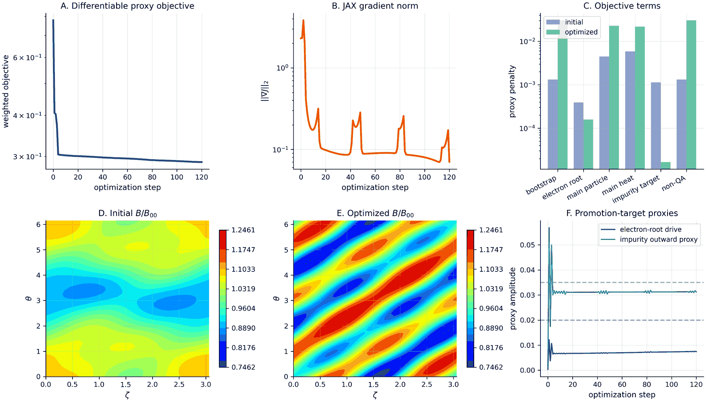

Optimization Workflows
======================

This guide covers fast, differentiable proxy objectives, teaching examples that
differentiate a kinetic solve, and completed drift-kinetic electric-field scans
for accepting a candidate.

The proxy is useful for ranking geometry changes and checking JAX derivatives.
It does not establish bootstrap current, ambipolar roots, transport fluxes, or
VMEC-boundary-to-SFINCS kinetic gradients. A candidate needs accepted kinetic
calculations and uncertainty estimates before supporting a research claim. The detailed
VMEC/Boozer differentiability boundary is maintained in :doc:`vmex_workflow`;
the release evidence and deferred research plan are maintained in
:doc:`validation_matrix`.

Fast QA proxy
-------------

The repository-local QA example is the quickest runnable workflow. It writes
PNG/PDF diagnostics and a JSON provenance record:

.. code-block:: bash

   python examples/optimization/qa_nfp2_dkx_objectives.py \
     --objective balanced \
     --steps 120 \
     --out-dir optimization-output \
     --stem qa_proxy

   A differentiable QA proxy diagnostic. It records objective and gradient
   behavior, field-strength terms, and proxy targets; it is not a kinetic
   transport validation artifact.

The presets are ``bootstrap``, ``electron-root``, ``flux-selective``, and
``balanced``. They combine normalized Boozer-field variance, angular
roughness, non-QA spectral content, and smooth target penalties. The proxy
holds the :math:`B_{00}` component fixed and treats modes with :math:`n\ne0`
as non-QA content. It is checked by finite differences through
``qa_proxy_gradient_gate``.

The proxy scalar is an optimizer aid, not a surrogate kinetic solve. It cannot
resolve the radial current

.. math::

   j_r(E_r) = \sum_s Z_s\Gamma_s(E_r),

or demonstrate a positive ambipolar root, solver convergence, backend
agreement, or kinetic-resolution convergence.

VMEC and analytic-current diagnostics
-------------------------------------

The VMEC-backed QA diagnostic reads a real ``vmex`` optimization result and
plots its equilibrium current indicator and finite-iota/aspect checks:

.. code-block:: bash

   python examples/optimization/qa_nfp2_bootstrap_current_comparison.py \
     --vmex-root /path/to/vmex \
     --out-dir optimization-output \
     --stem qa_vmec_diagnostic

The plotted quantity is VMEC ``jdotb / sqrt(bdotb)``. It is useful for
inspecting a current-sensitive equilibrium objective, but it is not a completed
``dkx`` or SFINCS bootstrap-current result. An optional
``--comparison-result-dir`` overlays another VMEC result; accept an apparent
improvement only after the finite-iota/aspect checks and the kinetic promotion
workflow below.

``KineticBootstrapCurrent`` can instead be placed directly in a VMEX
least-squares objective:

.. code-block:: python

   from dkx.bootstrap import KineticBootstrapCurrent

   kinetic = KineticBootstrapCurrent(profiles, surfaces=[0.25, 0.5, 0.75])
   objective_function_terms.append((kinetic, 0.0, 1.0))

``profiles`` may be the ``vmex.core.bootstrap.KineticProfiles`` object used by
the Redl term. Its polynomial coefficients describe :math:`n_e`, :math:`T_e`,
and :math:`T_i` in :math:`s`; the DKX term converts their derivatives to the
SFINCS radial convention. The term returns residuals based on
:math:`\langle j_\parallel B\rangle` in A T/m\ :sup:`2`, divided by its
``reference_current``. This is the VMEC ``jdotb`` unit. The normalized
``FSABjHatOverRootFSAB2`` value in an output file is dimensionless. Multiply
it by ``units.CURRENT_DENSITY`` to obtain A/m\ :sup:`2`; see :doc:`outputs`
for the required ``Hat``-to-SI conversions.

This is an expensive host-code objective: it requires
``derivative_method="finite_difference"`` and runs a drift-kinetic solve per
surface (and per electric-field value with ``ambipolar=True``). The shipped
``QA_optimization_bootstrap_dkx.py``, ``QH_optimization_bootstrap_dkx.py``,
and ``QI_optimization_bootstrap_dkx.py`` examples are research workflows. In
particular, Redl is an analytic model fitted in quasisymmetric settings, while
DKX evaluates the selected drift-kinetic model on the supplied geometry; their
agreement is a useful QA normalization check, not a replacement for a
resolution and model-scope qualification. QI results require their own
kinetic evidence.

Teaching kinetic derivatives
----------------------------

Two compact examples differentiate through an actual DKX kinetic solve. They
are teaching configurations, so their finite-difference agreement is a
derivative check rather than a resolution certificate.

.. code-block:: bash

   python examples/07_gradients/run.py
   python examples/08_vmex_optimization/run.py

``07_gradients`` differentiates normalized bootstrap current with respect to
temperature for a one-species circular-tokamak PAS case. It refreshes the
pitch-angle collision coefficients inside JAX while holding density, gradients,
geometry, and ``nu_n`` fixed, then compares the derivative with a central
difference. It does not cover full-Fokker--Planck temperature derivatives or
the host Case runner.

``08_vmex_optimization`` differentiates particle flux with respect to an
analytic Boozer ``|B|`` Fourier amplitude, checks the original kinetic
residual and finite-difference derivative, then descends that amplitude. The
kinetic geometry derivative is real, but its analytic surface is not a VMEC
boundary derivative. The optional VMEC/Boozer hand-off remains the scoped
proxy workflow described below.

Optional VMEC/Boozer JAX path
-----------------------------

The optional coupling remains a Boozer-spectrum proxy-gradient workflow. Run
its dependency-safe preflight before installing optional geometry packages:

.. code-block:: bash

   python examples/optimization/vmex_workflow_status.py --json

For an available VMEC ``wout`` file, the documented file-backed command is:

.. code-block:: bash

   python examples/autodiff/vmex_to_boozer_sfincs_pipeline.py \
     --wout /path/to/wout.nc \
     --mboz 3 --nboz 3 --surface 0.5 --steps 0 \
     --summary-json vmec_boozer_proxy.json

The written payload must retain a passing ``no_solve_provenance_gate``. It
records the VMEC/Boozer provenance and a gradient check for the proxy scalar;
``kinetic_solve_executed`` remains false. Do not describe this path as an
end-to-end VMEC-boundary-to-kinetic-transport gradient until every required
geometry, operator, solve, reduction, and gradient-validation stage in
:doc:`vmex_workflow` has been qualified.

Promoting an accepted candidate
-------------------------------

Only a completed ``dkx scan-er`` directory is kinetic promotion evidence. It
must use the accepted geometry, profiles, species, radial surface, and kinetic
resolution. The scan outputs contain ``sfincsOutput.h5`` at every requested
electric field. An accepted electron-root result needs a bracketed positive
root with a finite local slope, not merely a sampled point with small radial
current.

Start by writing an auditable scan plan from the proxy JSON. Without
``--execute`` this command starts no solve:

.. code-block:: bash

   python examples/optimization/launch_dkx_candidate_scan.py \
     --proxy-summary optimization-output/qa_proxy.json \
     --input candidate/input_r0p50.namelist \
     --out-dir candidate/scan_cpu/r0p50 \
     --er-min -3 --er-max 3 --n-er 7 --jobs 4 \
     --impurity-species-index 2 --target-impurity-flux 0.01

The plan records exact scan and audit commands in
``candidate_scan_plan.json``. Review the electric-field interval, resolution,
species index, and flux convention before adding ``--execute``. A direct CPU
scan is equivalent to:

.. code-block:: bash

   JAX_PLATFORM_NAME=cpu dkx scan-er \
     --input candidate/input_r0p50.namelist \
     --out-dir candidate/scan_cpu/r0p50 \
     --values -3 -2 -1 0 1 2 3 \
     --compute-solution --skip-existing --jobs 4

For ``RHSMode=2`` or ``RHSMode=3`` inputs, use
``--compute-transport-matrix`` in place of ``--compute-solution``. The
required angular, pitch, speed, radial, and profile convergence studies depend
on the claim; the discretization and solver routes are described in
:doc:`numerics`.

Audit the completed scan:

.. code-block:: bash

   python examples/optimization/evaluate_dkx_promotion_scan.py \
     --scan-dir candidate/scan_cpu/r0p50 \
     --out-dir candidate/audit \
     --stem r0p50_cpu \
     --require-electron-root \
     --impurity-species-index 2 --target-impurity-flux 0.01

The audit evaluates :math:`\sum_s Z_s\Gamma_s`, root brackets,
``FSABjHatOverRootFSAB2``, selected particle and heat fluxes, and recorded
linear-residual diagnostics. It uses the output coordinate and sign
conventions described in :doc:`outputs`. ``evaluate_dkx_promotion_scan.py``
without ``--scan-dir`` creates a small synthetic scan for a runnable plotting
and API demonstration. That mode cannot promote a candidate.

Promotion evidence
------------------

For a physics claim, retain the proxy JSON, input namelists, all completed
outputs, solver traces, audit JSON, and declared acceptance tolerances. The
minimum checks are:

- completed residual and acceptance diagnostics for each DKX scan point;
- electric-field coverage that brackets every selected root and preserves its
  branch identity under refinement;
- convergence in the velocity, angular, and radial/profile choices relevant to
  the result;
- bootstrap-current normalization and particle/heat/impurity-flux sign audits;
- CPU/GPU comparison for selected final points; and
- SFINCS Fortran v3 comparison when the physics options lie in the shared
  model scope.

Use separate CPU and GPU completed scans, then compare their promotion JSON:

.. code-block:: bash

   CUDA_VISIBLE_DEVICES=0 JAX_PLATFORM_NAME=gpu dkx scan-er \
     --input candidate/input_r0p50.namelist \
     --out-dir candidate/scan_gpu/r0p50 \
     --values -3 -2 -1 0 1 2 3 \
     --compute-solution --skip-existing --jobs 1
   python examples/optimization/evaluate_dkx_promotion_scan.py \
     --scan-dir candidate/scan_gpu/r0p50 \
     --out-dir candidate/audit --stem r0p50_gpu \
     --require-electron-root \
     --impurity-species-index 2 --target-impurity-flux 0.01
   python examples/optimization/compare_dkx_promotion_runs.py \
     --cpu candidate/audit/r0p50_cpu.json \
     --gpu candidate/audit/r0p50_gpu.json \
     --out-dir candidate/audit --stem r0p50_comparison

For a shared-model Fortran v3 comparison, create a matching reference scan and
audit it with ``--allow-missing-residuals`` only when its output format lacks
DKX residual datasets. This is diagnostic-only: it can help compare written
observables but cannot admit the reference result as promotion evidence. A
reference-admission comparison still requires original-equation residual and
complete-state evidence, alongside the output comparison. Missing residual data
is not a reason to relax the residual requirement for the DKX result.

The comparison tolerances are part of the campaign record and must be chosen
per observable before interpreting a result. Backend parity establishes
reproducibility for the compared inputs; it does not by itself establish
resolution convergence or validate a proxy-selected configuration. Refer to
:doc:`validation_matrix` for preserved evidence, bounded claims, and deferred
QI/device-QI work. Performance and storage reports belong in
:doc:`performance`, not in candidate-admission evidence.
