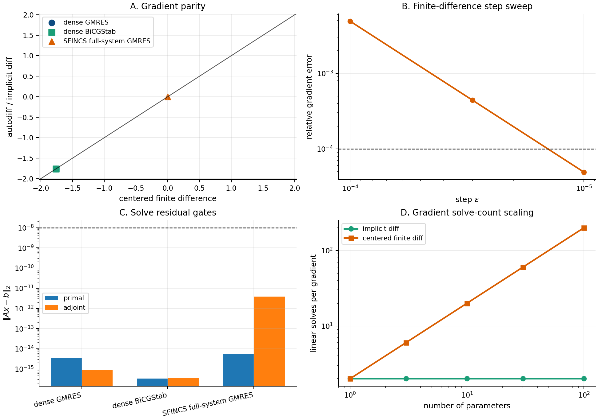
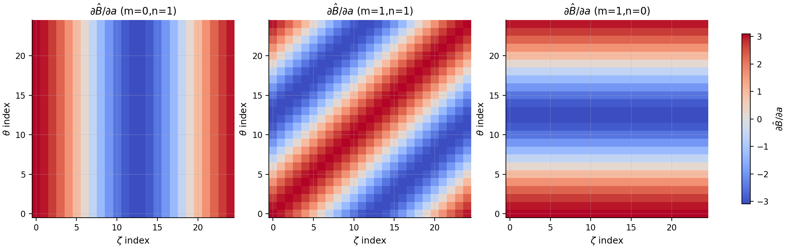
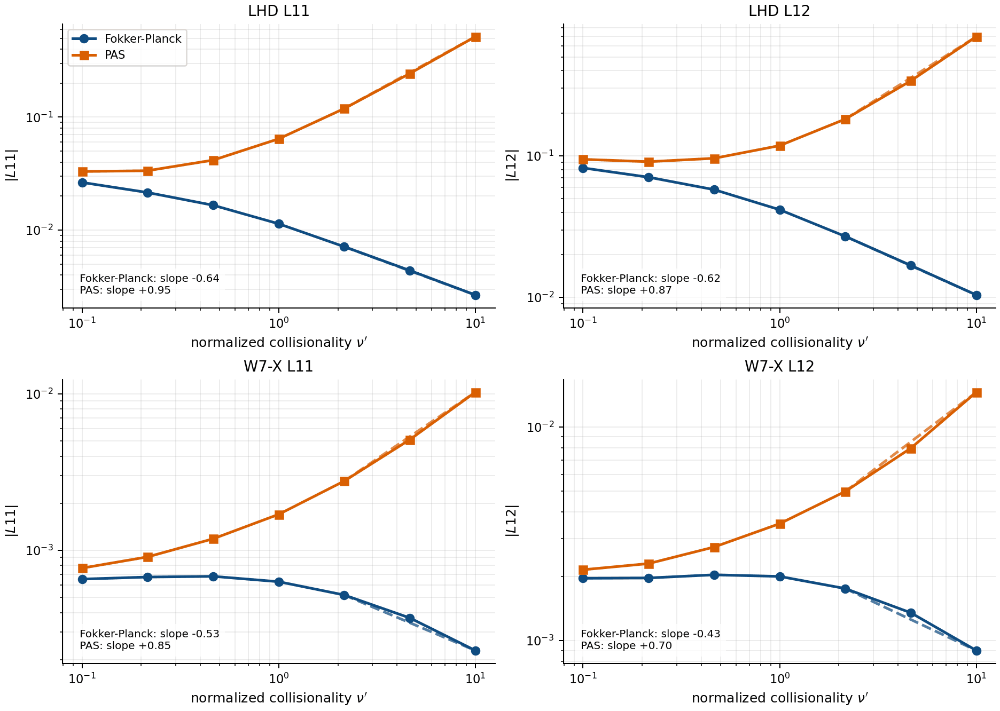
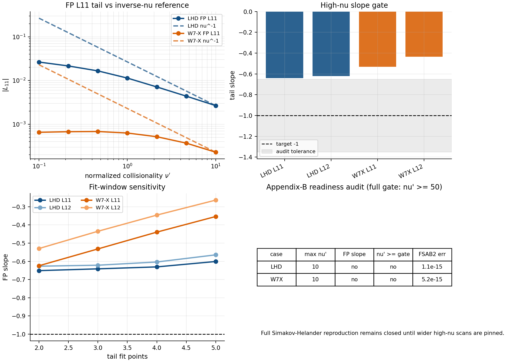
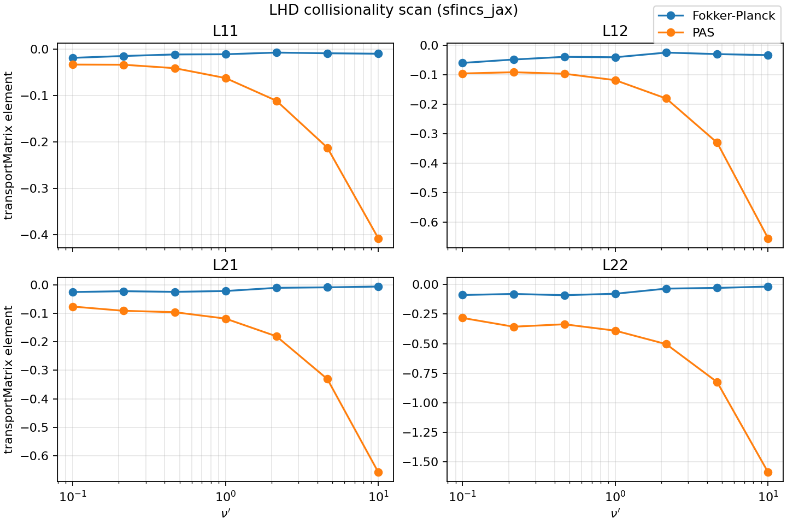
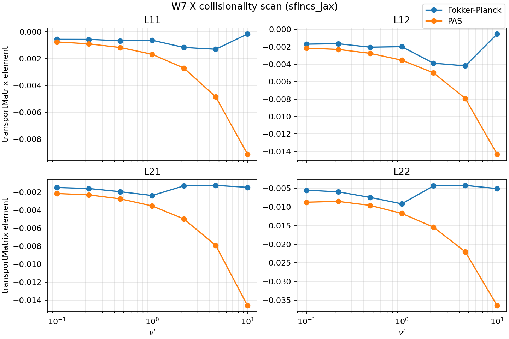
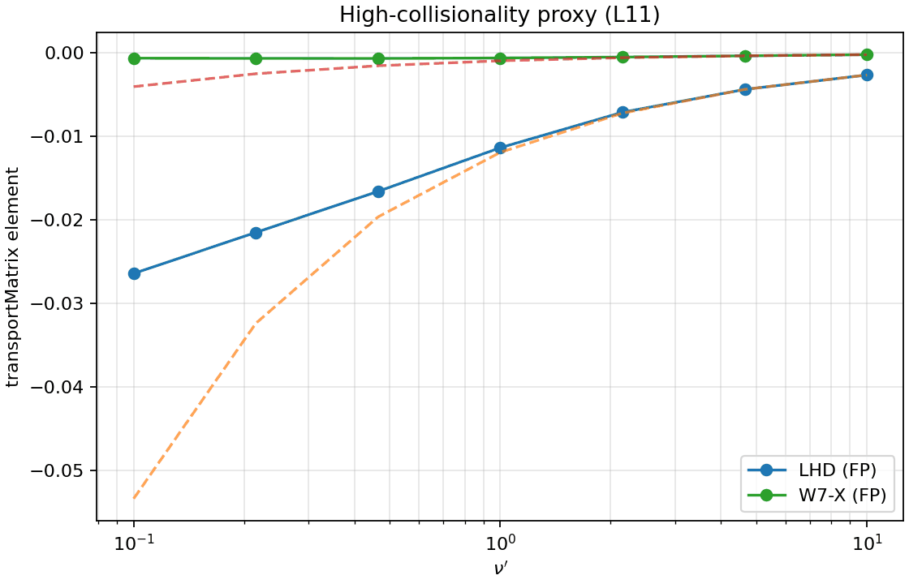

Paper figures (reproduced)
==========================

This page collects reproducible validation figures generated by running the
corresponding sfincs_jax cases. Figures 1 and 2 are backed by audited full-resolution
JSON summaries; fast variants remain available in the publication-figure scripts for
branch-level regression checks.

Generate the SFINCS-paper reproduction figures with

.. code-block:: bash

   python examples/publication_figures/generate_sfincs_paper_figs.py --fast

Omit ``--fast`` to use the default scan resolution.

Generate the publication validation dashboard with

.. code-block:: bash

   python examples/publication_figures/generate_validation_dashboard.py

Generate the frozen CPU/GPU Fortran-suite runtime and memory comparison with

.. code-block:: bash

   python examples/publication_figures/generate_fortran_suite_benchmark_summary.py

The default figure filters to production-scale rows whose Fortran v3 runtime is
at least ``10 s``. Use ``--min-fortran-runtime-s 0`` only for all-case CI/smoke
diagnostics, not for public performance claims.

Generate the autodiff/sensitivity validation figures with

.. code-block:: bash

   python examples/publication_figures/generate_autodiff_sensitivity_validation.py

Dashboard
~~~~~~~~~

.. figure:: _static/figures/paper/sfincs_jax_publication_validation_dashboard.png
   :alt: Literature-anchored sfincs_jax validation dashboard
   :width: 92%

   Publication dashboard generated from checked-in JSON artifacts. Panels A-B show
   the LHD and W7-X collision-operator collisionality scans used to audit FP/PAS
   behavior in the SFINCS 2014 validation setting. Panels C-D show the pinned
   trajectory-model sweeps used to verify exact zero-field agreement and finite-field
   separation between DKES, partial, and full trajectory models. The machine-readable
   summary is
   ``examples/publication_figures/artifacts/sfincs_jax_publication_validation_dashboard_summary.json``.

Fortran v3 suite benchmark
~~~~~~~~~~~~~~~~~~~~~~~~~~

.. figure:: _static/figures/paper/sfincs_jax_fortran_suite_benchmark_summary.png
   :alt: Frozen CPU and GPU sfincs_jax benchmark summary against SFINCS Fortran v3
   :width: 92%

   Runtime and memory comparison generated from the frozen full-suite reports.
   Panel A shows wall-clock runtime and Panel B shows active solver memory for
   SFINCS Fortran v3, ``sfincs_jax`` CPU cold/warm, and ``sfincs_jax`` GPU
   cold/warm across the production-scale subset. Both panels use log-scaled axes.
   Fortran memory is process maximum RSS; JAX memory uses profiler RSS deltas
   over the fixed Python/JAX/XLA baseline, with full process RSS retained in the
   JSON audit fields.
   Cases are ordered by best warm ``sfincs_jax`` speedup over the Fortran v3
   runtime, placing the strongest JAX wins first.
   Cold is the first external suite command. Warm runtime uses
   ``jax_runtime_s_warm`` when rerun timings are present and otherwise uses the
   recorded ``jax_logged_elapsed_s`` fallback; the JSON summary records
   ``warm_or_logged_runtime_source_counts``. The machine-readable summary,
   including parity status, runtime/memory ratios, and the excluded sub-``10 s``
   Fortran rows, is
   ``examples/publication_figures/artifacts/sfincs_jax_fortran_suite_benchmark_summary.json``.

Autodiff and sensitivity validation
~~~~~~~~~~~~~~~~~~~~~~~~~~~~~~~~~~~

   Gradient-validation dashboard for the differentiable solve path. Panel A compares
   autodiff/implicit-diff gradients with centered finite differences for stable scalar
   objectives, including a pinned SFINCS full-system linear solve. Panel B records the
   finite-difference step sweep used for the SFINCS gradient gate. Panel C shows primal
   and adjoint residuals for the solve checks. Panel D shows the solve-count advantage
   of implicit differentiation over centered finite differences as the number of
   parameters grows. The machine-readable summary is
   ``examples/publication_figures/artifacts/sfincs_jax_autodiff_sensitivity_validation_summary.json``.

   Spatial sensitivity maps for the differentiable ``geometryScheme=4`` Boozer
   harmonic amplitudes. This is a bounded manuscript artifact: it validates the JAX
   sensitivity machinery for the public analytic-Boozer geometry path, while full
   VMEC-boundary optimization remains a separate research workflow.

High-collisionality trend proxy
~~~~~~~~~~~~~~~~~~~~~~~~~~~~~~~

Generate the trend proxy with

.. code-block:: bash

   python examples/publication_figures/generate_high_collisionality_trend_proxy.py

   Power-law tail fits for ``L11`` and ``L12`` from the corrected full LHD and W7-X
   collisionality artifacts. This is a trend proxy, not the final
   Simakov-Helander analytic-limit reproduction: the W7-X Fokker-Planck tail shows
   the expected inverse-``nu`` trend on the checked-in range, while the LHD
   Fokker-Planck tail still needs a wider ``nu' >> 1`` scan before it can support the
   analytic-limit claim.

Simakov-Helander limit audit
~~~~~~~~~~~~~~~~~~~~~~~~~~~~

Generate the normalization/readiness audit with

.. code-block:: bash

   python examples/publication_figures/generate_simakov_helander_limit_audit.py
   python examples/publication_figures/generate_simakov_helander_high_nu_run_plan.py

   Reviewer-facing audit for the full high-collisionality analytic-limit lane.
   The JSON artifact records the Appendix-B geometry ingredients available in
   checked-in ``sfincsOutput.h5`` files, recomputes ``FSABHat2`` from ``BHat`` and
   ``DHat``, tracks the ``L11``/``L12`` inverse-``nu`` slope proxy, and explicitly
   keeps the full Simakov-Helander reproduction closed until wider high-``nu``
   scans are pinned. The machine-readable summary is
   ``examples/publication_figures/artifacts/sfincs_jax_simakov_helander_limit_audit_summary.json``.
   The paired high-``nu'`` run plan is
   ``examples/publication_figures/artifacts/sfincs_jax_simakov_helander_high_nu_run_plan.json``.

Launch the bounded pilot first so the terminal ETA and residual behavior are
visible before committing to the full FP/PAS LHD+W7-X extension:

.. code-block:: bash

   CUDA_VISIBLE_DEVICES=0,1 \
   python examples/publication_figures/generate_sfincs_paper_figs.py \
     --case lhd \
     --collision-operators 0 \
     --nuprime-min 17.78279101649707 \
     --nuprime-max 17.78279101649707 \
     --n-points 1 \
     --timeout-s 900 \
     --transport-workers 2 \
     --transport-parallel-backend gpu \
     --transport-sparse-direct-max 30000 \
     --require-residuals \
     --max-transport-residual 1e-6 \
     --max-transport-relative-residual 1e-6 \
     --skip-existing \
     --scan-only

The publication-figure scan launcher forces ``SFINCS_JAX_IMPLICIT_SOLVE=0`` for
these executable scans. That keeps high-collisionality transport on the explicit
performance path. The run plan caps sparse direct solves at ``30000`` active
unknowns by default: the LHD FP pilot remains on the accurate host sparse-LU
path, while larger W7-X FP high-``nu'`` runs must explicitly opt into the
``40000`` cap after a bounded pilot proves the residual gate is clean. The same
residual thresholds are also used as fail-fast aborts for sequential and
GPU-worker runs, so a bad high-``nu'`` point does not waste the rest of a
campaign once the first failed RHS is known. GPU runs can still opt into larger
host sparse-LU first attempts/rescues when a bounded pilot shows they are useful,
instead of the differentiable implicit path that intentionally avoids host-only
direct solvers.

On the current two-GPU ``office`` pilot for the first LHD FP high-``nu'`` point,
this explicit worker lane produced residuals ``4.33e-16``, ``5.33e-14``, and
``4.06e-11`` in about ``262 s``. The same explicit point on one GPU took about
``345 s``; the older implicit-path pilot took about ``569 s`` and stalled at much
larger residuals. The first full-resolution W7-X FP high-``nu'`` point now also
has a residual-clean route: with one GPU worker,
``SFINCS_JAX_TRANSPORT_SPARSE_FACTOR_DTYPE=float32``, and
``--transport-sparse-direct-max 40000``, the three RHS residual/RHS/relative
tuples were ``1.297471e-10 / 1.885192e-04 / 6.882435e-07``,
``1.975724e-12 / 2.623896e-04 / 7.529734e-09``, and
``4.841651e-09 / 6.589011e-01 / 7.348069e-09``. With sparse-helper factor
reuse, the scan took about ``582 s`` on one office GPU instead of about
``2028 s`` before reuse; RHS timings were about ``574.0 s``, ``2.47 s``, and
``2.38 s``. The smaller ``30000`` cap and the current Krylov-only
preconditioners still fail this point, so the strict residual gates remain
mandatory for widened scans.

W7-X high-nu preconditioning/performance
~~~~~~~~~~~~~~~~~~~~~~~~~~~~~~~~~~~~~~~~

Generate the W7-X high-``nu'`` performance figure with

.. code-block:: bash

   python examples/publication_figures/generate_w7x_high_nu_performance.py

.. figure:: _static/figures/paper/sfincs_jax_w7x_high_nu_performance.png
   :alt: W7-X high-nu sparse-helper factor reuse performance
   :width: 92%

   Runtime, residual, setup-count, and peak-RSS comparison for the first
   full-resolution W7-X FP high-``nu'`` point. The bounded ``30000`` cap is
   shown as a rejected route because it fails the residual gate. The
   factor-reuse sparse-LU route preserves the residual-clean transport matrix
   exactly while reducing wall time from about ``33.8 min`` to ``9.7 min`` and
   measured peak RSS from about ``19.9 GB`` to ``15.3 GB``. The machine-readable
   summary is
   ``examples/publication_figures/artifacts/sfincs_jax_w7x_high_nu_performance_summary.json``.

Figure 1 (LHD collisionality scan)
~~~~~~~~~~~~~~~~~~~~~~~~~~~~~~~~~~~~~~~~~~~~~~~~~~~~~~~~~~~~

   Ion transport matrix elements vs collisionality for LHD geometry at ``E_r = 0``.

Figure 2 (W7-X collisionality scan)
~~~~~~~~~~~~~~~~~~~~~~~~~~~~~~~~~~~~~~~~~~~~~~~~~~~~~~~~~~~~~

   Ion transport matrix elements vs collisionality for W7-X geometry at ``E_r = 0``.

Figure 3 (Simakov–Helander limits)
~~~~~~~~~~~~~~~~~~~~~~~~~~~~~~~~~~~~~~~~~~~~~~~~~~~~~~~~~~~~

   Historical high-collisionality proxy from the SFINCS-paper figure generator. Use
   the normalization/readiness audit above for reviewer-facing claims until a wider
   high-``nu`` Simakov-Helander reproduction is generated from pinned scan outputs.
