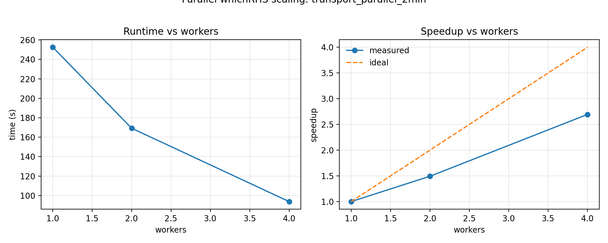
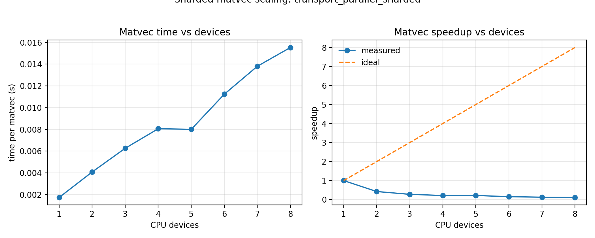
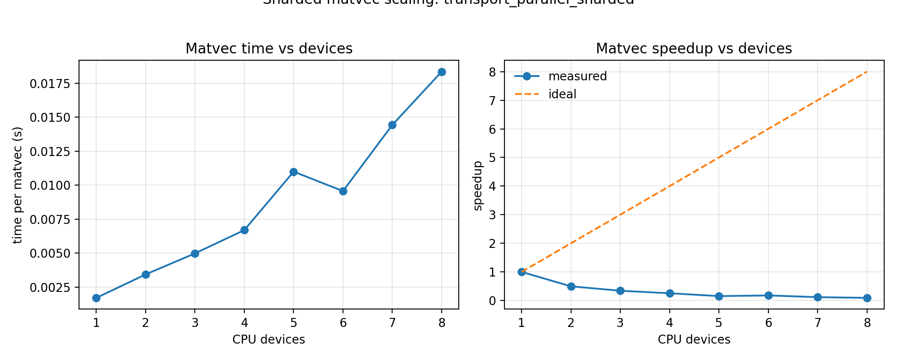
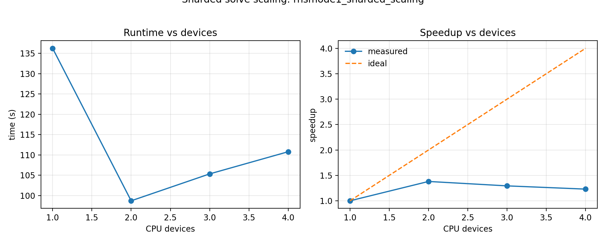
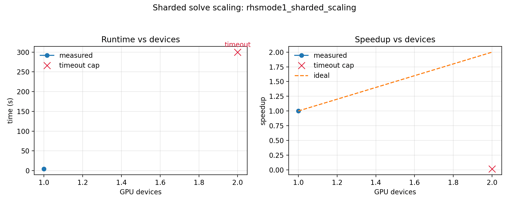

Parallelism
===========

This page explains how parallelism works in `sfincs_jax`, how it relates to more
traditional MPI-distributed neoclassical solves, and how to use it on a laptop
(multi-core CPU) or on clusters (multi-CPU / multi-GPU).

Why parallelism matters
-----------------------

Neoclassical transport solves are dominated by large, coupled linear systems. Even
with aggressive JIT and preconditioning, wall‑time scales roughly with the number
of Krylov iterations times the cost of each matvec. Parallelism is the primary way
to reduce time‑to‑solution once the single‑device kernels are efficient.

Two distinct patterns matter:

- **Embarrassingly parallel**: independent solves that can run concurrently
  (multiple `whichRHS`, multiple scan points, multiple cases).
- **Distributed linear algebra**: a single large linear system is split across
  devices to reduce per‑solve time.

Parallelism in JAX
------------------

JAX supports two broad modes of parallelism:

- **Multi‑process**: Run independent problems in separate Python processes. This is
  the simplest and most robust path on CPUs (and also works for GPUs if each
  process is pinned to a device).
- **SPMD / sharding**: Use explicit ``jax.jit`` sharding and sharded arrays to
  split a *single* linear system across multiple devices. This is the mechanism
  needed for per-solve strong scaling, but in ``sfincs_jax`` it remains an
  experimental path that must prove it amortizes synchronization and compilation
  overhead.

Key tradeoffs for `sfincs_jax`:

- Process parallelism is the easiest way to scale *independent* `whichRHS` solves
  and scan points on CPUs.
- Sharded matvec is the correct analogue to Fortran MPI for large single‑RHS
  solves, but it requires multi‑device setups and careful sharding constraints.

Parallelism in SFINCS (Fortran v3)
----------------------------------

SFINCS v3 uses **MPI + PETSc**:

- **Domain decomposition**: In `createGrids.F90`, PETSc DMDA splits **either**
  :math:`\theta` or :math:`\zeta` across MPI ranks (1‑D decomposition). Each rank
  owns a slab of the matrix rows for its local :math:`(\theta,\zeta)` range.
- **Distributed KSP**: In `solver.F90`, PETSc KSP solves the global linear system
  using distributed `Mat`/`Vec` objects. Direct solvers (MUMPS / SuperLU_DIST)
  handle the parallel factorization internally.

This is a classic MPI‑distributed linear‑algebra design: local matrix assembly,
parallel Krylov (or direct) solve.

Parallelism in sfincs_jax
-------------------------

`sfincs_jax` uses a layered approach that mirrors the Fortran design while
preserving differentiability:

1. **Parallel whichRHS (transport matrices)**

   RHSMode=2/3 solves are independent per `whichRHS`. We can solve multiple RHS
   in parallel across CPU processes or GPU devices.

   Implementation: `solve_v3_transport_matrix_linear_gmres` in
   `sfincs_jax.problems.transport_solve`.

2. **Parallel cases / scan points**

   The reduced suite and scan workflows are embarrassingly parallel across
   cases or scan points. The suite runner supports `--jobs` to execute
   multiple cases concurrently.

   Implementation: ``python -m sfincs_jax.validation.suite reduced``.

3. **Sharded matvec (SPMD)**

   For very large cases, an experimental single-RHS solve path can shard the
   state vector across multiple devices along :math:`\theta` or :math:`\zeta`.

   Implementation: `apply_v3_full_system_operator_cached` in
   `sfincs_jax.operators.profile_system` with explicit ``jax.jit`` sharding plus
   `with_sharding_constraint`.

   **Host‑device setup (CPU).** To emulate MPI‑style domain decomposition on a
   multi‑core CPU, request multiple host devices *before importing JAX*. You can
   do this from the CLI without environment variables:

   .. code-block:: bash

      sfincs_jax --cores 8 /path/to/input.namelist

   The equivalent environment variable remains available:

   .. code-block:: bash

      export SFINCS_JAX_CORES=8

   `sfincs_jax` will then shard the state vector along :math:`\\theta` or
   :math:`\\zeta` (whichever is larger) once the :math:`N_\\theta N_\\zeta`
   grid is large enough. This mirrors the Fortran DMDA split across angular
   coordinates.

   To disable sharding while keeping process parallelism, set:

   .. code-block:: bash

      export SFINCS_JAX_SHARD=0

Design choices and parity
-------------------------

- **Parity first**: parallel paths call the same matrix‑free operators as the
  sequential path, so outputs remain bit‑compatible up to floating reduction
  order.
- **Deterministic merges**: results are merged by column index to avoid
  nondeterministic ordering in parallel `whichRHS`.
- **Differentiability**: each worker uses the same JAX operators, so the solve
  itself remains differentiable. Cross‑process aggregation is performed in
  Python, so end‑to‑end gradients across multiple processes are not automatic.
  If you need gradients for transport matrices, compute each RHS gradient in the
  worker and combine them explicitly.

Step (1): Parallel `whichRHS`
-----------------------------

Enable process‑parallel `whichRHS` solves with:

.. code-block:: bash

   export SFINCS_JAX_TRANSPORT_PARALLEL=process
   export SFINCS_JAX_TRANSPORT_PARALLEL_WORKERS=4

This parallelizes the RHSMode=2/3 transport matrix loop across CPU processes.
Parity is preserved because each `whichRHS` solve is identical to the sequential
path; outputs are merged deterministically by column.

**Relevant code paths**

- `sfincs_jax.problems.transport_solve.solve_v3_transport_matrix_linear_gmres`
- `sfincs_jax.problems.transport_parallel_runtime`
- `python -m sfincs_jax.problems.transport_parallel_runtime`

**How it works**

- The master process partitions `whichRHS` indices and launches workers with
  `ProcessPoolExecutor`.
- Each worker reads the same input file, solves its RHS subset, and returns
  per‑RHS fluxes plus transport diagnostics.
- The master merges columns deterministically and reconstructs the transport
  matrix.
- By default, the process pool is persistent across repeated transport solves
  (`SFINCS_JAX_TRANSPORT_POOL_PERSIST=1`), which avoids worker re-spawn and
  repeated worker-side JAX startup/JIT overhead for warm runs. Set
  `SFINCS_JAX_TRANSPORT_POOL_PERSIST=0` to force one-shot pools.

**Platform note (macOS)**

macOS uses `spawn` for multiprocessing. Run from a file/module (not `python - <<EOF`)
so worker processes can import the main module cleanly.

**Measured CPU transport scaling (MacBook Pro M3 Max)**

Benchmark case: `examples/performance/transport_parallel_2min.input.namelist`
(RHSMode=2, geometryScheme=2, Ntheta=21, Nzeta=21, Nxi=6, NL=6, Nx=6).

Benchmark preconditioner: `SFINCS_JAX_TRANSPORT_PRECOND=xmg`.

Historical cache-warm CPU sweep (1, 2, 4 requested workers):
1 worker 252.5s, 2 workers 169.2s, 4 workers 93.7s.
Because this RHSMode=2 case has only three independent ``whichRHS`` tasks, the
4-worker point is a task-limited throughput snapshot rather than a release gate
for four fully occupied workers. Benchmark JSON records ``rhs_count`` and
payload coverage, and release-facing audits require claimed worker counts to be
no larger than the independent task count.

Process‑parallel workers automatically disable sharded matvec. For multi-worker
CPU runs, they also cap XLA/BLAS threads per worker to
``max(1, SFINCS_JAX_CORES / SFINCS_JAX_TRANSPORT_PARALLEL_WORKERS)`` so the
process pool does not oversubscribe the node. Set
``SFINCS_JAX_TRANSPORT_PIN_THREADS=0`` to leave thread pools unmanaged, or set
``SFINCS_JAX_TRANSPORT_PIN_THREADS=1`` to force the same cap for one-worker
diagnostics.

Reproduce:

.. code-block:: bash

   python examples/performance/benchmark_transport_parallel_scaling.py \
     --input examples/performance/transport_parallel_2min.input.namelist \
     --workers 1 2 3 \
     --repeats 1 \
     --warmup 0 \
     --global-warmup 1

The benchmark script uses the transport solve-only path
(``collect_transport_output_fields=False``) so timings isolate linear-solve
parallel behavior instead of full diagnostics/H5 field assembly.

   Parallel whichRHS scaling (runtime + speedup vs workers).

For this larger case, the historical task-limited snapshot reached about
``2.69x`` with a 4-worker request. The release-facing CPU-parallel story in
``sfincs_jax`` is narrower and more defensible: use process-parallel transport
and scan workloads first, and keep single-case multi-device sharding as an
experimental path for very large RHSMode=1 solves.
Note: RHSMode=2 has only **3** right-hand sides, so speedup naturally
saturates once there are more workers than independent ``whichRHS`` solves.

Transport-worker scaling audit
------------------------------

Saved transport-worker benchmark summaries can be checked with the pure
CI-fast policy helper
``sfincs_jax.problems.transport_parallel_runtime.audit_transport_parallel_scaling_summary``.
The helper does not launch workers, inspect hardware, or rerun solves. It only
audits the saved payload:

- the summary is marked as a transport-worker benchmark, not a sharded single-case
  benchmark;
- the summary has a valid one-worker baseline and a parallel worker point;
- there are enough independent transport tasks for the claimed worker count;
- GPU summaries record enough unique visible devices for the audited worker
  count;
- timing semantics are explicit, and release-facing claims use warm/hot timing
  rather than cold setup timing;
- measured speedup and worker efficiency pass the release gates;
- speedup stays within the finite-task ideal for the recorded ``rhs_count``;
- payload chunks for the claimed worker count cover each ``whichRHS`` exactly
  once;
- deterministic output/merge coverage is recorded.
- new or explicit release-claim payloads record a compile-amortization gate, so
  warm/cache timing evidence states how compile/setup work was kept out of the
  timed repeats.

The returned ``TransportParallelScalingAudit`` includes ``release_scaling_claim``,
``failures``, and ``notes`` so benchmark scripts can separate malformed payloads
from valid-but-weak measurements. If a saved payload explicitly records
``release_scaling_claim=false``, the audit preserves that non-release status even
when the measured gates pass. If a payload explicitly records
``release_scaling_claim=true``, the audit requires compile-amortization metadata
in addition to the speedup, efficiency, timing, task-count, and deterministic
coverage gates. This gate is intentionally scoped to transport-worker scaling:
it supports claims such as "two GPU workers solve three independent transport RHS
tasks with about 1.48x speedup." It does not upgrade single-case multi-GPU or
sharded RHSMode=1 benchmarks into release-facing strong-scaling claims; those
remain a separate experimental lane below.

The benchmark driver records these fields in new JSON outputs and can run the
gate directly:

.. code-block:: bash

   python examples/performance/benchmark_transport_parallel_scaling.py \
     --from-json path/to/regenerated_transport_parallel_scaling.json \
     --audit

Legacy JSON files that predate the stronger schema may still be useful for
figures, but they should not be used as release gates until regenerated with
explicit timing, device, task, and payload-coverage metadata.

Deterministic benchmark plans
-----------------------------

The parallel benchmark drivers write deterministic no-run plan artifacts
for CI and launch review. These commands validate CLI wiring, worker/device
allocation, warm/cold timing metadata, finite-task speedup limits, and memory
allocator/timeout semantics without launching SFINCS solves:

.. code-block:: bash

   python examples/performance/benchmark_transport_parallel_scaling.py \
     --input examples/performance/transport_parallel_2min.input.namelist \
     --workers 1 2 4 \
     --backend gpu \
     --global-warmup 1 \
     --plan-only

Plan JSON files are written under the selected ``--out-dir`` unless
``--plan-json`` is supplied. The artifacts are intentionally marked
``launches_solves=false``. They are not performance results; they are executable
contracts for the benchmark run that will follow.

Single-case sharded solve and one-GPU-per-case throughput campaign drivers are
preserved on the ``research/parallel-performance`` branch. They are not stable
example commands until they satisfy production-grid residual, runtime, memory,
and documentation gates.

Gate semantics are explicit in the plans:

- All parallel benchmark plans include ``parallel_claim_scope`` from
  ``audit_parallel_scaling_claim_scope``. This pure CI-safe audit labels the
  artifact as independent ``whichRHS`` throughput, independent case throughput,
  or experimental single-case sharding before any runtime/speedup claim is
  considered.
- The scope audit records whether the artifact is plan-only
  (``artifact_kind="benchmark_plan"`` or ``launches_solves=false``), whether
  measured timing results are present, and which follow-up speedup gate is
  required. A plan-only artifact can prove launch semantics and claim scope, but
  it cannot by itself prove runtime speedup or memory scaling. In JSON terms,
  plan-only independent-work artifacts may set
  ``claim_scope_release_eligible=true`` while keeping
  ``release_scaling_supported=false`` until measured timing results pass the
  named speedup gate.
- Ambiguous artifacts fail closed. In particular, missing ``benchmark_kind``,
  conflicting declared ``claim_scope``, or ``release_scaling_claim=true`` on a
  plan-only artifact all produce explicit failures before any public scaling
  claim can be made.
- Transport-worker plans name
  ``audit_transport_parallel_scaling_summary`` as the release speedup gate and
  record that cold-start timings are rejected for warm scaling claims.
- Transport-worker plans include ``compile_amortization_gate`` with
  ``passes``, warmup counts, timed-repeat counts, persistent-cache status, and
  ``compile_in_timed_region=false``. This is plan-only evidence that the measured
  run is intended to amortize compile/setup before timing; it is not itself a
  speedup result.
- Sharded-solve plans are marked
  ``benchmark_kind="single_case_sharded_solve"`` and
  ``release_scaling_claim=false``; their audit is a schema/honesty gate, not a
  release strong-scaling gate.
- If a single-case sharded artifact sets ``release_scaling_claim=true``, the
  scope audit fails before speedup is inspected. This keeps the public claim
  precise: production scaling is independent-work throughput; single
  RHSMode=1 strong scaling remains experimental until it has reproducible
  speedup, parity, and memory gates.
- Multi-GPU case-throughput plans define throughput speedup as
  ``sequential_one_gpu.wall_s / parallel_two_gpu.wall_s`` but keep it
  non-release until measured wall time improves.
- Memory metadata in plans records bounded child timeouts and allocator choices
  such as ``XLA_PYTHON_CLIENT_PREALLOCATE=false`` and ``cuda_malloc_async``.
  Peak RSS/GPU memory remains a measured-run artifact, not a plan-only claim.

Earlier runs (smaller grids)
----------------------------

We also benchmarked smaller RHSMode=2 cases (7–45 s single‑worker time). These
showed weaker scaling because process startup and JIT overheads dominate at
small problem sizes. The longer 2min case above is required to observe clear
speedup on laptop CPUs.

Reduced‑suite parallel sanity checks
------------------------------------

We also timed a pair of reduced‑suite examples using `SFINCS_JAX_CORES` to see
whether CPU parallelism helps at the ~1–3 s scale. Results (cache‑warm, second run):

.. list-table::
   :header-rows: 1
   :widths: 40 12 12 12 12

   * - Case
     - 1 core
     - 2 cores
     - 4 cores
     - 8 cores
   * - HSX_PASCollisions_DKESTrajectories
     - 2.825 s
     - 2.747 s
     - 2.787 s
     - 3.043 s
   * - transportMatrix_geometryScheme11
     - 1.599 s
     - 2.404 s
     - 2.691 s
     - 2.485 s

At these tiny sizes, per‑process startup, JIT cache synchronization, and
inter‑process overhead dominate the solve time, so additional cores do not help.
This is expected; strong scaling appears only once per‑RHS work reaches tens of
seconds.

JIT/compilation notes
---------------------

To avoid skew from compilation:

- The results above were collected after a one‑off warm run (workers=1) to populate
  the persistent JAX cache, with ``--warmup 0 --global-warmup 1`` for the timing run.
- To reproduce, either run once with ``--workers 1`` before timing or set
  ``--global-warmup 1`` and keep ``--warmup 0`` for the timed measurements.
- A persistent `JAX_CACHE_DIR` is used so processes can reuse compiled kernels.
- New transport-worker benchmark JSON records ``compile_amortization_gate``.
  The gate passes when either per-worker warmups are run before timed repeats or
  a global warmup plus persistent compilation cache is configured. If an artifact
  explicitly requests ``release_scaling_claim=true`` without this metadata, the
  pure audit fails closed.

Step (2): Parallel cases / scans
--------------------------------

The reduced suite runner can execute multiple cases in parallel:

.. code-block:: bash

   python -m sfincs_jax.validation.suite reduced --jobs 4 --reuse-fortran

Each case runs in its own process, with independent Fortran and JAX runs.
This is the highest‑ROI parallel mode for large test campaigns.

**Scan parallelism (E_r scans)**

For scans with many values, use `--jobs` to parallelize scan points:

.. code-block:: bash

   sfincs_jax scan-er \
     --input input.namelist \
     --out-dir scan_dir \
     --min -2 --max 2 --n 41 \
     --jobs 8

Parallel scan mode disables Krylov recycle between points. Use this when you
care more about throughput than per‑point warm‑start.

Scaling to dozens/hundreds (job arrays)
------------------------------------------------------------

For large ensembles, use job arrays on clusters and slice the work with
`--case-index`/`--case-stride` (suite) or `--index`/`--stride` (scan).

**Suite array (N cases across M array tasks)**

.. code-block:: bash

   #SBATCH --array=0-63
   python -m sfincs_jax.validation.suite reduced \
     --case-index ${SLURM_ARRAY_TASK_ID} \
     --case-stride 64 \
     --reuse-fortran

**Scan array (N scan points across M array tasks)**

.. code-block:: bash

   #SBATCH --array=0-63
   sfincs_jax scan-er \
     --input input.namelist \
     --out-dir scan_dir \
     --min -2 --max 2 --n 401 \
     --index ${SLURM_ARRAY_TASK_ID} \
     --stride 64

This gives near‑linear scaling to dozens or hundreds of workers, since each
task is independent.

Step (3): Sharded matvec (SPMD)
-------------------------------

Sharded matvec splits the *state vector* across devices for a **single solve**.
This is the closest analogue to the MPI / DMDA strategy in Fortran.

Enable sharding by selecting the axis (theta/zeta) or the full flat state vector:

.. code-block:: bash

   export SFINCS_JAX_MATVEC_SHARD_AXIS=zeta  # or theta
   # Optional flat sharding for distributed GMRES:
   # export SFINCS_JAX_MATVEC_SHARD_AXIS=flat

On CPUs, you can create multiple host devices with:

.. code-block:: bash

   export XLA_FLAGS=--xla_force_host_platform_device_count=4

On GPUs, JAX will automatically see all local devices.

**Notes**

- Sharding is **experimental** and only enabled when multiple devices
  are visible.
- When only one device is available, the code falls back to the standard JIT path
  and skips sharding constraints (no functional change).
- Sharded matvec requires the sharded dimension (``Ntheta`` or ``Nzeta``) to be
  divisible by the device count. Because v3 forces **odd** ``Ntheta``/``Nzeta``,
  only odd device counts activate theta/zeta sharding by default. Set
  ``SFINCS_JAX_SHARD_PAD=1`` (default) to pad ghost planes so even device counts
  can still shard without changing outputs in the cached sharded-JIT matvec path.
  (The RHSMode=1 distributed-GMRES matvec path still requires
  divisible theta/zeta partitions.)
- ``x`` sharding is available as a fallback when odd ``Ntheta``/``Nzeta`` block
  theta/zeta sharding. Use ``SFINCS_JAX_MATVEC_SHARD_AXIS=x`` or set
  ``SFINCS_JAX_MATVEC_SHARD_PREFER_X=1`` with a large ``Nx``. With
  ``SFINCS_JAX_SHARD_PAD=1`` (default), `sfincs_jax` pads ``Nx`` to the next
  multiple of the device count so x‑sharding can still activate.
- When sharding is active and no explicit RHSMode=1 preconditioner is requested,
  `sfincs_jax` defaults to an angular-local preconditioner along the sharded
  axis. For larger systems this can auto-upgrade to overlap-RAS
  (``theta_schwarz`` / ``zeta_schwarz`` via
  ``SFINCS_JAX_RHSMODE1_SCHWARZ_AUTO_MIN``), otherwise it uses theta/zeta line
  blocks. This keeps the preconditioner apply local to each shard, mirroring
  PETSc-style block-Jacobi/Schwarz behavior.
- The cached sharded matvec path is intentionally a top-level execution path.
  RHSMode=1 setup probes that call the operator from inside ``vmap``/``jit`` or
  a custom linear solve use a local unsharded JIT matvec instead. This avoids
  nested ``jax.set_mesh``/``pjit`` contexts while keeping normal CPU/GPU
  top-level matvecs sharded.
- Collisionless, ExB, and magnetic-drift derivative kernels use a
  sparse-row gather apply when the differentiation matrices are banded/sparse
  (common 3‑point/5‑point schemes). This keeps the operator matrix-free and
  differentiable while reducing dense derivative apply cost. The periodic roll
  kernel is enabled only on single-device runs by default; on multi-device
  sharded runs it is disabled unless
  ``SFINCS_JAX_PERIODIC_STENCIL_ON_SHARDED=1`` is set.
- This mirrors Fortran DMDA splitting along :math:`\theta` or :math:`\zeta`,
  with the same intent: distribute matvec and preconditioner cost.

**Padding design (theta/zeta sharding).** When ``SFINCS_JAX_SHARD_PAD=1``,
`sfincs_jax` pads odd ``Ntheta``/``Nzeta`` grids with **ghost planes** so that
even device counts can shard. The padding is constructed to be
mathematically neutral: weights and integration measures are padded with zeros,
so the extra planes contribute nothing to residuals or diagnostics. We also
pad ``BHat`` with 1 and derivatives with 0 to avoid division‑by‑zero in
intermediate expressions. The final output is **un‑padded**, so the user‑visible
solution and H5 outputs match the original grid exactly. This choice preserves
parity while allowing SPMD sharding on otherwise incompatible grids.

Sharded matvec scaling (single RHS)
-----------------------------------

We also benchmarked sharded matvec performance for a larger single‑RHS operator
in the extracted ``research/parallel-performance`` lane.

Latest run (cache warm, Macbook M3 Max, theta‑sharded with padding):
1 device 1.74 ms, 2 devices 4.08 ms, 3 devices 6.26 ms, 4 devices 8.06 ms,
5 devices 8.01 ms, 6 devices 11.24 ms, 7 devices 13.81 ms, 8 devices 15.53 ms.
CPU sharding overhead dominates at this size; this mode is primarily intended
for **very large grids** or multi‑GPU nodes.

Single-device derivative-kernel speedup
---------------------------------------

For the same extracted operator, enabling sparse derivative kernels reduced
single-device matvec time from ``7.49e-4 s`` to ``5.87e-4 s`` (about ``1.28x``
faster, cache-warm).

The sharded matvec drivers that produced this historical figure live on the
``research/parallel-performance`` branch. The stable example tree keeps the
transport-worker benchmark as the supported parallel throughput entry point.

X‑sharded matvec scaling (single RHS)
-------------------------------------

X‑sharding avoids the odd‑grid constraint. With ``SFINCS_JAX_SHARD_PAD=1``
(default), `sfincs_jax` pads ``Nx`` to the next multiple of the device count,
so all device counts can shard without falling back.

Latest run (cache warm, Macbook M3 Max, x‑sharded with padding):
1 device 1.70 ms, 2 devices 3.43 ms, 3 devices 4.98 ms, 4 devices 6.69 ms,
5 devices 11.00 ms, 6 devices 9.57 ms, 7 devices 14.44 ms, 8 devices 18.36 ms.

Shard_map halo prototype (uneven partition evaluation)
------------------------------------------------------

We added an **experimental** `shard_map` prototype that emulates PETSc‑style
uneven partitions by performing an explicit **all‑gather halo exchange** before
computing the collisionless :math:`\partial/\partial\theta` term. This is not
wired into production runs; it is a research benchmark to quantify the
communication cost of explicit halos for dense derivative operators.

The prototype driver and sharded input deck are kept on
``research/parallel-performance`` until this path has production-grid gates.

Notes:

- The prototype uses a **full gather halo** (all_gather) because the current
  dense derivative matrices are not stencil‑sparse in every scheme. For compact
  stencils, this can be replaced with neighbor halo exchange to reduce bandwidth.
- Outputs match the baseline collisionless operator; the path is for evaluation
  only and is not enabled by default.
- Latest measurement (Macbook M3 Max, 4 devices, theta axis): 0.679 s per call.

The reproduction scripts for these historical sharded matvec measurements are
kept with the extracted parallel-performance research lane.

Sharded solve scaling (single RHSMode=1)
----------------------------------------

We also benchmarked a **single RHSMode=1 solve** with theta-sharded matvecs.
The driver and input deck are preserved on ``research/parallel-performance``,
not in the stable example tree, because this lane is not a release-facing
strong-scaling feature.

Historical long-run measurement (Macbook M3 Max, ``nsolve=240``, baseline >2 min):

- 1 device: 136.25 s
- 2 devices: 98.70 s (1.38x speedup)
- 3 devices: 105.33 s (1.29x speedup)
- 4 devices: 110.78 s (1.23x speedup)

The benchmark runs with implicit linear solves enabled
(``SFINCS_JAX_IMPLICIT_SOLVE=1``) to match production defaults. Since the
2026-04-24 benchmark audit, use ``--inner-warmup-solves`` for hot-solve scaling
and ``--sample-timeout-s`` to keep cold XLA setup bounded. Pre-audit sharded
timings are retained only as regression context and should be regenerated before
publication claims.

In historical A/B runs, ``distributed_krylov=auto`` remained the best default
on this host.

This confirms that the sharded execution path can run deterministically under
controlled conditions, but it is **not** a release-facing strong-scaling claim.
Single-RHS GMRES remains reduction-heavy, and the implementation still
pays substantial synchronization/compile overhead on >1 CPU device.

The sharded-solve benchmark JSON is intentionally marked as
``benchmark_kind="single_case_sharded_solve"``,
``experimental_single_case_scaling=true``, and
``release_scaling_claim=false``. The corresponding pure helper,
``sfincs_jax.problems.transport_parallel_runtime.audit_sharded_solve_scaling_summary``,
checks that the artifact is schema-valid and honestly marked as experimental;
it does not convert a single-case sharded timing into a release transport
throughput claim.

The plan JSON also records
``operator_coarse_reuse_plan`` from
``sfincs_jax.problems.transport_parallel_runtime.plan_single_case_operator_coarse_reuse``.
This is the executable target for the next single-case scaling push: build the
RHSMode=1 full-system operator once per child process, compile the sharded
matvec/local-preconditioner/coarse-correction apply, keep the projected coarse
operator replicated on each device, and measure only hot solves after the
compiled operator/coarse state is reusable. The plan is deliberately
fail-closed. It remains ``promotion_ready=false`` until the same artifact has:

- a passing compiled-operator reuse gate;
- a passing deterministic 1-vs-N residual/output gate;
- a measured hot 1-vs-N speedup above the configured threshold;
- non-increasing peak memory relative to the one-device run.

On this host, long 8-device CPU runs still hit occasional XLA rendezvous
timeouts, so published strong-scaling results are capped at 5 devices.

Why scaling is still poor for single‑RHS GMRES
----------------------------------------------

For RHSMode=1, each GMRES iteration performs a **global reduction** (dot products
and norms) plus one matvec and preconditioner apply. On CPUs, the per‑iteration
work is relatively small compared to the **synchronization cost** of those global
reductions, and sharded matvecs introduce additional data movement. As a result,
strong scaling stalls or reverses until the per‑iteration workload is large
enough to amortize communication and Python/JAX dispatch overhead.

Next‑step plan
--------------

To reach strong scaling on dozens of cores or multi‑node runs, we need to reduce
global synchronization and keep most work local:

- **Domain‑decomposition preconditioner** (additive Schwarz / block‑Jacobi with
  overlap) so most Krylov progress happens in local subdomains.
- **Communication‑avoiding Krylov** (pipelined or s‑step GMRES) to fuse multiple
  dot‑products per iteration and reduce global barriers.
- **Coarse grid / deflation** (local coarse solve for the nullspace‑like modes)
  so the global coupling is handled by a small, cheap correction.

These steps mirror PETSc‑style strong‑scaling strategies and are the path to
meaningful speedups for single‑RHS runs on large CPU/GPU counts.

Prototype status: **block‑diagonal theta/zeta preconditioners** are available
for experimentation in both RHSMode=1 and transport (RHSMode=2/3):

- RHSMode=1: ``SFINCS_JAX_RHSMODE1_PRECONDITIONER=theta_dd`` / ``zeta_dd``
  (block sizes via ``SFINCS_JAX_RHSMODE1_DD_BLOCK_T`` /
  ``SFINCS_JAX_RHSMODE1_DD_BLOCK_Z``).
  A local-overlap Schwarz variant is available via
  ``SFINCS_JAX_RHSMODE1_PRECONDITIONER=theta_schwarz`` / ``zeta_schwarz``
  (overlap via ``SFINCS_JAX_RHSMODE1_DD_OVERLAP``). In auto mode, sharded runs
  can pick Schwarz preconditioning above
  ``SFINCS_JAX_RHSMODE1_SCHWARZ_AUTO_MIN``.
- Transport: ``SFINCS_JAX_TRANSPORT_PRECOND=theta_dd`` / ``zeta_dd``
  (block sizes via ``SFINCS_JAX_TRANSPORT_DD_BLOCK_T`` /
  ``SFINCS_JAX_TRANSPORT_DD_BLOCK_Z``).
  A local-overlap Schwarz variant is also available via
  ``SFINCS_JAX_TRANSPORT_PRECOND=theta_schwarz`` / ``zeta_schwarz``
  (overlap via ``SFINCS_JAX_TRANSPORT_DD_OVERLAP``).

These are stepping stones toward true overlapping Schwarz and remain opt-in
by default.

Verification
------------

- `tests/test_transport_parallel.py` compares sequential vs. parallel `whichRHS`
  outputs and confirms identical transport matrices.
- `tests/test_sharded_matvec.py` confirms sharded matvec falls back to standard
  JIT on single‑device hosts.

Recommended workflows
---------------------

**Macbook (multi‑core CPU)**

1. Use process parallelism for transport matrices:

   .. code-block:: bash

      export SFINCS_JAX_CORES=4

2. Use `--jobs` in the suite runner for concurrent cases.

**Perlmutter (multi‑CPU / multi‑GPU)**

- Multi‑CPU: set `SFINCS_JAX_CORES=<tasks-per-node>` and use `--jobs` for case‑level
  concurrency.
- Multi‑GPU: run a few `whichRHS` workers, one per GPU, or use
  `SFINCS_JAX_MATVEC_SHARD_AXIS=zeta` for single‑RHS sharding.
- Multi‑node: enable JAX distributed initialization so sharded matvecs can span
  multiple hosts. Provide process count/id and coordinator address:

  .. code-block:: bash

     export SFINCS_JAX_DISTRIBUTED=1
     export SFINCS_JAX_PROCESS_COUNT=$SLURM_NTASKS
     export SFINCS_JAX_PROCESS_ID=$SLURM_PROCID
     export SFINCS_JAX_COORDINATOR_ADDRESS=$SLURM_NODELIST
     export SFINCS_JAX_COORDINATOR_PORT=1234

Executable-first rollout
------------------------

The near-term parallelization program is split into two explicit tracks:

- **Executable / CLI path first**: prioritize throughput, memory, and scalable
  deployment on one node and then many nodes. This path may use explicit
  host-side solvers, process pools, or non-differentiable orchestration when
  that materially improves practical HPC performance.
- **Differentiable Python path second**: preserve JAX-native operator structure,
  sharding, and implicit-diff compatibility for workflows that genuinely need
  gradients.

That split matters because the fastest cluster path and the cleanest
end-to-end differentiable path are not always the same implementation.

Hardware targets:

- **Local MacBook Pro M3**: one visible JAX CPU device by default; host-device
  parallelism is activated with ``--cores N`` or ``SFINCS_JAX_CORES=N``.
- **Office workstation**: two visible CUDA devices, suitable for one-node
  multi-GPU sharded benchmark and fallback validation.

The immediate executable-facing milestones are:

1. make the CLI surface the actual parallel runtime controls directly,
2. benchmark one-node multi-core CPU and one-node multi-GPU sharded solves from
   the executable path,
3. stabilize multi-host bootstrap and Slurm launch patterns,
4. then push stronger domain decomposition and communication-avoiding Krylov for
   strong scaling on large single-RHS solves.

The corresponding differentiable-Python milestones are:

1. keep operator partitioning and residual evaluation JAX-native,
2. validate sharded JAX solves on one node before widening to multi-host,
3. then evaluate implicit-diff and gradient correctness across the distributed
   path.

The CLI flags are the public entry point for that rollout:

.. code-block:: bash

   sfincs_jax --cores 8 --shard-axis auto /path/to/input.namelist

   sfincs_jax transport-matrix-v3 \
     --input /path/to/input.namelist \
     --transport-workers 4

   CUDA_VISIBLE_DEVICES=0,1 \
   sfincs_jax write-output \
     --input /path/to/input.namelist \
     --shard-axis theta \
     --distributed-gmres auto

High-collisionality transport scans
-----------------------------------

The FP/PAS high-``nu'`` LHD/W7-X campaign is dominated by independent
transport-matrix RHS solves. Use process-level ``whichRHS`` parallelism first;
it is simpler and more reliable than sharding one ill-conditioned RHS solve:

.. code-block:: bash

   CUDA_VISIBLE_DEVICES=0,1 \
   python examples/publication_figures/generate_sfincs_paper_figs.py \
     --case lhd \
     --collision-operators 0 \
     --nuprime-min 17.78279101649707 \
     --nuprime-max 17.78279101649707 \
     --n-points 1 \
     --transport-workers 2 \
     --transport-parallel-backend gpu \
     --transport-sparse-direct-max 30000 \
     --require-residuals \
     --max-transport-residual 1e-6 \
     --max-transport-relative-residual 1e-6 \
     --scan-only

The launcher passes ``SFINCS_JAX_IMPLICIT_SOLVE=0`` to scan subprocesses. This
is intentional: the executable campaign prioritizes robust residuals and
throughput, so high-``nu'`` transport may use host sparse-LU first attempts or
rescue solves. The campaign command also writes solver diagnostics and rejects
outputs whose absolute or relative transport residual exceeds the configured
gate. It also wires those thresholds into fail-fast aborts: sequential runs stop
after the first bad ``whichRHS`` and GPU-worker runs terminate still-pending
workers as soon as a completed worker writes a bad residual artifact. If
``differentiable=True`` or ``SFINCS_JAX_IMPLICIT_SOLVE=1`` is used instead,
host-only direct rescues are disabled to preserve the implicit JAX
differentiation contract.

Current bounded ``office`` pilot for the first LHD FP high-``nu'`` point:

- implicit one-GPU path: about ``569 s`` and residuals up to ``5e-1``;
- explicit one-GPU sparse-LU path: about ``345 s`` and residuals below
  ``5e-11``;
- explicit two-GPU worker path: about ``262 s`` with the same clean residuals.

This is useful task/RHS parallelism for the high-``nu'`` campaign. It should not
be described as single-RHS strong scaling: one worker still owns two RHS solves,
and host sparse materialization/factorization remains a visible cost.

The W7-X FP high-``nu'`` point is no longer a correctness blocker, but it remains
the expensive case that should be launched conservatively. The clean bounded
route uses one GPU worker, float32 host sparse-LU factors with matrix-free true
residual verification, and ``--transport-sparse-direct-max 40000``:

.. code-block:: bash

   CUDA_VISIBLE_DEVICES=0 \
   SFINCS_JAX_TRANSPORT_SPARSE_FACTOR_DTYPE=float32 \
   python examples/publication_figures/generate_sfincs_paper_figs.py \
     --case w7x \
     --collision-operators 0 \
     --nuprime-min 17.78332923601508 \
     --nuprime-max 17.78332923601508 \
     --n-points 1 \
     --transport-workers 1 \
     --transport-parallel-backend gpu \
     --transport-sparse-direct-max 40000 \
     --transport-maxiter 800 \
     --require-residuals \
     --max-transport-residual 1e-6 \
     --max-transport-relative-residual 1e-6 \
     --scan-only

On ``office`` this first W7-X FP high-``nu'`` point takes about ``582 s``
with sparse-helper factor reuse, down from about ``2028 s`` when the same CSR
operator and sparse-LU factors were rebuilt separately for every RHS. It passed
with residual/RHS/relative tuples
``1.297471e-10 / 1.885192e-04 / 6.882435e-07``,
``1.975724e-12 / 2.623896e-04 / 7.529734e-09``, and
``4.841651e-09 / 6.589011e-01 / 7.348069e-09``. The measured per-RHS timings
were about ``574.0 s``, ``2.47 s``, and ``2.38 s``; the later RHS solves reuse
the explicit sparse helper. Peak RSS from ``/usr/bin/time -v`` was about
``15.3 GB``. A bounded ``30000`` cap finished faster but failed with
order-unity relative residuals, and the available Krylov preconditioners do not
close the full point by themselves. Widened W7-X high-``nu'`` campaigns should
therefore keep the strict residual gates enabled and use this sparse-LU lane
until a cheaper preconditioner is demonstrated.

.. figure:: _static/figures/paper/sfincs_jax_w7x_high_nu_performance.png
   :alt: W7-X high-nu sparse-helper factor reuse performance
   :width: 92%

   Publication-ready W7-X high-``nu'`` preconditioning/performance artifact.
   The residual-clean factor-reuse route has the same transport outputs as the
   earlier no-reuse sparse-LU route, but performs one host sparse factorization
   instead of three.

A focused single-RHS harness is checked in so preconditioner candidates can be
tested before launching the full high-``nu'`` figure workflow:

.. code-block:: bash

   CUDA_VISIBLE_DEVICES=0 \
   python examples/performance/benchmark_w7x_high_nu_preconditioners.py \
     --preconditioners auto,fp_tzfft,xmg \
     --which-rhs 2 \
     --sparse-direct-max 40000 \
     --sparse-factor-dtype float32 \
     --maxiter 800 \
     --timeout-s 900

The harness writes one generated W7-X high-``nu'`` input, runs each candidate in
a fresh subprocess, and records residual norms, RHS norms, relative residuals,
elapsed time, peak RSS, command environment, and logs. Use
``--reduced-resolution`` for local smoke tests, and keep full-resolution W7-X
runs on GPU nodes with explicit residual gates.

For multi-host bootstrap, keep one process per host/rank and pass the shared
coordinator address explicitly:

.. code-block:: bash

   sfincs_jax write-output \
     --input /path/to/input.namelist \
     --distributed \
     --process-count 8 \
     --process-id ${RANK} \
     --coordinator-address node0 \
     --coordinator-port 1234

Parity and determinism
----------------------

- `whichRHS` parallelization preserves parity because each RHS is solved by the
  same matrix‑free algorithm and merged by column in deterministic order.
- Use `SFINCS_JAX_STRICT_SUM_ORDER=1` for stricter parity when combining
  reductions across devices.

Performance notes
-----------------

- Process parallelism helps most when `whichRHS` count is high (transport matrices)
  or when running many scan points.
- Sharded matvec helps most when a *single RHS* is large and dominates runtime.

Measured large-case scaling snapshot
------------------------------------

The executable-side scaling story is functional but not yet the final
research-grade result. On the challenging geometryScheme=2 benchmark inputs used
in this repository, checked regression artifacts record the following
measurements. Treat single-case sharded entries as non-publication snapshots
until they are regenerated with the audited child-option propagation,
``--inner-warmup-solves``, and ``--sample-timeout-s`` controls:

- Local CPU sharded RHSMode=1 benchmark on the extracted
  ``research/parallel-performance`` input:

  - `1` device: `3.99 s`
  - `2` devices: `3.56 s`
  - `4` devices: `3.97 s`
  - `8` devices: `4.46 s`

  These runs use the bounded multilevel Schwarz correction path
  (``--rhs1-precond theta_schwarz --schwarz-coarse-levels 2``).

- Local Fortran v3 MPI benchmark on the same input:

  - `mpirun -n 1`: `1.18 s`
  - `mpirun -n 2`: `0.26 s`
  - `mpirun -n 4`: `0.39 s`

- Local CPU transport-worker benchmark on
  ``examples/performance/transport_parallel_2min.input.namelist``:

  - `1` worker: `252.5 s`
  - `2` workers: `169.2 s`
  - `4` workers: `93.7 s`

- Office workstation GPU transport-worker benchmark on
  ``examples/performance/transport_parallel_2min.input.namelist``:

  - `1` GPU worker: `351.1 s`
  - `2` GPU workers: `237.7 s`
  - measured speedup: `1.48x`
  - finite-task ideal for this 3-RHS case: `1.50x`

- Office workstation GPU sharded RHSMode=1 benchmark on the extracted
  medium-large input:

  - older stable snapshot: `1` GPU `44.91 s`, `2` GPUs `67.48 s`
  - fresh current-tip rerun with bounded multilevel Schwarz and distributed GMRES:
    `1` GPU `56.70 s`, `2` GPUs `169.36 s`

- Office workstation GPU sharded RHSMode=1 benchmark on the extracted larger
  input:

  - `1` GPU: `16.58 s`
  - unbounded PAS-TZ allocation would require about `155 GiB`
  - `sfincs_jax` guards that path and falls back to shard-local Schwarz /
    lighter PAS alternatives instead of crashing

These results support the deployment recommendation:

- CPU and GPU executable paths are parallel-capable and deterministic.
- The robust production GPU-parallel path is **transport-worker
  parallelism**, with one worker per GPU for independent RHSMode=2/3 solves.
- The robust production CPU-parallel path is process-parallel transport
  workers for RHSMode=2/3 solves and parallel suite/scan throughput.
- CPU host sharding for single-RHS solves is useful for regression experiments,
  but it is not the release-facing strong-scaling story.
- Multi-GPU single-case sharding remains experimental until stronger local
  domain decomposition and lower-synchronization Krylov are in place.

Two-GPU throughput rerun
------------------------

A practical research-lane GPU audit on office compared two sequential one-GPU
runs against two concurrent one-GPU runs on the same 2-GPU workstation using the
extracted throughput driver.

The measured result is below ideal:

- sequential 1-GPU execution of two cases: ``107.65 s`` wall time
- two concurrent 1-GPU runs on two GPUs: ``194.08 s`` wall time
- measured throughput speedup: ``0.55x``

This measurement separates correctness from scaling quality: the code is correct
and reproducible on multi-GPU launches, but the single-node GPU parallel path is
still not publication-grade from a scaling
standpoint. That is why the release-facing recommendation stays conservative:
use GPU acceleration per case for supported release workflows, and treat
multi-GPU parallelism as an
active research path rather than a proven default.

The 2026-05-12 timeout-safe rerun of the same audit on commit ``39e1e2f``
kept the benchmark bounded and wrote the checked artifact
``docs/_static/gpu_case_throughput_large_push_2026_05_12.json``. With
``nsolve=1`` and a ``180 s`` child timeout, the run completed but failed the
throughput gate:

- GPU warmups: ``39.79 s`` and ``30.00 s``
- sequential 1-GPU execution of two cases: ``59.18 s`` wall time
- two concurrent 1-GPU runs on two GPUs: ``175.77 s`` wall time
- measured throughput speedup: ``0.337x``
- audit result: ``ci_gate_pass=false`` because the speedup is below ``1x``

This is an intentionally non-promoting artifact. It proves the timeout-safe
measurement path works on a clean checkout and confirms that this particular
case-throughput lane is setup/compile dominated on office. It should
not be used as a release scaling claim.

Fresh two-GPU transport-worker rerun
------------------------------------

The stronger multi-GPU result comes from independent transport workers,
not from single-case sharding. On office we reran:

.. code-block:: bash

   PYTHONPATH=. python examples/performance/benchmark_transport_parallel_scaling.py \
     --backend gpu \
     --input examples/performance/transport_parallel_2min.input.namelist \
     --workers 1 2 \
     --repeats 1 \
     --warmup 0 \
     --global-warmup 1 \
     --precond xmg

To regenerate the checked-in figure from the saved payload without rerunning the
multi-minute GPU benchmark:

.. code-block:: bash

   python examples/performance/benchmark_transport_parallel_scaling.py \
     --from-json examples/performance/output/transport_parallel_scaling_gpu.json \
     --out-dir docs/_static/figures/parallel \
     --figure-name transport_parallel_scaling_gpu.png

Measured result:

- `1` GPU worker: ``351.05 s``
- `2` GPU workers: ``237.75 s``
- measured speedup: ``1.48x``
- finite-task ideal for `3` independent ``whichRHS`` solves on `2` workers:
  ``1.50x``

.. figure:: _static/figures/parallel/transport_parallel_scaling_gpu.png
   :alt: Two-point GPU transport-worker scaling benchmark
   :width: 88%

   Fresh office rerun of the publication-facing GPU transport-worker lane.

This is the release-quality GPU scaling result in ``sfincs_jax``:
parallelize independent transport RHS solves across GPUs. It is deterministic,
parity-preserving, and close to the finite-task ideal on the tested 2-GPU node.
That is a materially stronger story than the single-case sharded GPU
lane, which remains experimental.

Sharded-solve patch-width policy
--------------------------------

The RHSMode=1 theta/zeta Schwarz auto path does not clamp the local
patch width to a single sharded slice. On the extracted measured CPU benchmark,
a single-slice rule
caused an 8-device collapse because the additive-Schwarz patches became too
small to capture cross-shard angular coupling. The auto rule grows each
patch to roughly one local shard plus one DOF-target angular span, which keeps
the preconditioner local but avoids that fragmentation failure mode.

On the same benchmark, the older published multi-device timings were:

- `1` device: `4.91 s`
- `2` devices: `4.45 s`
- `4` devices: `7.00 s`

With the wider auto patch rule and the bounded multilevel residual correction,
the benchmark measures:

- `1` device: `3.99 s`
- `2` devices: `3.56 s`
- `4` devices: `3.97 s`
- `8` devices: `4.46 s`

This is still not ideal strong scaling, but it removes the old 4-device
collapse and makes the 8-device CPU path usable for real benchmarking instead of
pathological.

The implementation also includes a bounded multilevel correction on top of the
theta/zeta Schwarz patches when the solve is actually sharded across many
devices. The first coarse step reuses a wider theta/zeta block-diagonal
preconditioner as a residual correction; on 8-device runs, a second still-wider
correction level can be enabled automatically. This improves the worst
high-device fragmentation cases without changing the operator or output parity.

The extracted sharded solve benchmark driver supports explicit backend
selection, hot-solve timing, bounded child-process samples, and an optional
deterministic output probe.

For the GPU benchmark path, the runner uses ``CUDA_VISIBLE_DEVICES`` and
disables JAX preallocation by default in the subprocess. It also enables the
``cuda_malloc_async`` allocator in the benchmark subprocess so multi-GPU
benchmarking is less sensitive to fragmentation than the plain default allocator
path.

``--deterministic-output-probe`` launches one bounded solve on the 1-device
baseline and one on the largest requested device count, writes their solution
vectors under ``deterministic_output_probe/``, and records
``baseline_output_digest``, ``comparison_output_digest``,
``max_relative_residual_norm``, and ``evidence_source`` in
``deterministic_output_gate``. If the probe is omitted or fails, the saved audit
keeps ``release_scaling_claim=false`` and records the missing parity evidence in
``release_promotion_blockers``.

The clean ``office`` follow-up on 2026-05-17 makes this lane evidence-defined
rather than ambiguous. From a fresh checkout at ``8e34341``, the one-GPU hot
solve completed in ``4.047 s`` on an RTX A4000, but the two-GPU child timed out
at the ``300 s`` sample cap before producing a timed solve. The saved artifact
``docs/_static/transport_sharded_solve_gpu_1v2_failclosed_2026_05_17.json``
therefore records ``sharded_solve_audit.ci_gate_pass=false``,
``devices=2`` as a failed/timed-out sample, and
``deterministic_output_gate.evidence_source="skipped_after_timing_failure"``.
This is the supported interpretation: single-case multi-GPU sharding is a
documented research lane, not a user-facing performance claim. The research
implementation path is compiled device operator/coarse reuse across Krylov
iterations, not another solver-label toggle.

   Clean-office one-vs-two GPU sharded-solve attempt. The one-GPU hot solve
   completes, while the two-GPU child reaches the bounded timeout cap and is
   recorded as negative evidence rather than a scaling claim.

See also:

- `docs/performance_techniques.rst`
- `sfincs_jax.problems.transport_solve`
- `sfincs_jax.operators.profile_system`
