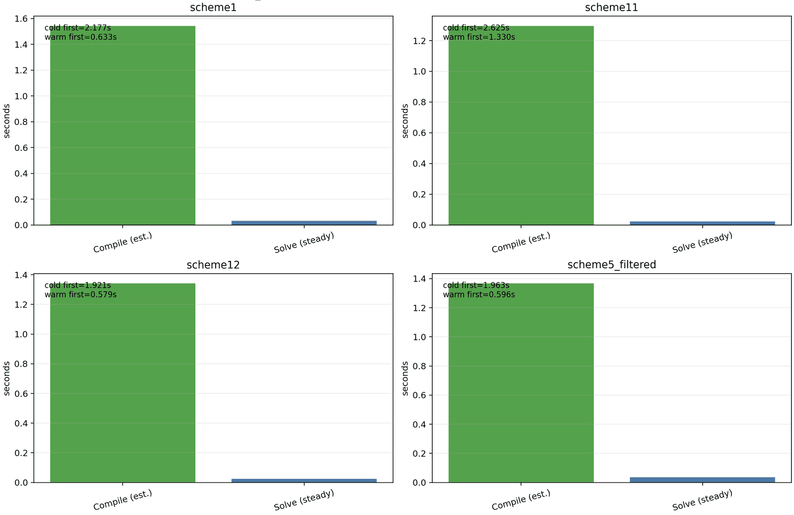

Performance and differentiability
=================================

`sfincs_jax` is designed around a few principles that enable both speed and gradients:

1) **Matrix-free operators**: avoid assembling sparse matrices; apply the discrete operator as a pure function.
2) **JIT compilation**: compile hot kernels (matvecs, residuals, linear solves) with `jax.jit`.
3) **Vectorization**: prefer `vmap`, `einsum`, and batched linear algebra over Python loops.
4) **Explicit separations of concerns**: non-differentiable I/O (reading `.bc`/`wout_*.nc`) is isolated from
   the differentiable compute graph.

For a full, technique-by-technique breakdown (equations, derivations, knobs, and
implementation notes), see :doc:`performance_techniques`.

Current release snapshot
------------------------

The current ``main`` branch release artifacts are:

- CPU: ``tests/scaled_example_suite_release_cpu_frozen_2026-04-25_v106``
- GPU: ``tests/scaled_example_suite_gpu_bounded_default_2026-04-28``

These report:

- ``39/39 parity_ok`` on CPU,
- ``39/39 parity_ok`` on GPU,
- no strict mismatches,
- no ``jax_error``,
- no ``max_attempts``.

The same reports are summarized by the checked-in publication benchmark artifact:

- figure:
  ``docs/_static/figures/paper/sfincs_jax_fortran_suite_benchmark_summary.png``
- summary JSON:
  ``examples/publication_figures/artifacts/sfincs_jax_fortran_suite_benchmark_summary.json``
- generator:
  ``examples/publication_figures/generate_fortran_suite_benchmark_summary.py``

That artifact records median cold JAX/Fortran wall-clock ratios of about
``0.012x`` on CPU and ``0.021x`` on GPU for the plotted production-scale subset,
with median active-memory ratios of about ``2.79x`` on CPU and ``3.61x`` on GPU.
The full process maximum-RSS ratios remain in the JSON reports for audit and are
about ``4.72x`` on CPU and ``9.16x`` on GPU; the public plot subtracts fixed
Python/JAX/XLA runtime baseline memory using profiler ``dpeak_rss_mb``/``drss_mb``
deltas.
The full 39-case suite remains the parity audit, but sub-``10 s`` Fortran rows
are excluded from the public runtime/memory plot because process launch,
filesystem overhead, and JIT amortization dominate those measurements.
The figure itself emphasizes absolute measurements: runtime bars are on the left,
active-memory bars are on the right, and each plotted production-scale case is
shown for SFINCS Fortran v3, ``sfincs_jax`` CPU cold/warm, and ``sfincs_jax`` GPU
cold/warm. Cases are ordered by best warm ``sfincs_jax`` speedup over the Fortran
v3 runtime. Cold is the first external suite command. Warm runtime uses
``jax_runtime_s_warm`` when rerun timings are present. The current frozen reports
were collected with one external command per case, so the warm bars use the
recorded ``jax_logged_elapsed_s`` field as a warm-path fallback; the summary JSON
stores ``warm_or_logged_runtime_source_counts`` and the excluded short-reference
rows to make that provenance explicit.

The performance story is therefore:

- correctness and robustness are release-ready for the current vendored example suite,
- the default CLI path is explicit and tuned for throughput and reliable convergence,
- the differentiable path is available from Python when gradients are needed,
- the CPU runtime drift watchlist is clean against the previously promoted frozen CPU lane,
- the GPU runtime drift watchlist is clean against the previously promoted frozen GPU lane,
- and the remaining work is to reduce runtime and memory on a small number of heavy PAS and geometry-rich cases.

Production-resolution benchmark tier
------------------------------------

The release figure above is intentionally a fast, reproducible example-suite
benchmark. Research-scale performance claims should use the separate
production-resolution input tier:

.. code-block:: bash

   python scripts/create_production_benchmark_inputs.py --clean

By default this writes ``benchmarks/production_resolution_inputs_2026-04-30``
from the public SFINCS_JAX example decks only. It enforces at least
``35 x 43 x 17 x 48`` on 3D grids and ``42 x 1 x 16 x 62`` on tokamak grids,
and the manifest records a ``10 s`` minimum SFINCS Fortran v3 runtime target
for public production timing rows.
Additional local decks can be added without changing the public manifest:

.. code-block:: bash

   python scripts/create_production_benchmark_inputs.py \
     --external-input /path/to/input.namelist \
     --out-root benchmarks/my_production_inputs \
     --clean

The default checked-in manifest now contains ``39`` example-derived cases and no
downstream project decks. Historical downstream inputs can still be imported
with compatibility flags for private reproduction, but they are not part of the
SFINCS_JAX-owned production benchmark tier.

The GitHub workflow ``Production Benchmark Inputs`` is manual-only and validates
this tier without running expensive solves. It regenerates the production input
tree, checks that the manifest is SFINCS_JAX-owned, and can upload the generated
input tree as an artifact for CPU/GPU/Fortran benchmark runners. Full production
runtime and memory sweeps should still be launched on a local workstation,
``office``, or a cluster where the requested CPU/GPU resources are explicit.

The scaled-suite runner also understands these manifest recommendations. When
``--examples-root`` points at a generated ``inputs/`` directory, the sibling
``manifest.json`` is detected automatically and only
``bounded_local_ok`` rows are launched by default:

.. code-block:: bash

   python scripts/run_scaled_example_suite.py \
     --examples-root benchmarks/production_resolution_inputs_2026-04-30/inputs \
     --fortran-exe /path/to/sfincs/fortran/version3/sfincs \
     --fortran-min-runtime-s 10.0 \
     --runtime-adjustment-iters 0 \
     --out-root benchmarks/production_resolution_cpu_local

Raise the guard only on an explicitly budgeted remote or cluster lane:
``--max-run-recommendation bounded_remote``,
``--max-run-recommendation remote_or_cluster_only``, or
``--max-run-recommendation all``. This prevents accidentally launching
remote-only HSX/W7-X production solves on a laptop while still keeping the full
manifest available for scheduled benchmark campaigns.

Current top offenders from the release artifacts plus focused current-tip
reruns are:

- CPU runtime: ``HSX_PASCollisions_fullTrajectories`` at ``4.027 s``
- CPU memory: ``sfincsPaperFigure3_geometryScheme11_PASCollisions_2Species_fullTrajectories`` at ``2298.6 MB``
- GPU runtime: ``monoenergetic_geometryScheme1`` at ``12.909 s``
- GPU memory: ``sfincsPaperFigure3_geometryScheme11_PASCollisions_2Species_fullTrajectories`` at ``2097.6 MB``

In other words, all examples run on CPU and GPU, but a handful of cases remain the clear optimization targets.

Recent current-tip GPU fixes that are now reflected in the release artifacts:

- ``geometryScheme5_3species_loRes`` now takes the bounded host-dense shortcut on the small GPU full-FP branch and completed parity-clean in about ``3.99 s``, down from the older ``144.597 s`` artifact.
- ``monoenergetic_geometryScheme5_ASCII`` now takes the bounded accelerator ``tzfft`` iterative path before any host sparse rescue on GPU and completed parity-clean in about ``3.94 s``.
- ``sfincsPaperFigure3_geometryScheme11_PASCollisions_2Species_fullTrajectories`` now skips an unnecessary sparse-ILU tail after a converged GPU ``schur`` accept and completed parity-clean in about ``7.42 s``.

Fresh bounded GPU solver-path validation:

- The ``2026-04-28`` one-GPU ``office`` pass rejected blanket accelerator dense auto-selection: it remained parity-clean, but regressed ``16`` tiny GPU suite cases and is therefore not the default.
- The accepted policy enables accelerator dense auto-selection only for moderate full-FP RHSMode=1 systems above ``SFINCS_JAX_RHSMODE1_DENSE_FP_ACCELERATOR_MIN``. The full 39-case GPU suite stayed ``39/39 parity_ok``, strict-clean, output-key complete, and runtime-drift clean against ``tests/scaled_example_suite_release_gpu_2026-04-25_v106``.
- The focused full-FP ``Ntheta=13, Nxi=40`` GPU repro now defaults to dense automatically at about ``2.794 s`` and ``1.04 GB`` RSS, compared with about ``9.539 s`` and ``2.14 GB`` for the forced Krylov path, with zero Fortran mismatches.
- The focused ``Ntheta=13, Nxi=20`` repro also stays parity-clean and avoids the pathological forced-Krylov rescue path, which took about ``137.411 s`` on the same GPU.
- A follow-up bounded offender pass promoted geometryScheme=11 full-trajectory
  PAS runs to top-level ``pas_tz`` on one GPU. In the 39-case artifact,
  ``HSX_PASCollisions_fullTrajectories`` stayed parity-clean while moving from
  about ``10.54 s`` / ``2042 MB`` to ``8.47 s`` / ``1577 MB``, and the
  SFINCS-paper geometry11 PAS row moved from about ``7.72 s`` / ``2098 MB`` to
  ``6.41 s`` / ``1609 MB``. Tokamak PAS+Er remains on Schur because forced
  ``xblock_tz``, unpreconditioned, and ``pas_hybrid`` probes all timed out.
- The corrected RHSMode=3 variant benchmark now forces transport solves, not just
  output-field generation. With that harness fix, bounded dense GPU transport is
  enabled for the monoenergetic geometryScheme=1 row: the release artifact moved
  from about ``13.04 s`` / ``996 MB`` to ``3.54 s`` / ``981 MB`` with zero
  practical or strict mismatches.

Recent current-tip PAS-DKES fix:

- ``HSX_PASCollisions_DKESTrajectories`` now auto-selects the structured ``pas_tz`` angular preconditioner on bounded CPU/GPU PAS-DKES cases. The focused CPU frozen-reference probe completed parity-clean in ``3.94 s`` with about ``1019 MB`` RSS, down from the previous table entry of ``5.481 s`` and ``2053.6 MB``. The matching one-GPU default probe on ``office`` completed parity-clean in ``7.63 s`` with about ``1175 MB`` RSS, down from the earlier dense-``xblock_tz`` probe of ``14.18 s`` and ``1530 MB`` on the same machine.

Recent current-tip PAS full-trajectory fix:

- ``HSX_PASCollisions_fullTrajectories`` now auto-selects the structured ``pas_tz`` angular preconditioner on the bounded CPU HSX-like full-trajectory PAS case. The focused CPU frozen-reference probe completed parity-clean in ``4.027 s`` with about ``1384 MB`` RSS, down from the prior release table entry of ``5.274 s`` and ``2002 MB``. The guard intentionally stays off for larger-W7X geometry11 full-trajectory and GPU full-trajectory cases unless a future measured gate proves both faster runtime and unchanged parity.
- The same CPU full-trajectory PAS policy now covers the bounded
  ``sfincsPaperFigure3_geometryScheme11_PASCollisions_2Species_fullTrajectories``
  row after a focused current-tip sweep showed ``pas_tz`` parity-clean and lower
  memory than Schur.  On the local CPU probe, default elapsed time dropped from
  about ``2.76 s`` / ``2263 MB`` to about ``2.01 s`` / ``1474 MB``.  The GPU
  full-trajectory default remains unchanged until a matching measured GPU gate
  proves a win.

Recent current-tip GPU tokamak PAS+Er fix:

- ``tokamak_1species_PASCollisions_withEr_fullTrajectories`` now uses a bounded one-GPU analytic-tokamak PAS+Er route that avoids the expensive ``xblock_tz`` setup and tightens the GMRES tolerance to ``1e-8``. The focused clean-remote ``office`` GPU probe completed parity-clean in ``3.249 s`` with about ``922 MB`` RSS, down from the previous release-table entry of ``18.199 s`` and ``1014.5 MB``. On GPU, medium bounded tokamak PAS+Er cases remain in the structured ``xblock_tz`` active-size window because that route avoids slow sparse fallback on the two-species GPU case.

Recent production-resolution CPU tokamak Er fix:

- ``tokamak_1species_FPCollisions_withEr_DKESTrajectories``,
  ``tokamak_1species_FPCollisions_withEr_fullTrajectories``, and
  ``tokamak_1species_PASCollisions_withEr_fullTrajectories`` now use a bounded
  CPU dense LU default when ``Er`` is nonzero and the active system size is in
  the measured ``5000`` to ``6500`` window. On the local production-resolution
  tier, the FP DKES+Er row dropped from ``130.379 s`` to ``2.148 s``, the FP
  full-trajectory Er row dropped from ``17.955 s`` to ``4.601 s``, and the PAS
  full-trajectory Er row dropped from ``95.302 s`` to ``2.812 s``, all with
  ``0`` Fortran mismatches. The tradeoff is higher transient RSS during dense
  LU, so the policy is CPU-only, byte-capped, and disabled by
  ``SFINCS_JAX_RHSMODE1_TOKAMAK_ER_DENSE=0``. The no-Er PAS control stayed on
  ``pas_tokamak_theta`` at ``1.775 s`` and about ``667 MB``.

Recent current-tip geometry4 PAS memory fix:

- ``geometryScheme4_2species_PAS_noEr`` now uses direct top-level ``pas_tz`` instead of wrapping the same angular block inside the constraint-Schur preconditioner on bounded near-zero-:math:`E_r` geometryScheme=4 PAS cases. The focused CPU probe completed parity-clean in ``1.962 s`` with about ``1728 MB`` RSS, while the clean-remote ``office`` GPU probe completed parity-clean in ``4.774 s`` with about ``1817 MB`` RSS. Disabling the policy with ``SFINCS_JAX_RHSMODE1_GEOM4_PAS_MEMORY_PAS_TZ=0`` restored the heavier Schur route in the same GPU probe (``5.899 s`` and about ``2507 MB`` RSS).

Recent current-tip VMEC monoenergetic memory fix:

- ``monoenergetic_geometryScheme5_ASCII`` and ``monoenergetic_geometryScheme5_netCDF`` now use the low-memory Krylov/``tzfft`` transport path by default for bounded CPU ``RHSMode=3`` VMEC cases. The focused CLI probes stayed parity-clean and reduced profiled RSS from about ``2950-3066 MB`` to ``506.5 MB`` for the ASCII fixture and ``603.2 MB`` for the netCDF fixture. Set ``SFINCS_JAX_TRANSPORT_GEOM5_MONO_LOW_MEMORY=0`` to restore the previous dense batched fallback for comparison.

External solver-library gates
-----------------------------

Additional JAX-ecosystem solver libraries are evaluated behind measured gates, not adopted on sight.

- ``lineax`` remains the strongest current candidate for bounded differentiable linear-solve experiments, but it is not part of the default CLI path.
- On a deterministic nonsymmetric stress matrix, the current local benchmark showed ``lineax.GMRES`` faster than the in-tree path while staying residual-clean (about ``0.39 s`` versus ``0.99 s``).
- On the tiny real SFINCS implicit-diff operator and its repeated-RHS reuse lane, the same local benchmark reached tiny residuals with ``lineax`` (about ``3.2e-16`` and ``7.5e-16``) but still returned failure statuses (maximum-step reached or iterative breakdown), while the in-tree solver stayed admissible and residual-clean (about ``1.4e-14`` and ``4.3e-12``).

So the current policy is:

- do not add ``lineax`` to the production CLI solve ladder yet,
- keep it as a candidate for explicitly bounded differentiable/reference-path experiments,
- require a pinned real-case runtime/RSS/parity win with clean solver status before any production integration.

The executable gate for this decision is:

.. code-block:: bash

   python examples/performance/benchmark_optional_lineax_implicit_solve.py \
     --backend all \
     --suite all \
     --out-json examples/performance/output/lineax_implicit_gate.json

This benchmark is intentionally optional. It always runs the current in-tree
``jax.lax.custom_linear_solve`` path, and it records ``lineax`` as skipped when the
library is not installed. A future Lineax-backed implementation should only be promoted
after all three gates below stay healthy:

- a synthetic deterministic nonsymmetric stress system,
- a tiny real SFINCS implicit-diff solve on
  ``tests/ref/pas_1species_PAS_noEr_tiny_scheme5.input.namelist``,
- and a repeated-RHS reuse case on that same tiny real operator.

For the current in-tree solver, the tiny real gate is already residual-clean with the
benchmark's parity-safe Krylov window. The remaining question is whether a Lineax-backed
path can match that reliability and then provide a real runtime or memory win.

A second optional ecosystem gate checks objective-wrapper libraries on a real
``geometryScheme=4`` differentiable task:

.. code-block:: bash

   python examples/optimization/benchmark_optional_eqx_jaxopt_scheme4_gate.py \
     --backend all \
     --n-theta 17 \
     --n-zeta 17 \
     --maxiter 5 \
     --stepsize 0.1

This gate keeps ``equinox`` and ``jaxopt`` outside the production solver path while
verifying that they can wrap a real repository objective cleanly. In the current local
run, the ``equinox`` wrapper matched a centered finite-difference directional derivative
to about ``1.1e-11`` absolute error, and the bounded ``jaxopt.GradientDescent`` lane
reduced the loss by about ``4.1e-14`` relative to the initial value while recovering
the target harmonic amplitudes to about ``1.6e-08`` in Euclidean norm.

What is differentiable today?
-----------------------------

Within the current parity-tested subset, the following are differentiable with respect to JAX-array parameters:

- The **matrix-free operator** application (F-block and full-system operator blocks).
- The **linear residual** ``r(x) = A x - b`` and Jacobian-vector products via ``jax.jvp``.

The Fortran v3 inputs (namelist files, `.bc`, `wout_*.nc`) are *not* differentiable.
However, once a `V3FullSystemOperator` is constructed, you can treat its fields as parameters and
differentiate objectives with respect to them. For example:

- Differentiate a residual norm w.r.t. ``nu_n`` (see ``examples/autodiff/autodiff_sensitivity_nu_n_scheme5.py``).
- Differentiate a diagnostics functional w.r.t. a differentiable geometry parameter in ``geometryScheme=4`` optimization demos.
- Differentiate a Boozer-spectrum geometry proxy through the optional
  ``vmec_jax -> booz_xform_jax -> sfincs_jax`` handoff in
  ``examples/autodiff/vmec_jax_to_boozer_sfincs_pipeline.py``.
- Differentiate **through a linear solve** via implicit differentiation (see
  ``examples/autodiff/implicit_diff_through_gmres_solve_scheme5.py``).

The release-facing CLI defaults do not force the differentiable path. For Python workflows,
you can request implicit differentiation through the solve using ``differentiable=True``
or the corresponding lower-level solve configuration. When the differentiable path is active,
linear solves use implicit differentiation (``jax.lax.custom_linear_solve``).

The VMEC/Boozer handoff example differentiates through JAX arrays and the
``booz_xform_jax`` transform, not through file I/O.  The current file-based
``wout`` and ``.bc`` readers remain provenance and parity tools; JAX-native
producers are the route for geometry sensitivities.

JAX-native performance patterns used in `sfincs_jax`
----------------------------------------------------

- **Keep arrays on-device**: build JAX arrays once and reuse them across matvec calls.
- **Use stable dtypes**: the v3 parity target requires 64-bit floats; `sfincs_jax` enables `jax_enable_x64`.
- **Avoid redundant dtype conversions**: collisionless and magnetic-drift operator kernels now cast
  `f` once per application (rather than per sub-term), reducing matvec overhead in PAS/FP hot cases.
- **Avoid Python loops in hot paths**:

  - For fixed-size recurrences (e.g. Legendre-coupled pitch-angle structure), prefer `jax.lax.scan` or
    banded updates via `at[].add(...)`.
  - For dense transforms, prefer `einsum`/batched `@` so XLA can fuse.
  - For Fourier-mode operations on uniform periodic grids, prefer `jax.numpy.fft` over explicit harmonic loops
    (e.g. `uHat` in `sfincs_jax.diagnostics`).
  - **Keep matvec control‑flow free** when using JAX GMRES/BiCGStab: avoid `lax.scan`/`lax.fori_loop`
    inside matrix-free operator applications. Use static fused sums instead.

- **Exploit linearity**: for linear runs, the operator is constant; store and reuse the assembled RHS and
  re-run only GMRES when parameters change.
- **Batch transport RHS solves when possible**: for ``RHSMode=2/3`` dense branches, `sfincs_jax`
  now assembles the dense operator once and solves all ``whichRHS`` right-hand sides in one
  batched linear solve, reducing repeated operator assembly and retracing overhead.
- **Vectorized RHSMode=1 diagnostics**: vm-only moment/flux accumulation and output shaping are
  stacked/batched in JAX for non-``Phi1`` runs, reducing Python-loop overhead during
  ``write_sfincs_jax_output_h5(..., compute_solution=True)``.
- **Fast weighted reductions in diagnostics**: transport/rhsmode1 weighted sums now use
  fused ``einsum`` kernels by default (with an opt-in strict-order fallback), reducing
  diagnostic accumulation overhead in both RHSMode=1 and RHSMode=2/3 paths.
- **Vectorized transport-matrix assembly**: RHSMode=2/3 now builds
  ``transportMatrix`` directly from batched flux arrays, avoiding per-``whichRHS``
  Python loops and repeated diagnostic tree slicing.
- **Precomputed transport diagnostics**: geometry/species factors shared across ``whichRHS``
  solves are precomputed once and reused in batched diagnostics, reducing runtime and JIT work
  in transport-matrix modes.
- **Recycled transport solves**: optional warm-start recycling keeps a small number of
  recent solution vectors across ``whichRHS`` iterations (``SFINCS_JAX_TRANSPORT_RECYCLE_K``),
  reducing Krylov iterations on sequential RHS solves.
- **Cross-run Krylov recycling**: set ``SFINCS_JAX_STATE_OUT``/``SFINCS_JAX_STATE_IN`` (or
  ``SFINCS_JAX_TRANSPORT_RECYCLE_STATE=0`` to disable) to reuse transport solutions between
  adjacent scan points with matching operators. For built-in scans, enable
  ``SFINCS_JAX_SCAN_RECYCLE=1`` to wire these automatically.
- **Transport preconditioning (default)**: RHSMode=2/3 transport solves use a JAX-native
  preconditioner built analytically from the collision operator. By default (BiCGStab),
  a collision-diagonal preconditioner is used. For FP cases and GMRES-based transport solves,
  ``SFINCS_JAX_TRANSPORT_PRECOND=auto`` promotes a lightweight **species×x block-Jacobi**
  (per-L) preconditioner for modest system sizes. This cuts iterations without matvec-based
  assembly and preserves parity on the reduced suite.
- **Explicit sparse-helper factor reuse**: hard RHSMode=2/3 high-``nu'`` executable
  runs can opt into bounded host sparse-LU rescue. The W7-X FP high-``nu'`` pilot
  now assembles/factorizes the active transport operator once and reuses it across
  the later RHS solves, reducing the one-point office GPU wall time from about
  ``2028 s`` to ``582 s`` while preserving identical transport outputs.
- **FP collision preconditioning (RHSMode=1)**: when the collision preconditioner is active
  and ``SFINCS_JAX_RHSMODE1_COLLISION_PRECOND_KIND`` is unset, FP cases auto-select a
  species×x block (``sxblock``) for small ``S*X`` and fall back to per-species x-blocks
  for larger systems. This reduces dense fallbacks in FP-heavy runs.
- **Low-rank FP preconditioning**: optional Woodbury corrections approximate the dense
  FP species×x blocks with a low-rank update to reduce setup and apply costs.
- **Coarse x-grid preconditioning**: ``SFINCS_JAX_TRANSPORT_PRECOND=xmg`` adds a two-level
  x-grid correction (coarse solve + fine diagonal smoother) to reduce PAS/FP iterations.
- **Mixed-precision preconditioners**: ``SFINCS_JAX_PRECOND_DTYPE`` defaults to ``auto``
  (float32 for large systems, float64 otherwise) to reduce memory and preconditioner cost
  while keeping Krylov solves in float64. ``SFINCS_JAX_PRECOND_FP32_MIN_SIZE`` controls
  the auto threshold, and ``SFINCS_JAX_PRECOND_FP32_MIN_BLOCK`` controls the per-block
  auto threshold.
- **Auto Schur for PAS constraints**: when ``constraintScheme=2`` and PAS collisions
  are active, large systems default to a Schur-complement preconditioner
  (``SFINCS_JAX_RHSMODE1_SCHUR_AUTO_MIN``) to reduce Krylov iterations in HSX-like cases.
- **Cached Boozer `.bc` parsing**: scheme11/12 geometry loading now caches parsed
  surfaces by content digest (plus geometry scheme), so repeated localized/copy paths of
  the same equilibrium file reuse one parsed surface table.
- **Cached f-block operators**: reuse collisionless/collision/magnetic-drift operators
  across repeated runs with identical geometry and physics settings (e.g., scans that
  only change :math:`E_r`).
- **Vectorized NTV accumulation across nonlinear iterates**: RHSMode=1 output writing now
  computes NTV from stacked iterates in one batched JAX call instead of Python per-iterate loops.
- **Auto active-DOF reduction for RHSMode=1 (no Phi1)**: when ``Nxi_for_x`` truncates
  the pitch basis, the linear solve now reduces to active unknowns by default, cutting
  both matrix-free solve cost and JIT work on upstream-style reduced cases.
- **Persistent cache in automated suite runs**: ``scripts/run_reduced_upstream_suite.py`` and
  the full example-suite runners can reuse a persistent JAX compilation cache when
  ``--jax-cache-dir`` is set explicitly.
- **Opt-in eager precompile**: ``SFINCS_JAX_PRECOMPILE`` is now explicit opt-in. A persistent
  JAX compilation cache can still amortize repeated workflows, but single-shot CLI solves and
  runtime audits no longer pay an extra eager compile pass just because a cache directory exists.
- **Warm runtime reporting**: use repeated JAX runs in the reduced-suite or full example-suite
  runners when you want steady-state runtime after the first (cold-compile) run.
- **Remove dead Jacobian work in hot matvec paths**: direct-Phi1 ``factorJ`` kinetic-row terms
  that are absent in v3 ``whichMatrix=3`` are not assembled, improving parity and avoiding
  unnecessary FLOPs in includePhi1-in-kinetic matrix applications.
- **Use implicit differentiation for solve gradients**: for objectives that depend on the solution `x(p)` of
  a linear system `A(p) x = b(p)`, prefer `jax.lax.custom_linear_solve` (adjoint solve) over
  differentiating through Krylov iterations.
- **Default to short-recurrence Krylov for transport**: BiCGStab avoids storing a full GMRES basis and
  is therefore far more memory efficient for large RHSMode=2/3 systems. GMRES remains available and is
  used as a fallback when BiCGStab stagnates; transport-matrix solves default to BiCGStab with the
  collision-diagonal preconditioner for speed and memory efficiency. RHSMode=1 remains GMRES-first for
  parity. [#petsc-bcgs]_
- **JIT-compiled Krylov solves (default)**: `sfincs_jax` now JIT-compiles the GMRES/BiCGStab wrappers
  to reduce Python overhead for iterative solves; set ``SFINCS_JAX_SOLVER_JIT=0`` to disable.

Explicit sparse host/device split helper
----------------------------------------

The reusable helper module ``sfincs_jax.explicit_sparse`` keeps the explicit sparse
policy separate from the solver driver. It is intended for the performance-first
CLI path and for future integration of sparse host-side rescues, not for the
default differentiable reference path.

It accepts dense JAX/NumPy matrices, sparse-like block tables, or matrix-free
callbacks and chooses one of three storage kinds:

- ``dense``: keep a host dense array,
- ``csr``: materialize a host SciPy CSR matrix,
- ``linear_operator``: keep only a host ``LinearOperator`` when a materialized
  matrix would exceed the configured budget.

The decision is deterministic and based on simple byte estimates:

.. math::

   \text{dense bytes} = N_{\text{rows}} N_{\text{cols}} \cdot \text{itemsize}

and for CSR,

.. math::

   \text{csr bytes} \approx \text{nnz} \cdot (\text{data itemsize} + \text{index itemsize})
   + (N_{\text{rows}} + 1) \cdot \text{index itemsize}.

Implementation: ``sfincs_jax.explicit_sparse``.

Public entry points:

- ``choose_storage_kind``
- ``build_operator_from_dense``
- ``build_operator_from_blocks``
- ``build_operator_from_matvec``
- ``factorize_host_sparse_operator``

The helper can be used to:

- materialize structured sparse operators on the host when that is cheaper than
  carrying a full dense matrix,
- factor the host-side sparse operator with SciPy ``splu`` or ``spilu`` for a
  deterministic explicit fallback,
- or keep only a ``LinearOperator`` when even sparse materialization would exceed
  the configured budget.

Current integration points:

- transport sparse-direct host solves now use the helper when
  ``SFINCS_JAX_TRANSPORT_SPARSE_HELPER`` selects the explicit path,
- RHSMode=1 host sparse-direct rescues can opt into the same explicit factor path
  through ``SFINCS_JAX_RHSMODE1_EXPLICIT_SPARSE_HELPER``,
- both paths remain outside the differentiable reference solve stack.

Solver defaults (Phi1 + sharding)
---------------------------------

- **Dense Newton step for small Phi1 systems**: when ``includePhi1 = .true.`` and
  the linearized system is modest, the Newton–Krylov inner solve uses a dense
  Newton step instead of GMRES. This removes Krylov setup overhead and matches
  v3 parity for small Phi1 fixtures.
  The cutoff is ``SFINCS_JAX_PHI1_NK_DENSE_CUTOFF`` (default: ``5000``) and is applied
  in ``sfincs_jax/io.py``.
- **Full Newton updates for Phi1 by default**: includePhi1 runs now update the
  Jacobian each Newton step (mirroring v3). Frozen linearization is opt‑in via
  ``SFINCS_JAX_PHI1_USE_FROZEN_LINEARIZATION``.
- **FP dense fallback threshold (RHSMode=1)**: full Fokker–Planck cases use a higher
  dense fallback ceiling to recover Fortran convergence when Krylov stagnates.
  The FP-specific cutoff is ``SFINCS_JAX_RHSMODE1_DENSE_FP_MAX`` (default: ``5000``),
  while generic RHSMode=1 dense fallbacks use ``SFINCS_JAX_RHSMODE1_DENSE_FALLBACK_MAX``
  (default: ``400``).
- **Small FP dense defaults (RHSMode=1)**: for modest system sizes, `sfincs_jax`
  defaults to a direct dense solve for full Fokker–Planck systems to avoid expensive
  Krylov + fallback paths while matching v3 parity. The FP cutoff is
  ``SFINCS_JAX_RHSMODE1_DENSE_FP_CUTOFF`` (default:
  ``min(SFINCS_JAX_RHSMODE1_DENSE_ACTIVE_CUTOFF, 5000)``). On accelerators, the
  same shortcut is only automatic above
  ``SFINCS_JAX_RHSMODE1_DENSE_FP_ACCELERATOR_MIN`` (default: ``1000``), since the
  current GPU suite shows tiny FP systems are faster on the lower-overhead
  matrix-free path. PAS uses Krylov by default to preserve parity and can be
  forced into dense fallback by setting ``SFINCS_JAX_RHSMODE1_DENSE_PAS_MAX`` explicitly.
- **Bounded tokamak electric-field dense default (RHSMode=1)**: production-resolution
  CPU tokamak Er cases just above the generic dense cutoff can spend tens of seconds
  in the Krylov/strong/sparse-rescue ladder even though dense LU is parity-clean.
  The measured default gate is CPU-only, non-differentiable, ``RHSMode=1``, no
  Phi1, ``N_zeta = 1``, nonzero ``Er``/potential-gradient drive, and active size
  between ``SFINCS_JAX_RHSMODE1_TOKAMAK_ER_DENSE_MIN`` and
  ``SFINCS_JAX_RHSMODE1_TOKAMAK_ER_DENSE_MAX`` (defaults ``5000`` and ``6500``).
  The dense matrix must also fit below
  ``SFINCS_JAX_RHSMODE1_TOKAMAK_ER_DENSE_MAX_BYTES`` (default ``350000000``).
  Disable this policy with ``SFINCS_JAX_RHSMODE1_TOKAMAK_ER_DENSE=0`` on
  memory-constrained hosts.
- **Large FP stage-2 polish (RHSMode=1)**: for large full-FP systems, stage-2 GMRES
  polish remains enabled by default with a larger elapsed-time budget, so difficult
  high-resolution cases can converge without external reference overlays.
  The defaults are capped for runtime safety (stage-2 ``maxiter`` up to ``600``,
  ``restart`` up to ``100`` in this regime), and controlled by
  ``SFINCS_JAX_LINEAR_STAGE2_MAXITER`` / ``SFINCS_JAX_LINEAR_STAGE2_RESTART``.
- **Large FP strong-preconditioner guard**: when active size is very large, expensive
  line/block strong-preconditioner fallbacks are skipped by default to prevent
  out-of-memory allocations. The cutoff is
  ``SFINCS_JAX_RHSMODE1_FP_STRONG_PRECOND_MAX`` (default: ``120000`` active DOFs).
- **PAS dense fallback threshold (RHSMode=1)**: PAS/constraintScheme=2 cases now
  disable dense fallback unless explicitly enabled via
  ``SFINCS_JAX_RHSMODE1_DENSE_PAS_MAX`` (or unless ``constraintScheme=0``), since
  the dense branch can drift from PETSc-style approximate solutions in small PAS runs.
- **Transport dense retry memory cap**: dense transport retries are only allowed if the
  estimated dense matrix stays below ``SFINCS_JAX_TRANSPORT_DENSE_MAX_MB`` (default:
  ``128`` MB) to avoid excessive memory use.
- **Dense solve guardrail**: ``SFINCS_JAX_DENSE_MAX`` caps the maximum vector size for
  direct dense solves (default: ``8000``), keeping accidental large dense assemblies
  from blowing up memory.
- **Sharded matvec on single‑device runs**: if ``SFINCS_JAX_MATVEC_SHARD_AXIS`` is set
  but only one device is available, sharding constraints are skipped and the standard
  unsharded matvec path is used (no functional change, just a no‑op).

Historical profiling notes
--------------------------

The case studies below are still useful because they explain where time is spent inside the
solver stack, but they are historical profiling notes rather than the release-facing status
summary. For current release claims, use the full example-suite artifacts listed above.

**PAS, tokamak, no Er (``tokamak_1species_PASCollisions_noEr``)**:

- Fortran: ~0.042 s; JAX: ~3.83 s.
- Dominant cost: RHSMode=1 solve (``rhs1_solve_done`` ~5.96 s) with PAS
  ``xblock_tz`` preconditioner (build ~1.9 s).
- Cheaper theta-line preconditioning was **slower** and increased peak RSS
  (``~4.7 GB`` vs ``~1.4 GB``), so the default ``xblock_tz`` is retained.
- Design note: the PAS collision preconditioner probe indicates weak collision-only
  residual reduction, so the stronger x‑block preconditioner is necessary for parity.

**PAS, tokamak, with Er, full trajectories
(``tokamak_1species_PASCollisions_withEr_fullTrajectories``)**:

- Frozen full-suite artifact on ``main`` before the current bounded retune:
  Fortran ``~0.017 s``; JAX CPU ``~37.7 s``.
- Current bounded CPU benchmark on the same frozen scaled case:
  default auto path now promotes to ``xblock_tz`` and runs in ``~3.6 s`` with
  ``0`` mismatches versus the pinned output artifact.
- Current bounded one-GPU benchmark on ``office``:
  default auto path skips the expensive ``xblock_tz`` setup, tightens GMRES to
  ``1e-8``, and runs in ``~3.25 s`` with ``0`` mismatches versus the pinned output
  artifact. The maximum ``pressureAnisotropy`` difference against the frozen
  reference was below ``9e-10`` absolute and ``2e-7`` relative.
- The key change is not a new equation or solver family. It is a better default
  branch choice for bounded tokamak PAS+Er cases: on CPU, prefer ``xblock_tz``
  before ``pas_schur`` when the active system and
  :math:`(L,\theta,\zeta)` block stay inside the configured cap; on GPU, avoid
  that setup when the bounded unpreconditioned route converges parity-clean with
  the tighter tolerance.
- This removes the old ``pas_schur -> xblock_tz`` fallback ladder on the pinned
  offender and turns it into a direct parity-clean solve.

**PAS, W7‑X paper Fig. 3 case
(``sfincsPaperFigure3_geometryScheme11_PASCollisions_2Species_fullTrajectories``)**:

- Fortran: ~0.014 s; JAX: ~1.75 s.
- Dominant cost: **dense RHSMode=1 solve** for a small system (``n=808``).
  The dense shortcut improves parity and robustness but is still dominated by
  Python/JAX overhead relative to Fortran for tiny runs.

**Transport matrix, W7‑X geometryScheme=11
(``transportMatrix_geometryScheme11``)**:

- Fortran: ~0.143 s; JAX: ~8.26 s.
- Dominant cost: RHSMode=2 ``whichRHS`` loop, each RHS falling back to a dense
  solve after BiCGStab/GMRES retries. Dense solver caching is already active,
  so the remaining cost is per‑RHS dense apply + matvec fallback.
- **Update**: the new **dense batch fallback** now solves all RHS in one dense
  factorization once a dense fallback is triggered, reducing this case to
  ~5.1 s on the same input (single-device, cold start).
- Next optimization target: a stronger transport preconditioner to avoid dense
  fallbacks entirely on W7‑X geometryScheme=11 cases.

Krylov solver strategy (memory + recycling)
-------------------------------------------

`sfincs_jax` defaults RHSMode=1 linear solves to GMRES and supports BiCGStab as an
opt-in low-memory option with GMRES fallback on stagnation. For RHSMode=2/3 transport-matrix solves we
default to BiCGStab and apply the collision-diagonal preconditioner by default, with GMRES as the
fallback. This keeps memory usage low while preserving the current release-facing parity guarantees. [#petsc-bcgs]_

For RHSMode=2/3 transport matrices, the ``whichRHS`` loop solves a sequence of linear systems with
nearly identical operators. We prototype a lightweight recycling hook that reuses the last ``k``
solution vectors as a warm start for the next solve. This is a small, practical approximation to
fully recycled Krylov methods such as GCRO-DR, which are designed explicitly for sequences of systems.
[#gcrodr]_ In practice it can reduce iterations without altering the linear operator or diagnostics.

For scans (e.g., ``sfincsScan``), you can enable on-disk Krylov recycling by writing a state file
after each run (``SFINCS_JAX_STATE_OUT``) and pointing the next run at it
(``SFINCS_JAX_STATE_IN``). When enabled, the transport solver will also seed its recycling basis
from the stored solutions to cut iterations between adjacent scan points.

Potential next solvers to explore (for further memory reductions or faster convergence on stiff cases):

- **IDR(s)**: short-recurrence, low-memory solvers for nonsymmetric systems with strong convergence
  properties on many practical problems. [#idrs]_
- **GCRO-DR / GMRES-DR / LGMRES**: recycled and deflated GMRES variants that explicitly reuse subspaces
  across sequences of linear systems. [#gcrodr]_

RHSMode=1 GMRES preconditioning (experimental)
----------------------------------------------

For RHSMode=1 linear solves that use matrix-free GMRES (as opposed to the dense assemble-from-matvec
path), you can enable an optional JAX-native preconditioner via an environment variable:

- ``SFINCS_JAX_RHSMODE1_PRECONDITIONER=point`` (or ``1``): point-block Jacobi on local (x,L) unknowns
  at each :math:`(\theta,\zeta)` (cheap, but can be too weak for stiff non-axisymmetric cases).
- ``SFINCS_JAX_RHSMODE1_PRECONDITIONER=collision``: collision-diagonal preconditioner using the
  analytic PAS/FP diagonal (cheap, effective for collision-dominated PAS/FP cases). For FP
  runs you can opt in to an x-block inverse per L via
  ``SFINCS_JAX_RHSMODE1_COLLISION_PRECOND_KIND=xblock`` or a full species×x block via
  ``SFINCS_JAX_RHSMODE1_COLLISION_PRECOND_KIND=sxblock``. Use
  ``SFINCS_JAX_RHSMODE1_FP_LOW_RANK_K`` (or ``SFINCS_JAX_FP_LOW_RANK_K``) to enable
  a low-rank Woodbury correction for the FP species×x blocks.
- ``SFINCS_JAX_RHSMODE1_PRECONDITIONER=sxblock_tz``: per‑:math:`L` species×x block over
  :math:`(\theta,\zeta)` (captures angular + inter-species coupling; higher setup cost).
- ``SFINCS_JAX_RHSMODE1_PRECONDITIONER=theta_line``: theta-line block preconditioning that couples
  all theta points (at fixed zeta) for all local (x,L) unknowns (stronger, higher setup cost).
- ``SFINCS_JAX_RHSMODE1_PRECONDITIONER=zeta_line``: zeta-line block preconditioning that couples
  all zeta points (at fixed theta) for all local (x,L) unknowns (stronger, higher setup cost).
- ``SFINCS_JAX_RHSMODE1_PRECONDITIONER=adi``: apply theta-line then zeta-line preconditioning
  sequentially (strongest of the built-ins, highest setup + apply cost).
- ``SFINCS_JAX_RHSMODE1_PRECONDITIONER=0``: disable.

The regularization used when inverting preconditioner blocks can be tuned with:

- ``SFINCS_JAX_RHSMODE1_PRECOND_REG`` (default: ``1e-10``).
- ``SFINCS_JAX_RHSMODE1_COLLISION_PRECOND_MIN``: minimum ``total_size`` for default collision
  preconditioning when preconditioner options are not set (default: 600).

These options are most useful when you also select a Krylov solve method for RHSMode=1 via:

- ``SFINCS_JAX_RHSMODE1_SOLVE_METHOD=incremental`` (or ``batched``).

You can also control which side the preconditioner is applied on:

- ``SFINCS_JAX_GMRES_PRECONDITION_SIDE=left`` (default): left-preconditioned GMRES.
- ``SFINCS_JAX_GMRES_PRECONDITION_SIDE=right``: right-preconditioned GMRES (PETSc-like default).

BiCGStab can optionally reuse the RHSMode=1 preconditioner:

- ``SFINCS_JAX_RHSMODE1_BICGSTAB_PRECOND=rhs1`` (or ``same``).

.. note::

   Preconditioners change the Krylov iteration path and can therefore affect strict line-by-line
   parity with PETSc in near-singular branches. They are mainly intended to reduce runtime while
   preserving practical output parity.

Future optimization ideas (optional)
------------------------------------

Parity is now achieved for the current full CPU and GPU example-suite audits, so remaining performance work is
profiling-driven and optional. High-ROI ideas to revisit if runtime becomes a bottleneck:

1. **Deeper Krylov recycling/deflation** (GCRO-DR / GMRES-DR) for long transport scans.
2. **Multilevel x-grid preconditioning** (coarse V-cycles) for stiff PAS/FP operators.
3. **Mixed-precision factorization** for FP block preconditioners (keep solves in float64).

.. [#petsc-bcgs] PETSc KSPBCGS manual page (BiCGStab solver notes, including memory behavior vs GMRES),
   https://petsc.gitlab.io/petsc/main/manualpages/KSP/KSPBCGS/
.. [#idrs] P. Sonneveld & M. van Gijzen, “IDR(s): a family of simple and fast algorithms for solving
   large nonsymmetric linear systems,” SIAM J. Sci. Comput. 31(2), 2008. TU Delft research portal:
   https://research.tudelft.nl/en/publications/idrs-a-family-of-simple-and-fast-algorithms-for-solving-large-non-2
.. [#gcrodr] E. de Sturler & M. L. Parks, “Analysis of Krylov subspace recycling for sequences of linear
   systems,” SAND2005-2794C, OSTI 970200, 2005.
   https://www.osti.gov/biblio/970200

Links to the JAX ecosystem (optional)
-------------------------------------

The package currently uses a lightweight in-repo GMRES implementation for parity control. For more advanced
workflows, the JAX ecosystem can be integrated cleanly once the residual is expressed in a differentiable way:

- `optax`: gradient-based optimization with schedules, constraints, and modern optimizers.
- `lineax`: optional benchmark target for differentiable linear solves, currently gated
  by ``examples/performance/benchmark_optional_lineax_implicit_solve.py`` and not used
  by the production CLI solver.

Parity tuning environment variables (developer)
-----------------------------------------------

For targeted parity debugging on difficult reduced fixtures, the solver exposes
opt-in environment variables:

- ``SFINCS_JAX_PHI1_NONLINEAR_RTOL``:
  override nonlinear relative stop for the includePhi1 frozen-linearization path.
- ``SFINCS_JAX_PHI1_NK_SOLVE_METHOD``:
  force Newton linear subsolve method (``dense``, ``incremental``, or ``batched``).
- ``SFINCS_JAX_PHI1_USE_FROZEN_LINEARIZATION``:
  force includePhi1 nonlinear branch to frozen/non-frozen Jacobian mode.
- ``SFINCS_JAX_PHI1_FROZEN_JAC_MODE``:
  select frozen-Jacobian variant for includePhi1 (``frozen``, ``frozen_rhs``, or ``frozen_op``; default ``frozen_rhs``).
- ``SFINCS_JAX_PHI1_GMRES_TOL``:
  override GMRES tolerance inside the includePhi1 nonlinear Newton–Krylov solves.
- ``SFINCS_JAX_PHI1_GMRES_MAXITER``:
  override GMRES max iterations inside includePhi1 Newton–Krylov solves.
- ``SFINCS_JAX_PHI1_LINESEARCH_FACTOR``:
  override the relative residual decrease required to accept a Newton step (legacy mode).
- ``SFINCS_JAX_PHI1_LINESEARCH_C1``:
  Armijo coefficient for the PETSc-style backtracking rule (default 1e-4).
- ``SFINCS_JAX_PHI1_LINESEARCH_MODE``:
  ``petsc`` (default for includePhi1 parity) uses the first step that satisfies the Armijo condition,
  ``best`` picks the step with the smallest residual among backtracking candidates,
  ``basic``/``full`` accept the full Newton step (no backtracking).
- ``SFINCS_JAX_PHI1_LINESEARCH_MAXITER``:
  override the maximum number of backtracking reductions (default 40 in ``petsc`` mode).
- ``SFINCS_JAX_PHI1_STEP_SCALE``:
  scale the Newton update step size (default 1.0); lower values damp iteration history.
- ``SFINCS_JAX_PHI1_QN_DIAG_SCALE``:
  scale the quasineutrality Phi1 diagonal stabilization (default 1.0).
- ``SFINCS_JAX_PHI1_MIN_ITERS``:
  minimum includePhi1 nonlinear iterations to record (default 4 in parity mode).
- ``SFINCS_JAX_TRANSPORT_MATVEC_MODE``:
  force transport-matrix matvec operator branch (``base`` or ``rhs``).
- ``SFINCS_JAX_TRANSPORT_DIAG_OP``:
  force diagnostics operator branch in transport-matrix runs (``base`` or ``rhs``).
- ``SFINCS_JAX_TRANSPORT_FORCE_KRYLOV``:
  disable the small-system dense fallback in RHSMode=2/3 and keep Krylov solves.
- ``SFINCS_JAX_TRANSPORT_EPAR_LOOSE``:
  opt-in looser GMRES tolerance for RHSMode=2 whichRHS=3 (E_parallel column), for parity experiments.
- ``SFINCS_JAX_TRANSPORT_EPAR_TOL``:
  override the tolerance used when ``SFINCS_JAX_TRANSPORT_EPAR_LOOSE`` is enabled (default 1e-8).
- ``SFINCS_JAX_TRANSPORT_EPAR_KRYLOV``:
  force Krylov (incremental GMRES) for RHSMode=2 whichRHS=3 regardless of dense fallback.
- ``SFINCS_JAX_TRANSPORT_PROJECT_NULLSPACE``:
  apply a constraint-space nullspace projection for RHSMode=2 whichRHS=3 (default on; set to 0 to disable).
- ``SFINCS_JAX_TRANSPORT_PROJECT_NULLSPACE_ATOL``:
  skip the projection when the constraint residual max-norm is below this threshold (default 1e-9).
- ``SFINCS_JAX_DENSE_REG``:
  override dense solve regularization strength for singular/near-singular systems.
- ``SFINCS_JAX_DENSE_SINGULAR_MODE``:
  choose singular branch handling in dense solves (default regularized mode; ``lstsq`` for minimum-norm).
- ``SFINCS_JAX_STRICT_SUM_ORDER``:
  force explicit loop-order weighted sums in diagnostics (debug/parity mode); by default
  fast fused ``einsum`` reductions are used.
- ``SFINCS_JAX_REMAT_COLLISIONS``:
  enable gradient checkpointing (``jax.checkpoint``) around collision operators to reduce peak memory
  during autodiff (``auto`` uses ``SFINCS_JAX_REMAT_COLLISIONS_MIN``; default 20000).
- ``SFINCS_JAX_REMAT_TRANSPORT_DIAGNOSTICS``:
  enable gradient checkpointing around transport diagnostics (``auto`` uses
  ``SFINCS_JAX_REMAT_TRANSPORT_DIAGNOSTICS_MIN``; default 20000).
- ``SFINCS_JAX_PRECOMPILE``:
  ahead-of-time compile core kernels when JAX persistent cache is enabled (``auto`` by default when
  ``JAX_COMPILATION_CACHE_DIR`` is set).

Reference benchmark figure (README/index)
-----------------------------------------

The repository includes a reproducible script that generates the top-level parity/runtime
comparison figure used in ``README.md`` and the docs index:

.. code-block:: bash

   python examples/performance/benchmark_transport_l11_vs_fortran.py --repeats 4

By default this uses frozen Fortran fixtures from ``tests/ref`` (no local Fortran runtime required).
If a local Fortran executable is available, pass ``--fortran-exe /path/to/sfincs`` for live runs.

Latest fixture-based snapshot (4 repeats, compile excluded for JAX):

.. list-table::
   :header-rows: 1
   :widths: 20 20 24 16

   * - Case
     - Fortran mean (s/run)
     - sfincs_jax mean (s/run)
     - max abs(ΔL11)
   * - ``scheme1``
     - 0.0275
     - 0.0937
     - 3.10e-13
   * - ``scheme11``
     - 3.6393
     - 0.1285
     - 1.39e-15
   * - ``scheme12``
     - 0.00888
     - 0.1073
     - 8.82e-08
   * - ``scheme5_filtered``
     - 2.9621
     - 0.1138
     - 5.30e-16

Fixture snapshot note: these values come from the frozen Fortran fixtures used by
``examples/performance/benchmark_transport_l11_vs_fortran.py`` when no local Fortran
executable is provided.

Persistent-cache compile/runtime split
--------------------------------------

To separate compile cost from steady solve time with the JAX persistent cache:

.. code-block:: bash

   python examples/performance/profile_transport_compile_runtime_cache.py --repeats 3

   For each case, compile estimate = cold first call - warm first call; steady solve is the warm repeated runtime.

Latest snapshot (3 repeats):

.. list-table::
   :header-rows: 1
   :widths: 20 20 20

   * - Case
     - Compile estimate (s)
     - Warm steady solve (s/run)
   * - ``scheme1``
     - 1.5432
     - 0.0327
   * - ``scheme11``
     - 1.2959
     - 0.0232
   * - ``scheme12``
     - 1.3417
     - 0.0237
   * - ``scheme5_filtered``
     - 1.3672
     - 0.0364

Deep profiling without perturbing GPU timings
---------------------------------------------

For release benchmarking and the reduced/full example-suite audits, the suite
harness now runs ``sfincs_jax`` with profiler marks disabled by default.
Wall-clock runtime and the solver's ``elapsed_s=...`` output are sufficient for
runtime drift auditing, and avoiding per-phase probes keeps the benchmark from
measuring itself. Repeated ``jax.devices()[0].memory_stats()`` polling inside hot
GPU phases can distort wall-clock timings badly on current JAX/CUDA stacks, so
explicit profiling is opt-in:

- ``SFINCS_JAX_PROFILE=0``:
  default for runtime suites and recommended for release-facing timing audits.
- ``SFINCS_JAX_PROFILE=1``:
  enable phase timing + host RSS marks in logs.
- ``SFINCS_JAX_PROFILE_DEVICE_MEM=1``:
  also sample device memory at each mark. Use this only for targeted diagnosis,
  not for benchmark lanes.
- ``SFINCS_JAX_PROFILE=full``:
  shorthand for timing/RSS plus per-mark device-memory sampling.

For full XLA/kernel traces, prefer the dedicated write-output trace helper:

.. code-block:: bash

   python scripts/profile_write_output_trace.py \
     --input tests/reduced_inputs/tokamak_2species_PASCollisions_noEr.input.namelist \
     --trace-dir /tmp/sfincs_trace_tokamak2 \
     --perfetto

Use ``--warmup 0`` to include compile/lowering time in the trace, or ``--warmup 1``
to focus on steady-state kernels. Add ``--device-memory-profile /tmp/sfincs_memory.pb``
for a one-shot device-memory snapshot instead of per-mark polling. For RHSMode=1
profile-current or distribution-function diagnostics, add ``--compute-solution``;
otherwise the helper only writes geometry/output fields and ``NIterations`` remains
zero.

The trace helper writes a timeout-safe JSON phase log at
``<trace-dir>/profile_write_output_trace_phases.json`` by default, or at the
path passed with ``--phase-log``. The sidecar records input preparation, warmup,
the JAX profiler context, the actual output solve/write phase, ``block_until_ready``,
and optional device-memory snapshotting. If the output solve finishes but JAX/XPlane/
Perfetto finalization fails, the helper returns solve success by default and records
``status="solve_completed_profile_incomplete"`` in the phase log. Use
``--strict-profiler`` when a profiling lane should fail CI if trace finalization
or device-memory snapshotting fails after a valid output file has already been written.
Use ``--no-jax-trace`` for long production audits that need the phase log and
Fortran-like solver output but should avoid XPlane/Perfetto overhead entirely.
The phase log is refreshed while a long solve is running; tune that heartbeat with
``--phase-log-interval-s``. Add ``--solver-trace path/to/solver_trace.json`` when
the run should also persist the solver/backend/residual metadata sidecar produced
by the output writer.

Memory footprint and compilation-time optimization (literature-backed)
-----------------------------------------------------------------------

The main memory and compile-time levers for ``sfincs_jax`` map to standard JAX/XLA
mechanisms and Krylov-solver theory. The items below are the highest-ROI, literature-backed
paths we use to guide performance work:

- **Measure device + host allocation hotspots** using the JAX device memory profiler and
  XLA/trace timelines before changing algorithms. This pinpoints which buffers dominate the
  memory footprint and where JIT time is spent. [#jax-profiler]_
- **Use gradient checkpointing** (``jax.checkpoint`` / ``jax.remat``) to trade recomputation
  for lower peak memory during autodiff, especially for long transport chains. [#jax-checkpoint]_
- **Control GPU memory preallocation** and allocation strategy when GPU memory is the limiting
  factor (e.g., disable full preallocation or set a memory fraction). [#jax-gpu-mem]_
- **Persist and reuse compilation artifacts** with the JAX compilation cache to amortize
  expensive builds across repeated runs. [#jax-compile-cache]_
- **Use ahead-of-time (AOT) compilation** for stable-shape kernels that dominate wall time;
  this reduces JIT latency during interactive or production runs. [#jax-aot]_
- **Prefer short-recurrence Krylov methods** (e.g., BiCGStab/IDR(s)) when GMRES memory growth
  becomes dominant, since GMRES stores all previous Krylov vectors. [#gmres-memory]_

These sources inform our memory and compilation roadmap; any algorithmic change is still
validated against unit tests, physics checks, and the current CPU/GPU example-suite parity artifacts before it becomes a default.

.. [#jax-profiler] JAX profiling and device memory tools:
   https://docs.jax.dev/en/latest/device_memory_profiling.html
.. [#jax-checkpoint] JAX gradient checkpointing (``jax.checkpoint`` / ``jax.remat``):
   https://docs.jax.dev/en/latest/gradient-checkpointing.html
.. [#jax-gpu-mem] JAX GPU memory allocation and preallocation controls:
   https://docs.jax.dev/en/latest/gpu_memory_allocation.html
.. [#jax-compile-cache] JAX persistent compilation cache:
   https://docs.jax.dev/en/latest/persistent_compilation_cache.html
.. [#jax-aot] JAX ahead-of-time compilation:
   https://docs.jax.dev/en/latest/aot.html
.. [#gmres-memory] Iterative methods reference (GMRES storage growth vs short-recurrence methods):
   https://mathworld.wolfram.com/GeneralizedMinimalResidualMethod.html

Connection to reduced-model adjoint methods
-------------------------------------------

Reduced-model neoclassical workflows often emphasize:

- a **monoenergetic drift-kinetic equation** as a reduced model,
- a **Legendre basis** representation,
- and **adjoint properties** that enable efficient derivatives of transport coefficients.

In `sfincs_jax`, the same goals (fast derivatives for optimization) are achieved by keeping the discrete
operator/residual in JAX so that:

- Jacobian actions can be obtained via **automatic differentiation** (JVP/VJP),
- and gradients through a solve can be obtained via **implicit differentiation**
  without forming matrices.

Operator-level parity debugging utility
---------------------------------------

For difficult upstream mismatches, compare a Fortran PETSc matrix directly against the
JAX operator assembly:

.. code-block:: bash

   python scripts/compare_fortran_matrix_to_jax_operator.py \
     --input /path/to/input.namelist \
     --fortran-matrix /path/to/sfincsBinary_iteration_000_whichMatrix_3 \
     --fortran-state /path/to/sfincsBinary_iteration_000_stateVector \
     --project-active-dofs \
     --out-json matrix_compare.json

The report includes block-wise statistics (``f``/``phi``/``extra``) and top-entry deltas
to localize missing couplings quickly.
