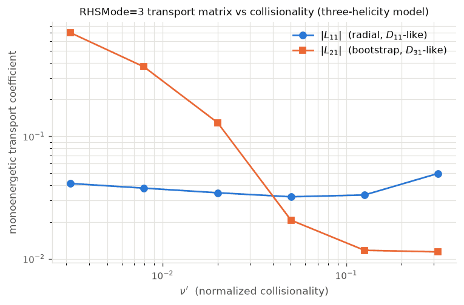
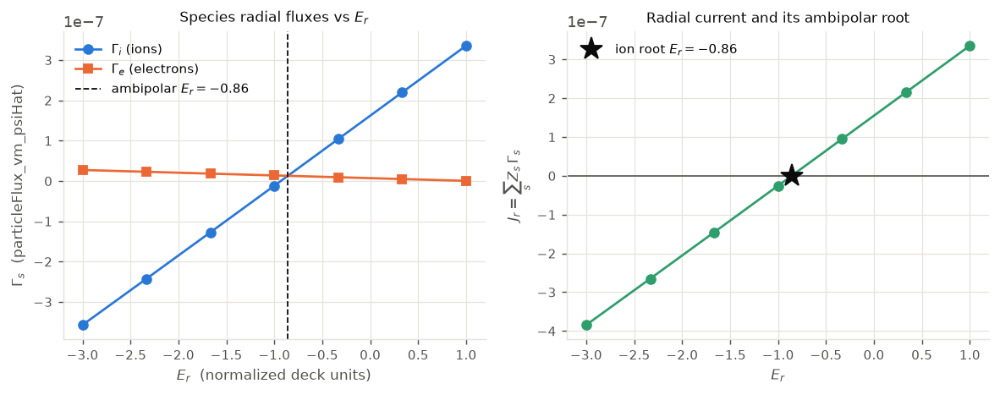

Physics reference: the radially local drift-kinetic model
=========================================================

This page is the physics reference for the canonical `sfincs_jax` stack. It
derives the radially local, linearized drift-kinetic equation (DKE) that the
code solves, states the SFINCS normalization conventions, and maps every term
onto the module that implements it. The equations quoted here are the forms the
code assembles (the implementing module and operator are named in the *Where in
the code* boxes), not a paraphrase of an external note.

For textbook background see Helander & Sigmar, *Collisional Transport in
Magnetized Plasmas* (2002); for the SFINCS model specifically see
`Landreman, Smith, Mollén & Helander, Phys. Plasmas 21, 042503 (2014)
<https://doi.org/10.1063/1.4870077>`_. Full citations are collected in
:doc:`references`; the block linear-algebra view is in :doc:`system_equations`
and :doc:`numerics`; the geometry inputs are in :doc:`geometry`.

Governing equation and the :math:`f_0+f_1` split
------------------------------------------------

`sfincs_jax` solves for the non-adiabatic first-order distribution
:math:`f_{s1}` of each kinetic species :math:`s` on a **single flux surface**,
holding the radial profiles and their gradients fixed (the *radially local*
approximation). The full distribution is split

.. math::

   f_s = f_{s0} + f_{s1},
   \qquad
   f_{s0} = n_s\left(\frac{m_s}{2\pi T_s}\right)^{3/2} e^{-x_s^2}\,
            e^{-Z_s\alpha\Phi_1/T_s},

where the second exponential is present only when the flux-surface potential
variation :math:`\Phi_1(\theta,\zeta)` is enabled (otherwise :math:`f_{s0}` is a
pure Maxwellian). The velocity coordinates are the normalized speed and the
pitch-angle cosine

.. math::

   x_s = \frac{v}{\sqrt{2 T_s/m_s}},
   \qquad
   \xi = \frac{v_\parallel}{v}.

The steady linearized DKE is written schematically as

.. math::

   \underbrace{v_\parallel \mathbf{b}\cdot\nabla f_{s1} + \mathcal{M}[f_{s1}]}_{\text{streaming + mirror}}
   + \underbrace{\mathbf{v}_E\cdot\nabla f_{s1}}_{E\times B}
   + \underbrace{\mathbf{v}_m\cdot\nabla f_{s1}}_{\text{magnetic drift}}
   + \underbrace{\dot{x}\,\partial_x f_{s1} + \dot{\xi}\,\partial_\xi f_{s1}}_{E_r\ \text{energy/pitch drifts}}
   - \sum_b C^{\mathrm{lin}}_{sb}[f_{s1},f_{b1}]
   = S_s,

with a source :math:`S_s` built from the radial thermodynamic drives and the
inductive field. Each term is derived and mapped to code below.

.. admonition:: Where in the code

   The whole operator is the single consolidated
   :class:`sfincs_jax.drift_kinetic.KineticOperator`. Its matrix-free action on
   the distribution block is ``KineticOperator.apply_f``;
   the term-by-term pieces are the ``_streaming_mirror``, ``_exb``,
   ``_er_xidot``, and ``_er_xdot`` methods; the drive :math:`S_s` is
   ``KineticOperator.rhs``. Build one from a namelist
   with :func:`sfincs_jax.drift_kinetic.kinetic_operator_from_namelist`.

Normalization: :math:`\Delta`, :math:`\alpha`, :math:`\nu_n`
------------------------------------------------------------

SFINCS works with hatted (dimensionless) fields. Lengths are in a reference
:math:`\bar R`, magnetic fields in :math:`\bar B`, so that
:math:`\hat B = B/\bar B` and :math:`\hat\psi = \psi/(\bar B\bar R^2)`. Three
scalar parameters set the physical scale of the drift-kinetic ordering:

.. math::

   \Delta = \frac{\bar m\,\bar v}{Z\,e\,\bar B\,\bar R}
          \;\sim\; \frac{v_{\mathrm{th}}}{\Omega\,\bar R},
   \qquad
   \alpha = \frac{e\,\bar\Phi}{\bar T},
   \qquad
   \nu_n = \frac{\bar\nu\,\bar R}{\bar v}.

- :math:`\Delta` (``Delta``) is the drift ordering parameter — the ratio of a
  thermal gyroradius to :math:`\bar R`. It multiplies every drift term
  (:math:`\mathbf{v}_E`, :math:`\mathbf{v}_m`, and the radial fluxes).
- :math:`\alpha` (``alpha``) converts the normalized potential to a normalized
  energy; it appears wherever the electrostatic potential enters
  (:math:`E\times B` drive, :math:`\Phi_1` Boltzmann factor, quasineutrality).
- :math:`\nu_n` (``nu_n``) is the overall collision-frequency normalization
  multiplying the collision operator.

These are the ``Delta``, ``alpha``, ``nu_n`` namelist inputs; they are written
verbatim into ``sfincsOutput.h5`` (see :doc:`outputs`). For monoenergetic
(``RHSMode=3``) runs the physical collisionality and electric field are supplied
instead as ``nuPrime`` and ``EStar``:

.. math::

   \nu' = \frac{(\hat G + \iota\,\hat I)\,\hat\nu}{v\,\hat B_0},
   \qquad
   E^\* = \frac{\hat G}{\iota\,v\,\hat B_0}\,\frac{d\hat\Phi}{d\hat\psi},

with :math:`\hat G`, :math:`\hat I` the covariant Boozer flux functions,
:math:`\iota` the rotational transform, and :math:`\hat B_0` the :math:`(0,0)`
Fourier mode of :math:`\hat B`. See :doc:`normalizations` for the radial-
coordinate conventions and the full unit table.

Streaming and mirror terms
--------------------------

Parallel streaming and the mirror force are the collisionless backbone of the
DKE. In the Legendre representation
:math:`f_{s1}=\sum_L f_{sL}(x,\theta,\zeta)P_L(\xi)`, the parallel-gradient
operator is

.. math::

   \mathbf{b}\cdot\nabla
   = \frac{\hat B^\theta\,\partial_\theta + \hat B^\zeta\,\partial_\zeta}{\hat B},

and streaming couples each Legendre mode :math:`L` to its neighbours
:math:`L\pm 1` through the recursion :math:`\xi P_L = \frac{L+1}{2L+3}P_{L+1} +
\frac{L}{2L-1}P_{L-1}`:

.. math::

   \left(v_\parallel \mathbf{b}\cdot\nabla f\right)_L
   = x\sqrt{\tfrac{\hat T_s}{\hat m_s}}\left[
       \frac{L+1}{2L+3}\,(\mathbf{b}\cdot\nabla)f_{L+1}
     + \frac{L}{2L-1}\,(\mathbf{b}\cdot\nabla)f_{L-1}
     \right].

The mirror force :math:`\mathcal{M}` carries the same :math:`L\pm1` structure
with the geometric prefactor

.. math::

   \mathcal{M} \propto
   -\,\sqrt{\tfrac{\hat T_s}{\hat m_s}}\,\frac{\mathbf{b}\cdot\nabla \hat B}{2\hat B},
   \qquad
   \mathbf{b}\cdot\nabla \hat B
   = \frac{\hat B^\theta\,\partial_\theta \hat B + \hat B^\zeta\,\partial_\zeta \hat B}{\hat B},

the upper/lower couplings scaled by :math:`(L+2)` and :math:`-(L-1)`
respectively. These two terms are always present.

.. admonition:: Where in the code

   ``KineticOperator._streaming_mirror``. The Legendre
   coupling coefficients :math:`\frac{L+1}{2L+3}` and :math:`\frac{L}{2L-1}`
   are :func:`sfincs_jax.phase_space.legendre_coupling_upper` /
   ``legendre_coupling_lower``. The same coefficients build the analytic
   block-tridiagonal factorization in ``KineticOperator.legendre_blocks``.

:math:`E\times B` drift
-----------------------

The equilibrium radial electric field :math:`E_r=-d\Phi_0/dr` produces an
:math:`E\times B` advection in the angular directions. Its diagonal-in-:math:`L`
prefactors are

.. math::

   F_{E\times B,\theta} = \frac{\alpha\Delta}{2}\,\frac{d\hat\Phi}{d\hat\psi}\,
     \frac{\hat D\,\hat B_\zeta}{\mathcal{B}},
   \qquad
   F_{E\times B,\zeta} = -\frac{\alpha\Delta}{2}\,\frac{d\hat\Phi}{d\hat\psi}\,
     \frac{\hat D\,\hat B_\theta}{\mathcal{B}},

where :math:`\hat D` is the Jacobian factor and :math:`\hat B_\theta`,
:math:`\hat B_\zeta` are covariant components. The denominator
:math:`\mathcal{B}` encodes the **trajectory model**:

- **default (full) trajectories**: :math:`\mathcal{B} = \hat B^2`;
- **DKES trajectories** (``useDKESExBDrift = .true.``):
  :math:`\mathcal{B} = \langle \hat B^2\rangle`, the flux-surface average. This
  is the monoenergetic ``incompressible`` :math:`E\times B` used for DKES-style
  benchmarks.

.. admonition:: Where in the code

   ``KineticOperator._exb`` and ``_exb_coefficients``.
   The ``useDKESExBDrift`` switch selects
   :math:`\hat B^2` vs :math:`\langle \hat B^2\rangle` (``fsab_hat2``).

Radial-electric-field energy and pitch-angle drifts
---------------------------------------------------

The full trajectory model adds two more :math:`E_r`-driven terms that couple
:math:`L\leftrightarrow L, L\pm 2`. The :math:`\dot\xi\,\partial_\xi` term
(enabled by ``includeElectricFieldTermInXiDot``) has coefficient

.. math::

   F_\xi = \frac{\alpha\Delta}{4\hat B^3}\,\frac{d\hat\Phi}{d\hat\psi}\,\hat D\,
   \bigl(\hat B_\zeta\,\partial_\theta \hat B - \hat B_\theta\,\partial_\zeta \hat B\bigr),

with the diagonal Legendre weight :math:`\frac{L(L+1)}{(2L-1)(2L+3)}` and
:math:`L\pm2` couplings. The :math:`\dot x\,\partial_x` term (enabled by
``includeXDotTerm``) acts through the dense speed operator :math:`x\,\partial_x`
with prefactor

.. math::

   F_x = -\frac{\alpha\Delta}{4}\,\frac{d\hat\Phi}{d\hat\psi}\,
   \frac{\hat D}{\hat B^3}\,
   \bigl(\hat B_\theta\,\partial_\zeta \hat B - \hat B_\zeta\,\partial_\theta \hat B\bigr).

Both terms vanish when :math:`d\hat\Phi/d\hat\psi=0`, so an :math:`E_r=0` run
reduces to the collisionless streaming/mirror plus collisions.

.. admonition:: Where in the code

   ``KineticOperator._er_xidot`` and ``_er_xdot``. The trajectory model is therefore encoded entirely by
   three flags: ``useDKESExBDrift`` (DKES :math:`E\times B`),
   ``includeElectricFieldTermInXiDot``, and ``includeXDotTerm``. The tangential
   *magnetic* drift terms (``magneticDriftScheme`` 1--9, matching the Fortran
   ``select case`` blocks) are assembled in ``drift_kinetic.py``; the ``full``
   trajectory here means the full :math:`E_r` terms.

Thermodynamic and inductive drives
----------------------------------

The source :math:`S_s` collects the free-energy drives. The radial-gradient
drive, projected onto Legendre modes :math:`L=0` (weight :math:`4/3`) and
:math:`L=2` (weight :math:`2/3`), is

.. math::

   S_s^{\mathrm{grad}} \propto
   \Delta\,\hat g_2\, x^2 e^{-x^2}
   \left[
     \frac{1}{\hat n_s}\frac{d\hat n_s}{d\hat\psi}
   + \frac{Z_s\alpha}{\hat T_s}\frac{d\hat\Phi}{d\hat\psi}
   + \left(x^2-\tfrac32\right)\frac{1}{\hat T_s}\frac{d\hat T_s}{d\hat\psi}
   \right],

with the geometric factor
:math:`\hat g_2 = \hat D\,(\hat B_\zeta\,\partial_\theta\hat B -
\hat B_\theta\,\partial_\zeta\hat B)/\hat B^3`. The inductive drive
(:math:`L=1`) is proportional to the parallel electric field
:math:`\hat E_\parallel` (``EParallelHat``) times :math:`\hat B`:

.. math::

   S_s^{\mathrm{ind}} \propto
   Z_s\alpha\, x\, e^{-x^2}\,\hat E_\parallel\,
   \frac{\hat n_s \hat m_s}{\hat T_s^2\,\langle \hat B^2\rangle}\,\hat B.

For the electrostatic (radial-gradient) part, the :math:`d\hat\Phi/d\hat\psi`
piece is dropped in transport-matrix modes so each drive can be isolated (see
below).

.. admonition:: Where in the code

   ``KineticOperator.rhs``. Transport-matrix RHS column
   overwrites (``whichRHS``) are handled by ``_with_rhs_settings``.

Collision operators
-------------------

`sfincs_jax` implements three collision models, selected by
``collisionOperator``: the two SFINCS v3 operators (full Fokker--Planck and
pitch-angle scattering) plus the momentum- and energy-conserving improved
Sugama model operator (``collisionOperator = 3``), a research extension beyond
Fortran v3.

Pitch-angle scattering (``collisionOperator = 1``)
~~~~~~~~~~~~~~~~~~~~~~~~~~~~~~~~~~~~~~~~~~~~~~~~~~~~

The Lorentz (pitch-angle-scattering, PAS) operator is diagonal in
:math:`(\theta,\zeta,x)` and in the Legendre index, with the classic
:math:`L(L+1)` eigenstructure:

.. math::

   C^{\mathrm{PAS}}_s f_{sL}
   = -\,\nu_n\,\hat\nu_D^s(x)\,\frac{L(L+1)}{2}\,f_{sL},

where the deflection frequency :math:`\hat\nu_D^s(x)` is built from the error
function and the Chandrasekhar function

.. math::

   \Psi(x) = \frac{\operatorname{erf}(x) - \frac{2}{\sqrt\pi}\,x\,e^{-x^2}}{2x^2}.

PAS is block-diagonal in :math:`L`, which is what makes the tier-1 structured
solve applicable (:doc:`numerics`).

.. admonition:: Where in the code

   The pitch-angle-scattering operator lives in :mod:`sfincs_jax.collisions` and
   is applied inside ``KineticOperator.apply_f``; the :math:`L(L+1)` factor is
   :func:`sfincs_jax.phase_space.lorentz_eigenvalues`, and the deflection
   frequency and Chandrasekhar function are helpers in the same module.

Full linearized Fokker--Planck (``collisionOperator = 0``)
~~~~~~~~~~~~~~~~~~~~~~~~~~~~~~~~~~~~~~~~~~~~~~~~~~~~~~~~~~~~~

The full linearized Landau operator adds, on top of the pitch-angle deflection,
the energy-scattering (test-particle) piece and the field-particle back-reaction
that restores momentum and energy conservation. For each species pair and
Legendre mode it is a dense matrix in the speed grid:

.. math::

   \left(C^{\mathrm{FP}} f\right)_{a,L}
   = -\,\nu_n\Bigl(
       \underbrace{C_E}_{\text{energy scatter}}
     + \underbrace{C_D}_{\text{field drag}}
     + \underbrace{R_L}_{\text{Rosenbluth response}}
     - \tfrac12\,\hat\nu_D\,L(L+1)\,\delta_{ab}
     \Bigr).

The field-particle term :math:`R_L` is expressed through the Rosenbluth
potentials :math:`H`, :math:`G` of a Maxwellian target. The code builds, for
each :math:`L`, the speed integrals that give :math:`H`, :math:`dH/dx`, and
:math:`d^2G/dx^2`, then maps them back to the collocation grid:

.. math::

   H_L(x) \propto \frac{1}{2L+1}\left(
       \frac{1}{x^{L+1}}\!\int_0^{x} t^{L+2}e^{-t^2}\,dt
     + x^{L}\!\int_{x}^{\infty} t^{1-L}e^{-t^2}\,dt \right),

and analogously for the derivative and second-derivative potentials. Momentum
and energy conservation are **structural** — they follow from using the exact
linearized field term (there is no ad-hoc moment-restoring projection unless the
optional ``Krook`` drag is requested). The dense speed coupling of :math:`C^{FP}`
is the dominant cost of a multi-species Fokker--Planck run.

.. admonition:: Where in the code

   The full Fokker--Planck operator and its Rosenbluth-potential speed integrals
   live in :mod:`sfincs_jax.collisions`, ported from the Landreman--Ernst
   speed-grid treatment
   (`arXiv:1210.5289 <https://arxiv.org/abs/1210.5289>`_). Both the
   pitch-angle-scattering and Fokker--Planck blocks are applied through
   ``KineticOperator.apply_f``.

Improved Sugama model operator (``collisionOperator = 3``)
~~~~~~~~~~~~~~~~~~~~~~~~~~~~~~~~~~~~~~~~~~~~~~~~~~~~~~~~~~~~~

A research extension beyond Fortran v3: the momentum- and energy-conserving
*improved* linearized model collision operator of Sugama *et al.*
(Phys. Plasmas 26, 102108, 2019), built with the moment-based field-particle
construction of Frei, Ernst & Ricci (Phys. Plasmas 29, 093902, 2022). The
test-particle part reuses the Fokker--Planck deflection and energy-diffusion
kernels; the field-particle back-reaction is a low-rank moment term (L=0
particle/energy, L=1 parallel momentum) whose coefficients cancel the
test-particle moment functionals algebraically, so conservation is exact at
the collocation level. It assembles into the same per-``L`` dense speed blocks
as the Fokker--Planck operator.

.. admonition:: Where in the code

   The improved Sugama construction lives in :mod:`sfincs_jax.collisions`
   next to the Fokker--Planck blocks and shares the same matvec
   (``apply_fokker_planck_v3``), applied through ``KineticOperator.apply_f``.

Flux-surface potential variation :math:`\Phi_1` and quasineutrality
-------------------------------------------------------------------

When ``includePhi1 = .true.`` the electrostatic potential carries a
flux-surface variation,

.. math::

   \Phi(\psi,\theta,\zeta) = \Phi_0(\psi) + \Phi_1(\theta,\zeta),

which enters the leading-order distribution as the Boltzmann factor
:math:`f_{s0}=f_{sM}\exp(-Z_s\alpha\Phi_1/\hat T_s)`. The additional unknown
:math:`\Phi_1(\theta,\zeta)` is closed by **quasineutrality**, and the gauge
freedom is fixed by :math:`\langle\Phi_1\rangle=0`:

.. math::

   \sum_s Z_s\!\int d^3v\,(f_{s0}+f_{s1}) = 0,
   \qquad
   \lambda:\ \langle\Phi_1\rangle = 0.

Two closures are supported: ``quasineutralityOption = 1`` (full Boltzmann
response, summing all kinetic species) and ``quasineutralityOption = 2`` (the
EUTERPE-style single-species adiabatic form). Because :math:`f_{s0}` depends
nonlinearly (exponentially) on :math:`\Phi_1`, the coupled kinetic +
quasineutrality system is solved by a warm-started Newton iteration; the whole
map is differentiable through the implicit-function theorem.

.. admonition:: Where in the code

   The quasineutrality rows and the :math:`\langle\Phi_1\rangle=0` Lagrange row
   are ``KineticOperator._quasineutrality_rows``; the
   :math:`\Phi_1`-in-kinetic coupling is ``_add_phi1_in_kinetic``; the :math:`\Phi_1`-in-collision poloidal density
   factor :math:`n_s e^{-Z_s\alpha\Phi_1/\hat T_s}` is applied in ``apply_f``.
   The nonlinear Newton driver is :func:`sfincs_jax.phi1.solve_phi1`, with the
   differentiable variant
   :func:`sfincs_jax.phi1.phi1_state`. ``readExternalPhi1`` treats
   :math:`\Phi_1` as a fixed external field: a linear solve (no Newton
   iteration) routed through :func:`sfincs_jax.run.run_profile`.

Moments, fluxes, and transport coefficients
-------------------------------------------

The physical outputs are velocity-space and flux-surface-average moments of the
solved :math:`f_{s1}`. All radial fluxes are computed natively on
:math:`\nabla\hat\psi` and then converted to the :math:`\psi_N`, :math:`\hat r`,
:math:`r_N` variants (:doc:`outputs`).

Particle and heat flux (magnetic drift). The radial flux carried by the
magnetic drift uses the geometric factor
:math:`\hat g_{vm} = (\hat B_\theta\,\partial_\zeta\hat B -
\hat B_\zeta\,\partial_\theta\hat B)/\hat B^3` and Legendre weights
:math:`8/3` (:math:`L=0`) and :math:`4/15` (:math:`L=2`):

.. math::

   \Gamma_s^{(vm)} = \Bigl\langle \Gamma_{s}^{vm}(\theta,\zeta)\Bigr\rangle,
   \qquad
   \Gamma_{s}^{vm} \propto \Delta\,\hat g_{vm}\!\int dx\,
   \Bigl[\tfrac{8}{3}\,x^4 f_{s,L=0} + \tfrac{4}{15}\,x^4 f_{s,L=2}\Bigr].

These are the ``particleFlux_vm_psiHat`` / ``heatFlux_vm_psiHat`` outputs. The
``_vm0`` variants use only :math:`f_{s0}`; the :math:`E\times B` flux family
(``_vE``) uses the analogous factor
:math:`(\hat B_\theta\,\partial_\zeta\Phi_1 - \hat B_\zeta\,\partial_\theta\Phi_1)/\hat B^2`
(note the :math:`\hat B^2` denominator, a genuine physical difference from the
magnetic-drift :math:`\hat B^3`).

Parallel flow and bootstrap current. The :math:`L=1` moment gives the parallel
flow and, summed over species with the charge weight, the bootstrap current
:math:`\langle\mathbf{j}\cdot\mathbf{B}\rangle`:

.. math::

   \langle \hat B \hat V_{\parallel s}\rangle \equiv \mathrm{FSABFlow}_s,
   \qquad
   \langle\mathbf{j}\cdot\mathbf{B}\rangle \equiv \mathrm{FSABjHat}
   = \sum_s Z_s\,\mathrm{FSABFlow}_s.

``FSABjHat`` is the neoclassical bootstrap current; ``jHat`` is the parallel
current density on the :math:`(\theta,\zeta)` grid.

Monoenergetic transport matrix and Onsager symmetry. For ``RHSMode=2`` (a
:math:`3\times3` thermal transport matrix) and ``RHSMode=3`` (a
:math:`2\times2` monoenergetic/DKES matrix), the code loops over the drive
columns and assembles :math:`L_{ij}` mapping the thermodynamic forces (radial
gradient drive, parallel electric field) to the responses (radial flux, parallel
flow). The shared :math:`\hat g_+ = \hat G + \iota\hat I` and
:math:`b_0/\hat G^2` normalization structure is what enforces the Onsager
symmetry :math:`L_{12}=L_{21}`; the ``examples/transport_coefficients.py`` script
prints the measured Onsager asymmetry as a check. The classic result is that in
a non-axisymmetric field the radial coefficient :math:`L_{11}` (:math:`D_{11}`-
like) grows like :math:`1/\nu` at low collisionality:

   Monoenergetic (``RHSMode=3``) transport-matrix entries versus normalized
   collisionality :math:`\nu'` for a three-helicity model field. :math:`|L_{11}|`
   (radial, :math:`D_{11}`-like) rises at low :math:`\nu'` — the characteristic
   :math:`1/\nu` neoclassical regime of a non-axisymmetric configuration —
   while :math:`|L_{21}|` (bootstrap, :math:`D_{31}`-like) tracks the parallel
   response. Reproduce with ``python docs/figures/generate_docs_figures.py``.

.. admonition:: Where in the code

   Magnetic-drift fluxes: :func:`sfincs_jax.moments.vm_flux_moments`; RHSMode-1 per-species table including ``FSABjHat`` and
   ``FSABFlow``: :func:`sfincs_jax.moments.rhsmode1_moments`;
   :math:`E\times B` flux: ``electric_drift_flux_moments``;
   transport matrix: :func:`sfincs_jax.moments.transport_matrix_from_flux_arrays`.

Ambipolarity and the radial electric field
------------------------------------------

Unlike a tokamak, a stellarator field is not intrinsically ambipolar: the ion
and electron radial fluxes depend independently on :math:`E_r`, so a net radial
current would flow unless :math:`E_r` self-adjusts to the ambipolar root

.. math::

   J_r(E_r) = \sum_s Z_s\,\Gamma_s(E_r) = 0.

`sfincs_jax` evaluates :math:`J_r` at a given :math:`E_r` with one drift-kinetic
solve and finds the root with a bracket-expanding Brent solver that mirrors
SFINCS Fortran v3 ``ambipolarSolver.F90`` (option 2), classifying each root as
*ion*, *electron*, or *unstable*. The root is also exposed as a differentiable
quantity: :math:`dE_r/dp` for any profile parameter :math:`p` follows from the
implicit-function theorem applied to :math:`J_r(E_r,p)=0`, so ``jax.grad`` flows
through the ambipolar :math:`E_r`.

   Left: ion and electron radial fluxes :math:`\Gamma_s(E_r)` for a model
   stellarator with an ion+electron pair. Right: the radial current
   :math:`J_r=\sum_s Z_s\Gamma_s` and its ambipolar (ion) root. Reproduce with
   ``python docs/figures/generate_docs_figures.py``.

.. admonition:: Where in the code

   Radial current :math:`J_r=\sum_a Z_a\Gamma_a`:
   :func:`sfincs_jax.er.radial_current`; Brent root find and
   classification: :func:`sfincs_jax.er.find_ambipolar_er` with the
   ``_brent`` kernel; differentiable root:
   :func:`sfincs_jax.er.ambipolar_er` (implicit-function theorem through
   ``solvax.implicit.root_solve``). See ``examples/ambipolar_er_scan.py``.

Classical (collisional) transport
----------------------------------

In addition to the neoclassical fluxes above, the code evaluates the classical
(finite-gyroradius, collisional) particle and heat fluxes from the friction
forces of the linearized collision operator, following the upstream SFINCS
classical-radial-fluxes note (see :doc:`upstream_docs`). These are written as
``classicalParticleFlux*`` / ``classicalHeatFlux*`` for geometries that provide
the :math:`|\nabla\hat\psi|^2` metric (VMEC scheme 5 and Boozer ``.bc`` schemes
11/12).

Equation-to-code map
--------------------

.. list-table::
   :header-rows: 1
   :widths: 42 33 25

   * - Physics term
     - Canonical implementation
     - Enabling input
   * - Streaming :math:`v_\parallel\mathbf{b}\cdot\nabla f` + mirror
     - ``KineticOperator._streaming_mirror``
     - always on
   * - :math:`E\times B` drift
     - ``KineticOperator._exb``
     - ``dPhiHatdpsiHat``/``Er``, ``useDKESExBDrift``
   * - :math:`E_r` pitch-angle drift (:math:`\dot\xi\partial_\xi`)
     - ``KineticOperator._er_xidot``
     - ``includeElectricFieldTermInXiDot``
   * - :math:`E_r` energy drift (:math:`\dot x\partial_x`)
     - ``KineticOperator._er_xdot``
     - ``includeXDotTerm``
   * - Thermodynamic + inductive drives :math:`S_s`
     - ``KineticOperator.rhs``
     - profile gradients, ``EParallelHat``
   * - Pitch-angle scattering
     - Pitch-angle scattering in :mod:`sfincs_jax.collisions`
     - ``collisionOperator = 1``
   * - Full Fokker--Planck (Rosenbluth)
     - Full Fokker--Planck in :mod:`sfincs_jax.collisions`
     - ``collisionOperator = 0``
   * - :math:`\Phi_1` / quasineutrality
     - ``_quasineutrality_rows``, :mod:`sfincs_jax.phi1`
     - ``includePhi1``, ``quasineutralityOption``
   * - Fluxes, ``FSABjHat``, transport matrix
     - :mod:`sfincs_jax.moments`
     - ``RHSMode`` 1/2/3
   * - Ambipolar :math:`E_r`
     - :mod:`sfincs_jax.er`
     - ``inputRadialCoordinate = 4`` (``Er``)
   * - Flux-surface geometry
     - :class:`sfincs_jax.magnetic_geometry.FluxSurfaceGeometry`
     - ``geometryScheme``

Upstream derivations
--------------------

The long-form derivations are documented in the peer-reviewed SFINCS paper
(Landreman, Smith, Mollén, and Helander, *Phys. Plasmas* **21**, 042503 (2014),
`doi:10.1063/1.4870077 <https://doi.org/10.1063/1.4870077>`_) and in the unpublished
upstream SFINCS project documents archived at
`github.com/landreman/sfincs <https://github.com/landreman/sfincs>`_ (cited from
:doc:`upstream_docs`). The pieces most relevant to this reference are:

- the version-3 technical documentation — the master reference for the operator and
  normalization;
- the single-species and multi-species technical documentation — the drive and
  collision derivations;
- the Fokker--Planck operator implementation note — the Rosenbluth-potential field term;
- the :math:`\Phi_1` implementation and "effects on fluxes" notes — the
  :math:`\Phi_1`/quasineutrality closure and its effect on the flux definitions;
- the transport-matrix / Beidler-matrix note — the transport-coefficient correspondence;
- the classical-radial-fluxes and DKES notes — classical fluxes and DKES-limit compatibility.
