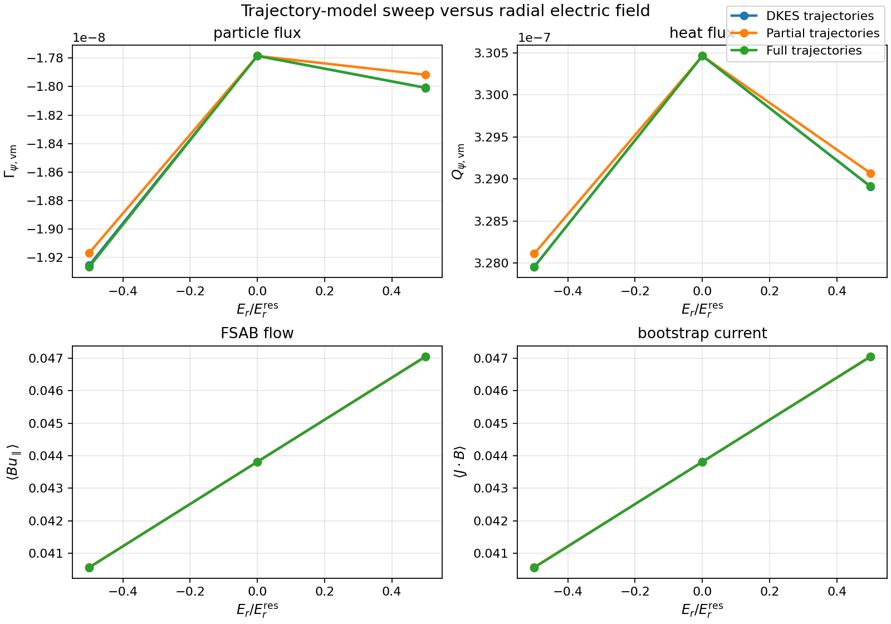

Validation Matrix
=================

This page tracks the publication-facing validation lanes for ``sfincs_jax``. The goal
is to connect each physics claim or benchmark figure to:

- a literature anchor,
- the script or workflow that generates it,
- the expected output artifact,
- and the status of the lane on the current branch.

Machine-readable manifest
-------------------------

The corresponding machine-readable manifest lives in:

- ``examples/publication_figures/validation_manifest.json``

That file is intended to become the stable spine for:

- future manuscript figure generation,
- reproducible benchmark reruns,
- and test/benchmark dashboards that distinguish implemented and planned lanes.

Implemented literature reproductions
------------------------------------

These lanes already have scripts and figure artifacts in the repository.

SFINCS 2014 collisionality figures
^^^^^^^^^^^^^^^^^^^^^^^^^^^^^^^^^^

Literature anchor:

- [Landreman et al. 2014](https://publications.lib.chalmers.se/records/fulltext/199559/local_199559.pdf)

Current scripts:

- ``examples/publication_figures/generate_sfincs_paper_figs.py --case lhd``
- ``examples/publication_figures/generate_sfincs_paper_figs.py --case w7x``

Current artifacts:

- ``docs/_static/figures/paper/sfincs_jax_fig1_lhd_collisionality.png``
- ``docs/_static/figures/paper/sfincs_jax_fig2_w7x_collisionality.png``
- ``docs/_static/figures/paper/sfincs_jax_fig3_simakov_helander.png``

These figures are intentionally low-resolution reproductions and should be read as
regression targets and validation scaffolds, not as the final polished figures for the
next paper.

Planned literature-driven lanes
-------------------------------

The next figure/test lanes should be built in this order.

1. Electric-field sweeps
^^^^^^^^^^^^^^^^^^^^^^^^

Literature anchors:

- [Landreman et al. 2014](https://publications.lib.chalmers.se/records/fulltext/199559/local_199559.pdf)

Publication target:

- one tokamak-like case,
- one stellarator case,
- fluxes, flows, and bootstrap current versus normalized radial electric field,
- clear comparison of partial, DKES-like, and full-trajectory models.

Current scaffold:

- ``examples/publication_figures/generate_er_trajectory_sweep.py``

This script already implements the correct upstream trajectory-model switches and
produces a JSON summary plus a 2x2 publication-style figure. At the moment it is a
validation scaffold rather than a pinned manuscript artifact: the final paper lane still
needs audited sweep inputs and fixed output roots for the selected tokamak-like and
stellarator-like cases.

Current prototype artifact:

- bounded fast tokamak-like sweep summary:
  ``examples/publication_figures/artifacts/er_sweep_fast_tokamak_summary.json``
- bounded fast prototype figure:
  ``docs/_static/figures/paper/sfincs_jax_er_trajectory_sweep.png``

   Prototype fast tokamak-like ``E_r`` sweep across DKES, partial, and full
   trajectory models. This figure is useful as a branch regression target and
   manuscript-layout prototype, but it is not yet the final audited literature
   reproduction. The final lane still needs fixed inputs, a denser sweep, and
   explicit physics assertions on ordering, crossover, and small-field agreement.

Validation goal:

- verify small-``E_r / E_r^{res}`` agreement and large-field separation behavior,
- make the ordering and crossover behavior explicit in both assertions and figures.

2. W7-X ambipolar-field validation
^^^^^^^^^^^^^^^^^^^^^^^^^^^^^^^^^^

Literature anchors:

- [Pablant et al. 2020 ion-root context](https://sites.fusion.ciemat.es/jlvelasco/files/papers/pablant2020ionroot.pdf)
- [Pablant et al. 2018 W7-X core radial electric field](https://sites.fusion.ciemat.es/jlvelasco/files/papers/pablant2018er.pdf)
- [Nature 2021 W7-X neoclassical validation context](https://www.nature.com/articles/s41586-021-03687-w)

Publication target:

- one figure comparing neoclassical ``E_r`` and/or heat-flux trends against the
  published W7-X validation context,
- one table documenting exactly which approximations and reconstructed inputs were used.

Validation goal:

- make any profile reconstruction assumptions explicit,
- use this lane only if the reconstructed input set is scientifically defensible.

3. MONKES / KNOSOS overlap
^^^^^^^^^^^^^^^^^^^^^^^^^^

Literature anchors:

- [MONKES paper](https://arxiv.org/abs/2312.12248)
- [KNOSOS paper](https://arxiv.org/abs/1908.11615)

Publication target:

- coefficient overlap on monoenergetic shared-model subsets,
- low-collisionality trend comparison where the models are not exactly identical.

Validation goal:

- separate exact overlap claims from qualitative trend/ordering claims,
- keep this lane focused on the model subset that is genuinely comparable.

4. Adjoint / sensitivity validation
^^^^^^^^^^^^^^^^^^^^^^^^^^^^^^^^^^^

Literature anchors:

- [Paul et al. 2019 adjoint optimization](https://arxiv.org/abs/1904.06430)
- [APS adjoint optimization abstract](https://meetings-archive.aps.org/dpp/2018/bp11/36/)

Publication target:

- directional-derivative agreement figure,
- one sensitivity-map figure,
- one small inverse-design or calibration demo.

Validation goal:

- show that the differentiable path is not just available, but numerically trustworthy
  for optimization-oriented workflows.

How this page should evolve
---------------------------

Each time a new figure lane is implemented, update both:

- this page,
- and ``examples/publication_figures/validation_manifest.json``.

That keeps the manuscript-facing validation story synchronized with the code structure
and the test/benchmark infrastructure.
