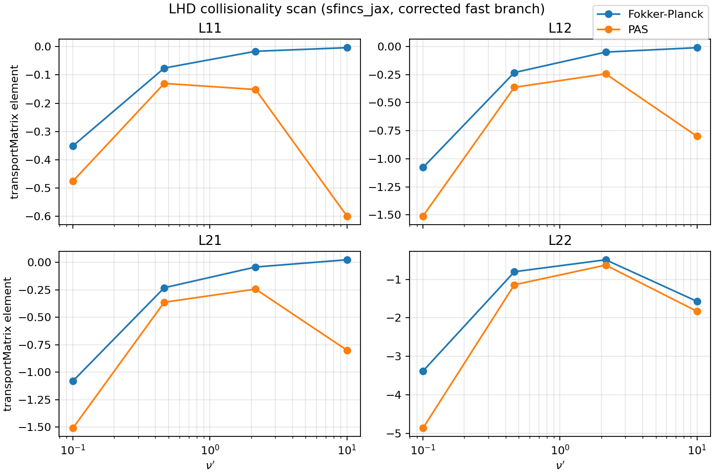
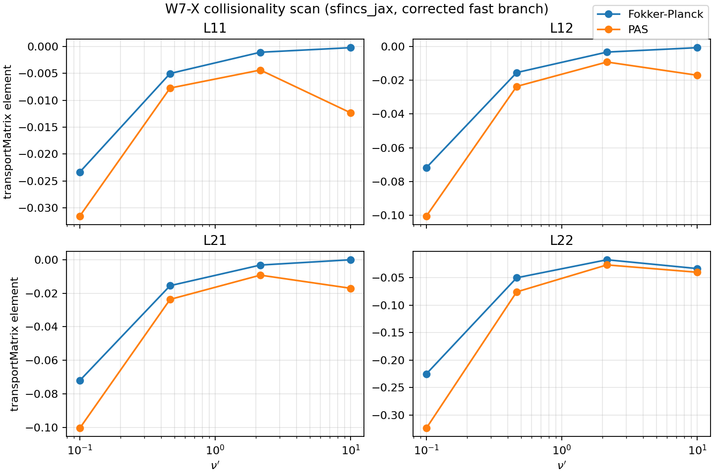
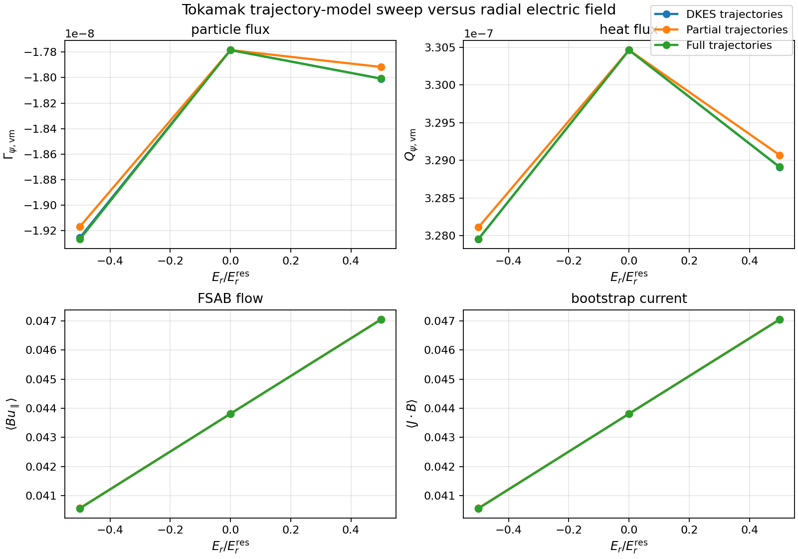
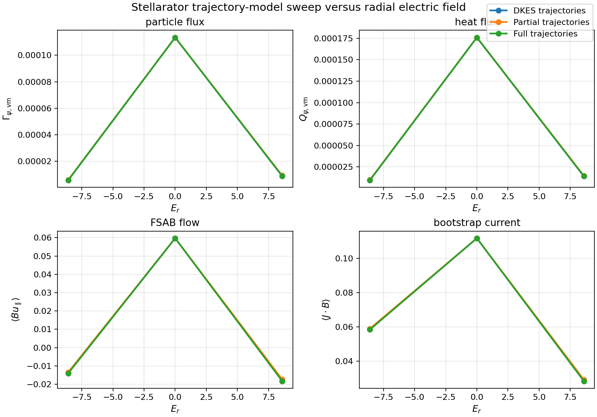

Validation Matrix
=================

This page tracks the publication-facing validation lanes for ``sfincs_jax``. The goal
is to connect each physics claim or benchmark figure to:

- a literature anchor,
- the script or workflow that generates it,
- the expected output artifact,
- and the status of the lane on the current branch.

Machine-readable manifest
-------------------------

The corresponding machine-readable manifest lives in:

- ``examples/publication_figures/validation_manifest.json``

That file is intended to become the stable spine for:

- future manuscript figure generation,
- reproducible benchmark reruns,
- and test/benchmark dashboards that distinguish implemented release lanes from
  deferred post-release research lanes.

Each manifest lane now also carries explicit research gates:

- ``source_code``: the implementation files that define the lane,
- ``tests``: the tests that protect the lane or its scaffold,
- ``acceptance_gates``: the concrete criteria required before the lane can support a
  manuscript or release claim.
- ``release_gate``: the release-facing claim status, evidence level, nonblocking
  release decision, and promotion gate for the lane.

The schema is enforced by ``tests/test_validation_manifest_schema.py``. Implemented
release lanes must point to existing scripts, artifacts, source files, and tests.
Deferred post-release lanes are closed for the tagged release but retain literature
anchors, implementation targets, tests, and acceptance criteria so follow-up research
work is not lost.

Release claim gate metadata
---------------------------

Every manifest record has a ``release_gate`` block checked by
``scripts/check_release_gates.py`` and ``tests/test_release_gate_metadata.py``.
The allowed ``claim_status`` values are:

- ``release_ready``: checked-in artifacts support the documented current-release
  claim, and the listed tests are the fast gate for that claim.
- ``regression_scaffold``: checked-in bounded artifacts are useful for CI,
  branch validation, or manuscript layout, but a broader/full-resolution claim is
  intentionally not being made.
- ``bounded_proxy``: checked-in artifacts support a narrower proxy or
  normalization claim, while the corresponding full literature reproduction stays
  closed until its promotion gate is met.
- ``closed_deferred``: the lane is explicitly closed for the current release as
  post-release or nightly research work.

No current manifest lane may set ``blocks_current_release=true``. A future lane
that is not ready must therefore be either absent from the release manifest or
recorded as ``closed_deferred`` with a concrete reason and promotion gate. This
prevents scaffold scripts, run plans, or proxy figures from being mistaken for
closed publication evidence.

Implemented literature reproductions
------------------------------------

These lanes already have scripts and figure artifacts in the repository.

Publication validation dashboard
^^^^^^^^^^^^^^^^^^^^^^^^^^^^^^^^

Literature anchor:

- `Landreman et al. 2014 <https://doi.org/10.1063/1.4870077>`_
- `Open PDF mirror <https://publications.lib.chalmers.se/records/fulltext/199559/local_199559.pdf>`_

Current script:

- ``examples/publication_figures/generate_validation_dashboard.py``

Current artifacts:

- ``examples/publication_figures/artifacts/sfincs_jax_publication_validation_dashboard_summary.json``
- ``docs/_static/figures/paper/sfincs_jax_publication_validation_dashboard.png``
- ``docs/_static/figures/paper/sfincs_jax_publication_validation_dashboard.pdf``

.. figure:: _static/figures/paper/sfincs_jax_publication_validation_dashboard.png
   :alt: Literature-anchored sfincs_jax validation dashboard
   :width: 92%

   Dashboard assembled from checked-in validation artifacts rather than hand-edited
   plot data. The acceptance tests assert that the collisionality scans contain both
   FP and PAS rows on the seven-point grid, that the high-collisionality ``L11``
   separation remains larger than the low-collisionality separation, and that the
   trajectory sweeps retain exact zero-field agreement while resolving finite-field
   model separation.

Fortran v3 CPU/GPU suite benchmark
^^^^^^^^^^^^^^^^^^^^^^^^^^^^^^^^^^

Literature and reference anchors:

- `Landreman et al. 2014 <https://doi.org/10.1063/1.4870077>`_
- `Open PDF mirror <https://publications.lib.chalmers.se/records/fulltext/199559/local_199559.pdf>`_
- `SFINCS Fortran repository <https://github.com/landreman/sfincs>`_

Current script:

- ``examples/publication_figures/generate_fortran_suite_benchmark_summary.py``

Current artifacts:

- ``examples/publication_figures/artifacts/sfincs_jax_fortran_suite_benchmark_summary.json``
- ``docs/_static/figures/paper/sfincs_jax_fortran_suite_benchmark_summary.png``
- ``docs/_static/figures/paper/sfincs_jax_fortran_suite_benchmark_summary.pdf``

.. figure:: _static/figures/paper/sfincs_jax_fortran_suite_benchmark_summary.png
   :alt: Frozen CPU and GPU suite benchmark against SFINCS Fortran v3
   :width: 92%

   Cross-code release benchmark generated from frozen CPU/GPU suite reports. The
   plotted bars show wall-clock runtime and active solver memory for SFINCS
   Fortran v3, ``sfincs_jax`` CPU cold/warm, and ``sfincs_jax`` GPU cold/warm
   across the reference-runtime-window rows whose Fortran v3 reference runtime
   is at least ``10 s``. The summary JSON records which legacy frozen rows still
   need full production-resolution reruns. JAX active memory subtracts the fixed Python/JAX/XLA runtime
   baseline using profiler RSS deltas while preserving full process RSS in the
   JSON audit fields. Cases are ordered by best warm ``sfincs_jax`` speedup over the
   Fortran v3 runtime. The acceptance tests require all 39 audited cases to remain
   ``parity_ok`` on both backends, with zero strict mismatches and no
   ``jax_error`` or ``max_attempts`` failures. Absolute runtime, memory, ratios,
   top offenders, warm timing-source counts, and the excluded short-reference
   rows are recomputed from the checked-in reports and stored in the JSON summary
   for manuscript tables and regression triage. The excluded short-reference
   rows remain CI parity/smoke checks until rerun at production-comparison
   resolution.

SFINCS 2014 collisionality figures
^^^^^^^^^^^^^^^^^^^^^^^^^^^^^^^^^^

Literature anchor:

- [Landreman et al. 2014](https://publications.lib.chalmers.se/records/fulltext/199559/local_199559.pdf)

Current scripts:

- ``examples/publication_figures/generate_sfincs_paper_figs.py --case lhd``
- ``examples/publication_figures/generate_sfincs_paper_figs.py --case w7x``

Current artifacts:

- ``docs/_static/figures/paper/sfincs_jax_fig1_lhd_collisionality.png``
- ``docs/_static/figures/paper/sfincs_jax_fig2_w7x_collisionality.png``
- ``docs/_static/figures/paper/sfincs_jax_fig3_simakov_helander.png``

The standard LHD and W7-X collisionality figures have now been regenerated from the
corrected scan-input writer and promoted as audited full-resolution validation
artifacts. They are still regression and manuscript-scaffold figures, not a claim that
every plotted point should reproduce the original paper image digit-for-digit.

Current status note:

- the scan writer in ``generate_sfincs_paper_figs.py`` was fixed on this branch after
  finding that duplicate namelist assignments could override the intended
  ``collisionOperator`` and fast-resolution settings
- the generator now emits machine-readable collisionality summaries with top-level
  metadata and sorted rows so full-resolution reruns have pinned provenance
  instead of relying only on figure files
- the checked-in full LHD and W7-X summaries each contain 14 rows: both FP and PAS
  labels on a seven-point collisionality ladder
- corrected bounded fast reruns are retained as branch-level regression scaffolds, but
  the main LHD/W7-X figure family now points at the full audited artifacts

Current audited full artifacts:

- full LHD summary:
  ``examples/publication_figures/artifacts/lhd_collisionality_summary.json``
- full LHD figure:
  ``docs/_static/figures/paper/sfincs_jax_fig1_lhd_collisionality.png``
- full W7-X summary:
  ``examples/publication_figures/artifacts/w7x_collisionality_summary.json``
- full W7-X figure:
  ``docs/_static/figures/paper/sfincs_jax_fig2_w7x_collisionality.png``

Corrected bounded branch artifacts:

- bounded corrected LHD summary:
  ``examples/publication_figures/artifacts/lhd_collisionality_reaudit_fast_summary.json``
- bounded corrected LHD figure:
  ``docs/_static/figures/paper/sfincs_jax_fig1_lhd_collisionality_reaudit_fast.png``

   Corrected bounded LHD collisionality rerun after fixing the scan-input writer.
   This branch artifact now resolves the expected FP/PAS separation again and is backed
   by direct JSON-based assertions, but it is still a bounded fast branch lane rather
   than the final audited paper figure.

- bounded corrected W7-X summary:
  ``examples/publication_figures/artifacts/w7x_collisionality_reaudit_fast_summary.json``
- bounded corrected W7-X figure:
  ``docs/_static/figures/paper/sfincs_jax_fig2_w7x_collisionality_reaudit_fast.png``

   Corrected bounded W7-X collisionality rerun after fixing the scan-input writer.
   This lane also resolves clean FP/PAS separation and is light enough for branch-level
   validation, but it remains a bounded fast artifact rather than the final audited
   paper figure.

Autodiff / sensitivity validation
^^^^^^^^^^^^^^^^^^^^^^^^^^^^^^^^^

Literature anchors:

- `Paul et al. 2019 adjoint optimization <https://arxiv.org/abs/1904.06430>`_
- `APS adjoint optimization abstract <https://meetings-archive.aps.org/dpp/2018/bp11/36/>`_

Current script:

- ``examples/publication_figures/generate_autodiff_sensitivity_validation.py``

Current artifacts:

- ``examples/publication_figures/artifacts/sfincs_jax_autodiff_sensitivity_validation_summary.json``
- ``docs/_static/figures/paper/sfincs_jax_autodiff_gradient_check.png``
- ``docs/_static/figures/paper/sfincs_jax_autodiff_gradient_check.pdf``
- ``docs/_static/figures/paper/sfincs_jax_autodiff_sensitivity_map.png``
- ``docs/_static/figures/paper/sfincs_jax_autodiff_sensitivity_map.pdf``

.. figure:: _static/figures/paper/sfincs_jax_autodiff_gradient_check.png
   :alt: Autodiff gradient validation for sfincs_jax
   :width: 92%

   Bounded manuscript-grade autodiff validation. The checked-in summary records
   centered finite-difference comparisons, primal residuals, and adjoint residuals
   for custom-linear-solve gradients. The SFINCS full-system panel uses a pinned
   tiny PAS fixture and validates the implicit-differentiation path without changing
   production solver defaults.

.. figure:: _static/figures/paper/sfincs_jax_autodiff_sensitivity_map.png
   :alt: Boozer harmonic sensitivity maps for sfincs_jax
   :width: 92%

   Differentiable ``geometryScheme=4`` Boozer-harmonic sensitivity maps. This
   artifact validates the public analytic-Boozer geometry path used by examples and
   optimization scaffolds; it does not claim full VMEC-boundary optimization.

Bounded integration lanes
-------------------------

These lanes are useful for integration review, but they are not current-release
publication claims unless and until they are added to
``examples/publication_figures/validation_manifest.json`` with explicit
``release_gate`` metadata.

Mapped x-grid PAS transport evidence
^^^^^^^^^^^^^^^^^^^^^^^^^^^^^^^^^^^^

Current scripts and source anchors:

- ``scripts/run_mapped_xgrid_transport_evidence.py``
- ``sfincs_jax/adaptive_maps.py``
- ``sfincs_jax/mapped_xgrid_objectives.py``
- ``sfincs_jax/mapped_xgrid_transport_evidence.py``
- opt-in ``xGridScheme = 50`` construction in ``sfincs_jax/v3.py``

Current bounded artifacts:

- ``docs/_static/mapped_xgrid_transport_evidence_rhsmode2_tiny.json``
- ``docs/_static/mapped_xgrid_transport_evidence_rhsmode2_tiny.csv``
- ``docs/_static/mapped_xgrid_transport_evidence_reduced_pas_tokamak_rhsmode2.json``
- ``docs/_static/mapped_xgrid_transport_evidence_reduced_pas_tokamak_rhsmode2.csv``

Current tests:

- ``tests/test_adaptive_maps.py``
- ``tests/test_mapped_xgrid_objectives.py``
- ``tests/test_mapped_xgrid_v3.py``
- ``tests/test_mapped_xgrid_transport_evidence.py``
- ``tests/test_run_mapped_xgrid_transport_evidence.py``

Scope and status:

- The tiny artifact is a smoke comparison against a small RHSMode=2 PAS fixture.
- The reduced PAS tokamak artifact compares mapped ``Nx=7`` candidates against an
  ``Nx=13`` reference and records residuals, active-DOF counts, elapsed time,
  moment-objective diagnostics, and transport-matrix error.
- The best reduced PAS tokamak candidate by transport error is a bounded evidence
  point for the opt-in mapped-grid machinery, not a claim that mapped grids should
  replace default SFINCS-v3-compatible grids.
- Full-FP mapped-grid compatibility remains open because the current full-FP
  collision precompute path still has assumptions that are not yet mapped-grid
  compatible.

Promotion gates:

- add the lane to the manifest with ``claim_status`` no stronger than
  ``bounded_proxy`` until production-resolution evidence exists,
- compare against higher-resolution default-grid references, not only
  same-resolution smoke solves,
- demonstrate residual-clean CPU/GPU behavior on at least one representative PAS
  transport case,
- and keep default ``xGridScheme`` behavior unchanged unless full-suite parity and
  runtime/memory gates justify promotion.

QI seed-robustness smoke
^^^^^^^^^^^^^^^^^^^^^^^^

Current script and tests:

- ``scripts/run_qi_seed_robustness.py``
- ``tests/test_run_qi_seed_robustness.py``

Current smoke artifact:

- ``docs/_static/qi_seed_robustness_smoke.json``
- ``docs/_static/qi_seed_robustness_multiseed.json``
- ``docs/_static/qi_seed_robustness_evidence_manifest.json``
- ``docs/_static/qi_seed_robustness_scale060_xblock_lgmres_rescue_multiseed5_cpu.json``
- ``docs/_static/qi_seed_robustness_scale060_gpu_rejected_solver_probes_2026_05_13.json``
- ``docs/_static/qi_seed_robustness_scale060_global_coupling_rejected_2026_05_13.json``
- ``docs/_static/qi_seed_robustness_scale060_device_krylov_rejected_2026_05_13.json``

Scope and status:

- The runner materializes deterministic neighboring QI cases from
  ``examples/additional_examples/input.namelist``.
- Each generated case localizes the VMEC equilibrium beside the generated
  ``input.namelist`` and records seed-specific ``nu_n`` / ``Er`` perturbations.
- Optional ``--execute`` mode runs ``sfincs_jax write-output`` and records stdout,
  stderr, output, and solver-trace paths.
- The checked multi-seed summary records three bounded default-CLI execute
  passes at ``7 x 13 x 25 x 4``: process failures ``0``, solver traces readable,
  public method ``auto``, all seeds ``converged=true``, and maximum residual
  ratio below ``1e-6``. Treat it as runner and default-solver-policy evidence
  only, not a production-resolution robustness claim.
- The current production-readiness manifest rolls in 25 checked artifacts:
  17 passing bounded artifacts and 8 non-passing blocker artifacts. The largest
  passing and attempted bounded grid is ``15 x 31 x 60 x 5`` with active size
  ``81377`` and total size ``139502``. The remaining hard blocker is the
  scale-0.60 one-GPU seed-3 solve; solver-toggle, global-coupling/operator-reuse,
  and device-Krylov probes are documented as rejected evidence.

Promotion gates:

- keep at least one bounded passing multi-seed ``--execute`` QI artifact with
  solver traces,
- record residual/output gates for the passing artifact,
- run production-resolution CPU/GPU ladders before claiming full QI robustness,
- and add the lane to the manifest only after the evidence is closed enough to
  assign a nonblocking ``release_gate`` status.

Solver-path policy refactor
^^^^^^^^^^^^^^^^^^^^^^^^^^^

Current source and tests:

- ``sfincs_jax/solver_path_policy.py``
- ``tests/test_solver_path_policy.py``

Scope and status:

- The refactor centralizes directly testable policy decisions for solver JIT
  eligibility, preconditioner dtype selection, PAS geometry-4 FP32 gating,
  residual-rescue slack, DKES GMRES budget preservation, sparse-PC defaults,
  structural-tolerance parsing, and resource-exhaustion classification.
- This is a maintainability and reproducibility gate for solver-path selection.
  It does not by itself support a new performance or physics claim.

Promotion gates:

- keep policy tests green alongside the driver-wrapper tests,
- verify no solver-path branch change is promoted without residual-clean and
  parity-clean artifacts,
- and summarize solver-path provenance in release artifacts before using a new
  branch as a documented default.

Closed post-release research lanes
----------------------------------

The following lanes are not release blockers. They are closed in the manifest as
``deferred_post_release`` with explicit criteria for reopening them in a later
research/nightly cycle.

1. Electric-field sweeps
^^^^^^^^^^^^^^^^^^^^^^^^

Literature anchors:

- [Landreman et al. 2014](https://publications.lib.chalmers.se/records/fulltext/199559/local_199559.pdf)

Publication target:

- one tokamak-like case,
- one stellarator case,
- fluxes, flows, and bootstrap current versus normalized radial electric field,
- clear comparison of partial, DKES-like, and full-trajectory models.

Current scaffold:

- ``examples/publication_figures/generate_er_trajectory_sweep.py``

This script already implements the correct upstream trajectory-model switches and
produces JSON summaries plus 2x2 publication-style figures.

Current fixed artifacts:

- audited tokamak-like reference summary:
  ``examples/publication_figures/artifacts/er_sweep_tokamak_reference_summary.json``
- audited tokamak-like reference figure:
  ``docs/_static/figures/paper/sfincs_jax_er_trajectory_sweep_tokamak_reference.png``
- bounded stellarator-like fast summary:
  ``examples/publication_figures/artifacts/er_sweep_stellarator_fast_reference_summary.json``
- bounded stellarator-like fast figure:
  ``docs/_static/figures/paper/sfincs_jax_er_trajectory_sweep_stellarator_fast_reference.png``

   Fixed tokamak-like ``E_r`` sweep across DKES, partial, and full trajectory
   models. This lane is now pinned to checked-in JSON and figure artifacts, and
   it is backed by direct numerical assertions on zero-field agreement and
   finite-field model separation.

   Fixed stellarator-like fast branch scaffold across DKES, partial, and full
   trajectory models. This is intentionally a bounded branch-validation lane:
   it resolves the expected model separation on the selected input, but the
   full-resolution stellarator sweep remains a heavier validation target.

Validation goal:

- verify small-field agreement and large-field separation behavior,
- make the ordering and crossover behavior explicit in both assertions and figures,
- promote the stellarator-like branch scaffold to a full-resolution audited lane only
  after the runtime/cost tradeoff is acceptable for the release/nightly workflow.

2. High-collisionality proxy after collisionality audit
^^^^^^^^^^^^^^^^^^^^^^^^^^^^^^^^^^^^^^^^^^^^^^^^^^^^^^^

Literature anchors:

- [Landreman et al. 2014](https://publications.lib.chalmers.se/records/fulltext/199559/local_199559.pdf)

Closed branch evidence:

- corrected bounded LHD and W7-X fast reruns resolve FP/PAS separation on the same
  four-point ``\\nu'`` ladders that previously collapsed onto identical stored outputs
- audited full LHD and W7-X collisionality summaries now resolve both FP and PAS labels
  on seven-point ``\\nu'`` ladders
- a checked-in trend proxy now records high-collisionality tail slopes from those
  corrected artifacts:
  ``examples/publication_figures/artifacts/sfincs_jax_high_collisionality_trend_proxy_summary.json``
- a checked-in Simakov-Helander normalization audit now records the Appendix-B
  geometry ingredients, ``FSABHat2`` recomputation, inverse-``nu`` slope gates, and
  explicit readiness status:
  ``examples/publication_figures/artifacts/sfincs_jax_simakov_helander_limit_audit_summary.json``

.. figure:: _static/figures/paper/sfincs_jax_high_collisionality_trend_proxy.png
   :alt: High-collisionality trend proxy from checked-in collisionality artifacts
   :width: 92%

   Trend proxy for the ``L11`` and ``L12`` tails. The SFINCS 2014 paper states that
   PAS ``L11``/``L12`` scale like ``+nu`` at high collisionality, while
   momentum-conserving FP/model-operator results should approach inverse-``nu``
   scaling in the ``nu' >> 1`` limit. The checked-in W7-X artifact satisfies the
   inverse-tail proxy, but the LHD artifact does not yet, so this figure is kept as a
   implemented trend gate rather than the final analytic-limit reproduction.

.. figure:: _static/figures/paper/sfincs_jax_simakov_helander_limit_audit.png
   :alt: Simakov-Helander high-collisionality readiness audit
   :width: 92%

   Normalization and readiness audit for the full Simakov-Helander lane. The audit
   confirms that checked-in ``sfincsOutput.h5`` files contain the geometry quantities
   needed for an Appendix-B comparison, but it keeps the full analytic-limit
   reproduction closed because the current full collisionality summaries stop near
   ``nu'=10`` rather than a wider ``nu' >> 1`` range. The JSON summary now also
   carries a recommended logarithmic high-``nu'`` extension grid for each case,
   ending near ``nu'`` of ``100``, so the next heavy run is pinned and reviewable.

Post-release acceptance criteria:

- keep machine-readable summary artifacts for each full scan,
- keep the Simakov-Helander audit artifact in CI as the parent gate for future
  high-collisionality scan work,
- use
  ``examples/publication_figures/artifacts/sfincs_jax_simakov_helander_high_nu_run_plan.json``
  as the executable high-``nu'`` extension plan; it is generated from the audit
  and currently pins LHD and W7-X extension commands ending near ``nu'=100``,
- run each plan entry's ``pilot_command`` first; the first LHD FP pilot at
  ``nu'=17.78`` on the office GPU took about ``569 s`` for one transport point,
  so the complete FP/PAS LHD+W7-X extension is a nightly/workstation campaign,
- and only promote the deferred full analytic-limit reproduction after wider
  high-``nu`` LHD and W7-X scans are regenerated and the readiness gate flips true.

The run-plan artifact is explicitly labelled as a deferred executable plan. Its
machine-readable gates record that residual thresholds are wired into every command
and that ``ready_for_literature_claim`` remains false because no completed high-``nu``
scan artifact is present yet. Publication panel summaries use the same convention:
``publication_figure.claim_status`` is ``proxy_or_deferred`` unless the source JSON is
both numerically gated and checked in as a converged artifact.

A separate W7-X high-``nu`` preconditioner/performance figure is available for the
single first FP point, but it is not a physics-validation lane. Its summary gates
only support the bounded claim that sparse-helper factor reuse is residual-clean,
faster than no-reuse, uses fewer sparse factorizations, and rejects the failed
bounded Krylov route. The figure metadata therefore keeps
``ready_for_physics_validation_claim=false``.

3. W7-X ambipolar-field validation
^^^^^^^^^^^^^^^^^^^^^^^^^^^^^^^^^^

Literature anchors:

- [Pablant et al. 2020 ion-root context](https://sites.fusion.ciemat.es/jlvelasco/files/papers/pablant2020ionroot.pdf)
- [Pablant et al. 2018 W7-X core radial electric field](https://sites.fusion.ciemat.es/jlvelasco/files/papers/pablant2018er.pdf)
- [Nature 2021 W7-X neoclassical validation context](https://www.nature.com/articles/s41586-021-03687-w)

Publication target:

- one figure comparing neoclassical ``E_r`` and/or heat-flux trends against the
  published W7-X validation context,
- one table documenting exactly which approximations and reconstructed inputs were used.

Validation goal:

- make any profile reconstruction assumptions explicit,
- use this lane only if the reconstructed input set is scientifically defensible.

Current scaffold:

- ``examples/publication_figures/generate_w7x_ambipolar_validation.py``

This script now exists as the executable lane scaffold. It defaults to the existing
``filteredW7XNetCDF_2species_magneticDrifts_withEr`` example input, runs an
``E_r`` scan, postprocesses the scan with ``sfincs_jax.ambipolar.solve_ambipolar_from_scan_dir``,
and writes both a metadata-rich JSON summary and a publication-style figure.
It also supports ``--skip-existing`` plus ``--index/--stride`` split execution, so
the heavy reference scan can be resumed or distributed across devices before the final
ambipolar postprocess/figure pass.

The summary JSON now includes explicit ``acceptance_gates``:

- finite distinct ``E_r``/current scan points,
- finite ambipolar roots,
- radial-current sign bracketing,
- roots inside the scanned ``E_r`` range,
- root consistency with a sign-change bracket,
- a resolved local current slope at the accepted root,
- an ion-root candidate,
- complete equilibrium/profile/discharge/literature provenance,
- checked-in source-artifact status,
- and the combined ``ready_for_literature_claim`` gate.

Without a provenance JSON containing ``equilibrium_source``, ``profile_source``,
``configuration_or_shot``, and ``literature_reference``, generated artifacts remain
``w7x_like_scaffold`` rather than ``w7x_literature_validation``.
Even with complete provenance, generated summaries remain
``w7x_literature_candidate_deferred`` until the matching W7-X summary artifact is
checked in; this prevents an exploratory rerun from being labelled as a closed
literature comparison.
Start from
``examples/publication_figures/provenance/w7x_ambipolar_provenance_template.json``;
it is intentionally incomplete and should be copied/finalized for a specific
equilibrium/profile reconstruction before any literature-facing W7-X claim.

Current closure note:

- the script and focused tests are in place,
- the checked-in literature artifact is still intentionally absent,
- this lane is closed for the current release as ``deferred_post_release`` until a
  defensible W7-X input reconstruction is run and its summary/figure are pinned in
  the repository.

4. MONKES / KNOSOS overlap
^^^^^^^^^^^^^^^^^^^^^^^^^^

Literature anchors:

- [MONKES paper](https://arxiv.org/abs/2312.12248)
- [KNOSOS paper](https://arxiv.org/abs/1908.11615)

Publication target:

- coefficient overlap on monoenergetic shared-model subsets,
- low-collisionality trend comparison where the models are not exactly identical.

Validation goal:

- separate exact overlap claims from qualitative trend/ordering claims,
- keep this lane focused on the model subset that is genuinely comparable.

How this page should evolve
---------------------------

Each time a new figure lane is implemented, update both:

- this page,
- and ``examples/publication_figures/validation_manifest.json``.

That keeps the manuscript-facing validation story synchronized with the code structure
and the test/benchmark infrastructure.
